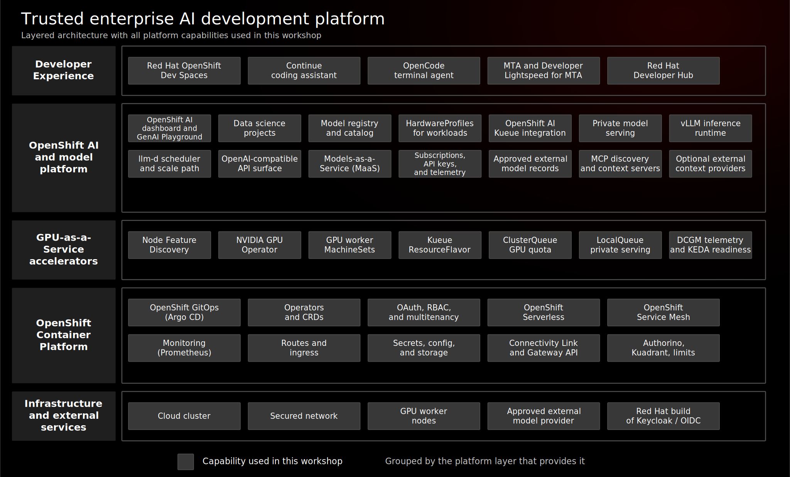

# Trusted Enterprise AI Development Platform on Red Hat OpenShift AI

## Why This Workshop Exists

AI-assisted software development is becoming a normal expectation for engineering teams. The hard part for large enterprises is not whether AI can help write, explain, test, or modernize code. The hard part is how to make those capabilities available without losing control of source code, regulated data, model access, cost, and operational risk.

That question matters most in organizations with strict privacy, sovereignty, and governance requirements. Many teams, especially in regulated European industries, cannot simply paste enterprise code into uncontrolled public AI services. At the same time, they still want access to modern AI capabilities and, in some cases, approved frontier models for tasks where policy allows external processing.

This workshop shows a platform pattern for that tension:

- Private models run on OpenShift for sensitive workloads.
- Approved external models are exposed only through a governed access layer.
- Developers use familiar tools instead of learning model infrastructure.
- Platform teams control identity, access, rate limits, telemetry, and lifecycle.
- The same model access pattern powers coding assistance, modernization, and portal-driven self-service.

The goal is not to claim that every AI use case automatically satisfies a regulation. The goal is to show how Red Hat OpenShift AI, open source model infrastructure, and Models-as-a-Service can give enterprise architects the controls and choices needed to design trustworthy AI-enabled development platforms.

## Architecture



## What We Are Building

The workshop builds a complete AI-enabled development platform on Red Hat OpenShift:

```text
Developer experience
  Red Hat Developer Hub
  Red Hat OpenShift Dev Spaces
  Continue and OpenCode
  Red Hat Developer Lightspeed for MTA
  Red Hat OpenShift AI GenAI Studio and Playground

Governed model access
  Models-as-a-Service gateway
  Access policies and subscriptions
  API keys, quotas, rate limits, telemetry

Model choices
  Private local models on OpenShift
    - nemotron-3-nano-30b-a3b
    - gpt-oss-20b
  Governed external models
    - gpt-4o
    - gpt-4o-mini

Platform foundation
  Red Hat OpenShift AI
  OpenShift GitOps
  OpenShift OAuth and RBAC
  NVIDIA GPU Operator and NFD
  Red Hat build of Kueue
  OpenShift Custom Metrics Autoscaler Operator
  OpenShift Serverless, Service Mesh, monitoring
```

The central design choice is that model consumers do not connect directly to scattered model endpoints. They connect through MaaS. MaaS becomes the enterprise control point where platform teams publish model choices and enforce access.

## What The Demo Proves

The demo progresses through nine focused platform stages. The ordered source of truth is [`demo/flows/default.yaml`](demo/flows/default.yaml).

| Stage | What we show | What to understand |
|------|--------------|--------------------|
| [010 - OpenShift AI Platform Foundation](stages/010-openshift-ai-platform-foundation/README.md) | The AI control plane, dashboard, users, model registry, and platform services | Trusted AI starts with a managed platform, not a collection of scripts |
| [020 - GPU Infrastructure for Private AI](stages/020-gpu-infrastructure-private-ai/README.md) | NVIDIA GPU enablement, Red Hat build of Kueue, queue quotas, and GPUaaS observability | Private AI needs centrally managed accelerator infrastructure, not manually assigned GPU nodes |
| [030 - Private Model Serving](stages/030-private-model-serving/README.md) | Local LLMs served on Red Hat OpenShift AI | Sensitive workloads need a private model path before developer tools consume it |
| [040 - Governed Models-as-a-Service](stages/040-governed-models-as-a-service/README.md) | MaaS, gateway policy, subscriptions, quotas, telemetry, and API keys | Model serving becomes an enterprise platform service through governance |
| [050 - Approved External Model Access](stages/050-approved-external-model-access/README.md) | External OpenAI models behind the governed MaaS path | External model use can be centralized without making it private |
| [060 - MCP Context Integrations](stages/060-mcp-context-integrations/README.md) | OpenShift, Slack, and BrightData MCP integrations | Tool context has its own data boundary and approval model |
| [070 - Controlled Developer Workspaces](stages/070-controlled-developer-workspaces/README.md) | Red Hat OpenShift Dev Spaces, Continue, and OpenCode | Developers get familiar AI tools without bypassing platform governance |
| [080 - AI-Assisted Application Modernization](stages/080-ai-assisted-application-modernization/README.md) | MTA and Red Hat Developer Lightspeed for MTA | AI becomes more valuable when grounded in analysis and workflow context |
| [090 - Developer Portal and Self-Service](stages/090-developer-portal-self-service/README.md) | Red Hat Developer Hub discovery of applications and platform capabilities | A developer portal turns AI platform services into self-service paths |

If someone only reads the workshop, they should still learn the architecture: private model serving, governed external model access, platform identity, developer tooling, modernization workflows, and portal-driven consumption.

## How Red Hat And Open Source Make It Work

Red Hat OpenShift is the consistent application platform underneath the demo. It supplies the identity, RBAC, networking, routing, scheduling, storage integration, monitoring, and GitOps reconciliation patterns that enterprise teams already use for application delivery. Red Hat OpenShift AI adds the AI-specific control plane for model discovery, model serving, model registry, GenAI Studio, and Models-as-a-Service access.

Open source projects provide the building blocks. Open Data Hub and models-as-a-service supply upstream AI platform and MaaS patterns. KServe and vLLM provide Kubernetes-native serving and OpenAI-compatible local inference. Gateway API, Kuadrant, and Authorino create the API policy path. Eclipse Che, DevWorkspace, Continue, OpenCode, Konveyor, Kai, and Backstage bring the same governed model access into developer workspaces, modernization workflows, and the portal.

Red Hat’s value in this architecture is integration and lifecycle management across those pieces. Operators install and reconcile platform services. OpenShift OAuth and RBAC establish shared identity boundaries. OpenShift GitOps makes the desired state repeatable. OpenShift AI and MaaS turn local and external models into discoverable, governed services instead of leaving every team to manage endpoints, keys, quotas, and telemetry on its own.

## Red Hat Products Demonstrated

This is a Red Hat platform demo. The open source projects are important, but the workshop is primarily about how Red Hat products package, integrate, operate, and support those capabilities for enterprise use.

| Red Hat product | Role in the workshop |
|-----------------|----------------------|
| [Red Hat OpenShift](https://www.redhat.com/en/technologies/cloud-computing/openshift) | The Kubernetes application platform providing identity, RBAC, networking, scheduling, storage integration, routes, monitoring, and operational consistency |
| [Red Hat OpenShift AI](https://www.redhat.com/en/products/ai/openshift-ai) | The AI platform layer for model serving, GenAI Studio, model registry, dashboard experience, and AI workload lifecycle management |
| [Red Hat OpenShift GitOps](https://www.redhat.com/en/technologies/cloud-computing/openshift/gitops) | GitOps delivery and reconciliation of the workshop platform through Argo CD |
| [Red Hat build of Kueue](https://docs.redhat.com/en/documentation/openshift_container_platform/4.20/html-single/ai_workloads/) | Queueing, quota, and admission control for OpenShift AI GPU workload management |
| [OpenShift Custom Metrics Autoscaler Operator](https://docs.redhat.com/en/documentation/openshift_container_platform/4.20/html/nodes/automatically-scaling-pods-with-the-custom-metrics-autoscaler-operator) | Red Hat-supported KEDA integration for metric-driven autoscaling patterns |
| [Red Hat OpenShift Dev Spaces](https://www.redhat.com/en/technologies/cloud-computing/openshift/dev-spaces) | Cloud-native developer workspaces for AI-assisted development and modernization |
| [Migration Toolkit for Applications](https://www.redhat.com/en/technologies/jboss-middleware/migration-toolkit-for-applications) | Application modernization analysis and Red Hat Developer Lightspeed for MTA integration for AI-assisted migration |
| [Red Hat Developer Hub](https://www.redhat.com/en/technologies/cloud-computing/developer-hub) | Enterprise developer portal and software catalog for self-service platform consumption |
| [Red Hat Connectivity Link](https://www.redhat.com/en/blog/red-hat-connectivity-link) | API connectivity, gateway, and policy layer used in the MaaS governance path |
| [Red Hat build of Keycloak](https://www.redhat.com/en/technologies/cloud-computing/openshift/keycloak) | Identity brokering for MTA and Developer Hub authentication flows |

The demo is meant to show how these products work together as a platform: Red Hat OpenShift runs the infrastructure, Red Hat OpenShift AI manages AI capabilities, MaaS governs model access, Red Hat OpenShift Dev Spaces and MTA consume models in developer workflows, and Red Hat Developer Hub turns the whole platform into a discoverable experience.

## Open Source Projects You Will Meet

Red Hat products in this workshop are built with and around open source communities. Part of the value of the demo is showing how those projects can be assembled into an enterprise platform with supportable lifecycle, identity, governance, and operations.

| Project | Where it appears | What to learn |
|---------|------------------|---------------|
| [Open Data Hub](https://opendatahub.io/) and [models-as-a-service](https://github.com/opendatahub-io/models-as-a-service) | MaaS control plane | Upstream foundation for OpenShift AI and MaaS-style model access |
| [Kueue](https://kueue.sigs.k8s.io/) | GPUaaS workload management | Kubernetes-native queueing, quota, and workload admission primitives |
| [KEDA](https://keda.sh/) | GPUaaS autoscaling readiness | Event-driven autoscaling patterns behind OpenShift Custom Metrics Autoscaler |
| [KServe](https://kserve.github.io/website/) | OpenShift AI model serving | Kubernetes-native model serving primitives |
| [vLLM](https://docs.vllm.ai/) | Local LLM inference | High-throughput LLM serving with an OpenAI-compatible API surface |
| [llm-d](https://llm-d.ai/) | Distributed inference architecture | Open source approach for distributed LLM serving on Kubernetes |
| [Gateway API](https://gateway-api.sigs.k8s.io/) | MaaS gateway | Kubernetes-native API routing and traffic management |
| [Kuadrant](https://kuadrant.io/) and [Authorino](https://www.authorino.io/) | MaaS policy enforcement | AuthN/AuthZ and rate-limit policy patterns at the gateway |
| [Eclipse Che](https://www.eclipse.org/che/) and DevWorkspace | Red Hat OpenShift Dev Spaces | Cloud-native development workspaces on Kubernetes |
| [Continue](https://www.continue.dev/) and [OpenCode](https://opencode.ai/) | AI coding assistants | OpenAI-compatible developer tooling that can consume MaaS endpoints |
| [Konveyor](https://www.konveyor.io/) | MTA modernization | Open source application modernization analysis and workflows |
| [Backstage](https://backstage.io/) | Red Hat Developer Hub | Software catalog and developer portal patterns |

The workshop is not only a product tour. It is also a map of how open source projects become consumable, governed enterprise capabilities through Red Hat platforms.

## Trust Boundaries

This workshop deliberately demonstrates more than one trust level.

| Path | Boundary | What it teaches |
|------|----------|-----------------|
| Private local models | Prompts and code remain on the OpenShift platform | Sensitive development and modernization can use AI without sending code to an external provider |
| Governed external models | Prompts are proxied to an approved external provider | Frontier models can be made available with centralized access and usage control where policy permits |
| MCP integrations | The base deployment includes a read-only OpenShift MCP server; Slack and BrightData MCP components are optional and require their own credentials | Tool context must be evaluated separately from model access because each integration has its own data boundary |

This distinction is important. A governed external model is not the same as a private model. The value of the platform is that both choices can be offered through one controlled interface with clear policy boundaries.

This is a disposable demo environment, not production implementation guidance. Red Hat OpenShift AI 3.4 documents Models-as-a-Service (MaaS) as a Technology Preview feature, and Red Hat Developer Lightspeed for MTA 8.1 is also documented as Technology Preview. The demo intentionally includes early-access and upstream components where they are needed to show the end-to-end platform story.

External OpenAI model definitions are included in GitOps with a placeholder API key. They demonstrate the governed external model path, but external calls are only enabled after an operator provisions `openai-api-key` in the `maas` namespace from an approved provider credential. The optional Stage 050 smoke test validates that path when token spend is approved. Known deviations, workarounds, and current validation status are tracked in [`BACKLOG.md`](BACKLOG.md) and [`docs/OPERATIONS.md`](docs/OPERATIONS.md).

## Why This Is Worth Knowing

The reusable pattern is bigger than this specific demo. A regulated enterprise can use the same architecture to answer common AI adoption questions:

- Which models are approved for which types of data?
- Which teams can access which models?
- Can sensitive source code stay inside the platform boundary?
- Can public models be offered without handing developers unmanaged provider keys?
- Can usage be measured and controlled?
- Can AI tools be embedded into real development and modernization workflows?

The workshop shows that Red Hat OpenShift AI can act as the enterprise AI platform, not only as a place to deploy models. It can become the trusted layer where model choice, developer productivity, and governance meet.

## Running The Workshop

The READMEs are designed to teach the architecture. The commands below are for operators running the lab.

```bash
git clone https://github.com/adnan-drina/rhoai3-coding-demo.git
cd rhoai3-coding-demo
cp env.example .env
oc login --token=<token> --server=<api>
./scripts/validate-stage-flow.sh
./scripts/bootstrap.sh
```

Deploy stages in order:

```bash
./stages/010-openshift-ai-platform-foundation/deploy.sh
./stages/020-gpu-infrastructure-private-ai/deploy.sh
./stages/030-private-model-serving/deploy.sh
./stages/040-governed-models-as-a-service/deploy.sh
./stages/050-approved-external-model-access/deploy.sh
./stages/060-mcp-context-integrations/deploy.sh
./stages/070-controlled-developer-workspaces/deploy.sh
./stages/080-ai-assisted-application-modernization/deploy.sh
./stages/090-developer-portal-self-service/deploy.sh
```

For deployment details, validation strategy, and recovery procedures, use:

- [Documentation Index](docs/README.md)
- [Operations Guide](docs/OPERATIONS.md)
- [Troubleshooting Guide](docs/TROUBLESHOOTING.md)

## Repository Map

```text
rhoai3-coding-demo/
+-- scripts/                         # Bootstrap, shared helpers, validation
+-- gitops/
|   +-- argocd/app-of-apps/          # One Argo CD Application per stage
|   +-- stages/                      # Canonical GitOps source for stage manifests
+-- stages/                          # Canonical stage READMEs and deploy/validate scripts
+-- demo/flows/default.yaml          # Ordered demo flow metadata
+-- docs/
|   +-- README.md
|   +-- OPERATIONS.md
|   +-- TROUBLESHOOTING.md
+-- env.example
+-- README.md
```

## Demo Personas

| User | Purpose |
|------|---------|
| `ai-admin` | Platform administrator persona for model, MTA, and portal administration |
| `ai-developer` | Developer persona consuming models, workspaces, and modernization workflows |
| `kubeadmin` | Cluster administrator for platform setup and recovery |

## References

- [Red Hat AI](https://www.redhat.com/en/products/ai)
- [Red Hat OpenShift AI](https://www.redhat.com/en/products/ai/openshift-ai)
- [Accelerate enterprise software development with NVIDIA and MaaS](https://docs.redhat.com/en/learn/ai-quickstarts/rh-maas-code-assistant)
- [What is Model-as-a-Service?](https://www.redhat.com/en/topics/ai/what-is-models-as-a-service)
- [Red Hat OpenShift AI 3.3 documentation](https://docs.redhat.com/en/documentation/red_hat_openshift_ai_self-managed/3.3/)
- [Red Hat OpenShift AI 3.4 MaaS documentation](https://docs.redhat.com/en/documentation/red_hat_openshift_ai_self-managed/3.4/html/govern_llm_access_with_models-as-a-service/use-models-as-a-service_maas)
- [Migration Toolkit for Applications 8.1 documentation](https://docs.redhat.com/en/documentation/migration_toolkit_for_applications/8.1/)
- [Red Hat Developer Lightspeed for MTA 8.1](https://docs.redhat.com/en/documentation/migration_toolkit_for_applications/8.1/html-single/configuring_and_using_red_hat_developer_lightspeed_for_mta/index)
- [Red Hat Developer Hub 1.9 documentation](https://docs.redhat.com/en/documentation/red_hat_developer_hub/1.9)
- [Red Hat OpenShift Dev Spaces documentation](https://docs.redhat.com/en/documentation/red_hat_openshift_dev_spaces/)
- [opendatahub-io/models-as-a-service](https://github.com/opendatahub-io/models-as-a-service)
