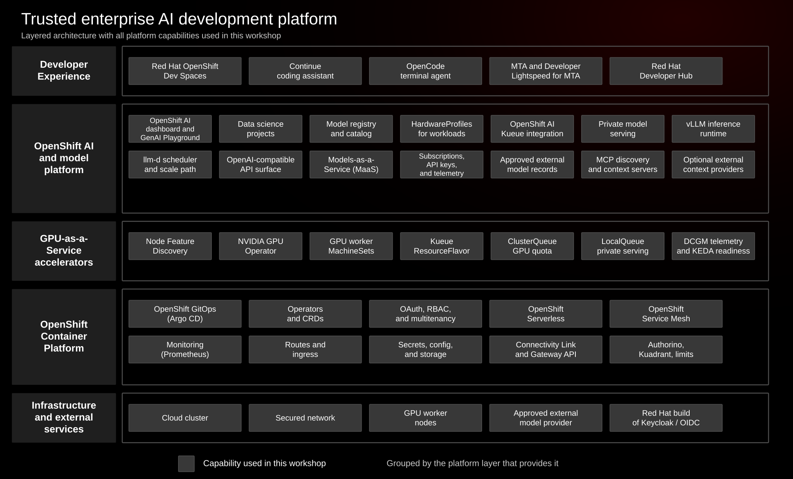

# Trusted Enterprise AI Development Platform on Red Hat OpenShift AI

## Why This Workshop Exists

AI-assisted development is now a normal expectation for software teams. But enterprises adopting it face two problems at once, and solving only one of them fails:

**The control problem.** The question is not whether AI can help with code, tests, documentation, or modernization — it is how to offer that help without losing control of source code, credentials, model access, cost, telemetry, and operational risk. This workshop answers with a governed platform pattern:

- private models run on Red Hat OpenShift for sensitive workloads;
- approved external models are exposed only through a governed access layer;
- platform teams control identity, API keys, subscriptions, rate limits, token limits, quotas, telemetry, and lifecycle;
- GitOps keeps platform state reproducible.

**The maturity problem.** Developers do not arrive at autonomous AI workflows in one step — and tooling that skips the journey gets rejected or misused. This workshop structures the developer experience as an **AI development maturity ladder**, with familiar tools at each rung, every one consuming models through the same governed platform:

| Rung | Developer experience | Tooling |
|------|----------------------|---------|
| **Assisted** (060) | First one-shot prompts in the IDE — and their limits | Dev Spaces + Kilo Code via MaaS |
| **Agentic** (070) | Enterprise standards as reusable skills and specs that agents follow and improve | OpenCode + AGENTS.md + skills |
| **Autonomous** (080) | Multi-agent legacy migration with human review gates | MigIQ (MTA + Developer Lightspeed) |

Self-service and trusted delivery are not rungs — they are constants supplied by the **Advanced Application Platform** (stage 050) underneath the ladder: every rung enters through the developer portal (a golden-path template) and exits through pipelines with quality gates and provenance. *Self-service in, trusted delivery out, at every maturity level.*

Each rung deliberately exposes its own limits to motivate the next: one-shot prompting fails on project standards, which motivates skills and specs; skill-guided agents motivate autonomous multi-agent workflows — and every step lands on the same platform rails.

The workshop does not claim regulatory compliance. It shows controls and boundaries that help architects design AI-enabled development platforms for privacy-sensitive, sovereignty-sensitive, and regulated environments.

## Architecture



## What We Are Building

Underneath the ladder sits the governed platform foundation that every rung consumes. The demo builds it on Red Hat OpenShift:

- a Red Hat OpenShift AI foundation with dashboard access, GenAI Studio, model registry, model serving, MaaS, shared identity, and monitoring;
- GPU infrastructure for private AI with NVIDIA GPU enablement, Red Hat build of Kueue, and observability;
- private model serving with vLLM and OpenAI-compatible APIs;
- governed Models-as-a-Service access for private and approved external models;
- developer workflows through Red Hat OpenShift Dev Spaces, Kilo Code, OpenCode, Migration Toolkit for Applications, Developer Lightspeed, and Red Hat Developer Hub.

The central design choice is simple: consumers do not connect directly to scattered model endpoints. They connect through MaaS, where platform teams publish approved model choices and enforce access policy.

## What The Demo Shows

The executable platform path is the eight-stage flow in [`flows/default.yaml`](flows/default.yaml), organized in three progressive sections.

**Section 1: Governed model platform** — *Build the trusted AI infrastructure before a single developer prompt is issued.*

- [010 - OpenShift AI Platform Foundation](stages/010-openshift-ai-platform-foundation/README.md) — AI control plane, identity, dashboard, model registry, and observability
- [020 - GPU Infrastructure for Private AI](stages/020-gpu-infrastructure-private-ai/README.md) — NVIDIA GPU enablement, Kueue quotas, and hardware profiles
- [030 - Private Model Serving](stages/030-private-model-serving/README.md) — Local LLMs served with vLLM and OpenAI-compatible APIs
- [040 - Governed Models-as-a-Service](stages/040-governed-models-as-a-service/README.md) — MaaS subscriptions, API keys, token limits, external models, and MCP context

**Section 2: Advanced application platform** — *The app-platform layer every rung of the ladder consumes: self-service in, trusted delivery out.*

- [050 - Advanced Application Platform](stages/050-advanced-app-platform/README.md) — Developer Hub portal with golden-path templates, OpenShift Pipelines with quality gates, and Trusted Artifact Signer for provenance

**Section 3: AI development maturity ladder** — *Climb from assisted prompts to agentic development to autonomous migration, each rung entering through the portal and exiting through the pipeline.*

- [060 - AI-Assisted Development](stages/060-ai-assisted-development/README.md) — Dev Spaces workspaces with Kilo Code via MaaS and the golden-path coding exercise
- [070 - AI-Agentic Development](stages/070-ai-agentic-development/README.md) — OpenCode with AGENTS.md, reusable skills, and spec-driven development of a brand-new Quarkus application
- [080 - AI-Autonomous Migration](stages/080-ai-autonomous-migration/README.md) — MigIQ analysis plus multi-agent Spring Boot to Quarkus migration through MaaS

Each developer-arc stage README (060–080) carries a **Demo Script** section in Know/Show form — the business beat to say, the exact clicks to show, and the deliberately scripted fail-forward moments — so the demo can be delivered by someone who did not build it.

**How to present it.** For platform-engineering audiences, walk 010–050 in order and treat Section 3 as the payoff; for developer audiences, deploy everything beforehand, open with stage 050's portal, and spend the time on 060–080. Two deliberate "aha" moments carry the ladder: Stage 060 ends with the quality gate *failing* on AI-written code and a human prompting the fix; Stage 070 ends with the gate *passing on the first push* because the standards steered the agent — the maturity jump is measurable, not asserted. Stage 080's wrap-up walks the arc backwards through the portal catalog and the MaaS usage dashboard: every AI consumer identified, metered, and governed by one gateway. The recurring line that ties every rung together: *self-service in, trusted delivery out.*

## Why This Is Worth Knowing

The reusable pattern is larger than this repository. Enterprises need to answer practical questions before adopting AI development tools:

- Which model paths are approved for each data classification?
- Which users, teams, tools, and applications can access each model?
- Can sensitive source code stay inside the OpenShift platform boundary?
- Can approved external models be offered without distributing provider keys?
- Can usage be measured, limited, traced, and reviewed?
- Can modernization and portal workflows use AI without bypassing platform governance?

This demo treats AI assistance as a platform capability. Red Hat OpenShift AI supplies model serving and MaaS. Red Hat OpenShift supplies the application platform. Red Hat OpenShift Dev Spaces, Kilo Code, MTA, Developer Lightspeed, and Developer Hub bring the governed model path into developer workflows.

## How Red Hat And Open Source Make It Work

Red Hat OpenShift provides the enterprise Kubernetes foundation: identity, RBAC, networking, routing, scheduling, storage integration, monitoring, and GitOps patterns. Red Hat OpenShift AI adds the AI control plane for model serving, GenAI Studio, model registry, and MaaS. Red Hat Advanced Developer Suite capabilities bring workspaces, modernization, portal discovery, and AI-assisted developer experiences into the same platform story.

Open source projects provide the building blocks: Open Data Hub and models-as-a-service for the upstream AI platform pattern, KServe and vLLM for inference, llm-d for distributed serving architecture, Gateway API with Kuadrant and Authorino for policy enforcement, Eclipse Che and DevWorkspace for workspaces, Kilo Code and OpenCode for coding assistants, Konveyor and Kai for modernization, and Backstage for the developer portal.

Red Hat's role in this architecture is integration, lifecycle, support posture, and operational consistency across those pieces.

## Trust Boundaries

Private local models keep prompts and code inside the OpenShift platform boundary. Governed external models use centralized MaaS credentials, subscriptions, rate limits, token limits, and telemetry, but prompts are still processed by the external provider. MCP integrations have their own data boundary because tool context can expose cluster state, documents, chat data, web data, or actions against other systems. These boundaries support governance, traceability, documentation, and EU AI Act readiness; they do not replace legal review, data classification, human review, or production security assessment.

## Running The Workshop

The READMEs explain the architecture. Operators should use the commands below only in a prepared OpenShift environment.

**Environment sizing (required).** The full stack (RHOAI + ODF + GPU + MaaS +
model serving) puts heavy, sustained load on the control plane. Provision
**`m6a.4xlarge`-class nodes (16 vCPU / 64 GiB) for the control plane *and* the
CPU workers** — the control-plane sizing is the one that bites, and on RHDP it is
often a separate setting from the workers. The default sandbox `m6a.xlarge`
(4 vCPU / 16 GiB) control plane is **not** sufficient: kube-apiserver exhausts the
node's CPU/memory and masters fail one after another. GPU nodes are sized by
accelerator (e.g. `g6e.2xlarge`) and are exempt. Every stage's `deploy.sh` runs
`scripts/require-node-sizing.sh` first and refuses to start on undersized nodes.

```bash
git clone https://github.com/adnan-drina/rhoai3-coding-demo.git
cd rhoai3-coding-demo
cp env.example .env
oc login --token=<token> --server=<api>
./scripts/validate-stage-flow.sh
```

Stage 010 bootstraps OpenShift GitOps itself (declarative overlays in
`gitops/bootstrap/`) before handing the platform to Argo CD.

Deploy the implemented stages in order:

```bash
./stages/010-openshift-ai-platform-foundation/deploy.sh
./stages/020-gpu-infrastructure-private-ai/deploy.sh
./stages/030-private-model-serving/deploy.sh
./stages/040-governed-models-as-a-service/deploy.sh
./stages/050-advanced-app-platform/deploy.sh
```

Stages 060–080 are workflow-only: all of their infrastructure (workspaces,
pipelines, quality gates, the MigIQ stack) is deployed by stage 050. Each
keeps a read-only `validate.sh` for its demo prerequisites:

```bash
./stages/060-ai-assisted-development/validate.sh
./stages/070-ai-agentic-development/validate.sh
./stages/080-ai-autonomous-migration/validate.sh
```

For deployment detail, validation strategy, and recovery procedures, use:

- [Documentation Index](docs/README.md)
- [Operations Guide](docs/OPERATIONS.md)
- [Troubleshooting Guide](docs/TROUBLESHOOTING.md)
- [Backlog and Workaround Register](BACKLOG.md)

## Repository Map

```text
rhoai3-coding-demo/
|-- README.md
|-- AGENTS.md                        # Entry point for AI coding agents working on this repo
|-- BACKLOG.md                       # Workarounds, limitations, and deferred work
|-- CONTRIBUTING.md
|-- env.example
|-- flows/default.yaml               # Ordered source of truth for the demo flow
|-- scripts/                         # Shared helpers, validation, recovery
|-- golden-repos/                    # Sources for the golden-path template repositories
|-- .agents/                         # Tool-neutral shared agent guidance: rules, skills, hooks, references
|-- gitops/
|   |-- bootstrap/                   # Declarative OpenShift GitOps bootstrap (stage 010)
|   |-- argocd/app-of-apps/          # Argo CD Applications for stages 010-090
|   `-- stages/                      # GitOps source for stage manifests
|-- stages/                          # Stage READMEs and per-stage deploy/validate scripts
`-- docs/                            # Operations, troubleshooting, TechDocs, and governance docs
```

## This Repository Practices What It Demonstrates

Stage 070 teaches agentic development with `AGENTS.md` and reusable skills. This repository is maintained the same way: [`AGENTS.md`](AGENTS.md) is the agent entry point, and [`.agents/`](.agents/README.md) holds tool-neutral rules, doc-grounded skills for every Red Hat product in the demo, and safety hooks (including a cluster guard that blocks mutating `oc`/`kubectl` commands against unintended clusters). Tool-specific directories such as `.cursor/` contain only thin bridge files that point at the shared layer.

## Demo Personas

| User | Purpose |
|------|---------|
| `ai-admin` | Platform administrator persona for OpenShift AI, MTA, portal, and model administration |
| `ai-developer` | Developer persona consuming workspaces, models, and modernization workflows |
| `kubeadmin` | Cluster administrator for platform setup and recovery |

## Red Hat Products Demonstrated

| Red Hat product | Role in the workshop |
|-----------------|----------------------|
| [Red Hat Advanced Developer Suite](https://www.redhat.com/en/products/advanced-developer-suite) | Product family for the developer productivity layer represented by Dev Spaces, MTA, Developer Hub, and Developer Lightspeed |
| [Red Hat OpenShift](https://www.redhat.com/en/technologies/cloud-computing/openshift) | Kubernetes application platform for identity, RBAC, networking, routing, scheduling, monitoring, and operations |
| [Red Hat OpenShift AI](https://www.redhat.com/en/technologies/cloud-computing/openshift/openshift-ai) | AI platform for model serving, GenAI Studio, model registry, and MaaS |
| [Red Hat AI Inference Server](https://www.redhat.com/en/products/ai) | vLLM-based runtime used for private LLM serving |
| [Red Hat OpenShift GitOps](https://www.redhat.com/en/technologies/cloud-computing/openshift/gitops) | Argo CD based reconciliation of stage manifests |
| [Red Hat build of Kueue](https://docs.redhat.com/en/documentation/red_hat_build_of_kueue/1.0/html/overview/index) | Queueing, quota, and admission control for AI workloads |
| [Red Hat OpenShift Dev Spaces](https://www.redhat.com/en/technologies/cloud-computing/openshift/dev-spaces) | Managed cloud development workspaces |
| [Migration Toolkit for Applications](https://developers.redhat.com/products/mta) | Application inventory, static analysis, migration rules, and modernization workflow |
| [Red Hat Developer Lightspeed for MTA](https://docs.redhat.com/en/documentation/migration_toolkit_for_applications/8.1/html-single/configuring_and_using_red_hat_developer_lightspeed_for_mta/index) | AI-assisted modernization suggestions grounded in MTA findings |
| [Red Hat Developer Hub](https://www.redhat.com/en/technologies/cloud-computing/developer-hub) | Enterprise developer portal, software catalog, and TechDocs surface |
| [Developer Lightspeed for Red Hat Developer Hub](https://developers.redhat.com/products/rhdh/developer-lightspeed) | AI-assisted portal experience |
| [Red Hat Connectivity Link](https://www.redhat.com/en/technologies/cloud-computing/connectivity-link) | Gateway and policy layer used in the MaaS governance path |
| [Red Hat build of Keycloak](https://access.redhat.com/products/red-hat-build-of-keycloak) | Identity broker used by MTA and Developer Hub authentication flows |

## Open Source Projects You Will Meet

| Project | Where it appears | What it contributes |
|---------|------------------|---------------------|
| [Open Data Hub](https://opendatahub.io/) and [models-as-a-service](https://github.com/opendatahub-io/models-as-a-service) | OpenShift AI and MaaS | Upstream AI platform and model access patterns |
| [KServe](https://kserve.github.io/website/) | Model serving | Kubernetes-native serving primitives |
| [vLLM](https://docs.vllm.ai/) | Private inference | Efficient LLM serving with OpenAI-compatible APIs |
| [llm-d](https://llm-d.ai/) | Distributed inference | Kubernetes-native distributed LLM serving architecture |
| [Gateway API](https://gateway-api.sigs.k8s.io/) | MaaS routing | Kubernetes-native API routing |
| [Kuadrant](https://kuadrant.io/) and [Authorino](https://www.authorino.io/) | MaaS policy | AuthN/AuthZ, rate limiting, token limiting, and protection patterns |
| [Kueue](https://kueue.sigs.k8s.io/) | GPUaaS | Queueing, quota, and admission control primitives |
| [Eclipse Che](https://www.eclipse.org/che/) and [DevWorkspace](https://github.com/devfile/devworkspace-operator) | Dev Spaces | Cloud workspace orchestration |
| [Kilo Code](https://kilocode.ai/) and [OpenCode](https://opencode.ai/) | Coding assistance | IDE and terminal AI coding workflows that can consume MaaS endpoints |
| [Konveyor](https://www.konveyor.io/) and [Kai](https://github.com/konveyor/kai) | MTA and Developer Lightspeed | Modernization analysis and AI-assisted remediation foundations |
| [Backstage](https://backstage.io/) and [TechDocs](https://backstage.io/docs/features/techdocs/) | Developer Hub | Software catalog and documentation publishing |

## References

- [Red Hat AI](https://www.redhat.com/en/products/ai)
- [Red Hat OpenShift](https://www.redhat.com/en/technologies/cloud-computing/openshift)
- [Red Hat OpenShift AI](https://www.redhat.com/en/technologies/cloud-computing/openshift/openshift-ai)
- [Red Hat OpenShift AI 3.4 documentation](https://docs.redhat.com/en/documentation/red_hat_openshift_ai_self-managed/3.4/)
- [Red Hat OpenShift AI 3.4 MaaS documentation](https://docs.redhat.com/en/documentation/red_hat_openshift_ai_self-managed/3.4/html/govern_llm_access_with_models-as-a-service/use-models-as-a-service_maas)
- [MaaS code assistant quickstart](https://docs.redhat.com/en/learn/ai-quickstarts/rh-maas-code-assistant)
- [Migration Toolkit for Applications 8.1 documentation](https://docs.redhat.com/en/documentation/migration_toolkit_for_applications/8.1/)
- [Red Hat Developer Hub 1.9 documentation](https://docs.redhat.com/en/documentation/red_hat_developer_hub/1.9)
- [Red Hat OpenShift Dev Spaces documentation](https://docs.redhat.com/en/documentation/red_hat_openshift_dev_spaces/)
- [A guide to AI code assistants with Red Hat OpenShift Dev Spaces](https://developers.redhat.com/articles/2026/01/28/guide-ai-code-assistants-red-hat-openshift-dev-spaces)
- [Vibes, specs, skills, and agents: The four pillars of AI coding](https://developers.redhat.com/articles/2026/03/30/vibes-specs-skills-agents-ai-coding)
