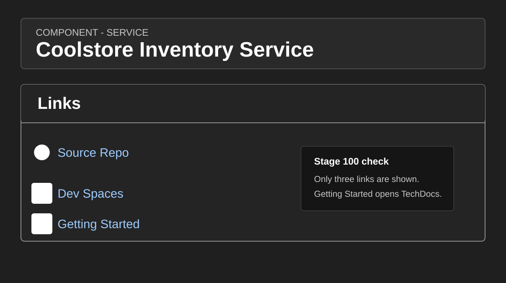
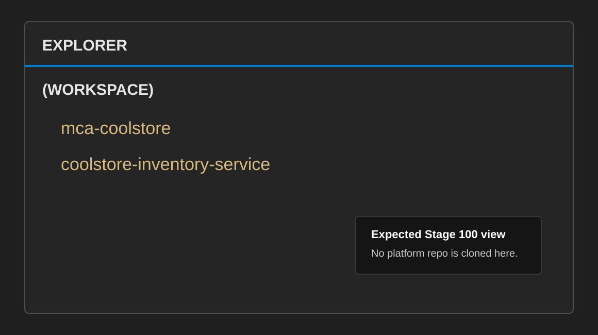

# Developer Workspace Guide

This guide is for demo users working in Stage 060 and later. It explains how to
start from Red Hat Developer Hub, open the governed Red Hat OpenShift Dev Spaces
workspace, and use MaaS-backed Kilo Code for developer onboarding and enterprise
vibe coding without using personal provider credentials.

The guide is published through Developer Hub TechDocs so the developer can read
it from the portal without cloning the platform repository into the workspace.

This follows the enterprise pattern from Red Hat's AI-assisted application
development ebook: put AI tooling behind an internal developer platform, make
the approved path easy to discover, and keep human review and evidence capture
visible. The workspace is a safe innovation-zone experience, not a private
collection of local plugins and personal API keys.

The demo uses Andrej Karpathy's X post as the origin reference for the term
"vibe coding" and Red Hat's enterprise guide to AI-assisted application
development as the terminology source. In this guide, vibe coding means
human-led, prompt-driven IDE work. The developer stays responsible for review,
validation, and evidence capture.

The developer-focused stages then teach the four increments from Red Hat's
"vibes, specs, skills, and agents" framing: start with intuitive exploration,
turn accepted intent into specs, package repeatable checks as skills, and let
agents use those assets for bounded engineering work.

## Stage 060 Outcome

At the end of Stage 060, the developer has verified:

- Developer Hub exposes three clear workflow entry points:
  `Getting Started with AI Coding`, `Coolstore Inventory Service`, and
  `MCA Coolstore`.
- Developer Hub opens this TechDocs guide from the `Getting Started` link.
- Each `Dev Spaces` link opens a single-repository workspace for the selected
  component.
- Kilo Code is configured locally by the workspace startup command with MaaS
  routes and API keys (four providers: Nemotron default, local Qwen, qwen3-235b,
  minimax-m2).
- OpenShift Toolkit is available in Che Code for IDE-based OpenShift resource
  navigation.
- Kilo Code can reach `nemotron-3-nano-30b-a3b` through MaaS with the opening
  onboarding and vibes prompt.
- No route URL, API key, token, kubeconfig, or provider credential is committed.

## What Is Already Prepared

Stage 050 creates the Dev Spaces environment and pre-provisions separate
single-repository workspaces for the demo personas:

- `getting-started-ai-coding` for onboarding and MaaS client verification.
- `coolstore-inventory-service` for AI-assisted engineering and golden-path
  Quarkus service work.
- `mca-coolstore` for migration and modernization exercises.

The Developer Hub `Dev Spaces` links use the OpenShift Dev Spaces supported Git
repository URL launch pattern, `https://<devspaces-host>#<git-repository-url>`,
so the workspace opens with only the selected repository. The platform owns the
workspace definition, tooling image, source repositories, model access path, and
workspace-local AI tool configuration. Stage deployment stores MaaS API keys in
`Secret/wksp-ai-developer/maas-devspace-api-keys`; the workspace startup command
renders local Kilo Code configuration from that Secret. Some workspaces also
render OpenCode configuration for later agentic engineering stages, but OpenCode
is not part of the Stage 060 demo flow.

The OpenCode-capable demo workspaces use a digest-pinned `che-incubator/cli-ai-tools`
image because that is the current public OpenCode-in-Dev-Spaces reference path.
The Red Hat-managed baseline for a production workspace image is the Red Hat
OpenShift Dev Spaces Universal Developer Image that matches the installed Dev
Spaces version. Treat the incubator image as a demo convenience until a
reviewed UDI-derived enterprise image is published.

The onboarding Quarkus exercise targets Java 21, and the workspace must provide
that as the default runtime. Stage 060 sets `JAVA_HOME` for the tooling
container and writes Java 21 shell defaults during workspace startup so fresh
terminals make both `java -version` and `mvn -v` resolve to Java 21. If a fresh
workspace still reports Java 17, fix the workspace image or startup
configuration; do not add Java-version workarounds to the application prompt.

Che Code editor policy is also platform-managed. Stage 050 installs Kilo Code
from Open VSX through the DevWorkspace `DEFAULT_EXTENSIONS` setting and
provides a `vscode-editor-configurations` ConfigMap in each workspace namespace
for editor recommendations and bash terminal defaults. The modernization-only
MTA extensions are scoped to the `mca-coolstore` DevWorkspace with
`DEFAULT_EXTENSIONS`, so they do not install into the onboarding or inventory
engineering workspaces.

## Step 1: Start From Developer Hub

1. Log in to Red Hat Developer Hub with the assigned demo user.
2. Open the component that matches the task:
   - `Getting Started with AI Coding` for Stage 060 vibe coding.
   - `Coolstore Inventory Service` for deferred engineering stages `120-150`.
   - `MCA Coolstore` for deferred modernization stages `160-170`.
3. Confirm the component shows only these links:
   - `Source Repo`
   - `Dev Spaces`
   - `Getting Started`
4. Open `Getting Started` to read this TechDocs guide.



The link card is intentionally small. Deeper delivery, evidence, and task docs
belong in the repository and TechDocs navigation, not in the first component
overview.

## Step 2: Open The Dev Spaces Workspace

1. From the Developer Hub component, open the `Dev Spaces` link.
2. Log in to Red Hat OpenShift Dev Spaces with the assigned demo user.
3. Start or open the workspace for the selected component.
4. Wait for the IDE to open and for the startup command to finish.

During startup, the onboarding workspace renders local home-directory config
from the platform-managed MaaS API key Secret:

- `~/.config/kilo/kilo.json` (four providers, OpenCode-schema JSON)
- `~/.config/kilo/AGENTS.md` (governance rules)
- `~/.config/opencode/opencode.json`

If the Secret is not ready, the startup command falls back to the checked-in
templates so the workspace still opens. Do not put real route URLs or API keys
into checked-in template files; they remain Git-tracked placeholders.

For Stage 060, the selected workspace should show only one project directory:



Do not clone `rhoai3-coding-demo` into this workspace. The developer workspace
is for application work; platform implementation and stage GitOps stay in the
platform repository and are exposed through Developer Hub.

## Step 3: Confirm Workspace Files

From the Dev Spaces terminal:

```bash
find /projects -maxdepth 1 -mindepth 1 -type d -printf "%f\n" | sort
test -f ~/.config/kilo/kilo.json && echo "Kilo Code config present"
grep '"model"' ~/.config/kilo/kilo.json
```

Expected project directories:

```text
getting-started-ai-coding
```

If you opened the inventory or modernization component instead, the only project
directory should be `coolstore-inventory-service` or `mca-coolstore`
respectively. If an old `coding-exercises`, `coolstore`, or multi-repository
workspace appears, it is stale state from a previous workspace volume. Stop it
and open the component-specific `Dev Spaces` link before recording Stage 060 as
green.

## Step 4: Confirm MaaS API Keys

Stage deployment creates API keys for the demo models and stores them in the
developer workspace namespace. The normal developer flow does not require
copying keys from the OpenShift AI dashboard.

From the workspace terminal, confirm the local config files were generated:

```bash
test -f ~/.config/kilo/kilo.json && echo "Kilo Code config present"
grep '"model"' ~/.config/kilo/kilo.json
```

Expect four model entries (Nemotron, Qwen local, qwen3-235b, minimax-m2).
Confirm the Kilo Code approval-gate is active: Kilo Code requests user
approval before executing file edits, keeping the human in the loop.

Platform operators can inspect key records in Red Hat OpenShift AI by opening
`Gen AI studio` and then `API keys`. MaaS shows generated key values only once,
so do not rely on the dashboard as a source for workspace startup. The
workspace reads the values from the Kubernetes Secret created by Stage 050.

## Step 5: Choose The Model Endpoint

Use a model endpoint that matches the exercise and data policy:

| Model ID | Typical use | MaaS path prefix |
|----------|-------------|------------------|
| `nemotron-3-nano-30b-a3b` | Default private model for sensitive code and enterprise demo tasks | `/models-as-a-service/<model>/v1` |
| `qwen3-6-35b-a3b` | Private coding-focused model (Qwen3.6 35B A3B, FP8-dynamic) | `/models-as-a-service/<model>/v1` |
| `qwen3-235b` | External 16K-context reasoning model via LiteLLM proxy | `/redhat-ods-applications/<model>/v1` |
| `minimax-m2` | External 196K-context model via LiteLLM proxy | `/redhat-ods-applications/<model>/v1` |
| `gpt-4o-mini` | Lower-cost approved external model when provider-side processing is allowed | `/redhat-ods-applications/<model>/v1` |

The default Stage 060 source-code path is:

```text
nemotron-3-nano-30b-a3b through MaaS
```

Use the model path that matches the task and data classification:

| Task type | Data classification | Default model path | Stage 060 decision |
|-----------|---------------------|--------------------|--------------------|
| Source-code explanation, README/API alignment, tests, and bounded implementation planning | Private source-code context | Private MaaS model | Use `nemotron-3-nano-30b-a3b` through MaaS. |
| General product documentation lookup or public Red Hat documentation review | Public documentation | Private MaaS model by default; approved external MaaS model only when policy allows | Prefer the private path during the demo to keep the story simple. |
| Corporate standards, internal policies, customer code, credentials, or private architecture notes | Sensitive internal context | Private MaaS model only | Do not use approved external models. Do not paste secrets. |
| Non-sensitive comparison of public model behavior | Public or synthetic content | Approved external MaaS model when explicitly allowed | Keep separate from source-code exercises and record the reason. |

The OpenAI-compatible MaaS endpoint shape is:

```text
https://<maas-gateway-host>/maas/<model-id>/v1
```

Some approved external models can use a namespace-qualified MaaS path, such as
`/redhat-ods-applications/<model-id>/v1`. If the OpenShift AI dashboard gives
you the full model endpoint, use that value directly for the selected model. If
you are updating templates for several models, replace `YOUR_MAAS_ROUTE` with
only the gateway base URL, such as `https://<maas-gateway-host>`, and preserve
the model-specific path shown by the platform.

## Step 6: Verify Kilo Code Configuration

Kilo Code is used for IDE-based chat, code explanation, edits, and code
generation in Act mode. It is useful when the developer wants assistance while
reading or changing files in the browser-based IDE.

Inspect the generated config from the Dev Spaces terminal:

```bash
grep '"model"' ~/.config/kilo/kilo.json
```

Do not print `apiKey` values. The generated config should include four
providers: `nemotron-3-nano-30b-a3b`, `qwen3-6-35b-a3b`, `qwen3-235b`, and
`minimax-m2` with MaaS OpenAI-compatible endpoints.

Kilo Code uses the OpenCode JSON schema for `kilo.json`. The generated
provider entries set a 600000 millisecond request timeout. This is intended
for long coding-agent generations through the MaaS gateway; it does not change
the model output token limits or make oversized prompts cheaper.

Kilo Code's Act mode requests user approval before executing file edits,
keeping the human in the review loop. For shell commands, open
`Terminal > New Terminal (Select a Container) > tooling-container` and run the
command yourself, or use OpenCode when that workflow is introduced.

Governance rules at `~/.config/kilo/AGENTS.md` carry durable workspace
behavior: file edits should be written to disk, repository-relative paths
should be used, edits should stay inside the requested project directory,
examples should stay minimal, and secrets or concrete route hosts must not be
printed.

Keep exercise details out of the governance rules. Product versions, Maven
coordinates, Java imports, generated file names, and validation commands belong
in the one-shot task prompt or later specs/skills. This keeps the same
workspace rules useful when the demo moves from the Stage 060 Quarkus exercise
to later spec-driven and agentic workflows.

Likewise, Java 21 is not a prompt guardrail. It is part of the controlled Dev
Spaces runtime contract. The prompt can ask for a Java 21 Quarkus application,
but the workspace must make Maven run on Java 21 before the developer validates
the generated project.

## Step 7: Verify Kilo Code

Send the opening prompt that verifies the AI coding assistants configuration
for this workspace:

```text
Check the AI coding assistants configuration for this workspace.

Return exactly four bullets:
- Client: the AI coding assistant being used.
- Model: the configured model ID.
- Model access: whether the model is reached through MaaS or not verified.
- Workspace: the repository name and workspace namespace if safely visible.
```

Record only:

- client: `Kilo Code`
- selected model ID
- prompt result: pass/fail
- blocker, if any

Do not copy the MaaS route, API key, or full cluster hostname into evidence.

For command evidence, use a terminal attached to `tooling-container`. Avoid the
plain `New Terminal` path if it opens a broken session; the workspace pod also
contains `che-gateway`, which is a non-interactive routing sidecar and not a
developer shell.

This is the Stage 060 coding-exercise check: a lightweight, human-led interaction
that verifies IDE integration with the configured model path before any
source-code change is requested.

## Step 8: Verify OpenShift Toolkit

OpenShift Toolkit is available in Che Code for developers who want an
IDE-integrated view of OpenShift projects, workloads, pods, logs, and
application resources.

Open the OpenShift Toolkit activity from the Che Code side bar. If the extension
asks for cluster access, use the same cluster identity and namespace boundaries
as the terminal `oc` session. Do not paste tokens into repository files or AI
prompts.

## Step 9: Record Stage 060 Evidence

Record live validation evidence outside this repository, for example in the PR,
issue tracker, or approved private evidence store. Do not commit live evidence
files, screenshots, route hostnames, credentials, tokens, API keys, kubeconfigs,
or private endpoint details to Git.

Record:

- Developer Hub component visible: yes/no
- `Getting Started` opens TechDocs: yes/no
- `Dev Spaces` opens the selected workspace: yes/no
- workspace project:
- private model ready: `nemotron-3-nano-30b-a3b`
- Kilo Code opening prompt passed: yes/no
- secrets committed: no

Do not record:

- API keys
- bearer tokens
- kubeconfigs
- full private route hostnames
- model provider credentials
- source-code prompt contents that include private code

## Later Segment: OpenCode And Scribe MCP

OpenCode, project rules, skills, and Scribe MCP are introduced in later
agentic-engineering and modernization segments. They are not part of the Stage
060 onboarding and Kilo Code vibes validation. When Scribe is running
locally or exposed as an approved MCP service, OpenCode can load it as a remote
MCP server for reviewed modernization rule work.

The generated MaaS OpenCode provider entries set a 600000 millisecond request
timeout and a 120000 millisecond streamed chunk timeout. These values prevent
long local-model generations from being cut short by conservative client
defaults while still surfacing genuinely stalled streams.

Local development endpoint:

```text
http://localhost:8080/mcp/sse
```

Candidate OpenCode configuration:

```json
{
  "$schema": "https://opencode.ai/config.json",
  "mcp": {
    "scribe": {
      "type": "remote",
      "url": "http://localhost:8080/mcp/sse",
      "enabled": true,
      "timeout": 30000
    }
  },
  "tools": {
    "scribe_*": false
  },
  "agent": {
    "mta-rule-engineer": {
      "tools": {
        "scribe_*": true
      }
    }
  }
}
```

Use Scribe only for reviewed modernization rule work. Generated Konveyor or
Kantra rules must still be validated, tested against expected matches and known
non-matches, and approved by a human before use.

## MTA Extensions

The MTA VS Code extensions are included only in the `mca-coolstore` workspace so
the same controlled workspace can support the modernization workflow introduced
in Stage 080. They help developers review MTA analysis findings and act on
modernization issues without leaving Dev Spaces.

Stage 060 only prepares the IDE side of that workflow. Stage 080 deploys
Migration Toolkit for Applications, Red Hat Developer Lightspeed for MTA, and
the server-side MaaS-backed LLM proxy configuration. Do not put MaaS API keys
directly into the MTA extension configuration unless a later exercise explicitly
instructs you to do so.
