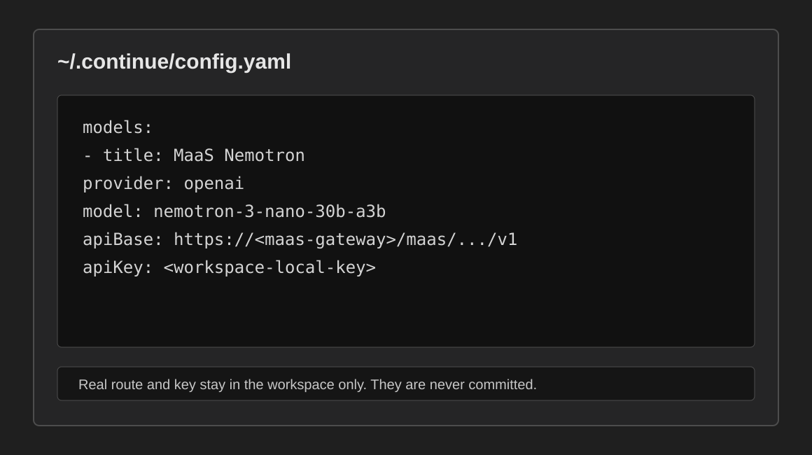
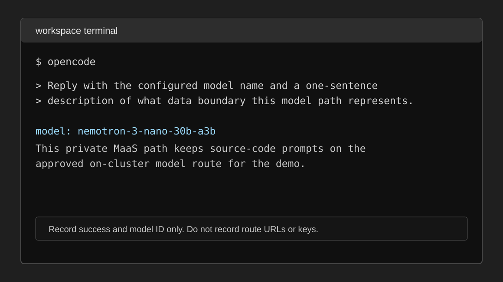

# Developer Workspace Guide

This guide is for demo users working in Stage 100 and later. It explains how to
start from Red Hat Developer Hub, open the governed Red Hat OpenShift Dev Spaces
workspace, and connect Continue and OpenCode to MaaS without using personal
provider credentials.

The guide is published through Developer Hub TechDocs so the developer can read
it from the portal without cloning the platform repository into the workspace.

## Stage 100 Outcome

At the end of Stage 100, the developer has verified:

- Developer Hub exposes three clear workflow entry points:
  `Getting Started with AI Coding`, `Coolstore Inventory Service`, and
  `MCA Coolstore`.
- Developer Hub opens this TechDocs guide from the `Getting Started` link.
- Each `Dev Spaces` link opens a single-repository workspace for the selected
  component.
- Continue is configured locally by the workspace startup command with MaaS
  routes and API keys.
- OpenCode is configured locally by the same startup command.
- Both tools can reach `nemotron-3-nano-30b-a3b` through MaaS with a harmless
  verification prompt.
- No route URL, API key, token, kubeconfig, or provider credential is committed.

## What Is Already Prepared

Stage 070 creates the Dev Spaces environment and pre-provisions separate
single-repository workspaces for the demo personas:

- `getting-started-ai-coding` for onboarding and MaaS client verification.
- `coolstore-inventory-service` for AI-assisted engineering and golden-path
  Quarkus service work.
- `mca-coolstore` for migration and modernization exercises.

The Developer Hub `Dev Spaces` links use the OpenShift Dev Spaces supported Git
repository URL launch pattern, `https://<devspaces-host>#<git-repository-url>`,
so the workspace opens with only the selected repository. The platform owns the
workspace definition, tooling image, source repositories, model access path, and
workspace-local AI tool configuration. Stage deployment stores MaaS API keys in
`Secret/wksp-ai-developer/maas-devspace-api-keys`; the workspace startup command
renders local Continue and OpenCode config files from that Secret.

Che Code editor policy is also platform-managed. Stage 070 provides a
`vscode-editor-configurations` ConfigMap in each workspace namespace. It
recommends the Continue extension from Open VSX and sets the integrated
terminal default profile to bash. The modernization-only MTA extensions are
scoped to the `mca-coolstore` DevWorkspace with `DEFAULT_EXTENSIONS`, so they do
not install into the onboarding or inventory engineering workspaces.

## Step 1: Start From Developer Hub

1. Log in to Red Hat Developer Hub with the assigned demo user.
2. Open the component that matches the task:
   - `Getting Started with AI Coding` for Stage 100 onboarding.
   - `Coolstore Inventory Service` for Stage 110 through Stage 150 engineering.
   - `MCA Coolstore` for Stage 160 and Stage 170 modernization.
3. Confirm the component shows only these links:
   - `Source Repo`
   - `Dev Spaces`
   - `Getting Started`
4. Open `Getting Started` to read this TechDocs guide.


The link card is intentionally small. Deeper delivery, evidence, and task docs
belong in the repository and TechDocs navigation, not in the first component
overview.

## Step 2: Open The Dev Spaces Workspace

1. From the Developer Hub component, open the `Dev Spaces` link.
2. Log in to Red Hat OpenShift Dev Spaces with the assigned demo user.
3. Start or open the workspace for the selected component.
4. Wait for the IDE to open and for the startup command to finish.

During startup, the onboarding and inventory workspaces render local
home-directory config from the platform-managed MaaS API key Secret:

- `~/.continue/config.yaml`
- `~/.config/opencode/opencode.json`
- `~/.opencode/opencode.json` as an OpenCode compatibility link or copy

If the Secret is not ready, the startup command falls back to the checked-in
templates so the workspace still opens. Do not put real route URLs or API keys
into `/projects/<repo>/.continue/config.yaml` or
`/projects/<repo>/.opencode/opencode.template.json`; those remain Git-tracked
templates.

OpenCode uses `~/.config/opencode/opencode.json` for user/provider
configuration. The project `.opencode/` directory is reserved for checked-in
templates, agents, commands, and future project-local assets.

The current Dev Spaces OpenCode build can also read the older
`~/.opencode/opencode.json` path. The workspace startup command migrates an
existing legacy file into the canonical path when needed, and then keeps the
legacy path as a compatibility link or copy.

For Stage 100, the selected workspace should show only one project directory:


Do not clone `rhoai3-coding-demo` into this workspace. The developer workspace
is for application work; platform implementation and stage GitOps stay in the
platform repository and are exposed through Developer Hub.

## Step 3: Confirm Workspace Files

From the Dev Spaces terminal:

```bash
find /projects -maxdepth 1 -mindepth 1 -type d -printf "%f\n" | sort
test -f ~/.continue/config.yaml && echo "Continue config present"
test -f ~/.config/opencode/opencode.json && echo "OpenCode config present"
test -f ~/.opencode/opencode.json && echo "OpenCode compatibility path present"
```

Expected project directories:

```text
getting-started-ai-coding
```

If you opened the inventory or modernization component instead, the only project
directory should be `coolstore-inventory-service` or `mca-coolstore`
respectively. If an old `coding-exercises`, `coolstore`, or multi-repository
workspace appears, it is stale state from a previous workspace volume. Stop it
and open the component-specific `Dev Spaces` link before recording Stage 100 as
green.

## Step 4: Confirm MaaS API Keys

Stage deployment creates API keys for the demo models and stores them in the
developer workspace namespace. The normal developer flow does not require
copying keys from the OpenShift AI dashboard.

From the workspace terminal, confirm the local config files were generated:

```bash
test -f ~/.continue/config.yaml && echo "Continue config present"
test -f ~/.config/opencode/opencode.json && echo "OpenCode config present"
test -f ~/.opencode/opencode.json && echo "OpenCode compatibility path present"
```

Platform operators can inspect key records in Red Hat OpenShift AI by opening
`Gen AI studio` and then `API keys`. MaaS shows generated key values only once,
so do not rely on the dashboard as a source for workspace startup. The
workspace reads the values from the Kubernetes Secret created by Stage 070.

## Step 5: Choose The Model Endpoint

Use a model endpoint that matches the exercise and data policy:

| Model ID | Typical use |
|----------|-------------|
| `nemotron-3-nano-30b-a3b` | Default private model for sensitive code and enterprise demo tasks |
| `gpt-oss-20b` | Alternative private local model |
| `gpt-4o` | Approved external model when provider-side processing is allowed |
| `gpt-4o-mini` | Lower-cost approved external model when provider-side processing is allowed |

The default Stage 100 source-code path is:

```text
nemotron-3-nano-30b-a3b through MaaS
```

The OpenAI-compatible MaaS endpoint shape is:

```text
https://<maas-gateway-host>/maas/<model-id>/v1
```

If the OpenShift AI dashboard gives you the full model endpoint, use that value
directly for the selected model. If you are updating the templates for several
models, replace `YOUR_MAAS_ROUTE` with only the gateway base URL, such as
`https://<maas-gateway-host>`.

## Step 6: Verify Continue Configuration

Continue is used for IDE-based chat, code explanation, edits, and code
generation. It is useful when the developer wants assistance while reading or
changing files in the browser-based IDE.

Inspect the generated config from the Dev Spaces terminal:

```bash
grep -E "model:|apiBase:" ~/.continue/config.yaml
```

Do not print `apiKey` values. The generated config should include
`nemotron-3-nano-30b-a3b`, `gpt-oss-20b`, `gpt-4o`, and `gpt-4o-mini` with
MaaS OpenAI-compatible endpoints.



Select `Local Config` in the Continue sidebar.

## Step 7: Verify Continue

Send a harmless prompt that proves the MaaS path works without exposing source
code or secrets:

```text
Reply with the configured model name and a one-sentence description of what data
boundary this model path represents. Do not include endpoint URLs, keys, or
source code.
```

Record only:

- client: `Continue`
- selected model ID
- prompt result: pass/fail
- blocker, if any

Do not copy the MaaS route, API key, or full cluster hostname into evidence.

Continue terminal command execution is intentionally not part of Stage 100
validation. In this Dev Spaces remote IDE, the current Continue VS Code
extension can send terminal text without reliably executing it or capturing
output. Use Continue for chat, edits, and read-only OpenShift MCP questions. Use
OpenCode or a manually opened Dev Spaces terminal for shell commands.

## Step 8: Verify OpenCode Configuration

OpenCode is used for terminal-based AI coding workflows. It is useful for
reviewing project structure, working with diffs, asking for multi-file changes,
and running command-line development tasks from the same controlled workspace.

Inspect the generated config from the Dev Spaces terminal:

```bash
jq '.model, .small_model, (.provider | keys)' ~/.config/opencode/opencode.json
```

Do not print provider `apiKey` values. The default model remains the private
local Nemotron model unless the exercise explicitly calls for an approved
external model.

The Stage 100 onboarding template sets the private Nemotron OpenCode output
budget to 16,384 tokens so longer coding answers are less likely to stop at the
client-side limit before the model finishes.

## Step 9: Verify OpenCode

Run OpenCode from the workspace terminal:

```bash
opencode
```

Use the same harmless prompt:

```text
Reply with the configured model name and a one-sentence description of what data
boundary this model path represents. Do not include endpoint URLs, keys, or
source code.
```



Record only:

- client: `OpenCode`
- selected model ID
- prompt result: pass/fail
- blocker, if any

Do not copy the MaaS route, API key, or full cluster hostname into evidence.

## Step 10: Capture Stage 100 Evidence

Use the Stage 100 evidence template from the platform repository. Evidence must
be sanitized.

Record:

- Developer Hub component visible: yes/no
- `Getting Started` opens TechDocs: yes/no
- `Dev Spaces` opens the selected workspace: yes/no
- workspace project:
- private model ready: `nemotron-3-nano-30b-a3b`
- Continue harmless prompt passed: yes/no
- OpenCode harmless prompt passed: yes/no
- secrets committed: no

Do not record:

- API keys
- bearer tokens
- kubeconfigs
- full private route hostnames
- model provider credentials
- source-code prompt contents that include private code

## Planned Scribe MCP Integration

Scribe is a candidate MCP server for the future MTA rule-generation workflow.
It is not deployed by the current Stage 070 workspace, but when Scribe is
running locally or exposed as an approved MCP service, OpenCode can load it as a
remote MCP server.

Local development endpoint:

```text
http://localhost:8080/mcp/sse
```

Candidate OpenCode configuration:

```json
{
  "$schema": "https://opencode.ai/config.json",
  "mcp": {
    "scribe": {
      "type": "remote",
      "url": "http://localhost:8080/mcp/sse",
      "enabled": true,
      "timeout": 30000
    }
  },
  "tools": {
    "scribe_*": false
  },
  "agent": {
    "mta-rule-engineer": {
      "tools": {
        "scribe_*": true
      }
    }
  }
}
```

Use Scribe only for reviewed modernization rule work. Generated Konveyor or
Kantra rules must still be validated, tested against expected matches and known
non-matches, and approved by a human before use.

## MTA Extensions

The MTA VS Code extensions are included only in the `mca-coolstore` workspace so
the same controlled workspace can support the modernization workflow introduced
in Stage 080. They help developers review MTA analysis findings and act on
modernization issues without leaving Dev Spaces.

Stage 070 only prepares the IDE side of that workflow. Stage 080 deploys
Migration Toolkit for Applications, Red Hat Developer Lightspeed for MTA, and
the server-side MaaS-backed LLM proxy configuration. Do not put MaaS API keys
directly into the MTA extension configuration unless a later exercise explicitly
instructs you to do so.
