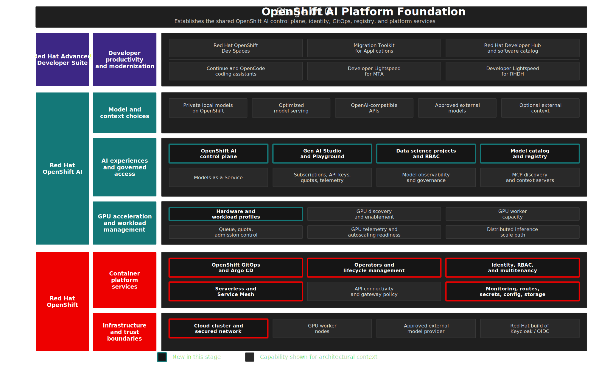

# Stage 010: Trusted OpenShift AI Platform Foundation

## Why This Matters

Enterprise AI adoption becomes difficult to govern when every team assembles its own notebooks, model endpoints, credentials, and dashboards. Platform teams need a shared control plane before developers and AI engineers start consuming models from multiple tools and trust boundaries.

This stage establishes that foundation with Red Hat OpenShift AI on OpenShift. It creates the place where model access, model metadata, dashboard access, user identity, monitoring, and accelerator choices can be managed as platform capabilities rather than one-off project setup.

## Architecture



## What This Stage Adds

- An OpenShift AI 3.3 control plane, installed through the Red Hat OpenShift AI Operator and reconciled from [`gitops/stages/010-openshift-ai-platform-foundation/base/`](../../gitops/stages/010-openshift-ai-platform-foundation/base/).
- A configured `DataScienceCluster` and `DSCInitialization` for the AI services used later in the workshop, including dashboard, model serving, model registry, KServe, Llama Stack, and MaaS-related components.
- GenAI Studio and dashboard configuration so model discovery and experimentation have a shared platform entry point.
- A model registry backed by PostgreSQL metadata storage in `rhoai-model-registries`, giving later stages a place to register local models with traceability.
- Demo users, OpenShift groups, and OpenShift OAuth integration so the same identities can flow through Red Hat OpenShift AI, MaaS, Red Hat OpenShift Dev Spaces, MTA, and Red Hat Developer Hub.
- CPU and NVIDIA L4 hardware profiles that make workload sizing and accelerator choices explicit in the platform experience.
- User workload monitoring and CA trust configuration needed by the later model-serving and dashboard flows.

The scope is intentional. This stage enables the platform services the demo consumes instead of trying to turn on every possible OpenShift AI feature.

## What To Notice In The Demo

Focus on the platform outcome rather than the installation mechanics.

OpenShift AI appears as a shared AI control plane, not just another namespace. GenAI Studio, the dashboard, model registry, users, groups, and hardware profiles are already in place before a single LLM is served. That order matters: model serving, developer tools, and modernization workflows all inherit the same identity and platform context.

The key takeaway is that enterprise AI starts with governed platform services before it starts with model endpoints.

## How Red Hat And Open Source Make It Work

OpenShift provides the operational substrate: identity, RBAC, namespaces, scheduling, networking, routes, storage integration, monitoring, and GitOps reconciliation. OpenShift AI adds the AI platform layer: dashboard access, data science projects, model serving integration, model registry, GenAI Studio, and components that later support MaaS.

The open source foundation comes from Kubernetes, Open Data Hub, KServe, Model Registry, and related serving projects. Red Hat packages and integrates those capabilities through operators and supported platform patterns so AI workloads can use the same identity, access, monitoring, and lifecycle controls as other OpenShift workloads.

## Red Hat Products Used

- **Red Hat OpenShift AI** is the main product demonstrated in this stage. It provides the AI dashboard, DataScienceCluster, model serving integration, GenAI Studio, and model registry experience.
- **Red Hat OpenShift** provides the underlying platform services: authentication, namespaces, routes, RBAC, scheduling, monitoring, and storage integration.
- **OpenShift Serverless** and **Service Mesh** provide platform services used by OpenShift AI serving components.

## Open Source Projects To Know

- [Open Data Hub](https://opendatahub.io/) is the upstream community foundation for many OpenShift AI capabilities.
- [KServe](https://kserve.github.io/website/) provides Kubernetes-native model serving concepts used by OpenShift AI.
- [Model Registry](https://github.com/opendatahub-io/model-registry) provides model metadata and lifecycle foundations.
- Kubernetes and OpenShift provide the identity, scheduling, networking, and operational substrate that make the AI layer enterprise-ready.

## Why This Is Worth Knowing

This stage teaches the first architectural principle of the workshop: AI should be delivered as a platform capability. Once identity, observability, dashboard access, model metadata, and hardware profiles are in place, the rest of the workshop can build on a consistent foundation.

For regulated organizations, that consistency matters. A platform gives teams a place to define controls and operating practices before developers start sending prompts to models.

## Where This Fits In The Full Platform

| Later stage | What it gets from Stage 010 |
|------------|---------------------------|
| Stage 020 | Platform readiness before accelerator capacity is added |
| Stage 030 | Data science project, model registry, and model serving integration |
| Stage 040 | Demo users, groups, and MaaS-related platform components |
| Stage 070 | Shared OpenShift identity for developer workspaces |
| Stage 090 | Platform identity and catalog context for Developer Hub |

## Deploy And Validate

Operational commands are kept here for workshop operators.

```bash
./stages/010-openshift-ai-platform-foundation/deploy.sh
./stages/010-openshift-ai-platform-foundation/validate.sh
```

Manifests: [`gitops/stages/010-openshift-ai-platform-foundation/base/`](../../gitops/stages/010-openshift-ai-platform-foundation/base/)

## References

- [Red Hat OpenShift AI](https://www.redhat.com/en/products/ai/openshift-ai)
- [Red Hat OpenShift AI 3.3 installation guide](https://docs.redhat.com/en/documentation/red_hat_openshift_ai_self-managed/3.3/html-single/installing_and_uninstalling_openshift_ai_self-managed/index)
- [Red Hat OpenShift AI 3.3 documentation](https://docs.redhat.com/en/documentation/red_hat_openshift_ai_self-managed/3.3/)
- [MaaS code assistant quickstart](https://docs.redhat.com/en/learn/ai-quickstarts/rh-maas-code-assistant)

## Next Stage

[Stage 020: GPU Infrastructure for Private AI](../020-gpu-infrastructure-private-ai/README.md) adds the accelerator layer required for private model inference.
