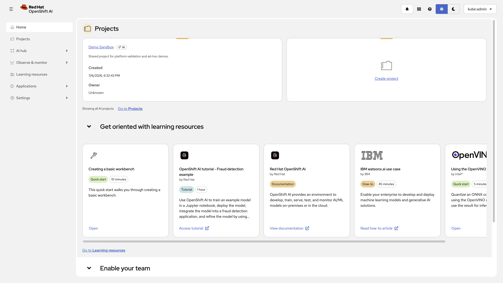
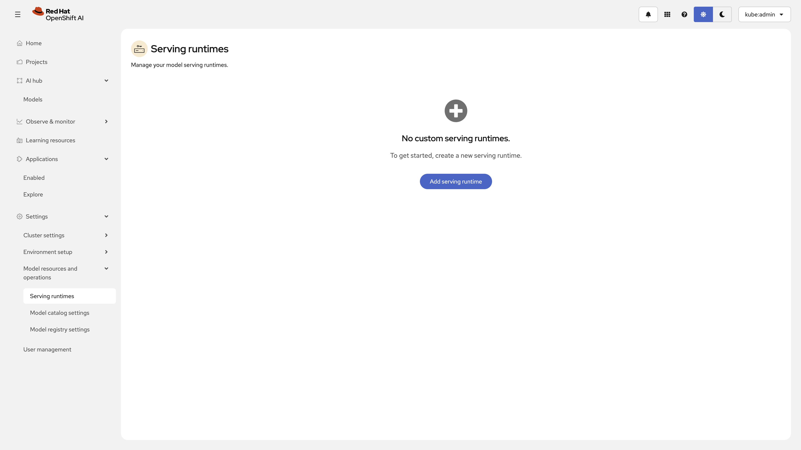
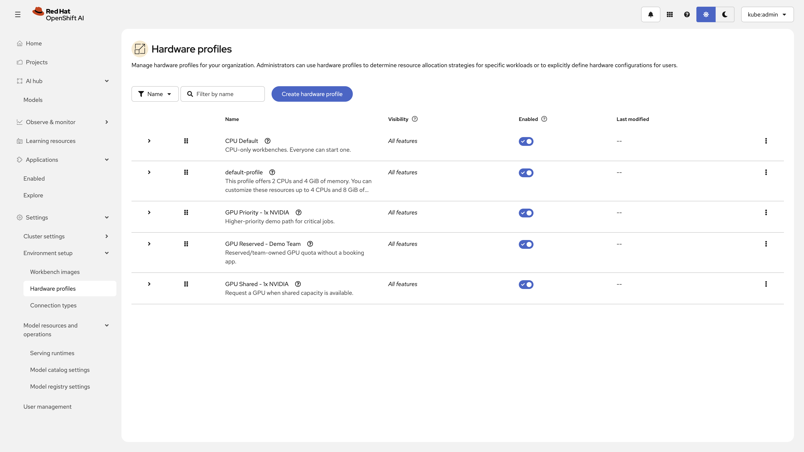
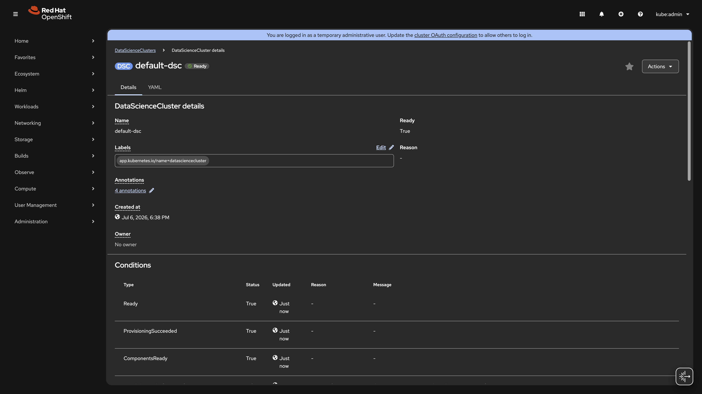
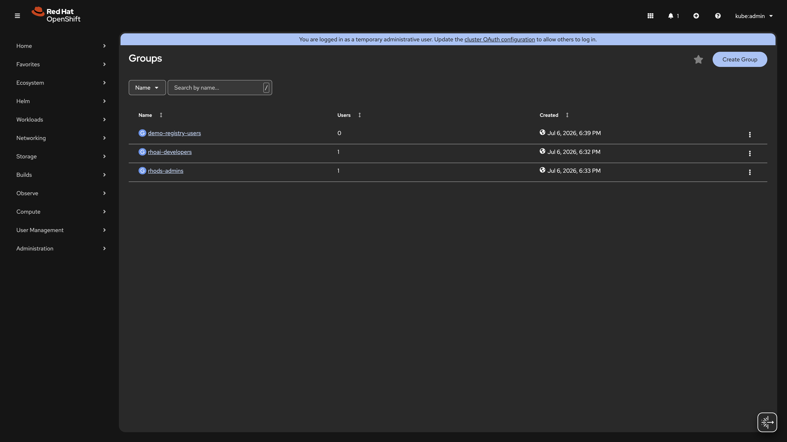

# Stage 010: OpenShift AI Platform Foundation

## Why This Matters

Enterprise AI has moved past experimentation. Business leaders are asking how to scale it safely, control costs, and protect sensitive data. Autonomous agents, model serving, pipelines, and evaluation workflows all require a stable, governed infrastructure beneath them. Without that foundation, AI projects stall at the proof-of-concept stage.

This stage builds the production-ready, GitOps-managed base that every subsequent demo stage depends on. It proves that a platform team can deliver a private AI platform on OpenShift — with S3-compatible object storage, identity, observability, and a governed model registry — before a single model is deployed. The infrastructure-first lesson: you cannot bypass the boring work of standardization if you want to reach the exciting work of AI innovation.

Red Hat OpenShift AI 3.4 delivers this as a metal-to-agent platform that runs consistently across bare-metal, private cloud, managed Kubernetes, and edge footprints. Open models such as Llama, Qwen, Granite, and DeepSeek run locally with predictable costs. The same platform integrates governed access to proprietary endpoints when required. Object storage is the connective tissue — model artifacts, pipeline data, and evaluation evidence all flow through S3-compatible storage provided natively by OpenShift Data Foundation.

## Architecture

```
┌─────────────────────────────────────────────────────────────────┐
│  OpenShift Container Platform 4.20 (AWS)                        │
│                                                                 │
│  ┌───────────────────────────────────────────────────────────┐  │
│  │  OpenShift GitOps (openshift-gitops)                      │  │
│  │  Argo CD · AppProject: rhoai-demo · tracking: annotation  │  │
│  └───────────────────┬───────────────────────────────────────┘  │
│                      │ reconciles                               │
│         ┌────────────┴────────────┐                            │
│         ▼                         ▼                            │
│  ┌─────────────────┐   ┌──────────────────────────────────┐   │
│  │  ODF MCG        │   │  Red Hat OpenShift AI 3.4        │   │
│  │  (openshift-    │   │  (redhat-ods-operator)           │   │
│  │   storage)      │   │                                  │   │
│  │  NooBaa/S3 ─────┼──▶│  DSCI · DSC (v2)                 │   │
│  │  OBC storage    │   │  Dashboard · Workbenches         │   │
│  │  class          │   │  Model Registry                  │   │
│  │       │         │   │  (redhat-ods-applications)       │   │
│  └───────┼─────────┘   └──────────────────────────────────┘   │
│          │ OBC                          ▲                      │
│          ▼                              │ Contributor          │
│  ┌──────────────────────────────────────┴────────────────┐    │
│  │  demo-sandbox (data science project)                  │    │
│  │  S3 connection (demo-sandbox-s3)  ·  ai-developer     │    │
│  └───────────────────────────────────────────────────────┘    │
│  Auth: htpasswd IdP — ai-admin (RHOAI admin), ai-developer    │
└─────────────────────────────────────────────────────────────────┘
```

## Demo

### OpenShift AI Dashboard

The platform control plane with the AI Coding Sandbox project (resource name `demo-sandbox`), AI Hub, Observe and Monitor, and Settings navigation.



### Serving Runtimes

Serving runtimes configuration ready for custom runtime definitions in later stages.



### Hardware Profiles

CPU Default, GPU Priority, GPU Reserved, and GPU Shared profiles. These are deployed by Stage 020 and visible here once that stage is applied.



### DataScienceCluster

The `default-dsc` DataScienceCluster resource showing Ready status.



### OpenShift Groups

Demo groups (`rhods-admins`, `rhoai-developers`) establishing the identity base for RBAC.



## What This Stage Adds

A production-ready AI platform foundation that all subsequent stages build on.

- **OpenShift GitOps** — Argo CD (channel `gitops-1.20`) with AppProject `rhoai-demo` and annotation-based resource tracking, reconciling all platform resources from Git; `gitops-plugin` console plugin enabled via sync-wave Job for Argo CD visibility in the OpenShift web console
- **OpenShift Data Foundation MCG** — standalone Multicloud Object Gateway (NooBaa) providing S3-compatible object storage via `ObjectBucketClaim`; StorageCluster uses `dbStorageClassName: gp3-csi`
- **Red Hat OpenShift AI 3.4** — operator on `stable-3.4` channel; DSCInitialization (v2) with monitoring in `redhat-ods-monitoring`, trace retention 2160h, trustedCABundle Managed; DataScienceCluster (v2) enabling Dashboard, Workbenches, and Model Registry; components removed until later stages: `kueue`, `kserve`, `aipipelines`, `feastoperator`, `ray`, `trainingoperator`, `trustyai`, `llamastackoperator`
- **Model Registry** — `demo-registry` CR in `rhoai-model-registries` namespace with embedded PostgreSQL; RBAC grants `rhods-admins` and `rhoai-developers` the operator-generated `registry-user-demo-registry` Role
- **Observability stack** — Cluster Observability Operator (stable channel, pinned to CSV v1.4.0 via manual InstallPlan approval, resource limits 750m CPU / 1Gi memory), Red Hat build of OpenTelemetry, and Tempo Operator; one Prometheus replica with 5Gi storage and 90-day retention; Tempo with PV-backed storage and 10% sampling
- **OdhDashboardConfig** — enables `observabilityDashboard` plus Technology Preview UI flags: `autorag`, `genAiStudio`, `maasAuthPolicies`, `modelAsService`, `vLLMDeploymentOnMaaS`
- **Platform access** — htpasswd identity provider with `ai-admin` (member of operator-owned `rhods-admins` group, project-admin on `demo-sandbox`) and `ai-developer` (member of `rhoai-developers`, edit on `demo-sandbox`); `demo-sandbox` namespace carries `kueue.openshift.io/managed: "true"` label for Stage 020 queue enforcement
- **S3 connection** — project-scoped `ObjectBucketClaim` exposed as `demo-sandbox-s3` using the dashboard's pre-installed S3 connection type

## What To Notice And Why It Matters

- **GitOps from day one** — every resource is in Git and reconciled by Argo CD, so the platform is reproducible and auditable
- **DSC component isolation** — removed components are explicitly listed; later stages enable their own deltas through hook Jobs, allowing one-stage-at-a-time validation
- **Argo CD Application ignores DSC component fields** that later stage patches modify, preventing reconciliation conflicts
- **MCG-only ODF** — no Ceph OSDs; full block/file storage is deferred until a stage explicitly needs it
- **Observability-first** — prerequisite operators are deployed before RHOAI so the observability dashboard menu is backed by real services
- **COO lifecycle policy** — pinned to v1.4.0 to avoid RHOAI 3.4 / COO 1.5 generated-resource incompatibility; this is an operator lifecycle decision, not general version pinning
- **Identity separation** — `rhods-admins` is the operator-owned admin group referenced in the RHOAI auth CR; `rhoai-developers` is a project-level contributor group; both are distinct roles with distinct access

## How Red Hat And Open Source Make It Work

OpenShift GitOps provides declarative reconciliation through Argo CD. OpenShift Data Foundation delivers S3-compatible object storage through the Multicloud Object Gateway (NooBaa). Red Hat OpenShift AI installs the control plane — Dashboard, Workbenches, and Model Registry — with a single operator. The Cluster Observability Operator, OpenTelemetry Operator, and Tempo Operator provide the metrics and tracing stack that the RHOAI observability dashboard consumes. OpenShift's built-in htpasswd identity provider and RBAC model give platform teams fine-grained control over who can access which AI resources.

## Trust Boundaries

| Boundary | Control |
|----------|---------|
| Cluster admin vs AI admin | `kubeadmin` is the recovery path; `ai-admin` gets RHOAI dashboard admin via `rhods-admins` and namespace admin on `demo-sandbox` only |
| Admin vs developer | `ai-developer` has edit (not admin) on `demo-sandbox`; no cluster-scoped privileges |
| Model Registry access | Operator-generated Role (`registry-user-demo-registry`) bound to `rhods-admins` and `rhoai-developers` — no anonymous access |
| Object storage | Per-namespace OBC; credentials are generated and never committed to Git |
| Secrets posture | htpasswd secret, passwords, and S3 connection secret are created imperatively by `setup-access.sh`; passwords stored in gitignored `.env` |
| Observability | Perses backend access limited to the COO operator namespace; `rhods-admins` granted narrow Perses/Prometheus API permissions |

## Red Hat Products Used

| Product | Version/Channel |
|---------|-----------------|
| Red Hat OpenShift Container Platform | 4.20 |
| Red Hat OpenShift AI Self-Managed | stable-3.4 |
| Red Hat OpenShift Data Foundation | 4.20 (MCG-only) |
| Red Hat OpenShift GitOps | gitops-1.20 |
| Cluster Observability Operator | stable (CSV v1.4.0) |
| Red Hat build of OpenTelemetry | stable |
| Red Hat OpenShift distributed tracing platform (Tempo) | stable |

## Open Source Projects To Know

| Project | Role |
|---------|------|
| Argo CD | GitOps reconciliation engine |
| NooBaa | S3-compatible object gateway (MCG) |
| Open Data Hub | Upstream for RHOAI operator and dashboard |
| Kubeflow Model Registry | Upstream for RHOAI Model Registry |
| Perses | Observability dashboard (COO operand) |
| OpenTelemetry | Distributed tracing and telemetry |
| Grafana Tempo | Trace storage backend |

## Deploy And Validate

```bash
# Bootstrap GitOps and deploy stage
./stages/010-openshift-ai-platform-foundation/deploy.sh

# Configure htpasswd identity, group membership, and S3 connection secrets
./stages/010-openshift-ai-platform-foundation/setup-access.sh

# Validate
./stages/010-openshift-ai-platform-foundation/validate.sh
```

The deploy script bootstraps OpenShift GitOps, then applies the Argo CD Application that reconciles all Stage 010 resources. Platform access (htpasswd IdP, group membership, S3 connection secret) is configured imperatively by `setup-access.sh` to keep credentials out of Git.

## References

| Source | Role |
|--------|------|
| [RHOAI 3.4 install guide](https://docs.redhat.com/en/documentation/red_hat_openshift_ai_self-managed/3.4/html/installing_and_uninstalling_openshift_ai_self-managed/installing-and-deploying-openshift-ai_install) | Operator, DSCI, DSC CR fields |
| [ODF 4.20 on AWS](https://docs.redhat.com/en/documentation/red_hat_openshift_data_foundation/4.20/html-single/deploying_openshift_data_foundation_using_amazon_web_services/index) | MCG standalone deployment |
| [RHOAI 3.4 Managing observability](https://docs.redhat.com/en/documentation/red_hat_openshift_ai_self-managed/3.4/html/managing_openshift_ai/managing-observability_managing-rhoai) | Observability stack prerequisites and dashboard flag |
| [OCP 4.20 GitOps](https://docs.redhat.com/en/documentation/openshift_container_platform/4.20/html/gitops/index) | OpenShift GitOps operator |
| [OCP 4.20 Observability](https://docs.redhat.com/en/documentation/openshift_container_platform/4.20/html/observability_overview/index) | OpenShift observability component boundary |
| [Red Hat build of OpenTelemetry 3.9](https://docs.redhat.com/en/documentation/red_hat_build_of_opentelemetry/3.9) | OpenTelemetry Operator |
| [Red Hat OpenShift distributed tracing platform 3.9](https://docs.redhat.com/en/documentation/red_hat_openshift_distributed_tracing_platform/3.9) | Tempo Operator |

## Next Stage

[Stage 020: GPU Infrastructure for Private AI](../020-gpu-infrastructure-private-ai/) provisions GPU worker capacity, installs the NVIDIA runtime stack, and creates quota-controlled queues so the platform can serve AI models on governed accelerators.
