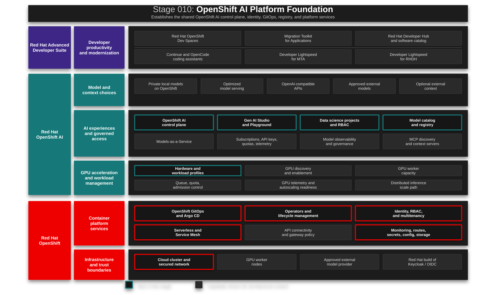

# Stage 010: OpenShift AI Platform Foundation

## Why This Matters

Enterprise AI is hard to govern when every team creates its own dashboards, notebooks, model endpoints, credentials, and access rules. Before developers can consume private or external models safely, the platform needs a shared AI control plane.

This stage installs the Red Hat OpenShift AI foundation for the workshop. It creates the platform surface for model serving, model metadata, GenAI Studio, dashboard access, identity, monitoring, and approved workload sizes.

## Architecture



## What This Stage Adds

This stage adds the shared OpenShift AI foundation.

- Red Hat OpenShift AI 3.4 installed through the Red Hat OpenShift AI Operator.
- Core OpenShift AI services for dashboard access, GenAI Studio, model serving, model registry, Llama Stack, and MaaS-related features.
- A PostgreSQL-backed model registry for model metadata.
- Demo users, OpenShift groups, and OpenShift OAuth integration.
- CPU and NVIDIA L4 hardware profiles for explicit workload sizing.
- User workload monitoring and CA trust configuration for observability and internal TLS handling.

The stage enables the services required by later stages. It does not try to enable every OpenShift AI feature.

## What To Notice And Why It Matters

Stage 010 makes OpenShift AI the shared control plane before any model endpoint is exposed.

- Platform teams get one entry point for model discovery, model metadata, dashboard access, and workload choices.
- OpenShift OAuth, groups, and RBAC establish the identity base for later model and workspace access.
- Hardware profiles make CPU and NVIDIA L4 choices visible through the platform rather than local assumptions.
- Monitoring prerequisites are installed early so later model, MaaS, and GPU signals have a place to land.

This matters because privacy-sensitive and regulated environments need repeatable platform controls before teams start sending source code or modernization context to AI services.

## How Red Hat And Open Source Make It Work

Red Hat OpenShift supplies identity, RBAC, namespaces, networking, routes, storage integration, monitoring, operators, and GitOps reconciliation. Red Hat OpenShift AI adds AI-specific platform services: dashboard, data science projects, model serving, GenAI Studio, model registry, and MaaS capabilities.

Open Data Hub, KServe, Model Registry, Kubernetes, and related serving projects provide the upstream foundation. Red Hat packages and integrates those capabilities so AI workloads inherit normal OpenShift lifecycle and access controls.

## Red Hat Products Used

- **[Red Hat OpenShift AI](https://www.redhat.com/en/technologies/cloud-computing/openshift/openshift-ai)** provides the AI dashboard, DataScienceCluster, model serving, GenAI Studio, MaaS features, and model registry.
- **[Red Hat OpenShift](https://www.redhat.com/en/technologies/cloud-computing/openshift)** provides authentication, namespaces, routes, RBAC, scheduling, monitoring, and storage integration.
- **[Red Hat OpenShift Serverless](https://www.redhat.com/en/technologies/cloud-computing/openshift/serverless)** provides Knative services used by OpenShift AI serving components.
- **[Red Hat OpenShift Service Mesh](https://www.redhat.com/en/technologies/cloud-computing/openshift/service-mesh)** provides service-mesh capabilities used by OpenShift AI serving components.

## Open Source Projects To Know

- [Open Data Hub](https://opendatahub.io/) is the upstream foundation for many OpenShift AI capabilities.
- [KServe](https://kserve.github.io/website/) provides Kubernetes-native model serving concepts.
- [Model Registry](https://github.com/opendatahub-io/model-registry) provides model metadata and lifecycle foundations.

## Deploy And Validate

```bash
./stages/010-openshift-ai-platform-foundation/deploy.sh
./stages/010-openshift-ai-platform-foundation/validate.sh
```

Manifests: [`gitops/stages/010-openshift-ai-platform-foundation/base/`](../../gitops/stages/010-openshift-ai-platform-foundation/base/)

## References

- [Red Hat OpenShift AI](https://www.redhat.com/en/technologies/cloud-computing/openshift/openshift-ai)
- [Red Hat OpenShift AI 3.4 installation guide](https://docs.redhat.com/en/documentation/red_hat_openshift_ai_self-managed/3.4/html-single/installing_and_uninstalling_openshift_ai_self-managed/index)
- [Red Hat OpenShift AI 3.4 documentation](https://docs.redhat.com/en/documentation/red_hat_openshift_ai_self-managed/3.4/)
- [MaaS code assistant quickstart](https://docs.redhat.com/en/learn/ai-quickstarts/rh-maas-code-assistant)

## Next Stage

[Stage 020: GPU Infrastructure for Private AI](../020-gpu-infrastructure-private-ai/README.md) adds the accelerator layer required for private model inference.
