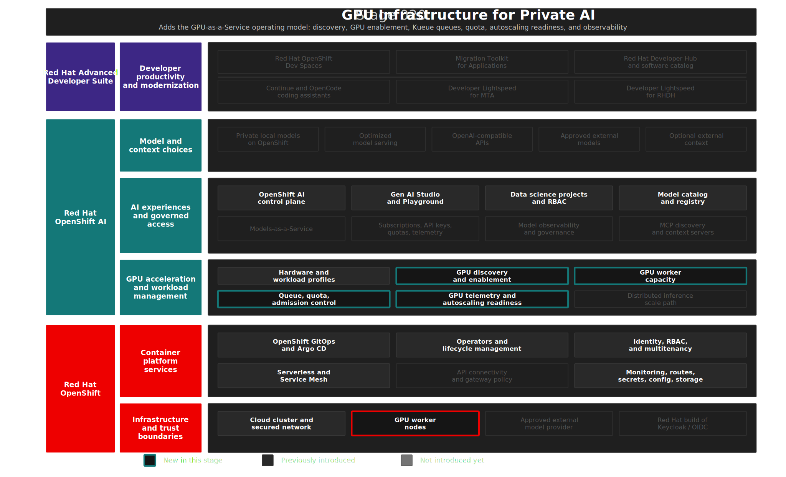

# Stage 020: GPU Infrastructure For Private AI

## Why This Matters

The workshop story starts with a platform team building a trusted AI development environment for enterprise developers. Stage 010 established the Red Hat OpenShift AI foundation. Stage 020 adds the private compute layer that makes the rest of the story credible: GPU capacity that can be discovered, scheduled, governed, observed, and consumed through platform abstractions.

For this demo, GPUs are not just infrastructure. They are the foundation for private model serving, where sensitive source code and prompts can stay inside the OpenShift platform boundary. If GPU access is handled as a collection of hand-built node selectors, every private model deployment becomes a special case. If GPU access is exposed as a governed platform service, the same environment can support model serving, developer workspaces, modernization workflows, and future AI workloads with clearer operational control.

This stage uses a demo-scale GPU-as-a-Service pattern aligned with Red Hat guidance: accelerator discovery, GPU node lifecycle, queue-based admission, quota, Red Hat OpenShift AI hardware profiles, autoscaling readiness, and observability. The demo does not simulate a large organization with many competing teams. It shows the control-plane building blocks that make governed private AI compute possible.

## Architecture



## What This Stage Adds

This stage adds a demo-scale GPU-as-a-Service foundation for private AI workloads.

- Hardware discovery through Node Feature Discovery so OpenShift can label accelerator-capable nodes.
- NVIDIA GPU enablement through the NVIDIA GPU Operator and managed NVIDIA L4 worker capacity.
- Red Hat build of Kueue with queue, flavor, and quota resources for admitted AI workloads.
- Queue-based Red Hat OpenShift AI hardware profiles that expose approved GPU choices through the platform experience.
- OpenShift Custom Metrics Autoscaler and KEDA readiness for metric-driven scaling patterns.
- GPUaaS observability for capacity, utilization, memory, queue state, and quota status.

The preferred path is queue-managed GPU consumption. Direct node-scheduling hardware profiles remain only for compatibility with existing OpenShift AI usage patterns.

## What To Notice And Why It Matters

Stage 020 turns accelerator capacity into a governed private AI compute service. Node Feature Discovery, the NVIDIA GPU Operator, AWS GPU MachineSet automation, Red Hat build of Kueue, Red Hat OpenShift AI hardware profiles, OpenShift Custom Metrics Autoscaler, and GPUaaS dashboards make GPU access discoverable, schedulable, quota-aware, and observable.

The essential proof point is enterprise control around scarce accelerator resources:

- `ResourceFlavor` maps the NVIDIA L4 node class to the labels and tolerations needed for scheduling.
- `ClusterQueue` and `LocalQueue` express quota and admission control for approved AI workloads.
- Queue-based OpenShift AI hardware profiles give users a dashboard-level accelerator choice without exposing node selectors, taints, or scheduler details.
- GPU, Kueue, and KEDA observability provide the signals needed for capacity planning, cost control, and utilization review.

This matters because private and sovereign AI depend on expensive accelerator capacity that must be shared without losing control. A GPU-as-a-Service pattern helps platform engineers reduce shadow IT, fragmented accelerator pools, idle capacity, and tenant-isolation risk while giving approved workloads a governed path to compute across the hybrid cloud estate.

## How Red Hat And Open Source Make It Work

Red Hat OpenShift provides the Kubernetes platform substrate: cluster identity, RBAC, machine management, scheduling, networking, monitoring, and Operator Lifecycle Manager. Node Feature Discovery identifies accelerator-capable nodes. The NVIDIA GPU Operator manages the driver stack, device plugin, container toolkit, and DCGM telemetry needed for GPU workloads.

Red Hat OpenShift AI provides the AI platform layer. In this stage it consumes the GPUaaS foundation through dashboard integration and hardware profiles. In Stage 030, private model-serving workloads use the queued GPU path by applying the `kueue.x-k8s.io/queue-name=private-model-serving` label.

Red Hat OpenShift AI 3.4 integrates with Kueue through **Red Hat build of Kueue**, not through the deprecated embedded Kueue component. This repository configures `DataScienceCluster.spec.components.kueue.managementState: Unmanaged`, which tells OpenShift AI to integrate with the externally managed Red Hat build of Kueue Operator. It also enables Kueue support in the dashboard and labels the `maas` namespace with `kueue.openshift.io/managed=true` so queue enforcement applies to supported workload types.

OpenShift Custom Metrics Autoscaler, the Red Hat-supported KEDA path for OpenShift, is installed as the autoscaling building block. In production, KEDA can use Prometheus or Kueue signals such as backlog or idle workload state to scale workloads or nodes. In this demo, it is deliberately not attached to the private model deployments. That keeps the first pass focused on the GPUaaS foundation while leaving a clear extension point for demand-driven scaling.


## Trust Boundaries

This stage does not process source code or prompts; its trust boundary is operational control over scarce accelerator capacity. OpenShift projects, RBAC, Kueue queues, quotas, hardware profiles, telemetry, and GitOps-managed state help platform teams keep private AI compute governed inside the OpenShift environment, which supports sovereignty and audit-readiness goals without claiming EU AI Act compliance on its own.

## Red Hat Products Used

- **Red Hat OpenShift** provides the application platform, Kubernetes scheduling, machine management, RBAC, monitoring, networking, and operator lifecycle.
- **Red Hat OpenShift AI** provides the AI platform integration point through hardware profiles, dashboard configuration, Kueue-aware workload management, and later private model serving.
- **Red Hat build of Kueue** provides the supported queueing and quota control plane used by Red Hat OpenShift AI 3.4.
- **OpenShift Custom Metrics Autoscaler Operator** provides the Red Hat-supported KEDA integration for custom-metric and event-driven autoscaling patterns.
- **Red Hat OpenShift GitOps** reconciles the GPUaaS desired state through Argo CD.

## Open Source Projects To Know

- [Node Feature Discovery](https://kubernetes-sigs.github.io/node-feature-discovery/stable/get-started/index.html) labels Kubernetes nodes based on hardware capabilities so accelerator-aware scheduling can work from observable node facts.
- [NVIDIA GPU Operator](https://docs.nvidia.com/datacenter/cloud-native/gpu-operator/latest/index.html) automates the NVIDIA software stack required for GPU workloads on Kubernetes.
- [DCGM Exporter](https://github.com/NVIDIA/dcgm-exporter) exposes GPU health, utilization, and memory metrics for monitoring.
- [Kueue](https://kueue.sigs.k8s.io/) provides Kubernetes-native workload queueing, quota accounting, and admission control.
- [KEDA](https://keda.sh/) provides event-driven autoscaling patterns that OpenShift supports through the Custom Metrics Autoscaler Operator.


## Where This Fits In The Full Platform

| Later stage | What it gets from Stage 020 |
|------------|-----------------------------|
| Stage 030 | GPU capacity, Kueue queue context, and hardware profile selection for private model serving |
| Stage 040 | Private model endpoints whose GPU footprint can be observed and governed through the platform |
| Stage 070 | Private model endpoints consumed from controlled developer workspaces |
| Stage 080 | Private MaaS model capacity for Red Hat Developer Lightspeed for MTA |
| Stage 090 | Platform capabilities that can be published through the developer portal |

## Deploy And Validate

Operational commands are kept here for workshop operators.

```bash
./stages/020-gpu-infrastructure-private-ai/deploy.sh
./stages/020-gpu-infrastructure-private-ai/validate.sh
```

Manifests: [`gitops/stages/020-gpu-infrastructure-private-ai/base/`](../../gitops/stages/020-gpu-infrastructure-private-ai/base/)

## References

- [Unlocking AI innovation: GPU-as-a-Service with Red Hat](https://www.redhat.com/en/blog/unlocking-ai-innovation-gpu-service-red-hat)
- [GPU-as-a-Service for AI at scale: Practical strategies with Red Hat OpenShift AI](https://www.redhat.com/en/blog/gpu-service-ai-scale-practical-strategies-red-hat-openshift-ai)
- [Red Hat OpenShift AI 3.4: Managing workloads with Kueue](https://docs.redhat.com/en/documentation/red_hat_openshift_ai_self-managed/3.4/html/managing_openshift_ai/managing-workloads-with-kueue)
- [Red Hat OpenShift AI 3.4: Working with hardware profiles](https://docs.redhat.com/en/documentation/red_hat_openshift_ai_self-managed/3.4/html/working_with_accelerators/working-with-hardware-profiles_accelerators)
- [Red Hat OpenShift AI 3.4: Managing distributed workloads](https://docs.redhat.com/en/documentation/red_hat_openshift_ai_self-managed/3.4/html/managing_openshift_ai/managing-distributed-workloads_managing-rhoai)
- [OpenShift 4.20: Red Hat build of Kueue](https://docs.redhat.com/en/documentation/openshift_container_platform/4.20/html-single/ai_workloads/)
- [OpenShift 4.20: Custom Metrics Autoscaler Operator](https://docs.redhat.com/en/documentation/openshift_container_platform/4.20/html/nodes/automatically-scaling-pods-with-the-custom-metrics-autoscaler-operator)
- [NVIDIA GPU Operator on OpenShift](https://docs.nvidia.com/datacenter/cloud-native/gpu-operator/latest/openshift/contents.html)

## Next Stage

[Stage 030: Private Model Serving](../030-private-model-serving/README.md) deploys the private model serving resources that consume the queue-backed GPU capacity.
