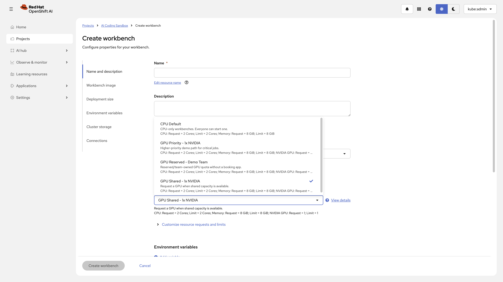
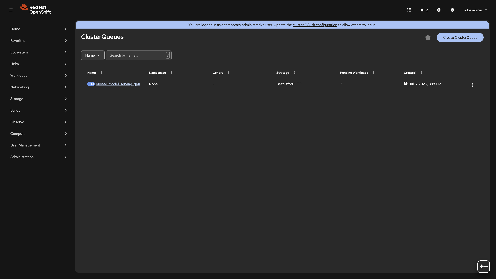

# Stage 020: GPU Infrastructure for Private AI

**Theme:** AI Platform Foundation
**Concept:** Make scarce GPU capacity available as a governed, self-service
platform capability.

---

## Why This Matters

Before teams can build or serve AI models, the platform must make scarce GPU
capacity available in a controlled way. A GPU worker costs materially more than
a CPU worker, and demand will always exceed supply once multiple teams start
building AI workloads.

The enterprise problem is not just "add a GPU node." Platform teams need to
decide who can use GPUs, how much capacity each team can consume, which work
gets admitted first, and how to shut capacity down when the demo or project is
idle. Data scientists should not have to understand node taints, tolerations,
device-plugin labels, or queue objects to get started.

This stage turns the GPU into a platform service. OpenShift Machine API creates
the worker capacity. Node Feature Discovery publishes hardware facts about the
nodes. The NVIDIA GPU Operator installs the NVIDIA runtime stack and exposes
GPU capacity to Kubernetes. Red Hat build of Kueue turns that capacity into
quota-controlled queues. Red Hat OpenShift AI hardware profiles present those
queues as simple dashboard choices: CPU Default, GPU Shared, GPU Priority, and
GPU Reserved.

---

## What Enables It

This stage builds the GPU-as-a-Service layer on top of the Stage 010 base
platform.

### GPU Worker Capacity

The demo uses one AWS `g6e.2xlarge` GPU worker by default. This instance type
provides one NVIDIA L40S GPU with 48 GB of GPU memory. The MachineSet is tracked
in GitOps so a fresh environment can create the GPU worker consistently.

This demo provisions two GPU workers — one NVIDIA L40S per private model (nemotron and qwen each claim a full card; see Stage 040). On every fresh environment, regenerate the MachineSet from the cluster's own worker pool before or right after deploy:

```bash
RHOAI_GPU_MACHINESET_REPLICAS=2 \
  ./stages/020-gpu-infrastructure-private-ai/generate-gpu-machineset.sh --write
```

The committed manifest carries cluster-specific identity (AMI, subnet,
cluster labels) and cannot provision on a different cluster.
Operators can manually scale the GPU
MachineSet to zero between sessions to control cost; the Argo CD Application
ignores `MachineSet.spec.replicas` drift so intentional scale-down is not
self-healed back to one.

### Hardware Discovery (NFD Operator)

The Node Feature Discovery Operator installs the OpenShift hardware-discovery
layer. Its `NodeFeatureDiscovery` instance publishes node feature labels from
hardware sources such as PCI devices. In this stage, NFD is the discovery
prerequisite that lets accelerator-aware operators and scheduling policy rely
on verified node metadata instead of hand-maintained labels.

NFD does not provide GPU capacity by itself. It hands discovered hardware
context to the accelerator stack; the NVIDIA GPU Operator and its GPU Feature
Discovery/device-plugin components expose the `nvidia.com/gpu` scheduling
resource and NVIDIA-specific GPU labels used by Kueue placement.

### NVIDIA GPU Enablement

The NVIDIA GPU Operator installs the driver stack, container toolkit, GPU
feature discovery, DCGM exporter, and device plugin. Each physical L40S is
advertised as one schedulable `nvidia.com/gpu` unit — this demo deliberately
does not enable time-slicing.

Time-slicing shares compute without memory isolation, which is useful for
workbench density around a single model (the rhoai3-demo foundation uses it
that way) but unsafe for this demo's two vLLM servers: a second model
co-scheduled onto a sliced card OOMs at weight load. Full-card placement is
the RHOAI 3.4-aligned mechanism because hardware profiles carry no affinity
concept and the KServe webhook strips LLMInferenceService template
anti-affinity.

### Queue-Based GPU Governance

Red Hat build of Kueue provides admission control and quota. This stage enables
RHOAI integration with the standalone Kueue operator by patching the shared
`DataScienceCluster` to `kueue.managementState: Unmanaged` via an Argo CD Sync
hook Job (`job-enable-dsc-kueue`) that uses a dedicated ServiceAccount and
ClusterRole in `redhat-ods-applications`. The GPU `ResourceFlavor` uses the
GPU Feature Discovery label (`nvidia.com/gpu.present: "true"`) and GPU-only
taint, so users do not need to know node placement details.

This stage creates:

- one CPU `ResourceFlavor`
- one GPU `ResourceFlavor` targeting GPU-labeled nodes and tolerating the GPU
  taint
- four `ClusterQueue` objects
- four `LocalQueue` objects in `demo-sandbox`
- one Kueue `WorkloadPriorityClass` (`gpu-high-priority`, value 1000) for future priority experiments

The `cq-gpu-shared` and `cq-gpu-priority` queues share a `gpu-pool` cohort,
enabling future fair-sharing and borrowing between them. The
`cq-gpu-reserved-demo` queue has no cohort — true isolation for the demo team.
The `cq-cpu-default` queue provides `cpu: 40`, `memory: 128Gi` — sized for
Stage 230's CPU model plane (Qwen3 reranker, granite-30m, MiniLM embedding
InferenceServices, plus the Enterprise RAG Workbench).

The initial queue design is intentionally non-preemptive because RHOAI
workbenches are not suspendable. The "GPU Priority" profile is a dedicated
quota lane, not a preemption demonstration.

### RHOAI Hardware Profiles

Hardware profiles turn queue and resource choices into dashboard-friendly
options. Users select a profile; RHOAI adds the queue binding to the workload.
The low-level scheduling authority remains in Kueue `ResourceFlavor` and
`LocalQueue` resources.

| Hardware profile | Backing queue | GPU quota | User-facing intent |
|---|---|---:|---|
| CPU Default | `lq-cpu-default` | 0 | CPU-only workbench or small job |
| GPU Shared - 1x NVIDIA | `lq-gpu-shared` | 0 | No spare capacity while both cards serve the private models; raise when GPU nodes are added |
| GPU Priority - 1x NVIDIA | `lq-gpu-priority` | 0 | Higher-importance lane, currently zero until GPU capacity grows |
| GPU Reserved - Demo Team | `lq-gpu-reserved-demo` | 2 | Reserved capacity: two L40S cards, one private model per card |

---

## Architecture

```text
AWS GPU MachineSet (g6e.2xlarge, 1x L40S each, replicas=2 for the two private models)
   |
   v
NFD Operator -> NodeFeatureDiscovery -> node hardware feature labels
   |
   v
NVIDIA GPU Operator -> driver, toolkit, GFD, DCGM, device plugin
   |
   v
device plugin: 1 physical GPU -> 1 schedulable nvidia.com/gpu unit
   |
   v
Red Hat build of Kueue -> ResourceFlavor -> ClusterQueue -> LocalQueue
   |
   v
RHOAI Hardware Profiles -> CPU Default / GPU Shared / GPU Priority / GPU Reserved
   |
   v
Data scientist selects governed capacity from the RHOAI dashboard
```

Stage 030 uses this capacity to prove vLLM model serving with Nemotron and
capture a lightweight serving baseline. Stage 040 exposes validated model
access through Models-as-a-Service.

---

## Demo

### Hardware Profile Selection

The workbench creation form exposes GPU capacity as simple dropdown choices — no node taints or tolerations required.



### GPU Shared Profile Selected

Selecting "GPU Shared - 1x NVIDIA" shows the resource specifications: CPU, memory, and one NVIDIA GPU from the shared capacity pool.


### GPU MachineSet

The AWS g6e.2xlarge GPU MachineSet providing L40S capacity, managed by OpenShift Machine API and tracked in GitOps.


### Kueue ClusterQueues

Queue-based GPU governance with cohort-based fair sharing between `cq-gpu-priority` and `cq-gpu-shared`, plus isolated `cq-gpu-reserved-demo` capacity.



---

## References

| Source | Role |
|---|---|
| [RHOAI 3.4 - Working with accelerators](https://docs.redhat.com/en/documentation/red_hat_openshift_ai_self-managed/3.4/html-single/working_with_accelerators/index) | NVIDIA GPU enablement and hardware profiles |
| [RHOAI 3.4 - Managing workloads with Kueue](https://docs.redhat.com/en/documentation/red_hat_openshift_ai_self-managed/3.4/html/managing_openshift_ai/managing-workloads-with-kueue) | Kueue integration posture |
| [RHOAI 3.4 - Managing distributed workloads](https://docs.redhat.com/en/documentation/red_hat_openshift_ai_self-managed/3.4/html/managing_openshift_ai/managing-distributed-workloads_managing-rhoai) | ResourceFlavor, ClusterQueue, LocalQueue concepts |
| [OCP 4.20 - Machine management](https://docs.redhat.com/en/documentation/openshift_container_platform/4.20/html-single/machine_management/index) | AWS MachineSet management |
| [OCP 4.20 - Node Feature Discovery](https://docs.redhat.com/en/documentation/openshift_container_platform/4.20/html-single/specialized_hardware_and_driver_enablement/index#psap-node-feature-discovery-operator) | NFD Operator, `NodeFeatureDiscovery`, and hardware feature labels |
| [redhat-cop/gitops-catalog - gpu-operator-certified](https://github.com/redhat-cop/gitops-catalog/tree/main/gpu-operator-certified) | GitOps operator/instance reference pattern |
| [redhat-cop/gitops-catalog - nfd](https://github.com/redhat-cop/gitops-catalog/tree/main/nfd) | GitOps NFD reference pattern |
| `docs/PLATFORM_BASELINE.md` | Active product version targets |
