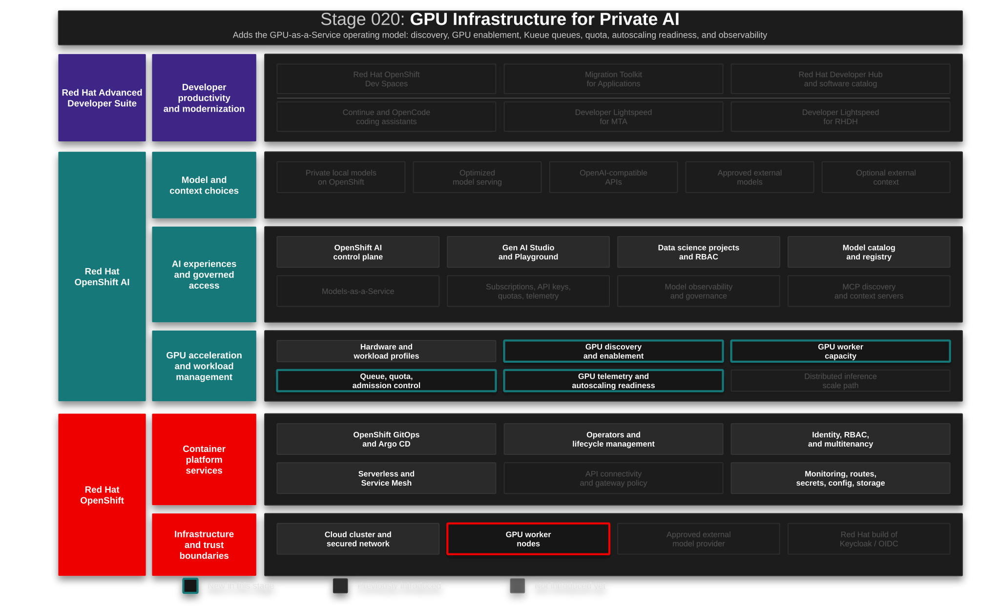

# Stage 020: GPU Infrastructure for Private AI

## Why This Matters

Private model serving needs accelerator capacity that can be discovered, scheduled, shared, observed, and governed. If every model deployment uses hand-built node selectors and local exceptions, private AI becomes difficult to operate and expensive to scale.

Stage 020 adds a demo-scale GPU-as-a-Service foundation. It prepares NVIDIA GPU capacity for OpenShift AI workloads and introduces queue-based admission, quota, hardware profiles, autoscaling readiness, and observability.

## Architecture



## What This Stage Adds

This stage adds governed GPU infrastructure for private AI workloads.

- Hardware discovery through Node Feature Discovery.
- NVIDIA GPU enablement through the NVIDIA GPU Operator and managed NVIDIA L4 worker capacity.
- Red Hat build of Kueue with `ResourceFlavor`, `ClusterQueue`, and `LocalQueue` resources.
- LeaderWorkerSet operator, required by the Kueue LeaderWorkerSet framework integration and later by Stage 030 llm-d serving.
- Queue-based OpenShift AI hardware profiles for approved GPU choices, plus the direct-scheduling NVIDIA L4 profiles (the 4-GPU profile ships disabled until the cluster carries that capacity).
- OpenShift Custom Metrics Autoscaler and KEDA readiness for metric-driven scaling patterns.
- GPU, Kueue, and quota observability dashboards.

The preferred path is queue-managed GPU consumption. Direct node-scheduling hardware profiles remain only for compatibility with existing OpenShift AI usage patterns.

## What To Notice And Why It Matters

Stage 020 turns scarce GPU capacity into a platform service.

- `ResourceFlavor` maps NVIDIA L4 nodes to the labels and tolerations needed for scheduling.
- `ClusterQueue` and `LocalQueue` express quota and admission control for model workloads.
- Queue-backed OpenShift AI hardware profiles hide scheduler details from users while preserving platform control.
- GPU and Kueue metrics support capacity planning, cost control, and utilization review.

This matters because private and sovereign AI depend on expensive accelerator capacity. A GPU-as-a-Service pattern helps reduce fragmented pools, idle capacity, tenant-isolation risk, and undocumented scheduling exceptions.

## How Red Hat And Open Source Make It Work

Red Hat OpenShift provides machine management, scheduling, RBAC, monitoring, Operator Lifecycle Manager, and GitOps delivery. Red Hat OpenShift AI consumes that foundation through hardware profiles. Red Hat build of Kueue adds the supported queueing and quota layer for AI workloads.

Node Feature Discovery labels accelerator-capable nodes. The NVIDIA GPU Operator manages the driver stack and DCGM telemetry. Kueue supplies Kubernetes-native workload admission. KEDA supplies the autoscaling extension point used by the OpenShift Custom Metrics Autoscaler Operator.

## Trust Boundaries

This stage does not process prompts or source code. Its trust boundary is operational control over accelerator capacity through OpenShift projects, RBAC, Kueue queues, quotas, hardware profiles, telemetry, and GitOps-managed state.

## Red Hat Products Used

- **[Red Hat OpenShift](https://www.redhat.com/en/technologies/cloud-computing/openshift)** provides scheduling, machine management, RBAC, monitoring, networking, and operator lifecycle.
- **[Red Hat OpenShift AI](https://www.redhat.com/en/technologies/cloud-computing/openshift/openshift-ai)** provides hardware profiles and Kueue-aware workload integration.
- **[Red Hat build of Kueue](https://docs.redhat.com/en/documentation/red_hat_build_of_kueue/1.0/html/overview/index)** provides queueing and quota control for AI workloads.
- **[Custom Metrics Autoscaler Operator for Red Hat OpenShift](https://docs.redhat.com/en/documentation/openshift_container_platform/4.20/html/nodes/automatically-scaling-pods-with-the-custom-metrics-autoscaler-operator)** provides the Red Hat-supported KEDA integration.
- **[Red Hat OpenShift GitOps](https://www.redhat.com/en/technologies/cloud-computing/openshift/gitops)** reconciles the GPUaaS desired state.

## Open Source Projects To Know

- [Node Feature Discovery](https://kubernetes-sigs.github.io/node-feature-discovery/stable/get-started/index.html) labels nodes based on hardware capabilities.
- [NVIDIA GPU Operator](https://docs.nvidia.com/datacenter/cloud-native/gpu-operator/latest/index.html) automates the NVIDIA software stack for GPU workloads.
- [DCGM Exporter](https://github.com/NVIDIA/dcgm-exporter) exposes GPU health, utilization, and memory metrics.
- [Kueue](https://kueue.sigs.k8s.io/) provides workload queueing, quota accounting, and admission control.
- [KEDA](https://keda.sh/) provides event-driven autoscaling patterns.

## Deploy And Validate

```bash
./stages/020-gpu-infrastructure-private-ai/deploy.sh
./stages/020-gpu-infrastructure-private-ai/validate.sh
```

Manifests: [`gitops/stages/020-gpu-infrastructure-private-ai/base/`](../../gitops/stages/020-gpu-infrastructure-private-ai/base/)

## References

- [Unlocking AI innovation: GPU-as-a-Service with Red Hat](https://www.redhat.com/en/blog/unlocking-ai-innovation-gpu-service-red-hat)
- [GPU-as-a-Service for AI at scale with Red Hat OpenShift AI](https://www.redhat.com/en/blog/gpu-service-ai-scale-practical-strategies-red-hat-openshift-ai)
- [Red Hat OpenShift AI 3.4: Managing workloads with Kueue](https://docs.redhat.com/en/documentation/red_hat_openshift_ai_self-managed/3.4/html/managing_openshift_ai/managing-workloads-with-kueue)
- [Red Hat OpenShift AI 3.4: Working with hardware profiles](https://docs.redhat.com/en/documentation/red_hat_openshift_ai_self-managed/3.4/html/working_with_accelerators/working-with-hardware-profiles_accelerators)
- [OpenShift 4.20: Red Hat build of Kueue](https://docs.redhat.com/en/documentation/openshift_container_platform/4.20/html-single/ai_workloads/)
- [OpenShift 4.20: Custom Metrics Autoscaler Operator](https://docs.redhat.com/en/documentation/openshift_container_platform/4.20/html/nodes/automatically-scaling-pods-with-the-custom-metrics-autoscaler-operator)
- [NVIDIA GPU Operator on OpenShift](https://docs.nvidia.com/datacenter/cloud-native/gpu-operator/latest/openshift/contents.html)

## Next Stage

[Stage 030: Private Model Serving](../030-private-model-serving/README.md) deploys private model serving resources that consume the queue-backed GPU capacity.
