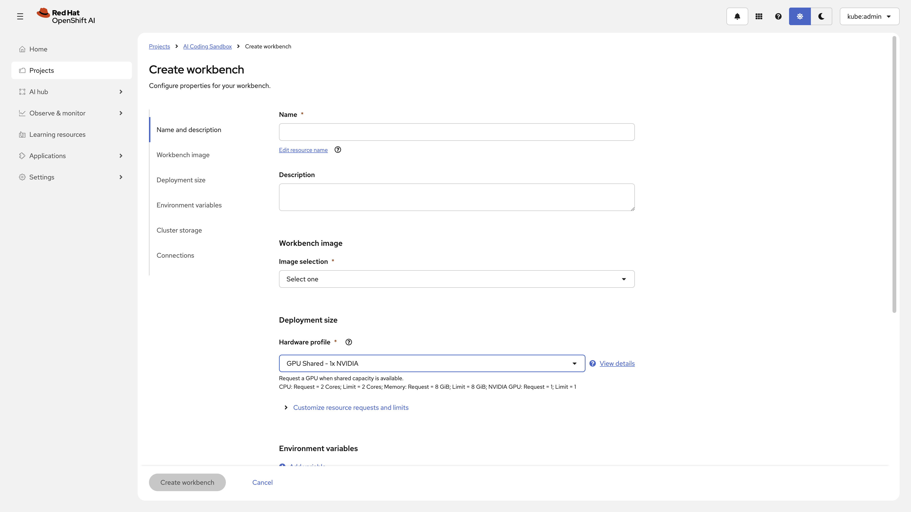
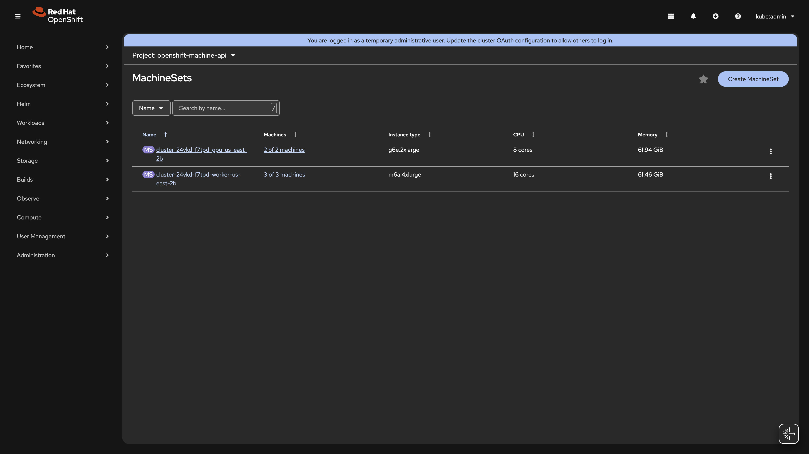
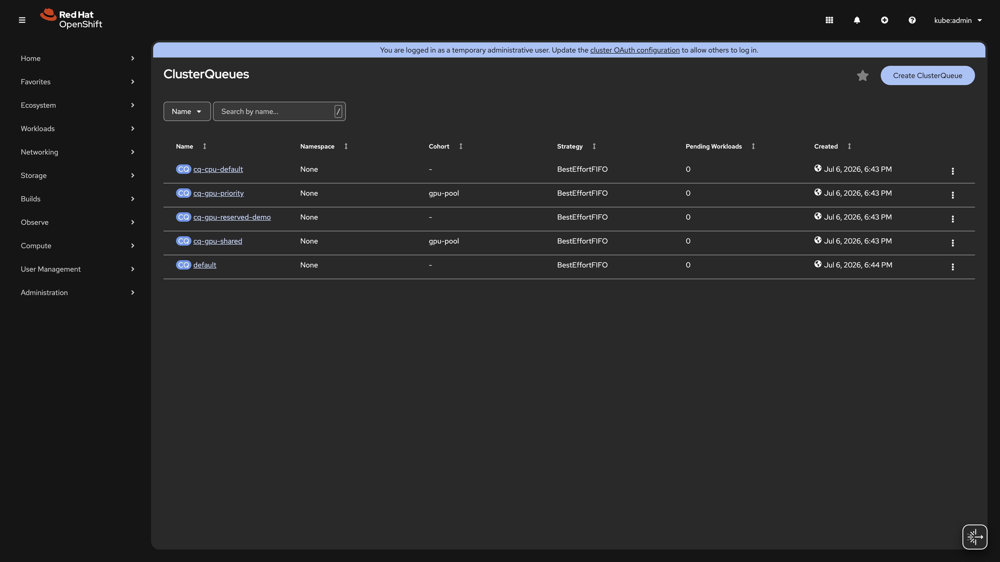

# Stage 020: GPU Infrastructure for Private AI

## Why This Matters

Before teams can build or serve AI models, the platform must make scarce GPU capacity available in a controlled way. A GPU worker costs materially more than a CPU worker, and demand will always exceed supply once multiple teams start building AI workloads.

The enterprise problem is not just "add a GPU node." Platform teams need to decide who can use GPUs, how much capacity each team can consume, which work gets admitted first, and how to shut capacity down when the demo or project is idle. Data scientists should not have to understand node taints, tolerations, device-plugin labels, or queue objects to get started.

This stage turns the GPU into a platform service. Data scientists select a hardware profile from the RHOAI dashboard; the platform handles node placement, taint toleration, quota enforcement, and admission control transparently.

## Architecture

```
AWS GPU MachineSet (g6e.2xlarge, 1x L40S each, replicas=2)
   │
   ▼
NFD Operator → NodeFeatureDiscovery → node hardware feature labels
   │
   ▼
NVIDIA GPU Operator → driver, toolkit, GFD, DCGM, device plugin
   │
   ▼
device plugin: 1 physical GPU → 1 schedulable nvidia.com/gpu unit (no time-slicing)
   │
   ▼
Red Hat build of Kueue → ResourceFlavor → ClusterQueue → LocalQueue
   │
   ▼
RHOAI Hardware Profiles → CPU Default / GPU Shared / GPU Priority / GPU Reserved
   │
   ▼
Data scientist selects governed capacity from the RHOAI dashboard
```

Stage 030 uses this capacity to serve a private LLM. Stage 040 exposes validated model access through Models-as-a-Service.

## Demo

### Hardware Profile Selection

The workbench creation form exposes GPU capacity as simple dropdown choices — no node taints or tolerations required.


### GPU Shared Profile Selected

Selecting "GPU Shared - 1x NVIDIA" shows the resource specifications: CPU, memory, and one NVIDIA GPU from the shared capacity pool.



### GPU MachineSet

The AWS g6e.2xlarge GPU MachineSet providing L40S capacity (two replicas), managed by OpenShift Machine API and tracked in GitOps.



### Kueue ClusterQueues

Queue-based GPU governance with cohort-based fair sharing between `cq-gpu-priority` and `cq-gpu-shared`, plus isolated `cq-gpu-reserved-demo` capacity.



## What This Stage Adds

The GPU-as-a-Service layer on top of the Stage 010 base platform.

- **Two GPU workers** — AWS `g6e.2xlarge` instances (one NVIDIA L40S with 48 GB GPU memory each), 200 GB gp3 encrypted EBS root volumes, tainted `nvidia-gpu-only:NoSchedule`; the Argo CD Application ignores `MachineSet.spec.replicas` drift so operators can manually scale to zero between sessions for cost control
- **Node Feature Discovery** — NFD Operator (`stable` channel, CSV `nfd.4.20.0`) publishes hardware feature labels; GPU Feature Discovery within the GPU Operator adds NVIDIA-specific labels used for Kueue placement
- **NVIDIA GPU Operator** — certified operator (`v26.3` channel, CSV `gpu-operator-certified.v26.3.2`) installs driver stack, container toolkit, GFD, DCGM exporter, and device plugin; each L40S is one schedulable `nvidia.com/gpu` unit with no time-slicing
- **Red Hat build of Kueue** — standalone operator (`stable-v1.3` channel, CSV `kueue-operator.v1.3.1`); integration enabled by patching the shared DSC to `kueue.managementState: Unmanaged` via an Argo CD Sync hook Job; cert-manager (bundled with Kueue operator) is a prerequisite
- **Queue topology** — one CPU ResourceFlavor, one GPU ResourceFlavor (targets `nvidia.com/gpu.present: "true"` nodes, tolerates GPU taint); four ClusterQueues (cpu-default, gpu-shared, gpu-priority, gpu-reserved-demo); four LocalQueues in `demo-sandbox`; one WorkloadPriorityClass (`gpu-high-priority`)
- **RHOAI Hardware Profiles** — CPU Default, GPU Shared, GPU Priority, GPU Reserved turn queue and resource choices into dashboard-friendly dropdown selections

## What To Notice And Why It Matters

- **Two cards, one model per card** — no time-slicing because vLLM servers sharing a sliced card OOM at weight load; full-card placement is the RHOAI 3.4-aligned mechanism
- **Non-preemptive queues** — RHOAI workbenches are not suspendable, so "GPU Priority" is a dedicated quota lane, not a preemption demonstration
- **Cohort-based fair sharing** — `cq-gpu-shared` and `cq-gpu-priority` share a `gpu-pool` cohort for future borrowing; `cq-gpu-reserved-demo` has no cohort (true isolation)
- **GPU quota currently zero on shared/priority** — both physical cards are claimed by the private models; raise quota when GPU nodes are added
- **CPU queue sizing** — `cq-cpu-default` provides cpu: 40, memory: 128Gi, sized for the CPU model plane (reranker, embedding InferenceServices, workbenches)
- **MachineSet is cluster-specific** — carries AMI, subnet, and cluster labels; must be regenerated from the cluster's own worker pool on each new environment via `generate-gpu-machineset.sh`
- **DSC patch mechanism** — Stage 020 does not own a second DataScienceCluster; it patches the Stage 010 shared owner through a dedicated ServiceAccount and ClusterRole

## How Red Hat And Open Source Make It Work

OpenShift Machine API creates GPU worker capacity from a declarative MachineSet. Node Feature Discovery publishes hardware facts. The NVIDIA GPU Operator installs the driver stack and exposes GPU capacity to Kubernetes. The Red Hat build of Kueue turns that capacity into quota-controlled queues with admission control and fair sharing. Red Hat OpenShift AI hardware profiles present those queues as simple dashboard choices so data scientists never interact with node-level scheduling primitives.

## Trust Boundaries

| Boundary | Control |
|----------|---------|
| GPU access | Taint `nvidia-gpu-only:NoSchedule` ensures only workloads with explicit toleration (via Kueue ResourceFlavor) land on GPU nodes |
| Quota enforcement | Kueue ClusterQueues bound by nominal quota — workloads exceeding quota are queued, not rejected silently |
| Isolation | `cq-gpu-reserved-demo` has no cohort; its GPU allocation cannot be borrowed by other queues |
| Cost control | MachineSet replicas can be scaled to zero manually; GitOps ignores the drift |
| DSC patch authority | Hook Job uses a scoped ServiceAccount and ClusterRole in `redhat-ods-applications` |

## Red Hat Products Used

| Product | Version/Channel |
|---------|-----------------|
| Red Hat OpenShift Container Platform | 4.20 (Machine API) |
| Red Hat OpenShift AI Self-Managed | stable-3.4 (hardware profiles, Kueue integration) |
| Node Feature Discovery Operator | stable (CSV nfd.4.20.0) |
| NVIDIA GPU Operator (certified) | v26.3 (CSV gpu-operator-certified.v26.3.2) |
| Red Hat build of Kueue | stable-v1.3 (CSV kueue-operator.v1.3.1) |

## Open Source Projects To Know

| Project | Role |
|---------|------|
| Kueue | Kubernetes-native job queuing and quota management |
| NVIDIA GPU Operator | Driver stack, device plugin, DCGM exporter |
| Node Feature Discovery | Hardware label publisher |
| NVIDIA GPU Feature Discovery | GPU-specific label publisher (within GPU Operator) |

## Deploy And Validate

```bash
# Generate cluster-specific GPU MachineSet (required on each new environment)
RHOAI_GPU_MACHINESET_REPLICAS=2 \
  ./stages/020-gpu-infrastructure-private-ai/generate-gpu-machineset.sh --write

# Deploy
./stages/020-gpu-infrastructure-private-ai/deploy.sh

# Validate (requires ≥2 GPUs schedulable)
./stages/020-gpu-infrastructure-private-ai/validate.sh
```

## References

| Source | Role |
|--------|------|
| [RHOAI 3.4 - Working with accelerators](https://docs.redhat.com/en/documentation/red_hat_openshift_ai_self-managed/3.4/html-single/working_with_accelerators/index) | NVIDIA GPU enablement and hardware profiles |
| [RHOAI 3.4 - Managing workloads with Kueue](https://docs.redhat.com/en/documentation/red_hat_openshift_ai_self-managed/3.4/html/managing_openshift_ai/managing-workloads-with-kueue) | Kueue integration posture |
| [RHOAI 3.4 - Managing distributed workloads](https://docs.redhat.com/en/documentation/red_hat_openshift_ai_self-managed/3.4/html/managing_openshift_ai/managing-distributed-workloads_managing-rhoai) | ResourceFlavor, ClusterQueue, LocalQueue concepts |
| [OCP 4.20 - Machine management](https://docs.redhat.com/en/documentation/openshift_container_platform/4.20/html-single/machine_management/index) | AWS MachineSet management |
| [OCP 4.20 - Node Feature Discovery](https://docs.redhat.com/en/documentation/openshift_container_platform/4.20/html-single/specialized_hardware_and_driver_enablement/index#psap-node-feature-discovery-operator) | NFD Operator and hardware feature labels |

## Next Stage

[Stage 030: Private Model Serving](../030-private-model-serving/) proves that a real LLM can be served on this governed GPU capacity — turning accelerator infrastructure into a working model endpoint before MaaS governance is introduced.
