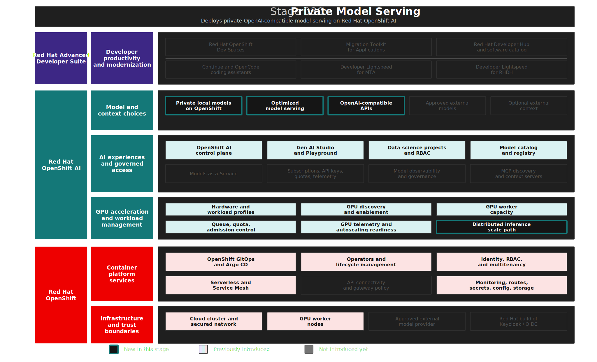

# Stage 030: Private Model Serving

## Why This Matters

The workshop story now has a platform foundation and a governed GPU service. Stage 030 turns that foundation into something developers and platform services can actually use: private AI inference running on Red Hat OpenShift AI.

Inference is the operational phase of AI. A trained model receives a prompt or input, applies what it learned during training, and returns a prediction, completion, classification, recommendation, or other answer. For this demo, inference means local large language models responding to coding and modernization requests through OpenAI-compatible APIs. That is the point where AI moves from "we have a model" to "we have a service that can power developer workflows."

This stage matters because enterprise AI coding assistance needs a credible private path before developers use it with sensitive source code. Later stages will add MaaS governance, developer workspaces, modernization tools, MCP context, and portal self-service. Those experiences depend on this stage proving that private model inference can be deployed, scheduled, secured, registered, and validated as platform infrastructure.

The important idea is not only that a model responds. It is that regulated enterprise environments need a repeatable inference layer with clear runtime choices, observable behavior, accelerator governance, API compatibility, and a path to scale when demand grows. Stage 030 introduces that layer with vLLM and llm-d in their proper roles: vLLM serves the model efficiently, and llm-d provides the Kubernetes-native architecture for distributed inference patterns around that serving engine.

## Architecture



## What This Stage Adds

Stage 030 provides the private inference layer for the trusted AI development platform.

- Local `LLMInferenceService` resources for `gpt-oss-20b` and `nemotron-3-nano-30b-a3b`.
- vLLM-based OpenAI-compatible inference containers using the `registry.redhat.io/rhaiis/vllm-cuda-rhel9:3.3.0` runtime image.
- Explicit llm-d scheduler enablement through `spec.router.scheduler: {}` on each `LLMInferenceService`.
- Single-GPU-per-replica deployment metadata, including NVIDIA L4 accelerator labeling, so the demo is clear about the scale pattern it is exercising.
- GPU resource requests for each private model, with Kueue queue labels that connect the workloads to the Stage 020 `private-model-serving` local queue.
- Gateway integration through `maas-default-gateway`, preparing the private models for the governed MaaS access path in Stage 040.
- Authentication enablement on the `LLMInferenceService` resources through `security.opendatahub.io/enable-auth: "true"`.
- Administrative RBAC for model management in the `maas` data science project prepared by Stage 020.
- LeaderWorkerSet prerequisites used by the LLM inference path and required for distributed inference patterns.
- vLLM runtime arguments for scale-readiness, including prefix caching and reduced access-log overhead.
- Explicit liveness and readiness probe timings for cold LLM startup on newly scaled GPU nodes.
- Prometheus metric aliases for vLLM request, token, latency, and prefix-cache metrics used by Red Hat's documented autoscaling path.
- Model Registry seed data so the local models are discoverable as named, versioned assets.
- The MaaS tier mapping workaround required by the current Red Hat OpenShift AI webhook before tier-annotated model resources can be accepted.

The stage currently runs each model with one replica and one GPU. That is intentional for the demo environment. It uses the Red Hat OpenShift AI llm-d `LLMInferenceService` path with vLLM as the inference runtime, but it does not attempt to prove multi-node or disaggregated prefill/decode serving. The demo shows the architectural starting point: a private model-serving service that can later grow into a richer distributed inference topology without changing the enterprise control plane story.

## What To Notice In The Demo

The main demo point is that private AI becomes an enterprise service only when inference is operated like platform infrastructure.

The models are not manually launched from a notebook or exposed as ad hoc endpoints. They are declared as GitOps-managed `LLMInferenceService` resources. Their GPU placement is tied to the Stage 020 queue. Their runtime containers expose OpenAI-compatible APIs. Their metadata is registered for discovery. Their readiness is validated before later stages publish them to developer-facing tools.

This is also where inference scaling enters the story. Inference gets harder as models grow, user volume increases, context windows expand, and latency expectations tighten. Scaling can involve faster runtimes, larger or more efficient accelerators, more replicas, queue-based admission, request routing, model optimization, and distributed inference. Online inference must respond quickly enough for interactive users, while batch and streaming patterns have different throughput and cost pressures. A regulated organization needs room to choose the right inference pattern without giving up platform governance.

This demo does not claim to prove high-scale distributed inference. It shows the private serving control plane and scale-ready primitives: GPU-backed `LLMInferenceService` resources, vLLM serving, llm-d scheduler enablement, Kueue queue integration, gateway attachment, LeaderWorkerSet installation, vLLM metrics aliases, and validation that the local models are ready. Those are the building blocks that make larger inference designs possible.

The Red Hat Developer multi-LLM MaaS article shows an adjacent advanced pattern: body-based routing through agentgateway, Gateway API Inference Extension `InferencePool` resources, and endpoint picker pods. This stage deliberately stops one level earlier. It focuses on Red Hat OpenShift AI `LLMInferenceService`, vLLM runtime health, llm-d readiness, and the metrics that make those advanced routing and autoscaling designs meaningful later.

## How Red Hat And Open Source Make It Work

Red Hat OpenShift provides the application platform underneath private inference: namespaces, RBAC, scheduling, storage attachment, routes, service networking, monitoring, and operator lifecycle. Red Hat OpenShift GitOps keeps the private model-serving desired state reproducible.

Red Hat OpenShift AI provides the model-serving control plane, data science project integration, dashboard experience, model registry integration, and `LLMInferenceService` API used by this stage. The model-serving platform makes trained models available as services that applications can query through API requests. In this demo, those requests are later routed through MaaS rather than handed directly to each developer tool.

vLLM is the serving engine in this stage. Its job is to run the model efficiently: manage GPU memory, serve LLM requests with high throughput, expose OpenAI-compatible APIs, and provide runtime metrics that operators can use to understand request pressure, latency, tokens, and cache behavior. That matters because enterprise developer tools should not need a custom integration for every private model. They can talk to a familiar API while the platform team retains control over where the model runs and how it is operated.

llm-d is the distributed inference architecture around the serving engine. Its job is to make LLM serving more Kubernetes-native as deployments grow: scheduler-aware routing, distributed serving patterns, LeaderWorkerSet integration, and future paths such as disaggregated prefill/decode and workload-aware autoscaling. In this demo, llm-d is used in a deliberately modest form through `LLMInferenceService` and explicit scheduler enablement. That is enough to show how private inference can be built on the same open cloud-native foundation that enterprises already use for regulated applications.

Stage 020 contributes the GPUaaS foundation. Stage 030 consumes it by labeling the local model resources with `kueue.x-k8s.io/queue-name=private-model-serving`, requesting GPU capacity, and letting the platform manage admission and scheduling rather than hard-coding private model serving as a special case.

## Why This Is Worth Knowing

Inference is where AI becomes operationally real. Training, fine-tuning, and model selection matter, but users experience AI through inference latency, quality, availability, security, and cost. For enterprise coding assistance, that means the model endpoint has to be more than reachable. It has to be governed, observable, repeatable, and ready to plug into the same platform controls as the rest of the developer experience.

This stage also explains why private AI is not just a data-sovereignty claim. Keeping prompts and code inside OpenShift requires the platform to run the inference stack itself: GPU capacity, serving runtime, model artifact, endpoint, authentication posture, registry metadata, and validation. Without those pieces, "use a private model" remains an idea rather than a service.

The reusable lesson is that enterprise-grade inference sits between infrastructure and application experience. It consumes GPUaaS from Stage 020 and becomes the model supply that MaaS, workspaces, modernization tools, and the developer portal consume later.

vLLM and llm-d are worth calling out because they show where the open source ecosystem is going. vLLM makes efficient LLM serving accessible across different accelerators and model families. llm-d extends that idea into the Kubernetes control plane, where routing, scheduling, scaling, and distributed serving can become platform concerns instead of one-off model team implementations. For regulated enterprises, that open architecture matters: it supports portability, auditability, repeatable operations, and a path away from opaque, single-provider inference stacks.

## Red Hat Products Used

- **Red Hat OpenShift AI** provides model serving, `LLMInferenceService`, model registry integration, and the data science project experience.
- **Red Hat AI Inference Server** provides the vLLM-based runtime image used by the private LLM serving containers.
- **Red Hat OpenShift** provides the runtime platform, RBAC, routes, service networking, storage, scheduling, and namespace isolation.
- **Red Hat build of Kueue** provides the queue and admission context inherited from Stage 020.
- **OpenShift monitoring** provides the PrometheusRule API used for vLLM metric aliases that support future autoscaling analysis.
- **Red Hat OpenShift GitOps** reconciles the model-serving desired state through Argo CD.

## Open Source Projects To Know

- [KServe](https://kserve.github.io/website/) provides Kubernetes-native inference service abstractions.
- [vLLM](https://docs.vllm.ai/) provides high-throughput LLM serving with OpenAI-compatible APIs. vLLM is a Linux Foundation-hosted open source project under the PyTorch Foundation ecosystem, with broad collaboration across model labs, hardware vendors, and AI infrastructure companies.
- [llm-d](https://llm-d.ai/) contributes Kubernetes-native distributed inference patterns for large language models. llm-d is a CNCF Sandbox project backed by contributors and supporters including Red Hat, Google Cloud, IBM Research, CoreWeave, NVIDIA, AMD, Cisco, Hugging Face, Intel, Lambda, Mistral AI, UC Berkeley, and the University of Chicago.
- [LeaderWorkerSet](https://lws.sigs.k8s.io/) supports coordinated leader-worker deployment patterns used by distributed AI workloads.
- [Open Data Hub](https://opendatahub.io/) is the upstream foundation for many OpenShift AI capabilities.

## Trust Boundaries

Private local models keep prompts and code inside the OpenShift platform boundary. In this stage, the inference runtime, model containers, GPU scheduling, service endpoints, and model metadata are all operated inside the cluster.

That does not mean every later AI path is private. Stage 050 introduces governed external models, where prompts are centrally controlled but still processed by an external provider. Stage 030 establishes the private option that sensitive coding and modernization workflows can use when policy requires local processing.

The model artifacts themselves also remain part of the trust boundary. Operators must verify licensing, provenance, and approved use for the model images they deploy. This repository uses declared model image references for a disposable demo and does not commit provider credentials, kubeconfigs, or private model secrets.

## Where This Fits In The Full Platform

| Earlier capability | How this stage uses it |
|--------------------|------------------------|
| Stage 010 platform foundation | Uses Red Hat OpenShift AI, model registry, RBAC, gateway prerequisites, and GitOps foundations |
| Stage 020 GPU Infrastructure for Private AI | Consumes queue-backed GPU capacity and the `private-model-serving` Kueue local queue |

| Later capability | What this stage provides |
|------------------|--------------------------|
| Stage 040 MaaS | Supplies local models that MaaS can publish, meter, and govern |
| Stage 060 MCP Context Integrations | Provides the private model path that can receive approved tool context through governed consumers |
| Stage 070 Dev Spaces | Provides private model endpoints for coding assistants |
| Stage 080 MTA | Provides the private model path for modernization assistance |
| Stage 090 Developer Portal | Provides a platform capability that can be documented and discovered as self-service |

## Deploy And Validate

Operational commands are kept here for workshop operators.

```bash
./stages/030-private-model-serving/deploy.sh
./stages/030-private-model-serving/validate.sh
```

Manifests: [`gitops/stages/030-private-model-serving/base/`](../../gitops/stages/030-private-model-serving/base/)

## References

- [Red Hat: What is AI inference?](https://www.redhat.com/en/topics/ai/what-is-ai-inference)
- [Red Hat OpenShift AI 3.4: Configuring your model-serving platform](https://docs.redhat.com/en/documentation/red_hat_openshift_ai_self-managed/3.4/html-single/configuring_your_model-serving_platform/index)
- [Red Hat OpenShift AI 3.4: Deploying models by using Distributed Inference with llm-d](https://docs.redhat.com/en/documentation/red_hat_openshift_ai_self-managed/3.4/html/deploy_models_using_distributed_inference_with_llm-d/deploying-models-using-distributed-inference_distributed-inference)
- [Red Hat OpenShift AI 3.4: Managing workloads with Kueue](https://docs.redhat.com/en/documentation/red_hat_openshift_ai_self-managed/3.4/html/managing_openshift_ai/managing-workloads-with-kueue)
- [Red Hat: Red Hat launches the llm-d community](https://www.redhat.com/en/about/press-releases/red-hat-launches-llm-d-community-powering-distributed-gen-ai-inference-scale)
- [Red Hat Developer: llm-d Kubernetes-native distributed inferencing](https://developers.redhat.com/articles/2025/05/20/llm-d-kubernetes-native-distributed-inferencing)
- [Red Hat Developer: Run Model-as-a-Service for multiple LLMs on OpenShift](https://developers.redhat.com/articles/2026/03/24/run-model-service-multiple-llms-openshift)
- [PyTorch: vLLM project](https://pytorch.org/projects/vllm/)
- [CNCF: Welcome llm-d to the CNCF](https://www.cncf.io/blog/2026/03/24/welcome-llm-d-to-the-cncf-evolving-kubernetes-into-sota-ai-infrastructure/)
- [KServe documentation](https://kserve.github.io/website/)
- [vLLM documentation](https://docs.vllm.ai/)
- [llm-d documentation](https://llm-d.ai/)
- [Open Data Hub](https://opendatahub.io/)

## Next Stage

[Stage 040: Governed Models-as-a-Service](../040-governed-models-as-a-service/README.md) adds the MaaS control point, gateway policy, quotas, telemetry, and subscriptions.
