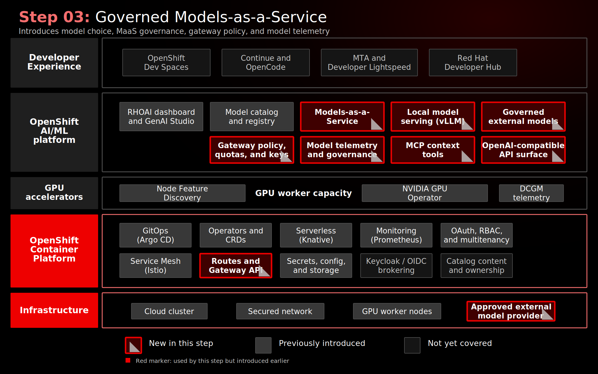

# Stage 030: Private Model Serving

## Why This Matters

Private model serving is where the platform starts to provide an on-cluster AI capability for sensitive development and modernization workflows. The value is not only that a model runs on OpenShift, but that it runs through platform-managed namespaces, RBAC, model metadata, hardware profiles, and GitOps reconciliation.

This stage gives the later developer tools a private model path before any external model access is introduced.

## Architecture



## What This Stage Adds

- Local `LLMInferenceService` resources for `gpt-oss-20b` and `nemotron-3-nano-30b-a3b`.
- The `maas` data science project and administrative RBAC for model management.
- LeaderWorkerSet prerequisites used by the local model-serving path.
- Model Registry seed data for the two local models.
- The MaaS tier mapping workaround required by the current Red Hat OpenShift AI webhook before tier-annotated model resources can be accepted.

The local models are the private model path used later by Models-as-a-Service, Red Hat OpenShift Dev Spaces, and Migration Toolkit for Applications.

## What To Notice In The Demo

Show that private AI starts as a platform service, not as a developer-managed endpoint:

1. The models are deployed from GitOps-managed `LLMInferenceService` resources.
2. GPU scheduling, namespace ownership, and RBAC are handled by the platform.
3. Model Registry entries make the local models discoverable as named assets.
4. The stage validates readiness before MaaS publishes the models to developer-facing tools.

The proof point is the boundary: sensitive prompts and source context can use a model served inside the OpenShift platform before any external provider is involved.

## How Red Hat And Open Source Make It Work

Red Hat OpenShift AI provides the model-serving control plane, data science project integration, model registry experience, and dashboard surface. OpenShift provides scheduling, identity, RBAC, networking, storage, and GitOps reconciliation.

The open source foundation includes KServe for Kubernetes-native model serving, vLLM for OpenAI-compatible LLM inference, llm-d and LeaderWorkerSet patterns for distributed inference prerequisites, and Open Data Hub as the upstream community behind many OpenShift AI capabilities.

## Red Hat Products Used

- **Red Hat OpenShift AI** provides model serving, model registry integration, and the data science project experience.
- **Red Hat OpenShift** provides the runtime platform, RBAC, routes, storage, scheduling, and namespace isolation.
- **Red Hat OpenShift GitOps** reconciles the model-serving desired state.

## Open Source Projects To Know

- [KServe](https://kserve.github.io/website/) provides Kubernetes-native inference service abstractions.
- [vLLM](https://docs.vllm.ai/) provides high-throughput OpenAI-compatible model serving.
- [llm-d](https://llm-d.ai/) contributes distributed inference patterns for Kubernetes-hosted LLMs.
- [Open Data Hub](https://opendatahub.io/) is the upstream foundation for OpenShift AI capabilities.

## Trust Boundaries

Private local models keep prompts and code inside the OpenShift platform boundary. That does not automatically make every AI workflow private; it means this stage establishes the private model option that later stages can consume through the governed MaaS path.

## Why This Is Worth Knowing

Enterprise AI coding assistance needs a credible private path before developers are asked to use it with sensitive code. This stage shows how the private model path can be provisioned as platform infrastructure and validated before it is exposed to developer workflows.

## Where This Fits In The Full Platform

| Earlier capability | How this stage uses it |
|--------------------|------------------------|
| Stage 010 platform foundation | Uses Red Hat OpenShift AI, model registry, RBAC, and GitOps foundations |
| Stage 020 GPU infrastructure | Schedules local model workloads onto GPU-capable workers |

| Later capability | What this stage provides |
|------------------|--------------------------|
| Stage 040 MaaS | Supplies local models that MaaS can publish and govern |
| Stage 070 Dev Spaces | Provides private model endpoints for coding assistants |
| Stage 080 MTA | Provides the private model path for modernization assistance |

## Deploy And Validate

Operational commands are kept here for workshop operators.

```bash
./stages/030-private-model-serving/deploy.sh
./stages/030-private-model-serving/validate.sh
```

Manifests: [`gitops/stages/030-private-model-serving/base/`](../../gitops/stages/030-private-model-serving/base/)

## References

- [Red Hat OpenShift AI documentation](https://docs.redhat.com/en/documentation/red_hat_openshift_ai_self-managed/)
- [KServe documentation](https://kserve.github.io/website/)
- [vLLM documentation](https://docs.vllm.ai/)
- [llm-d documentation](https://llm-d.ai/)
- [Open Data Hub](https://opendatahub.io/)

## Next Stage

[Stage 040: Governed Models-as-a-Service](../040-governed-models-as-a-service/README.md) adds the MaaS control point, gateway policy, quotas, telemetry, and subscriptions.
