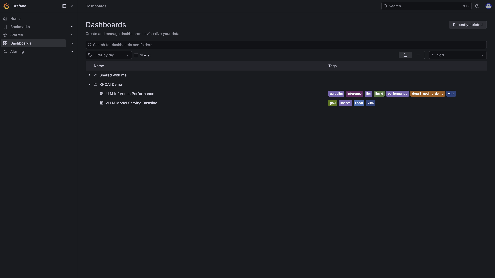
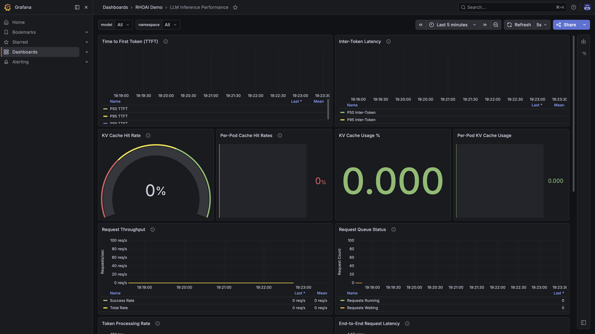

# Stage 030: Private Model Serving

## Why This Matters

GPU capacity is useful only after the platform can turn it into a working model endpoint. For a regulated enterprise, this is the point where raw accelerator infrastructure becomes a controlled GenAI capability: model artifacts, runtime selection, endpoint exposure, and resource strategy all need to be explicit before teams can trust the service.

This stage stands up the smallest useful slice of the Red Hat AI inference platform: it enables the standard KServe-based model-serving platform, provisions the vLLM ServingRuntime and the model registry, and wires user-workload monitoring — the foundation that Stage 040 serves the governed Nemotron and Qwen models on. Stage 030 itself deploys no model; that keeps a single Nemotron and a single Qwen, deployed once and governed in Stage 040.

The stage does not yet turn the model into a governed shared service. First we prove the platform can host a GPU-backed LLM endpoint; then Stage 040 publishes validated access through Models-as-a-Service.

## Architecture

```
Stage 010 shared DataScienceCluster (default-dsc)
        │
        │ Stage 030 hook Job patch
        ▼
  kserve.managementState: Managed
        │
        ▼
KServe model serving platform
        │
        ▼
vLLM NVIDIA GPU ServingRuntime (from live cluster template)
        │
        ▼
Nemotron InferenceService in demo-sandbox (OCI modelcar artifact)
        │
        ▼
GPU Reserved hardware profile from Stage 020
        │
        ▼
OpenAI-compatible /v1 inference endpoint (no auth)
        │
        ▼
ServiceMonitor → user workload monitoring (7d retention)
        │
        ▼
Grafana demo dashboards (LLM Performance, vLLM Baseline)
```

## Demo


| Screenshot | What it shows |
|------------|---------------|
|  | RHOAI Demo Grafana folder with LLM Performance and vLLM Baseline dashboards |
|  | Live LLM Inference Performance: TTFT (P50 ~67ms), ITL (P50 ~5ms), KV Cache metrics |
|  | Nemotron 3 Nano 30B pods running in `demo-sandbox` namespace |
|  | RHOAI AI Hub Deployments tab showing active KServe model serving |

## What This Stage Adds

The KServe model-serving **foundation** — the platform, runtime, registry, and
monitoring that the governed models in Stage 040 build on. Stage 030 does not
deploy a model itself; the Nemotron and Qwen deployments are owned by Stage 040
as governed MaaS `LLMInferenceService`s.

- **KServe enablement** — patches the shared DataScienceCluster to `kserve.managementState: Managed` via an Argo CD Sync hook Job
- **vLLM ServingRuntime** — the RHOAI-managed vLLM runtime the Stage 040 models are served on
- **Model Registry** — the `demo-registry` instance plus the Nemotron model card (registered model, version, OCI artifact pointer) created via REST API; the Stage 040 `MaaSModelRef` consumes this card
- **User workload monitoring** — enables `prometheus.retention: 7d` for the user workload Prometheus instance (reduced from 15d to avoid disk pressure on the demo cluster); configures Alertmanager with three receivers routing to a demo-local webhook

## What To Notice And Why It Matters

- **Foundation, not the models** — Stage 030 proves the serving platform is ready (KServe + vLLM runtime + registry + monitoring); the models themselves are deployed and governed in Stage 040 as MaaS. This keeps a single Nemotron and a single Qwen, deployed once.
- **Deploy uses REST API, not dashboard workflow** — `deploy.sh` creates the registry metadata programmatically via `oc apply` and Model Registry REST calls, enabling repeatable GitOps-compatible deployment
- **vLLM runtime from live cluster template** — the ServingRuntime image is not pinned in the repository; it comes from the RHOAI-managed template on the cluster
- **Lifecycle handover** — the direct Nemotron InferenceService is a serving baseline; Stage 040's deploy retires it to free its GPU for MaaS-published models
- **GuideLLM targets MaaS by default** — `benchmark-guidellm.sh` defaults to the `models-as-a-service` namespace (Stage 040 LLMInferenceService workload Service); for Stage 030 direct endpoint testing, override `RHOAI_MAAS_NAMESPACE=demo-sandbox`
- **Benchmark uses synthetic data** — GuideLLM synthetic mode provides controlled, reproducible token shapes for capacity planning without external dependencies
- **Legacy naming** — some ConfigMaps and Jobs reference `stage210` naming from a prior stage numbering scheme; this is tracked technical debt
- **Grafana is a community operator** — not a Red Hat product dependency; used only for demo dashboard visualization

## How Red Hat And Open Source Make It Work

Red Hat OpenShift AI provides the KServe model serving platform as a managed component. KServe orchestrates per-model runtime pods with standard Kubernetes lifecycle management. vLLM delivers high-performance GPU inference with OpenAI-compatible endpoints, prefix caching, and batched-token scheduling. The OCI modelcar pattern brings software engineering rigor to model artifacts — versioned, reproducible, and registry-hosted. OpenShift user workload monitoring scrapes model-serving metrics through generated ServiceMonitors. GuideLLM enables workload-shaped benchmarking to measure real-world inference performance.

## Trust Boundaries

| Boundary | Control |
|----------|---------|
| Model endpoint auth | Explicitly disabled (`enable-auth: false`) — unauthenticated within the cluster network; Stage 040 adds MaaS auth |
| Model artifact source | Red Hat registry OCI modelcar; no external model downloads at runtime |
| GPU isolation | Nemotron claims a full L40S card from the `cq-gpu-reserved-demo` queue; no sharing with other workloads |
| Monitoring access | Grafana uses a dedicated ServiceAccount with `cluster-monitoring-view` — read-only metrics access |
| Benchmark scope | GuideLLM runs in-cluster against the workload Service directly, bypassing any gateway or rate limit |

## Red Hat Products Used

| Product | Version/Channel |
|---------|-----------------|
| Red Hat OpenShift AI Self-Managed | stable-3.4 (KServe, Model Registry) |
| Red Hat OpenShift Container Platform | 4.20 (user workload monitoring, Alertmanager) |

## Open Source Projects To Know

| Project | Role |
|---------|------|
| vLLM | High-performance LLM inference engine |
| KServe | Kubernetes model serving orchestration |
| GuideLLM | LLM deployment benchmarking tool |
| Grafana Operator (community) | Demo dashboard visualization |
| Kubeflow Model Registry | Model metadata and versioning |

## Deploy And Validate

```bash
# Deploy (enables KServe, creates registry metadata, deploys InferenceService)
./stages/030-private-model-serving/deploy.sh

# Validate
./stages/030-private-model-serving/validate.sh

# Optional: run GuideLLM benchmark (after Stage 040 for MaaS, or override namespace)
RHOAI_MAAS_NAMESPACE=demo-sandbox \
  ./stages/030-private-model-serving/benchmark-guidellm.sh
```

The deploy script uses an idempotent discover-or-create flow: it checks for existing registry metadata and InferenceService before creating, and reconciles the endpoint to the curated Nemotron vLLM configuration.

## References

| Source | Role |
|--------|------|
| [RHOAI 3.4 - Configuring model-serving platform](https://docs.redhat.com/en/documentation/red_hat_openshift_ai_self-managed/3.4/html-single/configuring_your_model-serving_platform/index) | KServe, ServingRuntime platform enablement |
| [RHOAI 3.4 - Deploying models](https://docs.redhat.com/en/documentation/red_hat_openshift_ai_self-managed/3.4/html-single/deploying_models/index) | Model deployment and OCI modelcar pattern |
| [RHOAI 3.4 - Managing model registries](https://docs.redhat.com/en/documentation/red_hat_openshift_ai_self-managed/3.4/html-single/managing_model_registries/index) | Registry provisioning and access |
| [Red Hat Developer - GuideLLM](https://developers.redhat.com/articles/2025/06/20/guidellm-evaluate-llm-deployments-real-world-inference) | Benchmark methodology and workload-shaped testing |
| [Red Hat Developer - Why vLLM](https://developers.redhat.com/articles/2025/10/30/why-vllm-best-choice-ai-inference-today) | vLLM value and OpenShift AI integration |
| [OCP 4.20 - Monitoring](https://docs.redhat.com/en/documentation/openshift_container_platform/4.20/html/monitoring/index) | User workload monitoring and Alertmanager |

## Next Stage

[Stage 040: Governed Models-as-a-Service](../040-governed-models-as-a-service/) publishes the validated Nemotron endpoint (and an external GPT-4o-mini registration) through Red Hat OpenShift AI Models-as-a-Service with identity, API keys, rate limits, and tiered access policies.
