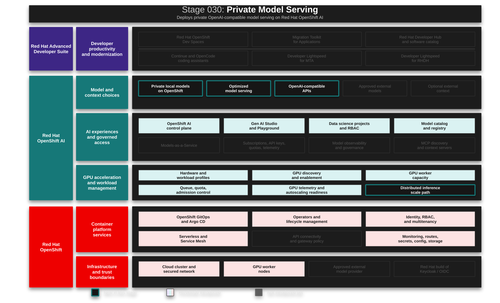

# Stage 030: Private Model Serving

## Why This Matters

Stage 010 created the OpenShift AI foundation and Stage 020 added governed GPU capacity. Stage 030 turns that foundation into private inference that developer tools and platform services can use.

For this demo, inference means local large language models answering coding and modernization requests through OpenAI-compatible APIs. The important point is not only that a model responds. The point is that sensitive prompts, source code, and modernization context can use a private path inside the OpenShift platform boundary.

## Architecture



## What This Stage Adds

This stage adds the private inference layer.

- Local `LLMInferenceService` resources for `gpt-oss-20b` and `nemotron-3-nano-30b-a3b`.
- Red Hat AI Inference Server / vLLM serving with an OpenAI-compatible API surface.
- Kueue-backed GPU placement with single-GPU demo sizing for each model replica.
- Platform authentication, RBAC, and gateway posture so model endpoints are not unmanaged routes.
- llm-d, readiness, and metric foundations for scale-aware inference operations (the LeaderWorkerSet operator arrives with Stage 020 as a Kueue dependency).
- Model registry seed data so private models are discoverable as named platform assets.

The stage demonstrates a controlled private-serving baseline, not a multi-node inference benchmark.

## What To Notice And Why It Matters

Stage 030 makes private inference an OpenShift AI platform service.

- Models are reconciled and validated as OpenShift AI resources, not launched manually from notebooks.
- vLLM provides efficient OpenAI-compatible serving for familiar application integration.
- The private coding models are configured for long developer prompts, including a 131,072-token model context for Nemotron and an 8,192-token chunked-prefill scheduling budget in the private vLLM runtimes.
- llm-d scheduler enablement, LeaderWorkerSet prerequisites, queue labels, readiness probes, and vLLM metrics create a path toward distributed inference patterns.
- Model registry seed data makes private models easier to discover and govern.

This matters because privacy and sovereignty claims require an operating model: controlled runtime, GPU scheduling, endpoints, metadata, metrics, and validation.

## How Red Hat And Open Source Make It Work

Red Hat OpenShift provides namespaces, RBAC, scheduling, routes, service networking, monitoring, operator lifecycle, and GitOps desired state. Red Hat OpenShift AI adds the model-serving control plane, data science project integration, model registry, and `LLMInferenceService` API.

vLLM provides efficient LLM serving and OpenAI-compatible APIs. llm-d adds Kubernetes-native distributed inference patterns around the serving engine. Together with Stage 020 GPUaaS, those pieces let private models run inside OpenShift while consumers use a familiar API.

## Trust Boundaries

Private local models keep prompts, source code, inference runtime, service endpoints, and model metadata inside the OpenShift platform boundary. Model artifact provenance, licensing, access control, telemetry, and human approval still require separate governance.

## Red Hat Products Used

- **[Red Hat OpenShift AI](https://www.redhat.com/en/technologies/cloud-computing/openshift/openshift-ai)** provides model serving, `LLMInferenceService`, model registry integration, and the data science project experience.
- **[Red Hat AI Inference Server](https://www.redhat.com/en/products/ai)** provides the vLLM-based runtime image used by private model serving.
- **[Red Hat OpenShift](https://www.redhat.com/en/technologies/cloud-computing/openshift)** provides runtime, RBAC, routes, networking, storage, scheduling, monitoring, and namespace isolation.
- **[Red Hat build of Kueue](https://docs.redhat.com/en/documentation/red_hat_build_of_kueue/1.0/html/overview/index)** provides queueing and admission control.
- **[Red Hat OpenShift GitOps](https://www.redhat.com/en/technologies/cloud-computing/openshift/gitops)** reconciles the model-serving desired state.

## Open Source Projects To Know

- [KServe](https://kserve.github.io/website/) provides Kubernetes-native inference service abstractions.
- [vLLM](https://docs.vllm.ai/) provides high-throughput LLM serving with OpenAI-compatible APIs.
- [llm-d](https://llm-d.ai/) contributes Kubernetes-native distributed inference patterns.
- [LeaderWorkerSet](https://lws.sigs.k8s.io/) supports coordinated leader-worker deployment patterns.
- [Open Data Hub](https://opendatahub.io/) is the upstream foundation for many OpenShift AI capabilities.

## Deploy And Validate

```bash
./stages/030-private-model-serving/deploy.sh
./stages/030-private-model-serving/validate.sh
```

Manifests: [`gitops/stages/030-private-model-serving/base/`](../../gitops/stages/030-private-model-serving/base/)

## References

- [Red Hat: What is AI inference?](https://www.redhat.com/en/topics/ai/what-is-ai-inference)
- [Red Hat OpenShift AI 3.4: Configuring your model-serving platform](https://docs.redhat.com/en/documentation/red_hat_openshift_ai_self-managed/3.4/html-single/configuring_your_model-serving_platform/index)
- [Red Hat OpenShift AI 3.4: Deploying models by using Distributed Inference with llm-d](https://docs.redhat.com/en/documentation/red_hat_openshift_ai_self-managed/3.4/html/deploy_models_using_distributed_inference_with_llm-d/deploying-models-using-distributed-inference_distributed-inference)
- [Red Hat OpenShift AI 3.4: Managing workloads with Kueue](https://docs.redhat.com/en/documentation/red_hat_openshift_ai_self-managed/3.4/html/managing_openshift_ai/managing-workloads-with-kueue)
- [KServe documentation](https://kserve.github.io/website/)
- [vLLM documentation](https://docs.vllm.ai/)
- [llm-d documentation](https://llm-d.ai/)

## Next Stage

[Stage 040: Governed Models-as-a-Service](../040-governed-models-as-a-service/README.md) adds the MaaS control point, gateway policy, subscriptions, quotas, telemetry, and API keys.
