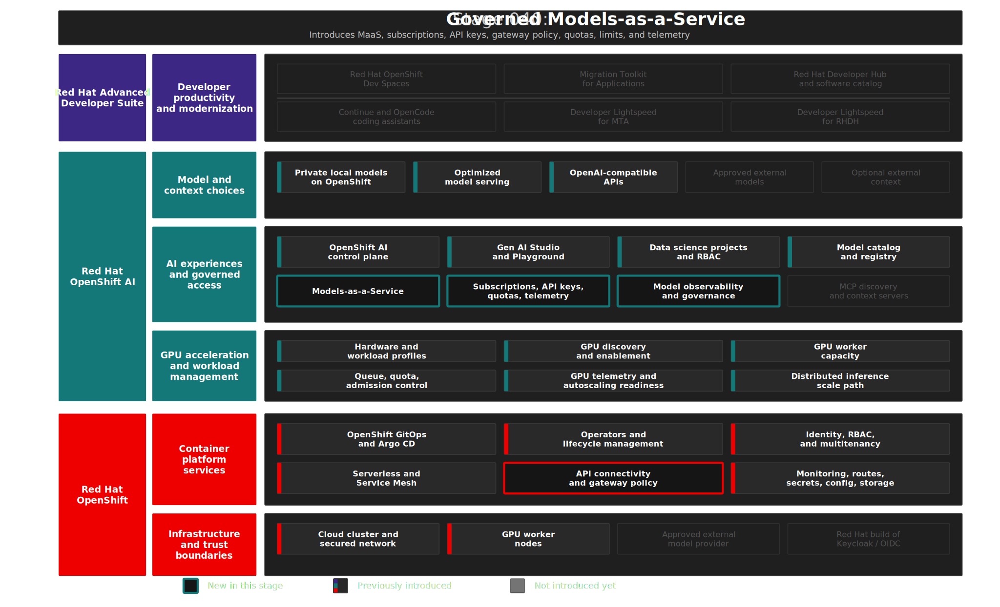

# Stage 040: Governed Models-as-a-Service

## Why This Matters

Stage 030 proved that private models can run on Red Hat OpenShift AI. Stage 040 turns those model endpoints into a shared enterprise service.

That shift is the heart of Models-as-a-Service (MaaS). A private model is useful only if more than one person, tool, or application can consume it without each team learning how the model was deployed, where the GPU runs, which route to call, how credentials are issued, or how usage is tracked. MaaS gives platform teams a way to expose model access through governed API endpoints while keeping control over identity, subscriptions, quotas, rate limits, token limits, telemetry, and policy.

In this demo, MaaS is the point where private AI starts to feel like an internal platform product. Developers and tools get a familiar model access pattern. Platform teams keep the controls they need for regulated environments: who can use which model, how much they can use, what traffic is visible, and where the trust boundary changes.

## Architecture



## What This Stage Adds

This stage adds the governed Models-as-a-Service access layer for private models.

- A MaaS model catalog and API path so private models can be discovered and consumed as shared platform resources.
- MaaS model references, authorization policy, and subscription resources for the local model portfolio.
- Central API key issuance so consumers do not manage direct model credentials.
- User tiers, rate limits, token limits, and telemetry policies for predictable model consumption.
- Red Hat Connectivity Link, Gateway API, Kuadrant, and Authorino resources that make MaaS a policy-enforced API path.
- Showback dashboards and GuideLLM-based validation helpers for usage visibility and repeatable model comparison.

The important capability is not a single new endpoint. It is a factory-style model access pattern: publish models once, subscribe teams to them, issue access centrally, apply policy consistently, and observe usage across consumers.

## What To Notice And Why It Matters

Stage 040 turns private model serving into a governed Models-as-a-Service capability. Local models are published as MaaS model choices, tied to a subscription, and accessed through MaaS-issued API keys instead of direct model routes. Red Hat Connectivity Link, Gateway API, Kuadrant, and Authorino enforce authentication, rate limits, token limits, and telemetry at the gateway.

The essential proof point is governed consumption without breaking application usability:

- Applications and developer tools get OpenAI-compatible model access through a standard API pattern.
- Platform teams control who can use each model, how much they can consume, and which usage signals are visible.
- User tiers, subscriptions, dashboards, and GuideLLM tests make access, fairness, showback, and capacity planning observable.
- Gateway policy keeps authentication, quotas, token limits, and telemetry centralized instead of embedded in each consuming tool.

This matters because enterprise AI adoption breaks down when every team manages endpoints, credentials, GPU capacity, and usage tracking independently. MaaS turns model access into a platform product: publish approved models once, govern consumption centrally, and give applications a stable, policy-aware API path that supports privacy, cost control, and auditability.

## How Red Hat And Open Source Make It Work

Red Hat OpenShift provides the runtime foundation for MaaS: identity integration, networking, routes, service discovery, storage, operators, monitoring primitives, and GitOps-managed platform state.

Red Hat OpenShift AI provides the model-serving and MaaS platform context. In Red Hat OpenShift AI 3.4, MaaS is documented as a Technology Preview capability for governing LLM access. This demo shows that direction in a disposable environment and keeps the deviation details explicit so readers can distinguish product-aligned architecture from temporary implementation workarounds.

Red Hat Connectivity Link, Gateway API, Kuadrant, and Authorino provide the API governance path. Together they turn model calls into policy-enforced traffic: identity checks, tier-aware access, rate limits, token limits, and telemetry. That gateway layer is what lets MaaS act as an enterprise control plane instead of another ad hoc model route.

The upstream Open Data Hub models-as-a-service project supplies the MaaS controller APIs used in this demo posture. CloudNativePG provides the PostgreSQL backing store for the MaaS API. Community Grafana is included only as a disposable demo add-on for visibility and is exposed through an OpenShift `ConsoleLink` for presenter convenience. The Grafana route uses OpenShift OAuth through the Red Hat OpenShift OAuth proxy sidecar so demo users authenticate with the same OpenShift identity provider used elsewhere in the workshop. A Red Hat-supported monitoring or observability path is preferred for long-lived environments.

Red Hat OpenShift AI 3.4 lists the Evaluation Stack control plane as a Developer Preview feature with built-in support for GuideLLM. This demo uses the upstream GuideLLM container directly as a pragmatic load generator until the Evaluation Stack path is ready for this workshop. Treat the GuideLLM path here as a demo-scale benchmarking helper, not a supported production evaluation platform.

This demo also includes deliberate implementation choices. The repository currently uses Red Hat OpenShift AI 3.3 plus selected upstream MaaS components so the full local and external model registration story can be shown. The upstream MaaS controller, upstream `maas-api` image, PostgreSQL storage, tokens bridge, and related patch jobs are demo deviations tracked in [`BACKLOG.md`](../../BACKLOG.md) and [`docs/OPERATIONS.md`](../../docs/OPERATIONS.md).

The Gen AI Playground uses a MaaS token request path that supplies a per-request `vllm_api_token` to Llama Stack. Llama Stack gives that request token precedence over provider-specific environment tokens. For that reason, this demo uses one consumer subscription, `demo-models-subscription`, for the models that can appear together in a Playground. Stage 040 starts the subscription with private models. Stage 050 expands the same subscription after approved external model records exist.


## Trust Boundaries

MaaS centralizes authentication, API keys, subscriptions, rate limits, token limits, and telemetry for private model access, but it does not change where a model processes data. Private local model calls stay inside the OpenShift platform boundary, while the same governance pattern can expose other model paths only when policy allows; these controls support traceability, usage accountability, and EU AI Act readiness but do not replace model approval, data classification, legal review, or production security assessment.

## Red Hat Products Used

- **Red Hat OpenShift AI** provides the model-serving and MaaS platform context.
- **Red Hat Connectivity Link** provides the gateway and policy layer used in the MaaS governance path.
- **Red Hat OpenShift GitOps** reconciles the MaaS, gateway, policy, and observability resources.
- **Red Hat OpenShift** provides the runtime platform, identity, networking, routes, storage, and monitoring foundation.
- **Red Hat OpenShift Dev Spaces** consumes this governed MaaS path in Stage 070 for AI coding assistants.
- **Migration Toolkit for Applications (MTA)** and **Red Hat Developer Lightspeed for MTA** consume this governed model access pattern in Stage 080.

## Open Source Projects To Know

- [Open Data Hub models-as-a-service](https://github.com/opendatahub-io/models-as-a-service) provides the upstream MaaS controller and APIs used by this demo posture.
- [Gateway API](https://gateway-api.sigs.k8s.io/) provides Kubernetes-native API routing primitives.
- [Kuadrant](https://kuadrant.io/) provides gateway policy patterns for authentication, rate limiting, and protection.
- [Authorino](https://www.authorino.io/) provides external authorization for gateway-protected APIs.
- [CloudNativePG](https://cloudnative-pg.io/) provides the PostgreSQL database used by the MaaS API in this demo.
- [Grafana](https://grafana.com/) provides the disposable demo dashboard used to visualize MaaS usage signals.
- [GuideLLM](https://github.com/vllm-project/guidellm) provides the short model load test used to compare MaaS-published OpenAI-compatible endpoints.
- [OpenShift OAuth proxy](https://catalog.redhat.com/en/software/containers/openshift4/ose-oauth-proxy-rhel9) protects the disposable Grafana dashboard with OpenShift login.


## Where This Fits In The Full Platform

| Earlier capability | How MaaS uses it |
|--------------------|------------------|
| Stage 010 platform foundation | Uses OpenShift identity, routes, GitOps, and platform services |
| Stage 020 GPU Infrastructure for Private AI | Relies on governed accelerator capacity for private inference cost and capacity planning |
| Stage 030 private model serving | Publishes local models as governed MaaS model choices |

| Later capability | What MaaS provides |
|------------------|--------------------|
| Stage 050 external access | Reuses the same governed path for approved external model records |
| Stage 060 MCP Context Integrations | Gives tool-augmented workflows a governed model access path |
| Stage 070 Dev Spaces | Supplies OpenAI-compatible endpoints and API keys for coding assistants |
| Stage 080 MTA | Supplies the governed model endpoint for Red Hat Developer Lightspeed for MTA |
| Stage 090 Developer Portal | Provides a platform capability that can be discovered and documented as self-service |

## Deploy And Validate

Operational commands are kept here for workshop operators.

```bash
./stages/040-governed-models-as-a-service/deploy.sh
./stages/040-governed-models-as-a-service/validate.sh
```

Stage validation runs a short GuideLLM test when a MaaS API key is available. The default is intentionally small:

```bash
GUIDELLM_MODEL=nemotron-3-nano-30b-a3b \
GUIDELLM_PROFILE=constant \
GUIDELLM_RATE=1 \
GUIDELLM_MAX_SECONDS=20 \
GUIDELLM_REQUESTS=5 \
GUIDELLM_OUTPUT_TOKENS=64 \
GUIDELLM_PROMPT="Explain why governed model access matters for enterprise software teams." \
./stages/040-governed-models-as-a-service/run-guidellm-load-test.sh
```

Use the same settings against both local models to compare behavior:

```bash
./stages/040-governed-models-as-a-service/compare-private-models.sh
./stages/040-governed-models-as-a-service/summarize-guidellm-results.sh
```

Set `GUIDELLM_SKIP_LOAD_TEST=true` to skip the load test during validation.

Manifests: [`gitops/stages/040-governed-models-as-a-service/base/`](../../gitops/stages/040-governed-models-as-a-service/base/)

## References

- [Red Hat: What is Model-as-a-Service?](https://www.redhat.com/en/topics/ai/what-is-models-as-a-service)
- [Red Hat Blog: Accelerate enterprise software development with NVIDIA and MaaS on Red Hat AI](https://www.redhat.com/en/blog/accelerate-enterprise-software-development-nvidia-and-model-service-maas-red-hat-ai)
- [Red Hat Developer: Run Model-as-a-Service for multiple LLMs on OpenShift](https://developers.redhat.com/articles/2026/03/24/run-model-service-multiple-llms-openshift)
- [Red Hat OpenShift AI documentation](https://docs.redhat.com/en/documentation/red_hat_openshift_ai_self-managed/)
- [Red Hat OpenShift AI 3.4 Developer Preview features](https://docs.redhat.com/en/documentation/red_hat_openshift_ai_self-managed/3.4/html/release_notes/developer-preview-features_relnotes)
- [Red Hat OpenShift AI MaaS documentation](https://docs.redhat.com/en/documentation/red_hat_openshift_ai_self-managed/3.4/html/govern_llm_access_with_models-as-a-service/use-models-as-a-service_maas)
- [Red Hat Connectivity Link gateway policies](https://docs.redhat.com/en/documentation/red_hat_connectivity_link/1.3/html-single/configuring_and_deploying_gateway_policies/configuring_and_deploying_gateway_policies)
- [OpenShift 4.20: Creating custom links in the web console](https://docs.redhat.com/en/documentation/openshift_container_platform/4.20/html-single/web_console/index#creating-custom-links_customizing-web-console)
- [OpenShift 4.20: Using service accounts as OAuth clients](https://docs.redhat.com/en/documentation/openshift_container_platform/4.20/html/authentication_and_authorization/using-service-accounts-as-oauth-client)
- [OpenShift OAuth proxy container](https://catalog.redhat.com/en/software/containers/openshift4/ose-oauth-proxy-rhel9)
- [Using OpenShift OAuth for Grafana Authentication](https://blog.cubieserver.de/2025/using-openshift-oauth-for-grafana-authentication/)
- [OpenShift 4.20: Monitoring getting started](https://docs.redhat.com/en/documentation/openshift_container_platform/4.20/html/monitoring/getting-started)
- [Open Data Hub models-as-a-service](https://github.com/opendatahub-io/models-as-a-service)
- [Gateway API](https://gateway-api.sigs.k8s.io/)
- [Kuadrant](https://kuadrant.io/)
- [Authorino](https://www.authorino.io/)
- [GuideLLM](https://github.com/vllm-project/guidellm)

## Next Stage

[Stage 050: Approved External Model Access](../050-approved-external-model-access/README.md) adds approved external OpenAI models behind the same governed MaaS path while making the provider trust boundary explicit.
