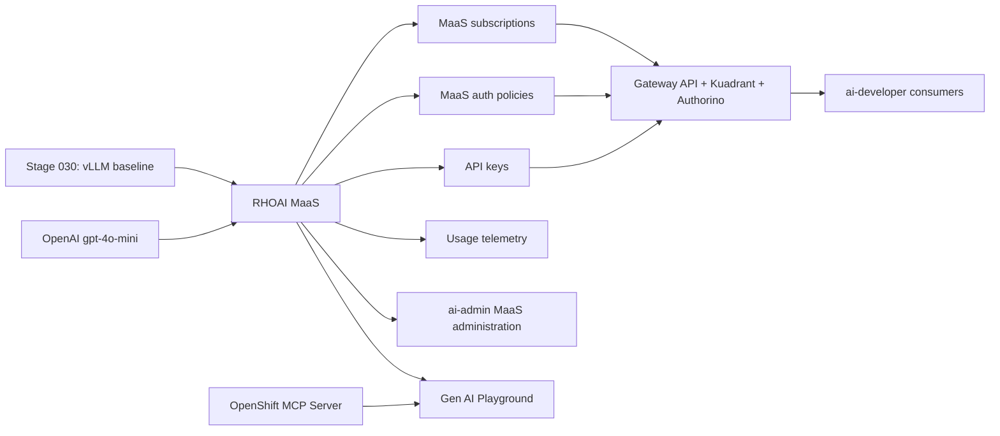
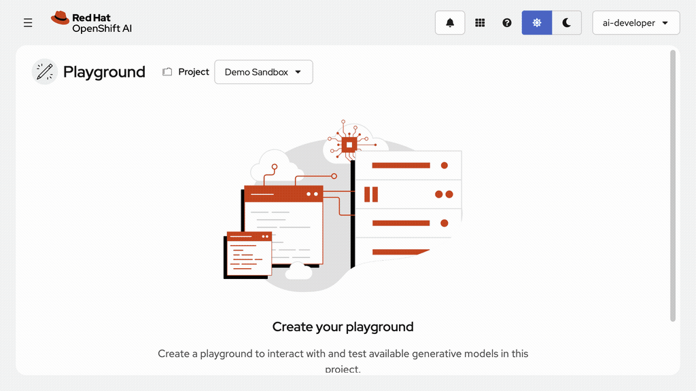

# Stage 040: Governed Models-as-a-Service

## Why This Matters

Enterprise AI teams need to turn model endpoints into governed platform
services. A raw inference URL is difficult to share safely: it lacks
subscription boundaries, API key lifecycle management, user-facing model
discovery, usage reporting, and consistent controls across local and external
models.

Models-as-a-Service (MaaS) adds that product layer. In this demo it publishes
two private local models — `nemotron-3-nano-30b-a3b` (131K-context reasoning)
and `qwen3-6-35b-a3b` (Qwen3.6 35B A3B FP8-dynamic, the coding specialist,
32K deployed context) — plus an external OpenAI `gpt-4o-mini` provider model
as managed AI assets that can be discovered, subscribed to, monitored, and
consumed through OpenAI-compatible APIs. Each private model requests one
L40S; Stage 020 disables GPU time-slicing so a 1-GPU request means an
exclusive card — two vLLM runtimes cannot share one card's memory, hardware
profiles have no affinity concept, and the KServe webhook strips
template-level anti-affinity on RHOAI 3.4, so full-card requests are the
documented-behavior-aligned placement mechanism.

## Architecture


```mermaid
flowchart LR
  previous["Stage 030: vLLM baseline"] --> maas["RHOAI MaaS"]
  openai["OpenAI gpt-4o-mini"] --> maas
  maas --> sub["MaaS subscriptions"]
  maas --> auth["MaaS auth policies"]
  maas --> keys["API keys"]
  maas --> obs["Usage telemetry"]
  sub --> gateway["Gateway API + Kuadrant + Authorino"]
  auth --> gateway
  keys --> gateway
  gateway --> users["ai-developer consumers"]
  maas --> admin["ai-admin MaaS administration"]
  maas --> playground["Gen AI Playground"]
  mcp["OpenShift MCP Server"] --> playground
```

## Demo



| Screenshot | What it shows |
|------------|---------------|
|  | GenAI Playground entry — project-scoped model interaction surface |
|  | MaaS default Gateway (data-science-gateway-class) with AWS ELB address |
|  | HTTPRoutes: local Nemotron + external GPT-4o-mini path-based routing |
|  | Kuadrant AuthPolicy enforcing API-key and token authentication |

## What This Stage Adds

This stage turns model endpoints into governed platform services with subscription-based access control, token quotas, API key lifecycle, and observability.

- MaaS prerequisites: cert-manager (hard prerequisite), Leader Worker Set Operator, Red Hat Connectivity Link v1.3.5, PostgreSQL database, Kuadrant configure Job.
- Local model migration: `LLMInferenceService` resources for Nemotron and Qwen3.6 in `models-as-a-service`, replacing the Stage 030 baseline `InferenceService`.
- External model publication: OpenAI `gpt-4o-mini` as a governed MaaS model with credential-gated provider key.
- Subscription and authorization policies with per-model token rate limits for developer and burst workloads.
- Gateway hostname patched to `maas.<ingress-domain>` via hook Job at deploy time with TLS from the cluster ingress certificate.
- vLLM PrometheusRule: recording rules for TTFT/ITL p95 and KV-cache utilization, plus serving-health alerts.
- Read-only OpenShift MCP server registered in Gen AI Playground for controlled tool use.
- Optional Slack and BrightData MCP servers (replicas 0 by default, activated when credentials are set).

## What To Notice And Why It Matters

Stage 040 is the governance control point for all model consumption that follows.

- **Subscription-based quotas.** Developer tokens are budgeted, not unlimited. Service-account subscriptions (`devspaces-coding-models`, `mta-migration-models`) provide workspace-level budgets at priority 100. Personal subscriptions (`personal-kube-admin`, `personal-ai-developer`, `personal-ai-admin`) at priority 150 win subscription selection for interactive use (e.g. GenAI Playground), so personal usage is metered separately. The `developer-hub-models` subscription is reserved for the planned RHDH integration.
- **Purpose-built subscriptions.** `devspaces-coding-models` (Nemotron 1M/h, Qwen-local 1M/h, Qwen3-235b 1M/h, MiniMax-M2 1M/h — no GPT-4o-mini). `mta-migration-models` (Nemotron 1M/h, Qwen-local 1M/h — locals only). `model-evaluation` (Nemotron 2M/h, GPT-4o-mini 1M/h) for benchmark runs. `ai-safety-guardrails` (Nemotron 500k/h) for NeMo guardrails self-check amplification.
- **Cross-stage wiring.** Stage 050 (`devspace-maas-key-provisioner`) service account uses the `devspaces-coding-models` subscription. Stage 050 MTA wiring (`job-patch-mta-maas-url`, `agentic-migration-key-provisioner`) uses the `mta-migration-models` subscription — keys minted under those service accounts inherit the matching token budget.
- **Operator version pinning.** The RHCL Subscription declares `startingCSV: rhcl-operator.v1.3.4` with manual InstallPlan approval; a hook Job (`approve-rhcl-installplan`) pins installation to `v1.3.5`. The Subscription anchors CatalogSource selection; the Job controls which InstallPlan is approved. This two-resource mechanism is deliberate because RHCL 1.4.0 is deprecated and Red Hat directs customers to pin to the latest 1.3.z release.
- **Generated resources stay operator-managed.** AuthPolicy, TokenRateLimitPolicy, EnvoyFilter, and HTTPRoutes are created by the MaaS/RHCL/Kuadrant operators from the declared subscriptions and model refs — they are NOT authored in GitOps.
- **Serving-health monitoring.** The `vllm-serving-health` PrometheusRule fires: high TTFT (>2s for 10m), request queue backlog (>8 for 10m), KV-cache pressure (>90% for 10m), and a parked-model info alert when no metrics flow for 15m. These match the Stage 030 GuideLLM benchmark breakpoints.
- **OpenShift MCP bounded access.** The MCP server uses HTTP rate limiting (2 rps / burst 4) and enables only three tools: `pods_list_in_namespace`, `pods_get`, `nodes_top`. It denies Secret, ConfigMap, and RBAC resource access.
- **Optional MCP servers.** Slack and BrightData deployments run at replicas 0 and activate only when `SLACK_BOT_TOKEN` / `BRIGHTDATA_API_TOKEN` are set. Both use SSE transport on port 8080.

## How Red Hat And Open Source Make It Work

Red Hat OpenShift AI MaaS provides subscription-based model governance: model publication, API key lifecycle, authorization policies, token rate limits, and usage telemetry — all scoped through the `maas.opendatahub.io/v1alpha1` API. Red Hat Connectivity Link and Kuadrant handle gateway policy enforcement, rate limiting through Limitador, and authentication through Authorino. Gateway API provides the ingress data plane. vLLM serves the local models through KServe InferenceServices backed by LLMInferenceService resources, with the Leader Worker Set Operator as a distributed-inference prerequisite. PostgreSQL stores the MaaS API key lifecycle state.

The Gen AI Playground (Llama Stack Operator) provides the user-facing model interaction surface. The OpenShift MCP Server adds bounded read-only cluster context as a registered tool.

## Trust Boundaries

- Local models (Nemotron, Qwen) keep all prompts and completions inside the OpenShift platform boundary.
- The external GPT-4o-mini path sends prompts to OpenAI — governed by MaaS token limits but processed by the provider.
- The MaaS gateway authenticates every request via API key against subscription and auth policy; unauthenticated requests are rejected.
- The OpenShift MCP server is read-only, denies sensitive resource types, and rate-limits HTTP access — models cannot write to or escalate within the cluster.
- The provider API key (`openai-provider-api-key`) is credential-gated and never committed to Git.

## Red Hat Products Used

- **[Red Hat OpenShift AI](https://www.redhat.com/en/technologies/cloud-computing/openshift/openshift-ai)** provides MaaS model governance, vLLM model serving, Gen AI Playground, and the Llama Stack Operator.
- **[Red Hat Connectivity Link](https://docs.redhat.com/en/documentation/red_hat_connectivity_link/1.3)** provides gateway policy enforcement, Kuadrant rate limiting, Authorino authentication, and DNS integration.
- **[Red Hat OpenShift](https://www.redhat.com/en/technologies/cloud-computing/openshift)** provides Gateway API, cert-manager, User Workload Monitoring, and the cluster infrastructure.

## Open Source Projects To Know

- [vLLM](https://vllm.ai/) is the high-throughput model serving engine behind the private inference endpoints.
- [KServe](https://kserve.github.io/website/) provides the Kubernetes-native model serving control plane.
- [Kuadrant](https://kuadrant.io/) provides policy-based API management for rate limiting and authentication.
- [Authorino](https://github.com/Kuadrant/authorino) is the external authorization service in the gateway policy chain.
- [Limitador](https://github.com/Kuadrant/limitador) is the rate-limiting engine enforcing token quotas.
- [OpenShift MCP Server](https://github.com/openshift/openshift-mcp-server) provides read-only cluster context as an MCP tool server.
- [Leader Worker Set](https://github.com/kubernetes-sigs/lws) is the distributed-inference scheduling prerequisite.

## Deploy And Validate

```bash
./stages/040-governed-models-as-a-service/deploy.sh
./stages/040-governed-models-as-a-service/validate.sh
```

Manifests: [`gitops/stages/040-governed-models-as-a-service/base/`](../../gitops/stages/040-governed-models-as-a-service/base/)

Prerequisites: cert-manager must be installed before deploy.sh runs (the script fails without it). The `register-model-cards.sh` script (invoked by deploy.sh) registers the Qwen3.6 rich model card through the authenticated registry route; the Nemotron card is registered by Stage 030.

## References

| Resource | Link |
|----------|------|
| RHOAI 3.4 — Govern LLM access with MaaS | https://docs.redhat.com/en/documentation/red_hat_openshift_ai_self-managed/3.4/html-single/govern_llm_access_with_models-as-a-service/index |
| RHOAI 3.4 — Authentication for llm-d using RHCL | https://docs.redhat.com/en/documentation/red_hat_openshift_ai_self-managed/3.4/html/deploy_models_using_distributed_inference_with_llm-d/configuring-authentication-for-llmd_distributed-inference |
| Red Hat Connectivity Link 1.3 — Installing | https://docs.redhat.com/en/documentation/red_hat_connectivity_link/1.3/html-single/installing_connectivity_link/index |
| OCP 4.20 — Leader Worker Set Operator | https://docs.redhat.com/en/documentation/openshift_container_platform/4.20/html/ai_workloads/leader-worker-set-operator |
| OCP 4.20 — cert-manager Operator | https://docs.redhat.com/en/documentation/openshift_container_platform/4.20/html/security_and_compliance/cert-manager-operator-for-red-hat-openshift |
| Red Hat Ecosystem Catalog — PostgreSQL 16 | https://catalog.redhat.com/en/software/containers/rhel9/postgresql-16/657b03866783e1b1fb87e142 |
| Centralized routing for LLMs on OpenShift AI | https://developers.redhat.com/articles/2026/05/25/route-external-and-local-llms-models-as-a-service |
| OpenShift MCP Server — Technology Preview | https://www.redhat.com/en/blog/model-context-protocol-server-red-hat-openshift-now-available-technology-preview |
| OpenShift MCP Server repository | https://github.com/openshift/openshift-mcp-server |
| OpenAI API — GPT-4o mini | https://developers.openai.com/api/docs/models/gpt-4o-mini |

## Next Stage

[Stage 050: AI-Assisted Development](../060-ai-assisted-development/README.md)
moves governed model access into developer workspaces with IDE-integrated AI
coding tools that consume MaaS endpoints instead of personal provider keys.
