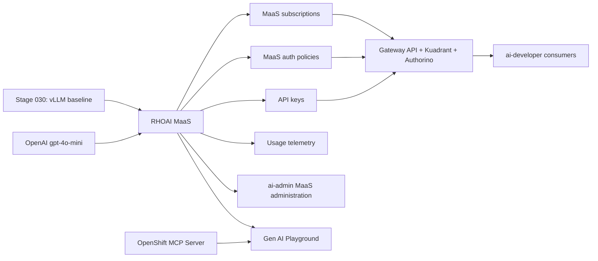
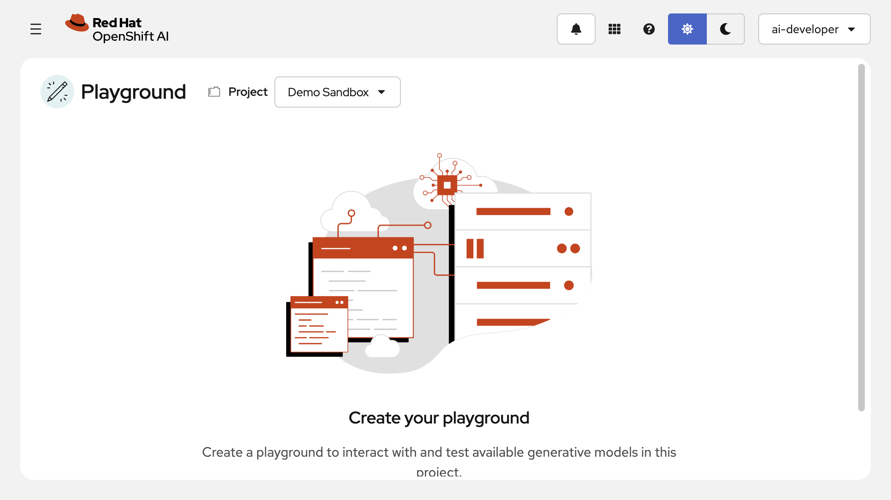
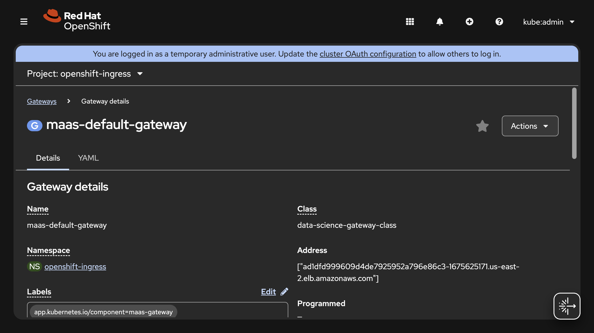
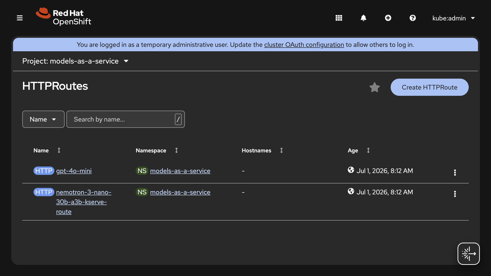
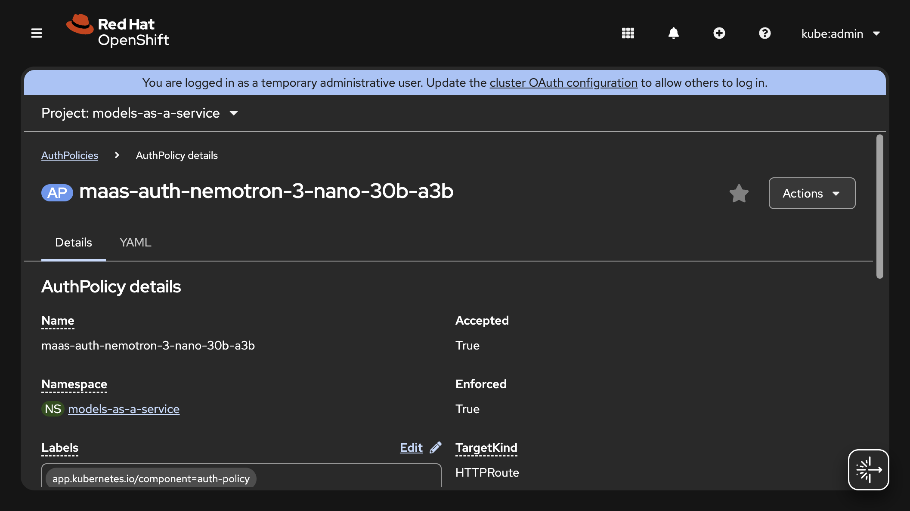

# Stage 040: Governed Models-as-a-Service

## Why This Matters

Enterprise AI teams need to turn model endpoints into governed platform services. A raw inference URL is difficult to share safely: it lacks subscription boundaries, API key lifecycle management, user-facing model discovery, usage reporting, and consistent controls across local and external models.

Models-as-a-Service (MaaS) adds that product layer. In this demo it publishes two private local models — `qwen3-6-27b` (Qwen3.6 27B FP8: benchmark-selected for tool-calling reliability, agentic planning, and top-tier coding, 131K deployed context, kept as the selectable alternate for Kilo, OpenCode, and Hermes) and `qwen3-8-27b-int4` (Qwen3.8 27B INT4, pinned Hugging Face revision `7fb3aaca2d21c0db4716572945208db40cef9966`, text-only, retained context 262144) — plus an external OpenAI `gpt-4o-mini` provider model as managed AI assets that can be discovered, subscribed to, monitored, and consumed through OpenAI-compatible APIs. Each private model requests one L40S. Stage 020 disables GPU time-slicing so a 1-GPU request means an exclusive card — two vLLM runtimes cannot share one card's memory, hardware profiles have no affinity concept, and the KServe webhook strips template-level anti-affinity on RHOAI 3.4, so full-card requests are the placement mechanism. Client defaults in stages 050-080 use `qwen3-8-27b-int4`, and `qwen3-6-27b` stays selectable.

`qwen3-8-27b-int4` is not a Red Hat validated model. The Red Hat AI validated-model matrix reviewed on 2026-09-22 does not list `RedHatAI/Qwen3.8-27B-INT4` and does not publish an OCI modelcar for it. The service uses the installed RHOAI 3.4 `LLMInferenceService` path and the operator vLLM runtime, with the documented `hf://` URI because no matching official OCI artifact exists. A successful local response shows compatibility with that installed runtime. It is not Red Hat model validation. The closest matrix entry, `RedHatAI/Qwen3.6-27B-FP8`, is validated for vLLM v0.21.0, RHOAI 3.5.0-ea.2, and 8x H100, which is a different combination from this cluster's RHOAI 3.4.4, vLLM 0.18.0, and single L40S. llm-d well-lit paths for RHOAI 3.4 likewise list H100, H200, B200, and A100 rather than L40S. Single-GPU `LLMInferenceService` on L40S is this repository's existing serving pattern.

## Architecture


```mermaid
flowchart LR
  previous["Stage 030: vLLM baseline"] --> maas["RHOAI MaaS"]
  openai["OpenAI gpt-4o-mini"] --> maas
  maas --> sub["MaaS subscriptions"]
  maas --> auth["MaaS auth policies"]
  maas --> keys["API keys"]
  maas --> obs["Usage telemetry"]
  sub --> gateway["Gateway API + Kuadrant + Authorino"]
  auth --> gateway
  keys --> gateway
  gateway --> users["ai-developer consumers"]
  maas --> admin["ai-admin MaaS administration"]
  maas --> playground["Gen AI Playground"]
  mcp["OpenShift MCP Server"] --> playground
```

## Demo


| Screenshot | What it shows |
|------------|---------------|
|  | GenAI Playground entry — project-scoped model interaction surface |
|  | MaaS default Gateway (data-science-gateway-class) with AWS ELB address |
|  | HTTPRoutes: local model + external GPT-4o-mini path-based routing |
|  | Kuadrant AuthPolicy enforcing API-key and token authentication |

## What This Stage Adds

This stage turns model endpoints into governed platform services with subscription-based access control, token quotas, API key lifecycle, and observability.

- MaaS prerequisites: cert-manager (hard prerequisite), Leader Worker Set Operator, Red Hat Connectivity Link v1.3.5, PostgreSQL database, Kuadrant configure Job, `kuadrant-console-plugin` enablement (sync-wave 14) for Connectivity Link gateway and policy visibility in the OpenShift web console.
- Local model migration: the `LLMInferenceService` for Qwen3.6 27B in `models-as-a-service` (a second-model workshop overlay exists under `local-models/optional/`), plus a separate `qwen3-8-27b-int4` service, replacing the Stage 030 baseline `InferenceService`. Qwen 3.6 serving flags follow the official vLLM Qwen3.6-27B recipe with Tool Calling and Text Only enabled (`--reasoning-parser qwen3`, `--enable-auto-tool-choice`, `--tool-call-parser qwen3_xml`, `--language-model-only`). Qwen 3.8 uses the same parsers and text-only mode, the pinned revision's sampling defaults (`temperature` 1.0, `top_p` 0.95, `top_k` 20), FP8 KV cache, and `--mamba-cache-mode=align`. Speculative decoding stays off.
- External model publication: OpenAI `gpt-4o-mini` as a governed MaaS model with credential-gated provider key.
- Subscription and authorization policies with per-model token rate limits for developer and burst workloads.
- Gateway hostname patched to `maas.<ingress-domain>` via hook Job at deploy time with TLS from the cluster ingress certificate.
- vLLM PrometheusRule: recording rules for TTFT/ITL p95 and KV-cache utilization, plus serving-health alerts.
- Read-only OpenShift MCP server registered in Gen AI Playground for controlled tool use.
- Optional Slack and BrightData MCP servers (replicas 0 by default, activated when credentials are set).

## What To Notice And Why It Matters

Stage 040 is the governance control point for all model consumption that follows.

- **Subscription-based quotas.** Developer tokens are budgeted, not unlimited. Service-account subscriptions (`devspaces-coding-models`) provide workspace-level budgets at priority 100. Personal subscriptions (`personal-kube-admin`, `personal-ai-developer`, `personal-ai-admin`) at priority 150 win subscription selection for interactive use (e.g. GenAI Playground), so personal usage is metered separately.

**Subscription architecture:**

| Name | Owners | Models (limit/1h) | Priority | Purpose |
|------|--------|-------------------|----------|---------|
| `devspaces-coding-models` | SA `devspace-maas-key-provisioner` | qwen3-6-27b @20M/1h, qwen3-8-27b-int4 @20M/1h | 100 | Dev Spaces workspaces (Kilo Code / OpenCode). Default client model is qwen3-8-27b-int4; qwen3-6-27b stays selectable |
| `personal-kube-admin` / `personal-ai-developer` / `personal-ai-admin` | one user each | qwen3-6-27b @1M, qwen3-8-27b-int4 @1M, gpt-4o-mini @100K | **150** | Interactive/Playground — wins user-token selection |

Retired: `rhoai-developers-coding-models`, `enterprise-rag-autorag`, `developer-hub-models`, `model-evaluation`, `ai-safety-guardrails`. The last three had no API keys and no running consumer. `ai-admin` and `ai-developer` keep access through their personal subscriptions.

- **Cross-stage wiring.** Stage 050 (`devspace-maas-key-provisioner`) service account uses the `devspaces-coding-models` subscription. (The former `mta-migration-models` subscription was removed with Developer Lightspeed — MTA currently consumes no models; see BACKLOG "Developer Lightspeed re-enable".)
- **Operator version pinning.** The RHCL Subscription declares `startingCSV: rhcl-operator.v1.3.5` directly in the manifest with manual InstallPlan approval; a hook Job (`approve-rhcl-installplan`) guards against accidental upgrades past `v1.3.5`. This is deliberate because RHCL 1.4.0 is deprecated and Red Hat directs customers to pin to the latest 1.3.z release.
- **Generated resources stay operator-managed.** AuthPolicy, TokenRateLimitPolicy, EnvoyFilter, and HTTPRoutes are created by the MaaS/RHCL/Kuadrant operators from the declared subscriptions and model refs — they are NOT authored in GitOps.
- **Serving-health monitoring.** The `vllm-serving-health` PrometheusRule fires: high TTFT (>2s for 10m), request queue backlog (>8 for 10m), KV-cache pressure (>90% for 10m), and a parked-model info alert when no metrics flow for 15m. These match the Stage 030 GuideLLM benchmark breakpoints.
- **OpenShift MCP bounded access.** The MCP server uses HTTP rate limiting (2 rps / burst 4) and enables only three tools: `pods_list_in_namespace`, `pods_get`, `nodes_top`. It denies Secret, ConfigMap, and RBAC resource access.
- **Optional MCP servers.** Slack and BrightData deployments run at replicas 0 and activate only when `SLACK_BOT_TOKEN` / `BRIGHTDATA_API_TOKEN` are set. Both use SSE transport on port 8080.

**Red Hat internal external models:** `qwen3-235b` (16K context) and `minimax-m2` (196K context) are published as governed MaaS models via a LiteLLM proxy at `maas-rhdp.apps.maas.redhatworkshops.io`. One shared API key (`.env` `REDHAT_MODELS_API_KEY` → Secret `redhat-models-provider-api-key`, `inference.networking.k8s.io/bbr-managed=true` label) authenticates both models. The MaaS integration uses the `ExternalModel` + `MaaSModelRef` pattern so both models appear in subscriptions and the Playground alongside the local models and gpt-4o-mini.

**Visibility semantics:** what a user sees in the MaaS dashboard = what their own subscriptions authorize. Admin users (kube:admin) may see grayed-out subscription links for SA-owned subscriptions (like `devspaces-coding-models`); this is correct behavior — the admin is not an owner of that subscription.

**Usage attribution:** external-model rows in the MaaS usage dashboard show the upstream response's model id (e.g. `minimaxai/minimax-m2-maas`), not the MaaS alias (`minimax-m2`). This is expected when the provider returns a different model identifier than the one the MaaS gateway advertises.

## How Red Hat And Open Source Make It Work

Red Hat OpenShift AI MaaS provides subscription-based model governance: model publication, API key lifecycle, authorization policies, token rate limits, and usage telemetry — all scoped through the `maas.opendatahub.io/v1alpha1` API. Red Hat Connectivity Link and Kuadrant handle gateway policy enforcement, rate limiting through Limitador, and authentication through Authorino. Gateway API provides the ingress data plane. vLLM serves the local models through KServe InferenceServices backed by LLMInferenceService resources, with the Leader Worker Set Operator as a distributed-inference prerequisite. PostgreSQL stores the MaaS API key lifecycle state.

The Gen AI Playground (Llama Stack Operator) provides the user-facing model interaction surface. The OpenShift MCP Server adds bounded read-only cluster context as a registered tool.

## Trust Boundaries

- The local model keeps all prompts and completions inside the OpenShift platform boundary.
- The external GPT-4o-mini path sends prompts to OpenAI — governed by MaaS token limits but processed by the provider.
- The MaaS gateway authenticates every request via API key against subscription and auth policy; unauthenticated requests are rejected.
- The OpenShift MCP server is read-only, denies sensitive resource types, and rate-limits HTTP access — models cannot write to or escalate within the cluster.
- The provider API key (`openai-provider-api-key`) is credential-gated and never committed to Git.

## Red Hat Products Used

- **[Red Hat OpenShift AI](https://www.redhat.com/en/technologies/cloud-computing/openshift/openshift-ai)** provides MaaS model governance, vLLM model serving, Gen AI Playground, and the Llama Stack Operator.
- **[Red Hat Connectivity Link](https://docs.redhat.com/en/documentation/red_hat_connectivity_link/1.3)** provides gateway policy enforcement, Kuadrant rate limiting, Authorino authentication, and DNS integration.
- **[Red Hat OpenShift](https://www.redhat.com/en/technologies/cloud-computing/openshift)** provides Gateway API, cert-manager, User Workload Monitoring, and the cluster infrastructure.

## Open Source Projects To Know

- [vLLM](https://vllm.ai/) is the high-throughput model serving engine behind the private inference endpoints.
- [KServe](https://kserve.github.io/website/) provides the Kubernetes-native model serving control plane.
- [Kuadrant](https://kuadrant.io/) provides policy-based API management for rate limiting and authentication.
- [Authorino](https://github.com/Kuadrant/authorino) is the external authorization service in the gateway policy chain.
- [Limitador](https://github.com/Kuadrant/limitador) is the rate-limiting engine enforcing token quotas.
- [OpenShift MCP Server](https://github.com/openshift/openshift-mcp-server) provides read-only cluster context as an MCP tool server.
- [Leader Worker Set](https://github.com/kubernetes-sigs/lws) is the distributed-inference scheduling prerequisite.

## Qwen 3.8 next to Qwen 3.6

Both services request one full L40S from `lq-gpu-reserved-demo` (`cq-gpu-reserved-demo` nominal GPU quota is already 2). CPU and memory requests stay at 2 CPU and 16Gi, the same starting point as Qwen 3.6. The reserved queue allows 12 CPU and 48Gi, and one g6e.2xlarge has enough leftover CPU and RAM for that pod beside the GPU Operator. Scheduler pods stay on CPU workers.

Configuration that differs from `qwen3-6-27b`, and why:

| Setting | Qwen 3.6 | Qwen 3.8 | Reason |
|---------|----------|----------|--------|
| Artifact | `hf://RedHatAI/Qwen3.6-27B-FP8` (floating) | `hf://RedHatAI/Qwen3.8-27B-INT4:7fb3aaca2d21c0db4716572945208db40cef9966` | Pin the reviewed INT4 revision. No official modelcar exists. |
| Weights | FP8 | compressed-tensors packed INT4, group 128 | The checkpoint's quantization config. AWQ in `recipe.yaml` is smoothing only. |
| `max-num-seqs` | 8 | 2 | Hybrid models allocate per-slot state up front. Start smaller. |
| `gpu-memory-utilization` | 0.92 | 0.90 | Starting engineering value for the INT4 checkpoint plus FP8 KV. |
| Generation override | temperature 0.6, top_p 0.95, top_k 20, plus penalty fields | temperature 1.0, top_p 0.95, top_k 20 | Pinned `generation_config.json`. Do not copy the 3.6 override. |
| Prefix cache | `--enable-prefix-caching` | same, plus `--mamba-cache-mode=align` | This runtime rejects mamba cache mode `all` for Qwen3.5. |
| `max-model-len` | 131072 | 262144 | Retained after the length checks below. 131072 was only the starting value. |
| Speculative decoding | off | off | The card's `dspark-preview` method is not used. |

Shared on purpose: one replica, one GPU, tensor parallelism 1 (vLLM default; `spec.parallelism` is left unset so the service stays a single-node Deployment), text-only `--language-model-only`, `max-num-batched-tokens=4096`, `--kv-cache-dtype=fp8`, `--reasoning-parser=qwen3`, `--tool-call-parser=qwen3_xml`, the MaaS gateway, auth, hardware profile, and reserved queue. Platform arguments for TLS, `/mnt/models`, the served name, and usage reporting stay in place.

### Measured on 2026-09-22

These numbers are from this cluster. They are not Red Hat capacity ratings. GuideLLM ran against each engine Service, not through MaaS. The workload was `prompt_tokens=512,output_tokens=64` for 40 seconds at concurrency 1 and 2. GuideLLM 0.5 left time-to-first-token and inter-token latency unset (`first_token_iteration` was null). End-to-end latency and time per output token were populated. No request errored. Neither workload pod restarted. GPU memory after that run was 40249 MiB of 46068 MiB on the Qwen 3.8 node and 41165 MiB of 46068 MiB on the Qwen 3.6 node.

| Model | Concurrency | Completed requests | Errors | Median end-to-end | Median time per output token | Median output tokens/s |
|-------|-------------|--------------------|--------|-------------------|------------------------------|------------------------|
| Qwen 3.8 | 1 | 25 | 0 | 1.65 s | 25.7 ms | 38.9 |
| Qwen 3.8 | 2 | 41 | 0 | 1.93 s | 30.2 ms | 33.1 |
| Qwen 3.6 | 1 | 12 | 0 | 3.50 s | 54.7 ms | 18.3 |
| Qwen 3.6 | 2 | 23 | 0 | 3.41 s | 53.2 ms | 18.8 |

A separate streaming check with about 5600 prompt tokens, identical client sampling, and a 16-token cap measured time to first token:

| Model | Cold | Reused prefix |
|-------|------|----------------|
| Qwen 3.8 | 1.905 s | 0.314 s |
| Qwen 3.6 | 1.367 s | 0.260 s |

The 16-token cap did not leave the aisle code in the streamed content, so that run is a latency check only.

Both models corrected `return a - b` to `return a + b` when called with temperature 1.0, top_p 0.95, top_k 20, thinking enabled, and `reasoning_effort=low`. The output budget was 512 tokens. Qwen 3.8 used 43 completion tokens. Qwen 3.6 used 314, most of them reasoning, and had failed the same task at a 128-token cap.

On the retained Qwen 3.8 server, one session recalled `NEEDLE_ALPHA` and `NEEDLE_OMEGA` at 246077 prompt tokens with 67 completion tokens. The same shape at 222077 tokens failed when the output cap was 128, because the reply hit the cap before the codes were produced, and passed when the cap was 512. Two unique sessions of 72077 and 70077 tokens both recalled both codes at the same time, with no restart. Identical repeated filler is prefix-cached, so those wall-clock times are not cold-prefill times. The 262144 setting was not filled to the last token.

The workload Deployment uses RollingUpdate with `maxSurge` 25% and `maxUnavailable` 25%. At one replica that rounds to one extra pod and zero unavailable pods. An update while both GPUs are busy waits for a third GPU. The `LLMInferenceService` CRD does not expose a Recreate strategy. To roll the new service, delete its current workload pod after the updated ReplicaSet exists so the replacement can take that GPU. Do not scale the MachineSet down to free a card.

### Remove Qwen 3.8

1. Delete `LLMInferenceService/qwen3-8-27b-int4` and `MaaSModelRef/qwen3-8-27b-int4` in `models-as-a-service`, and remove `qwen3-8-27b-int4` from the developer and evaluation subscriptions and auth policies. Leave `qwen3-6-27b` in place.
2. Identify the Machine that was added for this service before any scale-down. On this cluster that Machine is `cluster-grnl8-ng7jk-gpu-us-east-2b-zxhcx` (node `ip-10-0-32-106`). Qwen 3.6 stays on `cluster-grnl8-ng7jk-gpu-us-east-2b-8z9j8` (node `ip-10-0-31-189`). Confirm the instance type is still `g6e.2xlarge` and the node still reports one GPU before scaling.
3. Scale `machineset/cluster-grnl8-ng7jk-gpu-us-east-2b` to 1 only after that Machine is the one Machine API will remove. The Stage 020 provisioner does not change an existing MachineSet's replica count.

## Deploy And Validate

```bash
./stages/040-governed-models-as-a-service/deploy.sh
./stages/040-governed-models-as-a-service/validate.sh
```

Manifests: [`gitops/stages/040-governed-models-as-a-service/base/`](../../gitops/stages/040-governed-models-as-a-service/base/)

Prerequisites: cert-manager must be installed before deploy.sh runs (the script fails without it). The `register-model-cards.sh` script (invoked by deploy.sh) archives the retired Qwen3.6 35B card and registers the Qwen3.6 27B and Qwen3.8 27B INT4 cards through the authenticated registry route. After the Stage 040 sync it labels each `LLMInferenceService` with `modelregistry.opendatahub.io/name`, `registered-model-id`, and `model-version-id` so the model card Deployments tab lists the service. Those ids are assigned by the registry; Argo CD ignores drift on the three labels.

## References

| Resource | Link |
|----------|------|
| RHOAI 3.4 — Govern LLM access with MaaS | https://docs.redhat.com/en/documentation/red_hat_openshift_ai_self-managed/3.4/html-single/govern_llm_access_with_models-as-a-service/index |
| RHOAI 3.4 — Authentication for llm-d using RHCL | https://docs.redhat.com/en/documentation/red_hat_openshift_ai_self-managed/3.4/html/deploy_models_using_distributed_inference_with_llm-d/configuring-authentication-for-llmd_distributed-inference |
| Red Hat Connectivity Link 1.3 — Installing | https://docs.redhat.com/en/documentation/red_hat_connectivity_link/1.3/html-single/installing_connectivity_link/index |
| OCP 4.20 — Leader Worker Set Operator | https://docs.redhat.com/en/documentation/openshift_container_platform/4.20/html/ai_workloads/leader-worker-set-operator |
| OCP 4.20 — cert-manager Operator | https://docs.redhat.com/en/documentation/openshift_container_platform/4.20/html/security_and_compliance/cert-manager-operator-for-red-hat-openshift |
| Red Hat Ecosystem Catalog — PostgreSQL 16 | https://catalog.redhat.com/en/software/containers/rhel9/postgresql-16/657b03866783e1b1fb87e142 |
| Centralized routing for LLMs on OpenShift AI | https://developers.redhat.com/articles/2026/05/25/route-external-and-local-llms-models-as-a-service |
| OpenShift MCP Server — Technology Preview | https://www.redhat.com/en/blog/model-context-protocol-server-red-hat-openshift-now-available-technology-preview |
| OpenShift MCP Server repository | https://github.com/openshift/openshift-mcp-server |
| OpenAI API — GPT-4o mini | https://developers.openai.com/api/docs/models/gpt-4o-mini |

## Next Stage

[Stage 050: AI-Assisted Development](../060-ai-assisted-development/README.md) moves governed model access into developer workspaces with IDE-integrated AI coding tools that consume MaaS endpoints instead of personal provider keys.
