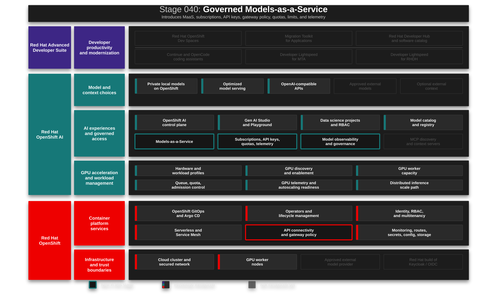

# Stage 040: Governed Models-as-a-Service

## Why This Matters

Stage 030 proved that private models can run on OpenShift AI. Stage 040 turns those model endpoints into a governed platform service.

Models-as-a-Service (MaaS) lets platform teams publish approved model choices while centralizing identity, API keys, subscriptions, quotas, rate limits, token limits, telemetry, and policy. Developers and tools get a familiar OpenAI-compatible access pattern without learning where the GPU runs or how each model was deployed.

## Architecture



## What This Stage Adds

This stage adds the governed MaaS access layer for private models.

- A MaaS model catalog and API path for local model consumption.
- `MaaSModelRef`, `MaaSAuthPolicy`, and `MaaSSubscription` resources for the private model portfolio.
- Central MaaS API key issuance so consumers do not manage direct model credentials.
- A demo PostgreSQL database and `maas-db-config` connection Secret for MaaS API key metadata.
- Subscription groups, rate limits, token limits, and tenant telemetry.
- Red Hat Connectivity Link, Gateway API, Kuadrant, and Authorino resources for policy-enforced API access.
- GuideLLM validation helpers for small, repeatable endpoint checks.

The important capability is the access pattern: publish models once, subscribe consumers to them, issue keys centrally, enforce policy consistently, and observe usage.

## What To Notice And Why It Matters

Stage 040 makes private model serving consumable without losing platform control.

- Applications and developer tools use OpenAI-compatible access through MaaS-issued API keys.
- Platform teams control which groups can use each model and how much they can consume.
- Subscriptions, token limits, tenant telemetry, and GuideLLM tests make usage visible.
- Gateway policy centralizes authentication, limits, and telemetry instead of embedding those controls in each client.
- The active OpenShift AI 3.4 path uses subscriptions rather than the older 3.3 tier model.

This matters because enterprise AI adoption breaks down when every team manages endpoints, keys, GPU capacity, and usage tracking independently.

## How Red Hat And Open Source Make It Work

Red Hat OpenShift AI 3.4 provides the MaaS controller, MaaS API, model references, authorization policy, subscriptions, and model-serving context. Red Hat Connectivity Link, Gateway API, Kuadrant, and Authorino turn model calls into policy-enforced API traffic.

GitOps owns the demo MaaS resources: local model references, access policy, subscriptions, tenant telemetry, validation helpers, and the disposable PostgreSQL backing service required by the MaaS API. The OpenShift AI operator owns the MaaS controller and MaaS API deployments. Remaining compatibility items are tracked in [`BACKLOG.md`](../../BACKLOG.md).

## Trust Boundaries

MaaS centralizes authentication, API keys, subscriptions, limits, and telemetry, but it does not change where a model processes data. Private local model calls stay inside the OpenShift platform boundary; other model paths require their own approval and trust-boundary review.

## Red Hat Products Used

- **[Red Hat OpenShift AI](https://www.redhat.com/en/technologies/cloud-computing/openshift/openshift-ai)** provides the MaaS and model-serving platform context.
- **[Red Hat Connectivity Link](https://www.redhat.com/en/technologies/cloud-computing/connectivity-link)** provides the gateway and policy layer.
- **[Red Hat OpenShift](https://www.redhat.com/en/technologies/cloud-computing/openshift)** provides runtime, identity, networking, routes, storage, and monitoring.
- **[Red Hat OpenShift GitOps](https://www.redhat.com/en/technologies/cloud-computing/openshift/gitops)** reconciles MaaS, gateway, policy, and telemetry resources.

## Open Source Projects To Know

- [Open Data Hub models-as-a-service](https://github.com/opendatahub-io/models-as-a-service) is the upstream project behind the MaaS APIs.
- [Gateway API](https://gateway-api.sigs.k8s.io/) provides Kubernetes-native API routing primitives.
- [Kuadrant](https://kuadrant.io/) provides gateway policy patterns for authentication, rate limiting, and protection.
- [Authorino](https://www.authorino.io/) provides external authorization for gateway-protected APIs.
- [CloudNativePG](https://cloudnative-pg.io/) provides the demo PostgreSQL database.
- [GuideLLM](https://github.com/vllm-project/guidellm) provides the small model load test used by validation.

## Deploy And Validate

```bash
./stages/040-governed-models-as-a-service/deploy.sh
./stages/040-governed-models-as-a-service/validate.sh
```

Stage validation runs a short GuideLLM test when a MaaS API key is available. Defaults come from [`env.example`](../../env.example). Set `GUIDELLM_SKIP_LOAD_TEST=true` to skip the load test.

Compare the two private models with the helper scripts:

```bash
./stages/040-governed-models-as-a-service/compare-private-models.sh
./stages/040-governed-models-as-a-service/summarize-guidellm-results.sh
```

Manifests: [`gitops/stages/040-governed-models-as-a-service/base/`](../../gitops/stages/040-governed-models-as-a-service/base/)

## References

- [Red Hat: What is Model-as-a-Service?](https://www.redhat.com/en/topics/ai/what-is-models-as-a-service)
- [Red Hat Developer: Run Model-as-a-Service for multiple LLMs on OpenShift](https://developers.redhat.com/articles/2026/03/24/run-model-service-multiple-llms-openshift)
- [Red Hat OpenShift AI 3.4 MaaS documentation](https://docs.redhat.com/en/documentation/red_hat_openshift_ai_self-managed/3.4/html-single/govern_llm_access_with_models-as-a-service/govern_llm_access_with_models-as-a-service)
- [Red Hat OpenShift AI 3.4 release notes](https://docs.redhat.com/en/documentation/red_hat_openshift_ai_self-managed/3.4/html-single/release_notes/release_notes)
- [Red Hat Connectivity Link gateway policies](https://docs.redhat.com/en/documentation/red_hat_connectivity_link/1.3/html-single/configuring_and_deploying_gateway_policies/configuring_and_deploying_gateway_policies)
- [Open Data Hub models-as-a-service](https://github.com/opendatahub-io/models-as-a-service)
- [Gateway API](https://gateway-api.sigs.k8s.io/)
- [Kuadrant](https://kuadrant.io/)
- [Authorino](https://www.authorino.io/)
- [GuideLLM](https://github.com/vllm-project/guidellm)

## Next Stage

[Stage 050: Approved External Model Access](../050-approved-external-model-access/README.md) adds approved external models behind the same governed MaaS path.
