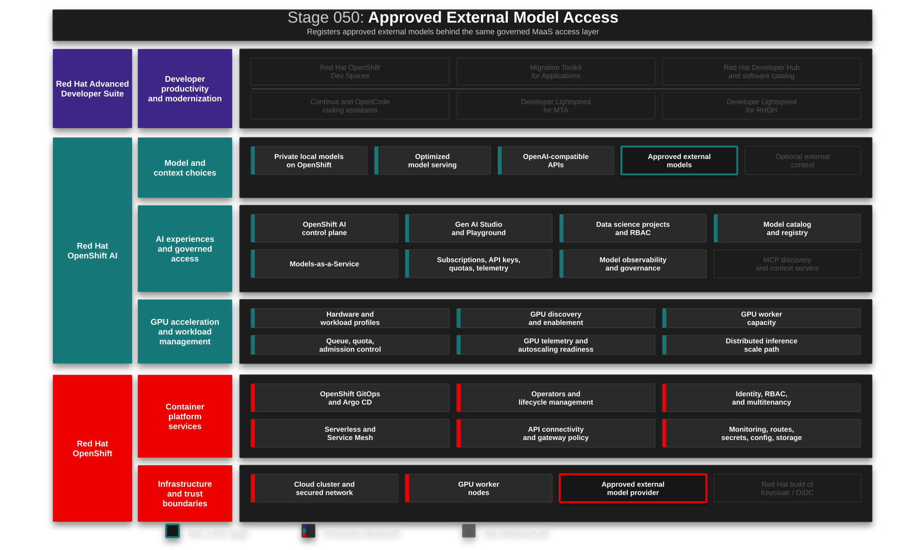

# Stage 050: Advanced Application Platform

> **Status:** consolidated platform stage (Phase 2 of
> [PLAN-advanced-app-platform-restructure](../../docs/PLAN-advanced-app-platform-restructure.md)).
> This stage owns every component the AI development stages consume, as
> kustomize components: `devspaces` (Dev Spaces + workspaces + MaaS keys),
> `pipelines` (Pipelines/TAS operators, the webhook dispatcher, and the
> reusable `project-pipeline` base — every project runs its OWN pipeline in
> its own namespace), `sonarqube` (fail-on-new-issue quality gate), `rhdh`
> (Developer Hub), `migiq` (MTA + Developer Lightspeed), and `coolstore`
> (the deployed stage 060 dev environment). The `agentic-quarkus-scaffold`
> golden-path template (stage 070) is registered in the catalog; golden
> repositories bootstrap via `scripts/bootstrap-golden-repos.sh`. Pipeline,
> SonarQube, dispatcher, and scaffolded-project flows are live-validated
> (see docs/OPERATIONS.md, 2026-07-13 entries).
> Anchor article: [Trusted software factory: Building trust in the agentic AI era](https://developers.redhat.com/articles/2026/05/13/trusted-software-factory-building-trust-agentic-ai-era).

## Why This Matters

Stages 010–040 build the governed model platform. Before a single developer
prompt is issued, the enterprise also needs the **application platform layer**
that AI-driven development will run on: a developer portal where every
workflow starts as a self-service template, and a delivery path where every
change exits through pipelines with quality gates and provenance.

That is this stage's job. The AI development maturity ladder (stages 060–080)
does not treat self-service and trusted delivery as separate rungs — they are
constants. Every rung enters through the portal and exits through the
pipeline: *self-service in, trusted delivery out, at every maturity level.*

Without a portal, the AI platform remains scattered across dashboards,
routes, namespaces, and README files. Without delivery gates, AI-multiplied
output multiplies the question auditors ask: *who built this artifact, from
what, and can we prove it?* This stage answers both before the developer arc
begins.

## Architecture



Red Hat Developer Hub provides the portal surface: software catalog, TechDocs,
and (in Phase 3) golden-path templates that provision per-run repositories for
the AI development stages. Red Hat OpenShift Pipelines provides the Tekton
runtime for build pipelines; Red Hat Trusted Artifact Signer provides the
sigstore stack (Fulcio CA, Rekor transparency log) for signing and attestation
once the Securesign instance is configured.

Operator co-tenancy note: both delivery operators install into
`openshift-operators` with `Automatic` approval. Stage 040 deploys Red Hat
Connectivity Link subscriptions with `Manual` approval in the same namespace,
and OLM applies the most restrictive approval to shared InstallPlans. A Sync
hook Job (`approve-installplans.yaml`) approves pending InstallPlans that
carry the Pipelines or TAS CSVs.

**Identity:** RHDH OIDC brokers through the MTA Keycloak that this stage's
own `migiq` component deploys. The PostSync jobs wait and retry, so ordering
resolves within a single Application sync — there is no cross-stage
dependency anymore. A standalone platform RHBK (realm `platform`) remains an
open refinement in the restructure plan; until it lands, the `slim` overlay
(platform without MigIQ) cannot serve RHDH sign-in.

## What This Stage Adds

This stage adds the application-platform layer every dev-arc rung consumes,
organized as five components under
[`gitops/stages/050-advanced-app-platform/base/`](../../gitops/stages/050-advanced-app-platform/base/):

- **devspaces** — Red Hat OpenShift Dev Spaces (CheCluster), persona
  workspaces, Che Code editor policy with Continue, MaaS API key
  provisioning, and the interim `agentic-coolstore` workspace.
- **pipelines** — OpenShift Pipelines (channel `pipelines-1.22`) and Trusted
  Artifact Signer (channel `stable-v1.4`) operators, the InstallPlan approval
  hook for Stage 040 co-tenancy, and the **per-project pipeline model**:
  every project namespace runs its own `app-push` pipeline (clone → Maven
  build → SonarQube gate → image build → `:latest` retag) instantiated from
  the `pipelines/project-pipeline` kustomize template. `app-platform-build`
  hosts only the webhook dispatcher (the GitHub App has a single endpoint)
  and the `project-provisioner` CronJob that reconciles build credentials
  into every namespace labeled `rhoai3.redhat.com/pipeline-project=true`.
- **sonarqube** — SonarQube + PostgreSQL and a PostSync job that rotates the
  admin password, provisions the scanner token, and sets a custom default
  quality gate that fails on any new issue.
- **rhdh** — Red Hat Developer Hub 1.9, OIDC brokered to OpenShift OAuth via
  the MigIQ Keycloak, runtime-generated catalog, TechDocs, ConsoleLink, and
  the OpenShift integration plugins (Kubernetes, Topology, Tekton CI tab,
  Argo CD) backed by the read-only `rhdh-kubernetes-reader` ServiceAccount.
- **migiq** — Migration Toolkit for Applications with Developer Lightspeed
  wired to MaaS, plus the agentic migration workspace.
- **coolstore** — the deployed Coolstore dev environment
  (`coolstore-inventory-service` in `coolstore-dev`): the demo starts from a
  running brownfield system, not an empty cluster. The Deployment pins the
  `:latest` image that every successful pipeline run republishes
  (`tag-latest` task); `deploy.sh` seeds the first green run. The brownfield
  `mca-coolstore` monolith itself stays source-only — it is the MTA analysis
  target, not a workload this pipeline can build.

The `overlays/slim` variant deploys the platform without MigIQ (usable once
the standalone platform RHBK lands).

**Developer entry points per stage:**

- **Stage 060** enters through the **catalog**, not a template: the
  `coolstore-inventory-service` component links straight into the governed
  Dev Spaces workspace; pushes to its repo run coolstore's own pipeline in
  `coolstore-dev`.
- **Stage 070** enters through the one **golden-path template**
  (`agentic-quarkus-scaffold`, in `base/rhdh/templates/`): it scaffolds a
  fresh corporate-standard Quarkus app into a per-run GitHub repo (topic
  `rhoai3-golden-path`) with its own namespace and pipeline instance —
  verified against the Backstage GitHub scaffolder module (`publish:github`
  with `protectDefaultBranch: false` so the demo can push to `main`).
- **Stage 080** enters through **MTA directly** for now (RHDH template
  deferred until the MigIQ migration flow is settled).

Webhooks are not created per repo: a GitHub App installed on all
repositories delivers push events to the shared dispatcher EventListener,
which routes each repository to its project's own pipeline.

## External Setup (one-time, outside the cluster)

1. **Golden repositories** under `github.com/adnan-drina`: run
   `./scripts/bootstrap-golden-repos.sh` (requires `gh` auth with `repo`
   scope). Re-running force-pushes golden state — that is the reset.
2. **GitHub PAT** (classic, `repo` scope) in `.env` as `GITHUB_TOKEN`: used
   by RHDH (scaffolder repo creation + catalog reads) and the pipeline's
   git-clone for private repos. A GitHub App cannot replace it here —
   installation tokens cannot create repositories under a personal account.
3. **GitHub App** (Settings → Developer settings → GitHub Apps) for webhook
   delivery: webhook URL = the `app-platform-listener` Route URL, webhook
   secret = `GITHUB_WEBHOOK_SECRET` from `.env`. Repository permissions:
   **Contents: Read-only** (required to subscribe to push events) plus the
   mandatory Metadata: Read-only. Subscribe to **Push** events and install
   on **All repositories** (covers future template-created repos). No
   client secret or private key is needed — the App only delivers webhooks.
4. **quay.io** (optional): create an organization/namespace and a robot
   account with push permission; set `IMAGE_REGISTRY`, `QUAY_ROBOT_USER`,
   `QUAY_ROBOT_TOKEN` in `.env`. Without these the pipeline pushes to the
   internal OpenShift registry.

## What To Notice And Why It Matters

- **The platform layer comes before the developer arc.** Portal, pipelines,
  and signing infrastructure exist before stage 060 issues the first prompt —
  so every AI workflow lands on governed rails instead of retrofitting them.
- **Self-service surface.** Catalog entities make ownership, lifecycle, tags,
  source links, and workflow docs visible; component-specific Dev Spaces
  links route developers into the correct controlled workspace.
- **Delivery evidence, operator-managed.** The Tekton stack is
  operator-managed and ready; TAS awaits its Securesign instance. AI-generated
  code needs the same supply-chain evidence as human-written code.
- **Operator co-tenancy is a real platform skill.** The InstallPlan hook shows
  how later stages must account for earlier stages' subscription approval
  policies in shared namespaces.

## How Red Hat And Open Source Make It Work

Red Hat Developer Hub packages Backstage for OpenShift with operator-based
deployment, supported configuration, and dynamic plugin management. The
catalog is generated at deploy time: a Sync hook Job resolves Dev Spaces and
TechDocs placeholders with cluster-specific URLs into a runtime ConfigMap; a
PostSync Job discovers routes, creates the OIDC client, generates session
secrets, patches `rhdh-secrets`, and restarts the deployment.

Red Hat OpenShift Pipelines brings Tekton with Pipelines-as-Code and Tekton
Chains for automated SLSA provenance. Red Hat Trusted Artifact Signer
packages sigstore (Fulcio, Rekor, Cosign) with OIDC-bound signing identities.
In the implementation phase these combine with SonarQube quality gates into
the shared delivery path used by all three AI development stages.

## Trust Boundaries

Developer Hub is a discovery and self-service surface: it links to approved
platform paths rather than embedding provider secrets or kubeconfigs. The
OIDC client secret and session secret are generated at deploy time and stored
in the `rhdh-secrets` Kubernetes Secret — not committed to Git. Build
pipelines execute in a controlled namespace with scoped RBAC. Signing
identities are bound to the platform's OIDC issuer — no long-lived signing
keys in the cluster; Rekor provides tamper-evident records. Production
deployment policies should gate on attestation verification, not on pipeline
success alone.

## Red Hat Products Used

- **[Red Hat Developer Hub](https://www.redhat.com/en/technologies/cloud-computing/developer-hub)** provides the enterprise developer portal and software catalog.
- **[Red Hat OpenShift Pipelines](https://docs.redhat.com/en/documentation/red_hat_openshift_pipelines/)** provides Tekton-based CI/CD, Pipelines-as-Code, and Tekton Chains for provenance.
- **[Red Hat Trusted Artifact Signer](https://access.redhat.com/products/red-hat-trusted-artifact-signer)** provides the sigstore stack (Fulcio, Rekor, Cosign) for signing and attestation.
- **[Red Hat build of Keycloak](https://access.redhat.com/products/red-hat-build-of-keycloak)** provides the OIDC identity broker (via stage 080 MTA until Phase 2 moves it here).
- **[Red Hat OpenShift](https://www.redhat.com/en/technologies/cloud-computing/openshift)** provides runtime, routes, console launcher integration, and OAuth identity foundation.

## Open Source Projects To Know

- [Backstage](https://backstage.io/) is the upstream developer portal framework behind Developer Hub.
- [TechDocs](https://backstage.io/docs/features/techdocs/) turns repository documentation into portal-hosted docs.
- [Tekton](https://tekton.dev/) is the cloud-native CI/CD framework behind OpenShift Pipelines.
- [Tekton Chains](https://tekton.dev/docs/chains/) provides automated SLSA provenance and in-toto attestation.
- [sigstore](https://www.sigstore.dev/) provides keyless signing with transparency-log guarantees (Cosign, Fulcio, Rekor).
- [SLSA](https://slsa.dev/) is the framework for supply-chain integrity levels.

## Demo Script

### Part 1 — The platform layer, before the first prompt

**Know.** Stages 010–040 governed the models. This stage governs the
application side: one portal where every AI development workflow will start,
one delivery path where every AI-generated change will be proven. The
maturity ladder you are about to climb (060–080) enters through this portal
and exits through these pipelines at every rung.

**Show.**
- Open Developer Hub from the console launcher; sign in with OpenShift
  identity (one identity chain, end to end).
- Open the catalog: components with ownership, lifecycle, source links, and
  Dev Spaces links that open the exact governed workspace — no assembling
  repository URLs.
- Open TechDocs for the developer workspace guide: the platform documents
  itself where developers already are.

### Part 2 — Trusted delivery talk track (base setup)

**Know.** Agents will soon produce code faster than humans can hand-verify
provenance. Auditors do not accept "the agent said it was fine". The Trusted
Software Factory answer: prove what was built and how — SLSA provenance,
signatures, SBOMs — on the same pipelines the platform already runs.

**Show (today, base setup).**
- OpenShift console, Pipelines view: the Tekton stack is operator-managed;
  each project namespace runs its own `app-push` pipeline instantiated from
  the shared `project-pipeline` base.
- Operators view: Trusted Artifact Signer installed — the sigstore stack
  awaiting its Securesign instance.
- Talk track: in the implementation phase, every push from stages 060–080
  goes through build, SonarQube quality gate, and (with Chains + TAS) signed
  SLSA attestation. "The same platform that lets agents write code proves
  what was built from it."

## Deploy And Validate

```bash
./stages/050-advanced-app-platform/deploy.sh
./stages/050-advanced-app-platform/validate.sh
```

Manifests: [`gitops/stages/050-advanced-app-platform/base/`](../../gitops/stages/050-advanced-app-platform/base/)

Flow dependency: Stage 040 (Governed Models-as-a-Service). `deploy.sh`
provisions the build-pipeline secrets from `.env` (`GITHUB_WEBHOOK_SECRET`,
`GITHUB_TOKEN`) before applying the Application, then seeds the coolstore
dev environment: it sets the `rhoai3-golden-path` topic on
`coolstore-inventory-service`, creates a seed PipelineRun, waits for it to
go green (cold cache ~15 min), and rolls the `coolstore-dev` deployment
onto the fresh `:latest` image. Re-running `deploy.sh` skips the seed when
the deployment is already Available.

Validation notes: `validate.sh` treats a missing Securesign instance as a
warning, not a failure — it arrives with the implementation phase. Stages
060–080 each keep a read-only `validate.sh` that checks this stage's
resources from their demo's perspective.

## References

| Topic | Link |
|-------|------|
| Red Hat Developer Hub 1.9 documentation | https://docs.redhat.com/en/documentation/red_hat_developer_hub/1.9 |
| Red Hat Advanced Developer Suite | https://www.redhat.com/en/products/advanced-developer-suite |
| RHDH authentication | https://docs.redhat.com/en/documentation/red_hat_developer_hub/1.9/html-single/authentication_in_red_hat_developer_hub/authentication_in_red_hat_developer_hub |
| RHDH dynamic plugins | https://docs.redhat.com/en/documentation/red_hat_developer_hub/1.9/html/installing_and_viewing_plugins_in_red_hat_developer_hub/index |
| Trusted software factory article | https://developers.redhat.com/articles/2026/05/13/trusted-software-factory-building-trust-agentic-ai-era |
| Red Hat Trusted Artifact Signer | https://access.redhat.com/products/red-hat-trusted-artifact-signer |
| Red Hat OpenShift Pipelines documentation | https://docs.redhat.com/en/documentation/red_hat_openshift_pipelines/ |
| SLSA framework | https://slsa.dev/ |

## Next Stage

[Stage 060: AI-Assisted Development](../060-ai-assisted-development/README.md)
starts the maturity ladder: one-shot prompts in a governed workspace, entering
through this stage's portal and exiting through its pipelines.
