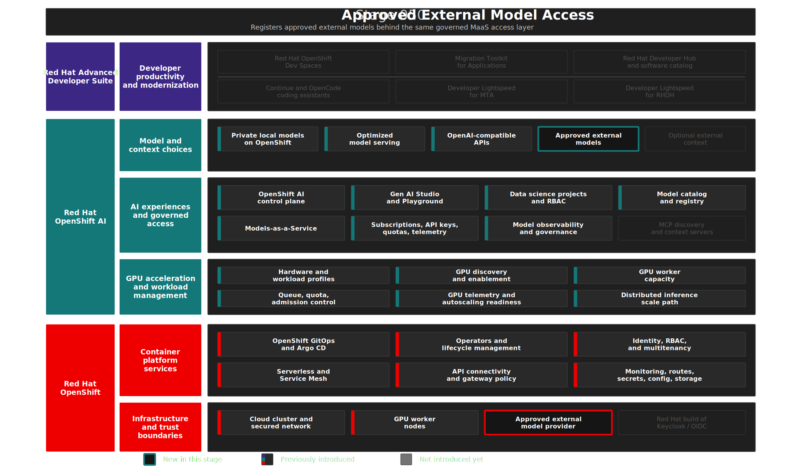

# Stage 050: Approved External Model Access

## Why This Matters

Stage 040 made model access governable. Stage 050 uses that same Models-as-a-Service (MaaS) operating model for a harder enterprise question: what happens when a team is allowed to use an external frontier model, but the organization still needs central control?

Most enterprises will not make one universal choice between private AI and external AI. Some workflows require local inference because source code, regulated data, or customer context must stay inside the OpenShift platform boundary. Other workflows might be approved for external models because the task benefits from a frontier provider, the data classification permits it, or the organization wants to compare behavior across model families.

The platform problem is not whether external models exist. The problem is unmanaged external access: copied API keys, unknown consumers, inconsistent rate limits, no usage trail, and developer tools configured outside platform policy. This stage shows a better pattern. Approved external models are registered as named MaaS assets, exposed through the same governed access layer as private models, and kept behind explicit subscription, API-key, token-limit, and gateway controls.

The boundary remains clear. MaaS centralizes access to the external provider, but it does not make the provider private. Prompts sent to these models are still processed outside the cluster and must be allowed by organizational policy.

## Architecture



## What This Stage Adds

Stage 050 adds approved external model choices to the governed MaaS model portfolio.

- OpenAI-backed `ExternalModel` resources for `gpt-4o` and `gpt-4o-mini`.
- Matching `MaaSModelRef` resources so the external models appear as MaaS-published model choices.
- A platform-owned `openai-api-key` Secret in the `maas` namespace, provisioned from `OPENAI_API_KEY` in `.env` when an approved key is available.
- An `external-models-access` `MaaSAuthPolicy` that grants access through the MaaS control layer rather than direct provider credentials.
- An `external-models-subscription` `MaaSSubscription` with token-rate limits for both approved external models.
- Generated gateway policies, authentication policies, and token-rate-limit policies from the MaaS controller path.
- Validation that external model registration, model references, authorization, subscriptions, and token-limit policies are active.
- An opt-in GuideLLM smoke test against `gpt-4o-mini` through MaaS for environments where external provider token spend is approved.
- A runtime MaaS API key creation path for the external subscription so the smoke test validates the same subscription boundary that a governed consumer would use.

The stage intentionally keeps external model inference optional. A missing `OPENAI_API_KEY` is a warning, not a stage failure, because the architecture can still register and govern the approved external model records without spending provider tokens.

## What To Notice In The Demo

Show Stage 050 as the continuation of the MaaS story, not as a separate external provider shortcut.

1. The external models are declared in GitOps as platform assets, not added manually to a developer workspace.
2. The provider credential is centralized in the platform namespace and injected by the gateway path; it is not copied into tools.
3. Consumers still receive MaaS-issued API keys and access through subscriptions.
4. Token limits and gateway policy apply to external models just as they do to private models.
5. Validation distinguishes registration from inference. Registration proves that MaaS knows about the external model choices. The opt-in smoke test proves that an approved key can complete an external call.
6. Observability changes at the provider boundary. MaaS can see gateway traffic, subscription use, rate limits, token limits, and request outcomes, but it cannot expose the provider's internal runtime signals.

This is the practical hybrid model portfolio pattern. Sensitive work can stay on the private vLLM and llm-d-backed models from Stage 030. Approved work can use external models through the same MaaS access model. Developer tools later in the workshop do not need to learn a different credential story for each choice.

## How Red Hat And Open Source Make It Work

Red Hat OpenShift AI provides the MaaS context used throughout this part of the demo. The Red Hat OpenShift AI 3.4 MaaS documentation describes model access through the OpenShift AI dashboard, MaaS-issued authentication tokens, tier-aware limits, OpenAI-compatible APIs, and rate-limit feedback. This stage follows that operating model while keeping the current Technology Preview posture visible.

Red Hat OpenShift provides the enterprise platform boundary: namespaces, RBAC, Secrets, routes, service networking, and identity. Red Hat OpenShift GitOps keeps the approved external model records and subscription resources reproducible while leaving real provider credentials outside Git.

Red Hat Connectivity Link, Gateway API, Kuadrant, and Authorino continue to provide the governed API path introduced in Stage 040. They keep authentication, authorization, token limits, and request routing in the platform layer instead of pushing those concerns into each developer tool.

The upstream Open Data Hub models-as-a-service project supplies the `ExternalModel`, `MaaSModelRef`, `MaaSAuthPolicy`, and `MaaSSubscription` behavior used here. That is a deliberate demo posture. It lets this workshop show approved external model registration now, aligned with the Red Hat OpenShift AI 3.4 MaaS direction, while the Red Hat-supported implementation matures. The deviation is tracked in [`BACKLOG.md`](../../BACKLOG.md) and operationally described in [`docs/OPERATIONS.md`](../../docs/OPERATIONS.md).

The Red Hat Developer multi-LLM MaaS article describes a more advanced pattern: one OpenAI-compatible endpoint that routes by the request body's `model` field. This demo currently uses model-specific MaaS paths because the highest-value gap for this workshop is governed access, credential control, and trust-boundary clarity. The single-endpoint body-routing pattern remains future work until it becomes necessary for the storyline and fits the target Red Hat support posture.

## Why This Is Worth Knowing

Enterprise AI platforms need choice without losing control.

Private models are essential when data classification, source-code sensitivity, or sovereignty requirements demand local processing. External models can still be useful when policy permits them, especially for comparison, broad capability coverage, or workloads where a frontier provider is the approved choice. A mature platform should make both paths explicit, governed, and easy to consume.

The reusable lesson is that MaaS is not only a private model publishing layer. It is a model access operating model. Platform teams can define which models are approved, how users subscribe, how keys are issued, how much traffic is allowed, what usage is visible, and where the data boundary changes.

For developer experience, this matters because AI tools work best when model choice is simple. Developers should not need to know where every model runs, which provider key to request, or how to wire each endpoint. They should receive an approved model catalog and a governed API path. Platform teams should retain enough control to manage cost, risk, and auditability.

## Red Hat Products Used

- **Red Hat OpenShift AI** provides the MaaS model access context and OpenAI-compatible consumption pattern.
- **Red Hat Connectivity Link** participates in the governed gateway path used for external model access.
- **Red Hat OpenShift GitOps** reconciles the approved external model resources, subscriptions, and policy desired state.
- **Red Hat OpenShift** provides namespaces, RBAC, Secrets, routes, identity integration, and service networking.
- **Red Hat OpenShift Dev Spaces** consumes approved model choices in Stage 070 through governed AI coding assistant configuration.
- **Migration Toolkit for Applications (MTA)** and **Red Hat Developer Lightspeed for MTA** can use governed model access in Stage 080 when an approved model is selected for modernization assistance.
- **Red Hat Developer Hub** can document the external model capability as a self-service platform option in Stage 090.

## Open Source Projects To Know

- [Open Data Hub models-as-a-service](https://github.com/opendatahub-io/models-as-a-service) provides the upstream MaaS APIs used for external model registration in this demo posture.
- [Gateway API](https://gateway-api.sigs.k8s.io/) provides Kubernetes-native routing primitives for the governed model access path.
- [Kuadrant](https://kuadrant.io/) provides gateway policy patterns for authentication, rate limiting, and protection.
- [Authorino](https://www.authorino.io/) provides external authorization for gateway-protected APIs.
- [GuideLLM](https://github.com/vllm-project/guidellm) provides the small opt-in smoke test used to confirm external inference through MaaS when provider token spend is approved.

## Trust Boundaries

Governed external access is not private model serving.

For private models from Stage 030, prompts and code stay inside the OpenShift platform boundary. For the external models in this stage, prompts are proxied through MaaS but processed by the external provider. That distinction must be visible to demo operators, developers, security teams, and anyone approving model use.

MaaS centralizes the controls around the external path: provider credentials, MaaS API keys, subscriptions, token limits, gateway policy, and usage telemetry. Those controls support governance and traceability, but they do not replace data classification, provider approval, legal review, or production security assessment.

No real provider key belongs in Git. The committed Secret is a placeholder. `deploy.sh` reads `OPENAI_API_KEY` from the operator's local `.env` file and patches the live `openai-api-key` Secret when an approved key is available. Validation never prints the provider key or the runtime MaaS key.

## Where This Fits In The Full Platform

| Earlier capability | How this stage uses it |
|--------------------|------------------------|
| Stage 010 platform foundation | Uses OpenShift identity, RBAC, namespaces, Secrets, and GitOps foundations |
| Stage 030 private model serving | Provides the private model baseline that external access must be distinguished from |
| Stage 040 governed MaaS | Reuses the model catalog, subscription, API-key, gateway policy, and telemetry pattern |

| Later capability | What this stage provides |
|------------------|--------------------------|
| Stage 060 MCP Context Integrations | Gives tool-context workflows a clear model boundary when external models are selected |
| Stage 070 Dev Spaces | Makes approved external models available to coding assistants when policy and credentials allow |
| Stage 080 MTA | Provides an approved external option for modernization assistance when private models are not the selected policy path |
| Stage 090 Developer Portal | Provides external model entities and trust-boundary guidance that can be documented for self-service |

## Deploy And Validate

Operational commands are kept here for workshop operators.

```bash
./stages/050-approved-external-model-access/deploy.sh
./stages/050-approved-external-model-access/validate.sh
```

By default, validation confirms registration and governance resources without spending provider tokens. To run a small external inference smoke test through the same MaaS and GuideLLM pattern used in Stage 040:

```bash
GUIDELLM_EXTERNAL_SMOKE_TEST=true \
GUIDELLM_REQUESTS=1 \
GUIDELLM_OUTPUT_TOKENS=32 \
./stages/050-approved-external-model-access/validate.sh
```

Use this only when `OPENAI_API_KEY` is approved for the demo environment. The opt-in smoke test creates a MaaS API key for `external-models-subscription` at runtime and does not print or store that key in Git. It disables GuideLLM's default `/health` backend probe for this external path because the MaaS route validates external access through the OpenAI-compatible inference API rather than a vLLM-style health endpoint.

Manifests: [`gitops/stages/050-approved-external-model-access/base/`](../../gitops/stages/050-approved-external-model-access/base/)

## References

- [Red Hat OpenShift AI 3.4: Use Models-as-a-Service](https://docs.redhat.com/en/documentation/red_hat_openshift_ai_self-managed/3.4/html/govern_llm_access_with_models-as-a-service/use-models-as-a-service_maas)
- [Red Hat: What is Model-as-a-Service?](https://www.redhat.com/en/topics/ai/what-is-models-as-a-service)
- [Red Hat Developer: Run Model-as-a-Service for multiple LLMs on OpenShift](https://developers.redhat.com/articles/2026/03/24/run-model-service-multiple-llms-openshift)
- [MaaS code assistant quickstart](https://docs.redhat.com/en/learn/ai-quickstarts/rh-maas-code-assistant)
- [Open Data Hub models-as-a-service](https://github.com/opendatahub-io/models-as-a-service)
- [Gateway API](https://gateway-api.sigs.k8s.io/)
- [Kuadrant](https://kuadrant.io/)
- [Authorino](https://www.authorino.io/)
- [GuideLLM](https://github.com/vllm-project/guidellm)
- [OpenAI API documentation](https://platform.openai.com/docs)

## Next Stage

[Stage 060: MCP Context Integrations](../060-mcp-context-integrations/README.md) adds tool-context integrations with their own data boundaries.
