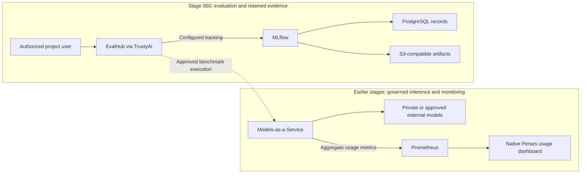

# Stage 050: Model Evaluation And Observability

## Why This Matters

Stage 040 establishes who may use a model. This stage asks whether it helps developers complete useful work, how reliably it responds, and how much governed usage that work consumes.

Evaluation and observability connect **task success, rework, latency and consumption**. Teams can use that evidence to choose models, investigate repeated retries and plan capacity. Red Hat's [What did AI cost you this quarter?](https://developers.redhat.com/articles/2026/09/18/what-did-ai-cost-you-this-quarter) frames showback as a way to improve the service teams receive. Here, usage is measured and costs remain **unpriced** until actual approved rates are supplied.

## Architecture

- **New in this stage:** native EvalHub and project-scoped evaluation access, alongside retained MLflow tracking and separate evaluation and tracking databases.
- **Already available:** governed model endpoints, GPU/model monitoring, native MaaS usage attribution and optional GenAI Studio tracing from earlier stages.
- **Value of the integration:** connect task results with operational evidence before changing a model or capacity allocation.

## Demo

Explore **Develop & train → Evaluations** for native evaluation discovery, and MLflow for experiment records and artifacts. Submit a governed run with `stages/050-model-evaluation/submit-evaluation.sh --model-name publishers/internal-models/models/qwen3-8-27b-int4 --num-examples <N>`; it appears in the Evaluations list and its metrics in the MLflow experiment. From the dashboard, **Start evaluation run** lists only `InferenceService` deployments of the selected project, so pick **Other (External endpoint)** with the MaaS gateway URL, the MaaS model id and the `evalhub-model-auth-maas` secret; the [troubleshooting entry](../../docs/TROUBLESHOOTING.md#start-evaluation-run-offers-no-model-to-choose) carries the exact values and benchmark parameters.

**Coding v1** is the native `coding-v1` collection: one benchmark, lighteval `lcb:codegeneration_v6` (LiveCodeBench v6, 1,055 competitive-programming problems, execution-scored `codegen_pass@1`, pass threshold 0.25). Three platform facts size a run on 3.5.1: lighteval samples 16 generations per problem in a single request, the evaluation sidecar allows 30 seconds per model request, and the lighteval adapter stops a benchmark after one hour. The helper therefore applies a code-only system prompt and a 512-token generation cap by default (Qwen answers then average about 300 tokens), and `--num-examples` bounds the job to the hour. A 16-sample request also needs the model to admit at least 16 concurrent sequences; both Stage 040 Qwen profiles do, and a request then takes about 14 seconds on Qwen 3.8 and 16 seconds on Qwen 3.6, so `--num-examples 120` fits the hour. Qwen 3.6 serves thinking mode by default and ignores the `/no_think` soft switch, so its answers stay empty under the generation cap until its server default matches the Qwen 3.8 profile (see [BACKLOG](../../BACKLOG.md) and the [troubleshooting entry](../../docs/TROUBLESHOOTING.md#evalhub-lighteval-job-completes-with-score-00-and-badgatewayerror)).

First results (2026-10-09, 16 samples per problem, code-only non-thinking answers, 512-token cap, logged as FINISHED MLflow runs and recorded on each model's registry version): Qwen 3.8 27B INT4 scored `codegen_pass@1` 0.242 on the first 120 LiveCodeBench v6 problems in 22 minutes; Qwen 3.6 27B FP8 scored 0.21 on the first 100 in 41 minutes (its 16-sample requests take about 25 seconds, so 100 problems is the hour-safe bound). Both sit below the suite's 0.25 threshold; the Evaluations page compares the two runs side by side.

Record a completed job on the model's registry entry with `stages/050-model-evaluation/record-evaluation.sh --job <job id> --model-version <version id>`: the dashboard renders a model version's custom properties, so each benchmark metric, the job, the experiment and the MLflow reference land there (`evalhub.*` keys). The registry API also accepts metric artifacts and experiment runs, but the 3.5 dashboard does not render them.

**SWE-bench** has no working built-in path in 3.5.1: the Inspect AI provider lists `inspect/swe-bench`, but its adapter image ships without the `swe_bench` extra (the task asserts on start) and offers only the `local` sandbox on Kubernetes, so the per-instance repository environments cannot run. The `swebench/` directory stages the community adapter (`evalhub-provider-swebench` ConfigMap in the operator namespace, documented custom-provider procedure), the tenant Role its grading Jobs need, the `swebench-agent` ServiceAccount and ConfigMap for patch generation (mini-swe-agent inside each SWE-bench instance image, talking to the MaaS gateway with the evaluation key), and the `evalhub-s3-test-data` Secret for the documented S3 test-data mount. `stages/050-model-evaluation/swebench-run.sh agents|merge|submit` drives a run. Two steps stay with a human reviewer before it can run: add `swebench` to the EvalHub CR `providers` list (it mounts a community image into the evaluation service), and bind the `anyuid` SCC to `demo-sandbox/evalhub-evalhub-job` and `demo-sandbox/swebench-agent` (the instance images and the grading init container run as root). The instance images come from Docker Hub, which rate-limits anonymous pulls; a pull secret or a mirror in the internal registry is needed beyond a handful of instances.

As a platform administrator, open **Observe & monitor → Dashboard → Usage**. Filter consumption by user, subscription and model, then inspect or export the native usage table.

## What This Stage Adds

This stage provides the evidence foundation for model and developer-workflow decisions:

- **EvalHub** coordinates evaluations through compatible native providers and collections.
- **TrustyAI** manages the native evaluation service and tenant integration.

The model catalog's **Safety and security insights** tab is an Eval Hub dashboard extension: the dashboard asks the Eval Hub BFF for the catalog's pre-computed safety data with the catalog namespace (`rhoai-model-registries`) as the request namespace, and that BFF applies the documented tenant authorization (`get` on the virtual resource `evaluations.trustyai.opendatahub.io` there) before proxying. The `tenant/catalog-insights-*` manifests grant exactly that read to `rhods-admins` and `rhoai-developers`; the namespace is not an Eval Hub tenant and gets no job, collection or provider permission.
- **MLflow** retains experiments, metrics and artifacts for later review.
- **Governed model authentication for evaluations.** Evaluation jobs reach models through the MaaS gateway with the `evaluation-sandbox` subscription (Stage 040). The `provision-evalhub-model-auth` Sync hook mints that key as the owning ServiceAccount and stores it in the tenant Secret `evalhub-model-auth-maas` under the documented `api-key` key; jobs reference it through `model.auth.secret_ref`, and the evaluation sidecar resolves it so adapters never see the credential.
- **`submit-evaluation.sh`** submits, follows and inspects evaluation jobs through the documented REST API with MLflow experiment tracking (`agentic-coding-qualification` by default).
- **Project isolation** scopes evaluation and tracking access to authorized OpenShift users.
- **A combined quality and usage view** reuses Stage 040 showback without moving gateway or monitoring ownership into Stage 050.

EvalHub and MLflow are generally available in OpenShift AI 3.5. The evaluation dashboard, MaaS observability and GenAI Studio tracing retain their feature-specific Technology Preview boundaries.

## What To Notice And Why It Matters

A benchmark result applies to its task, dataset and model configuration. For a coding agent, a useful outcome is a repository change that passes independent tests. Retaining those results alongside latency, retries and consumption helps distinguish a cheaper response from a more effective development workflow.

Native MaaS counters show aggregate total-token and call usage. They do not provide the input/output token split or internal tool trajectory, and missing history stays unknown. Showback helps identify questions to investigate; it does not turn usage into an invoice.

**Future engineering planning:** [ConfigIQ](https://configiq.xyz/) is a public [Red Hat Performance Engineering project](https://github.com/redhat-performance/configiq) for inference sizing, GPU comparison and cost modeling. Engineers can explore how model size, context, quantization, batching and workload shape affect memory and capacity tradeoffs. It is a future planning reference for this workshop: compare its estimates with measured behavior and actual local rates before making a sizing decision.

## How Red Hat And Open Source Make It Work

OpenShift AI's native TrustyAI component manages EvalHub, and its MLflow Operator manages the shared tracking service. EvalHub coordinates provider-backed evaluation work; PostgreSQL and OpenShift Data Foundation retain records and artifacts. GitOps manages customer configuration while the operators manage service workloads.

MaaS, Red Hat Connectivity Link, Prometheus and Perses provide the existing aggregate usage view. GenAI Studio offers an opt-in session tracing capability with an embedded MLflow viewer, complementing aggregate metrics; this is not automatic capture of every MaaS, MCP or agent interaction.

## Trust Boundaries

Evaluation uses existing OpenShift identities, project permissions and governed model access. Approved external models still process requests outside the cluster. Records, artifacts and identity-bearing usage exports require appropriate access and retention controls. Session traces can contain prompts, code and tool outputs: agree the content, redaction and storage policy before opting in. Credentials remain outside Git; showback is internal evidence, not billing-grade metering.

## Red Hat Products Used

- **[Red Hat OpenShift AI](https://www.redhat.com/en/technologies/cloud-computing/openshift/openshift-ai)** supplies EvalHub, TrustyAI, MLflow and their dashboard integration.
- **Red Hat OpenShift Container Platform and Cluster Observability Operator** provide the monitoring platform reused for operational visibility.
- **Red Hat OpenShift Data Foundation** provides S3-compatible artifact storage.
- **Red Hat OpenShift GitOps** keeps platform configuration reproducible.

## Open Source Projects To Know

EvalHub coordinates evaluations; MLflow organizes experiment evidence; PostgreSQL stores durable records. Prometheus and Perses provide aggregate usage queries and dashboards. ConfigIQ is a future sizing reference, separate from these deployed services.

## Deploy And Validate

The evaluation foundation uses the platform, serving and governed-access stages; it does not deploy another model or allocate another GPU. An actual evaluation requires its selected endpoint to be available.

Use the [operations guide](../../docs/OPERATIONS.md) for deployment and validation. The [Stage 050 design and acceptance record](../../docs/migration/050-model-evaluation-plan.md) carries the benchmark, coding-pilot and trace-verification prerequisites. Validation separates service readiness from completed results and retained MLflow evidence.

## References

- [What did AI cost you this quarter?](https://developers.redhat.com/articles/2026/09/18/what-did-ai-cost-you-this-quarter) — business context for attributed usage and service improvement.
- [Evaluating LLMs with EvalHub](https://docs.redhat.com/en/documentation/red_hat_openshift_ai_self-managed/3.5/html/evaluating_ai_systems/evaluating-llms-with-evalhub_evaluate)
- [Working with MLflow](https://docs.redhat.com/en/documentation/red_hat_openshift_ai_self-managed/3.5/html/working_with_mlflow/index)
- [MaaS observability and internal showback](https://docs.redhat.com/en/documentation/red_hat_openshift_ai_self-managed/3.5/html/govern_llm_access_with_models-as-a-service/deploy-and-manage-models-as-a-service)
- [Feature-specific Technology Preview boundaries](https://docs.redhat.com/en/documentation/red_hat_openshift_ai_self-managed/3.5/html/release_notes/technology-preview-features_relnotes)
- [ConfigIQ public project](https://github.com/redhat-performance/configiq) — future inference-sizing and GPU/cost comparisons.
- [EvalHub workflows and configuration](../../docs/migration/050-evalhub-completion.md)

## Next Stage

[Stage 060: Agent Runtime and AgentOps](../060-agent-runtime-and-agentops/README.md) introduces the planned isolated execution layer; Stage 070 adds developer workspaces, portal and delivery tooling.
