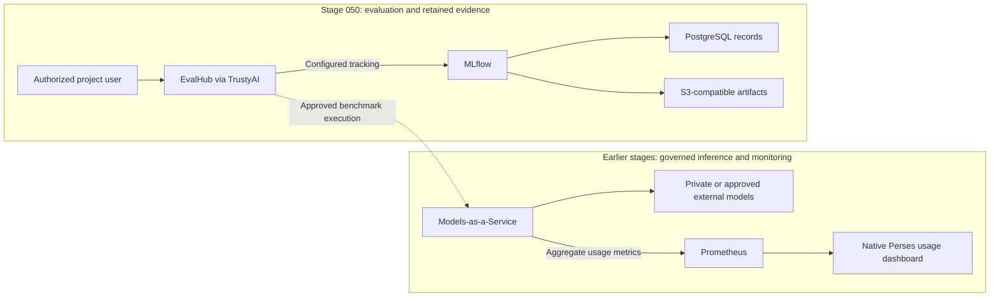

# Stage 050: Model Evaluation And Observability

## Why This Matters

Stage 040 establishes who may use a model. This stage asks whether it helps developers complete useful work, how reliably it responds, and how much governed usage that work consumes.

Evaluation and observability connect **task success, rework, latency and consumption**. Teams can use that evidence to choose models, investigate repeated retries and plan capacity. Red Hat's [What did AI cost you this quarter?](https://developers.redhat.com/articles/2026/09/18/what-did-ai-cost-you-this-quarter) frames showback as a way to improve the service teams receive. Here, usage is measured and costs remain **unpriced** until actual approved rates are supplied.

## Architecture

- **New in this stage:** native EvalHub and project-scoped evaluation access, alongside retained MLflow tracking and separate evaluation and tracking databases.
- **Already available:** governed model endpoints, GPU/model monitoring, native MaaS usage attribution and optional GenAI Studio tracing from earlier stages.
- **Value of the integration:** connect task results with operational evidence before changing a model or capacity allocation.

## Demo

Explore **Develop & train → Evaluations** for native evaluation discovery, and MLflow for experiment records and artifacts. The service foundation is ready; the first benchmark and coding-agent pilot results remain pending.

As a platform administrator, open **Observe & monitor → Dashboard → Usage**. Filter consumption by user, subscription and model, then inspect or export the native usage table.

## What This Stage Adds

This stage provides the evidence foundation for model and developer-workflow decisions:

- **EvalHub** coordinates evaluations through compatible native providers and collections.
- **TrustyAI** manages the native evaluation service and tenant integration.
- **MLflow** retains experiments, metrics and artifacts for later review.
- **Project isolation** scopes evaluation and tracking access to authorized OpenShift users.
- **A combined quality and usage view** reuses Stage 040 showback without moving gateway or monitoring ownership into Stage 050.

EvalHub and MLflow are generally available in OpenShift AI 3.5. The evaluation dashboard, MaaS observability and GenAI Studio tracing retain their feature-specific Technology Preview boundaries.

## What To Notice And Why It Matters

A benchmark result applies to its task, dataset and model configuration. For a coding agent, a useful outcome is a repository change that passes independent tests. Retaining those results alongside latency, retries and consumption helps distinguish a cheaper response from a more effective development workflow.

Native MaaS counters show aggregate total-token and call usage. They do not provide the input/output token split or internal tool trajectory, and missing history stays unknown. Showback helps identify questions to investigate; it does not turn usage into an invoice.

**Future engineering planning:** [ConfigIQ](https://configiq.xyz/) is a public [Red Hat Performance Engineering project](https://github.com/redhat-performance/configiq) for inference sizing, GPU comparison and cost modeling. Engineers can explore how model size, context, quantization, batching and workload shape affect memory and capacity tradeoffs. It is a future planning reference for this workshop: compare its estimates with measured behavior and actual local rates before making a sizing decision.

## How Red Hat And Open Source Make It Work

OpenShift AI's native TrustyAI component manages EvalHub, and its MLflow Operator manages the shared tracking service. EvalHub coordinates provider-backed evaluation work; PostgreSQL and OpenShift Data Foundation retain records and artifacts. GitOps manages customer configuration while the operators manage service workloads.

MaaS, Red Hat Connectivity Link, Prometheus and Perses provide the existing aggregate usage view. GenAI Studio offers an opt-in session tracing capability with an embedded MLflow viewer, complementing aggregate metrics; this is not automatic capture of every MaaS, MCP or agent interaction.

## Trust Boundaries

Evaluation uses existing OpenShift identities, project permissions and governed model access. Approved external models still process requests outside the cluster. Records, artifacts and identity-bearing usage exports require appropriate access and retention controls. Session traces can contain prompts, code and tool outputs: agree the content, redaction and storage policy before opting in. Credentials remain outside Git; showback is internal evidence, not billing-grade metering.

## Red Hat Products Used

- **[Red Hat OpenShift AI](https://www.redhat.com/en/technologies/cloud-computing/openshift/openshift-ai)** supplies EvalHub, TrustyAI, MLflow and their dashboard integration.
- **Red Hat OpenShift Container Platform and Cluster Observability Operator** provide the monitoring platform reused for operational visibility.
- **Red Hat OpenShift Data Foundation** provides S3-compatible artifact storage.
- **Red Hat OpenShift GitOps** keeps platform configuration reproducible.

## Open Source Projects To Know

EvalHub coordinates evaluations; MLflow organizes experiment evidence; PostgreSQL stores durable records. Prometheus and Perses provide aggregate usage queries and dashboards. ConfigIQ is a future sizing reference, separate from these deployed services.

## Deploy And Validate

The evaluation foundation uses the platform, serving and governed-access stages; it does not deploy another model or allocate another GPU. An actual evaluation requires its selected endpoint to be available.

Use the [operations guide](../../docs/OPERATIONS.md) for deployment and validation. The [Stage 050 design and acceptance record](../../docs/migration/050-model-evaluation-plan.md) carries the benchmark, coding-pilot and trace-verification prerequisites. Validation separates service readiness from completed results and retained MLflow evidence.

## References

- [What did AI cost you this quarter?](https://developers.redhat.com/articles/2026/09/18/what-did-ai-cost-you-this-quarter) — business context for attributed usage and service improvement.
- [Evaluating LLMs with EvalHub](https://docs.redhat.com/en/documentation/red_hat_openshift_ai_self-managed/3.5/html/evaluating_ai_systems/evaluating-llms-with-evalhub_evaluate)
- [Working with MLflow](https://docs.redhat.com/en/documentation/red_hat_openshift_ai_self-managed/3.5/html/working_with_mlflow/index)
- [MaaS observability and internal showback](https://docs.redhat.com/en/documentation/red_hat_openshift_ai_self-managed/3.5/html/govern_llm_access_with_models-as-a-service/deploy-and-manage-models-as-a-service)
- [Feature-specific Technology Preview boundaries](https://docs.redhat.com/en/documentation/red_hat_openshift_ai_self-managed/3.5/html/release_notes/technology-preview-features_relnotes)
- [ConfigIQ public project](https://github.com/redhat-performance/configiq) — future inference-sizing and GPU/cost comparisons.

## Next Stage

[Stage 060: Advanced Application Platform](../060-advanced-app-platform/README.md) supplies the developer portal, workspaces and delivery tooling that consume governed AI and produce the real workflow evidence this stage will help assess.
