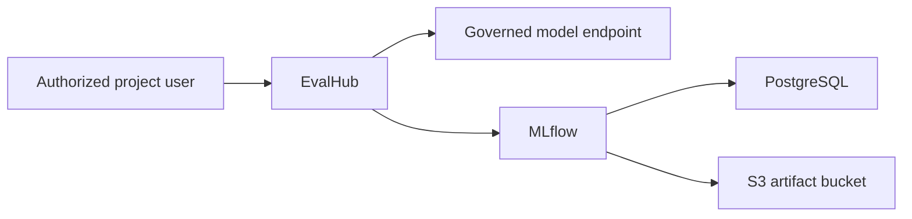

# Stage 050: Model Evaluation

## Why This Matters

Make model selection measurable. This stage adds an evaluation service and durable experiment tracking to the governed model-serving platform. Teams can compare model behavior against defined tasks, retain results and artifacts, and review evidence before changing a model used by developers.

## Architecture



The existing RHOAI operator manages the MLflow and TrustyAI components. Stage 050 enables their delegated fields on the shared DataScienceCluster rather than creating another cluster configuration. MLflow runs in `redhat-ods-applications`; EvalHub has its own `evalhub` namespace. Operators own their generated service workloads. Separate PostgreSQL instances store tracking and evaluation data; the platform's NooBaa service supplies the artifact bucket.

The database design is a durable demo setup: single-instance PostgreSQL, retained PVCs, namespace-local plaintext database connections and restricted network access. It is not a highly available production database design. Provider identity databases are not reused.

## What This Stage Adds

- **MLflow** provides shared experiment tracking with PostgreSQL records and S3-compatible artifacts.
- **EvalHub** coordinates evaluations through its built-in providers and collections.
- **TrustyAI** supplies the native EvalHub operator and tenant authorization integration.
- **Project access** separates the evaluation server from the `demo-sandbox` tenant where authorized users work.

The RHOAI 3.5 support matrix identifies MLflow 3.14 and TrustyAI 1.37 as generally available, and EvalHub 0.3 as Technology Preview. An evaluation result is evidence for the selected task, dataset and model configuration; it is not a universal quality or safety guarantee.

## What To Notice And Why It Matters

Readiness proves that services are available; a completed evaluation proves behavior for a specified model, task and dataset. Retaining both tracking records and artifacts makes that evidence reviewable later.

## How Red Hat And Open Source Make It Work

OpenShift AI supplies native MLflow and TrustyAI operators. EvalHub coordinates provider-backed evaluation jobs, while MLflow records experiments and NooBaa stores their artifacts. GitOps owns the service configuration and leaves generated workloads to the operators.

## Trust Boundaries

Use existing OpenShift identities and tenant permissions. Evaluation requests cross from the tenant to governed model endpoints; tracking records and artifacts remain in the platform database and S3 storage. Runtime secrets are local cluster inputs, not Git content. Provider identity databases are not reused.

## Red Hat Products Used

- **Red Hat OpenShift AI 3.5** supplies MLflow, TrustyAI and EvalHub integration.
- **Red Hat OpenShift Data Foundation** provides S3-compatible artifact storage.
- **Red Hat OpenShift GitOps** reconciles the stage configuration.

## Open Source Projects To Know

MLflow supplies experiment tracking; EvalHub coordinates evaluations; PostgreSQL stores durable records. The native product operators manage their service workloads.

## Deploy And Validate

Complete Stage 010, Stage 030 and Stage 040. KServe RawDeployment is an EvalHub prerequisite; the evaluation stage does not deploy another model or GPU workload. Configure the repository environment guard and the published source revision before deployment. Use existing OpenShift identities and project permissions; no new identity provider is required.

```bash
./stages/050-model-evaluation/deploy.sh
./stages/050-model-evaluation/validate.sh
```

Deployment checks its prerequisites before changing the cluster, enables the native components, configures database inputs and waits for MLflow before creating EvalHub. Validation separates service readiness from authenticated API access and completed evaluation evidence. Without recorded evaluation/run identifiers it exits with evaluation evidence pending, even when API checks pass.

For a useful evaluation, select a bounded task, dataset and already-served model endpoint; retain the resulting job identifier and inspect its result and MLflow evidence. Starting one benchmark against 1–5 samples is an explicit action using the native EvalHub API/SDK and an authorized tenant session. Readiness alone does not prove a completed benchmark, durable result persistence or access through the dashboard. Dashboard discoverability must be checked separately with a real user session.

Inspect a completed evaluation without creating another job:

```bash
./stages/050-model-evaluation/validate.sh --job-id <recorded-job-id> --mlflow-run-id <recorded-32-hex-run-id>
```

The check requires completed results, a native benchmark result whose returned MLflow run ID matches the supplied run ID, and finished tracking records with metrics. Missing correlation remains an acceptance gap.

## References

- [RHOAI 3.5 supported configurations and release posture](https://access.redhat.com/articles/rhoai-supported-configs-3.x)
- [Installing MLflow](https://docs.redhat.com/en/documentation/red_hat_openshift_ai_self-managed/3.5/html/working_with_mlflow/installing-mlflow_mlflow)
- [Evaluating LLMs with EvalHub](https://docs.redhat.com/en/documentation/red_hat_openshift_ai_self-managed/3.5/html/evaluating_ai_systems/evaluating-llms-with-evalhub_evaluate)

## Next Stage

[Stage 060: Advanced Application Platform](../060-advanced-app-platform/README.md) supplies the developer portal, workspaces and delivery tooling that consume the governed AI platform.
