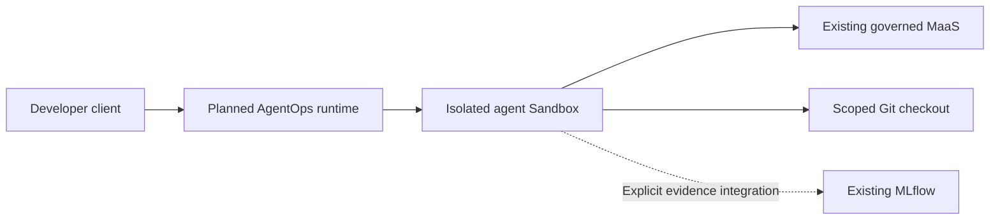

# Stage 060: Agent Runtime And AgentOps

## Why This Matters

Governed model access does not isolate an agent that can edit files, run tools and retain memory. This stage introduces a separate execution boundary so platform teams can control an agent’s identity, access, lifetime and evidence while developers keep their preferred editor.

## Architecture

The proposed runtime uses a shared OpenShell control plane and isolated agent Sandboxes. A persistent logical agent instance survives IDE restarts; each task uses its own checkout and scoped credentials. Stage 070 supplies the developer portal, workspaces and SCM integration.

## What This Stage Adds

**Planned:** authenticated agent hosting, policy-controlled tool execution, durable state, bounded background work and explicit telemetry integration. OpenCode and Hermes workflows in Stages 120 and 130 consume this platform.

Agent Catalog remains Stage 030 discovery, MaaS and existing MCP services remain Stage 040, and evaluation/tracking remain Stage 050. Catalog registration does not host an agent, and gateway telemetry does not automatically capture its internal trajectory.

## What To Notice And Why It Matters

Separate an agent’s durable identity from its running process. Stopping an IDE can preserve approved bounded background work; deleting a workspace requires an explicit result and credential retention policy. Independent tests assess the resulting code outside the agent’s writable boundary.

## How Red Hat And Open Source Make It Work

RHOAI 3.5 Agent Catalog and OpenShell integration are Developer Preview. The proposal targets a pinned upstream OpenShell 0.1 release with Kubernetes isolation and existing OpenShift identity and MaaS access. Hermes hosting is a project integration, and its current local fork requires qualification.

## Trust Boundaries

Runtime implementation must prove authenticated tenant isolation, nonroot execution, filesystem and network controls, scoped credentials and real cancellation. No anonymous tool API or automatic full-content tracing is implied.

## Red Hat Products Used

Existing OpenShift and OpenShift AI supply identity, governed inference, discovery and evidence services. The runtime and its exact support boundaries remain under design review.

## Open Source Projects To Know

OpenShell provides runtime controls; OpenCode and Hermes supply agent workflows. Their selected image, protocol and sandbox compatibility must be verified before use.

## Deploy And Validate

This stage is **planned and not deployed**. It has no deployment script, Argo CD Application or runtime manifests. Validation reports pending rather than installed readiness. See the [runtime design proposal](../../docs/migration/060-agent-hosting-and-scm-plan.md) for implementation gates.

## References

- [RHOAI 3.5 Developer Preview features](https://docs.redhat.com/en/documentation/red_hat_openshift_ai_self-managed/3.5/html/release_notes/developer-preview-features_relnotes)
- [NVIDIA OpenShell](https://github.com/NVIDIA/OpenShell)
- [OpenCode server](https://opencode.ai/docs/server/)
- [Hermes agent API](https://hermes-agent.nousresearch.com/docs/user-guide/features/api-server)

## Next Stage

[Stage 070: Advanced Application Platform](../070-advanced-app-platform/README.md) provides developer workspaces, portal, SCM and delivery services that integrate with the agent runtime.
