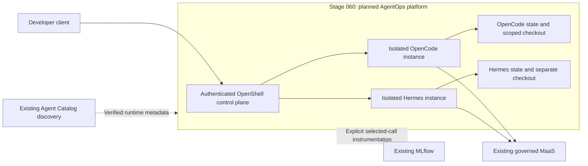

# Stage 060: Agent Runtime And AgentOps

## Why This Matters

An AI coding agent does more than answer a prompt: it edits files, runs programs and calls services. Platform teams need a way to let developers bring useful agents without giving those agents unrestricted access to code, credentials or infrastructure.

AgentOps provides that operating boundary: controlled execution, identity, policy, lifecycle and evidence. Red Hat's [kernel-level agent security story](https://www.redhat.com/en/blog/beyond-container-boundaries-kernel-level-agent-security-red-hat-openshift-ai-35) explains why runtime enforcement complements model guardrails. Here, a standalone agent can retain its work while the developer closes the IDE, with access and background execution governed by the platform.

## Architecture

- **New in this stage:** planned standalone agent hosting, policy-controlled execution and persistent lifecycle outside the IDE.
- **Already available:** model/agent discovery, governed model access, existing MCP services, evaluation and tracking.
- **Value of the integration:** a repeatable execution boundary for both OpenCode and Hermes, with project-scoped evidence and consumption.

## What This Stage Adds

The planned platform will provide:

- **Bring-your-own agents:** reproducible images and toolchains for standalone OpenCode and Hermes.
- **Controlled access:** runtime filesystem, process and network policies, with authenticated changes and approvals.
- **Persistent work:** logical agent state survives IDE restarts; approved background jobs remain bounded and cancellable.
- **Project isolation:** separate credentials, state and Git checkouts, with reviewed changes exchanged through Git.
- **Operational evidence:** security audit events and explicit selected-call MLflow tracing alongside existing MaaS usage.

OpenCode is the first proof slice; Hermes is also required before this stage is complete.

## What To Notice And Why It Matters

A policy written in a prompt is different from a denied operation enforced by the runtime. Demonstrate both allowed and denied actions, and connect them to their audit evidence. A stopped IDE is also different from a stopped agent: background work needs an explicit lifetime and cancellation policy.

Agent discovery does not host an agent, and aggregate model usage does not reveal every tool or planning step. Keep those responsibilities distinct when assessing safety and task success.

## How Red Hat And Open Source Make It Work

OpenShift supplies the execution and identity platform. NVIDIA OpenShell supplies sandbox controls and policy interfaces, while OpenCode and Hermes supply the agent workflows. Existing Models-as-a-Service governs inference, and existing MLflow retains explicitly instrumented evidence.

RHOAI 3.5 Agent Catalog and OpenShell integration are Developer Preview. The deployed gateway runs a pinned upstream OpenShell development build (0.1.3-dev, the merge commit of upstream PR 4150), not a tagged release; that choice does not make the project integration a production-supported RHOAI feature. Broader semantic guardrails, red-team campaigns and VM isolation are separate extensions.

## Trust Boundaries

The runtime must restrict each agent to its approved checkout, tools and service access. Validation must prove that an agent cannot approve its own permission expansion or read provider credentials from its runtime context. Independent verification remains outside its writable boundary. Traces require scoped access and redaction; no automatic capture of every MaaS, MCP or internal agent interaction is implied.

## Red Hat Products Used

- **Red Hat OpenShift Container Platform** provides the execution, identity and network foundations.
- **Red Hat OpenShift AI** supplies existing catalog discovery, governed inference, evaluation and tracking.
- **Red Hat OpenShift GitOps** will reconcile the reviewed runtime configuration.

## Open Source Projects To Know

OpenShell controls sandbox execution and access. OpenCode and Hermes run the development workflows; MLflow records selected instrumented evidence. These components have separate version and support boundaries.

## Deploy And Validate

Enable the native MCP Lifecycle Operator prerequisites with `bash ./stages/060-agent-runtime-and-agentops/deploy-mcp-platform.sh "$GIT_REPO_BRANCH"`; validate with `bash ./stages/060-agent-runtime-and-agentops/validate-mcp-platform.sh`. This separate Technology Preview component exposes the native MCPServer API through the RHOAI operator.

The catalog's **OpenShift MCP Server 0.4** uses a pinned Red Hat image and a project-scoped native MCPServer. Its deployment policy requires each caller's OpenShift token, retains the catalog's read-only core/config tools and denies Secret resources. The approved boundary is HTTPS at the public entrypoint and HTTP inside the cluster, including forwarded tokens; the operator's generated ingress policy permits cluster peers. Registry metadata is registered through the native MLflow API because this RHOAI 3.5.1 catalog does not include the adjacent Register action. A callable HTTPS endpoint is advertised only after runtime and caller-authorization checks pass. The existing MCP service remains available until its replacement and consumers are verified.

For a protected Gen AI Studio connection, the native workflow is **Playground → MCP**, enter your own session access token, choose **Authorize**, then **View tools**. No shared token is stored in the Registry or server configuration. The new catalog connection has not yet been added to Studio.

The catalog server is registered with native version **0.4.0** (catalog version **0.4**) and deployed with 13 read-only core/config tools. Browse it under **AI hub → MCP servers → Registry** or **Deployments** in the demonstration project. The verified HTTPS endpoint requires your OpenShift token. Its Studio discovery connection and governed MCP entrypoint are still pending; the existing Studio server remains available.

For console discovery only, deploy the separate `agent-console` component with `bash ./stages/060-agent-runtime-and-agentops/deploy-console.sh "$GIT_REPO_BRANCH"`, then run `bash ./stages/060-agent-runtime-and-agentops/validate-console.sh`. It enables the Developer Preview AgentOps view and permits each persona to read Services and Sandboxes in its own workspace. Launch and lifecycle remain in the authenticated OpenShell CLI. The generic console creation wizard is not qualified and receives no Sandbox creation permission from this component.

The authenticated control plane and native sandbox controller are available. A workspace owner can start an OpenCode sandbox with no model provider, reach its HTTP and event-stream endpoints through the authenticated gateway, and stop, restart and delete it; file, interface-binding and network-egress attempts outside the policy are denied, and another owner's workspace is refused. Model-backed OpenCode tasks are not yet qualified. Standalone agent qualification is still in progress; completing this stage requires OpenCode, Hermes, catalog discovery and selected-call tracing. The [implementation plan](../../docs/migration/060-agent-runtime-and-agentops-plan.md) defines the version, isolation, lifecycle, discovery and evidence gates.

## References

- [Red Hat: kernel-level agent security](https://www.redhat.com/en/blog/beyond-container-boundaries-kernel-level-agent-security-red-hat-openshift-ai-35)
- [RHOAI 3.5 Developer Preview features](https://docs.redhat.com/en/documentation/red_hat_openshift_ai_self-managed/3.5/html/release_notes/developer-preview-features_relnotes)
- [NVIDIA OpenShell](https://github.com/NVIDIA/OpenShell)
- [OpenCode server](https://opencode.ai/docs/server/)
- [Hermes agent API](https://hermes-agent.nousresearch.com/docs/user-guide/features/api-server)

## Next Stage

[Stage 070: Advanced Application Platform](../070-advanced-app-platform/README.md) will provide developer workspaces, portal and delivery services, including planned Gitea integration. The AgentOps runtime can be qualified independently, then integrated with these developer clients.
