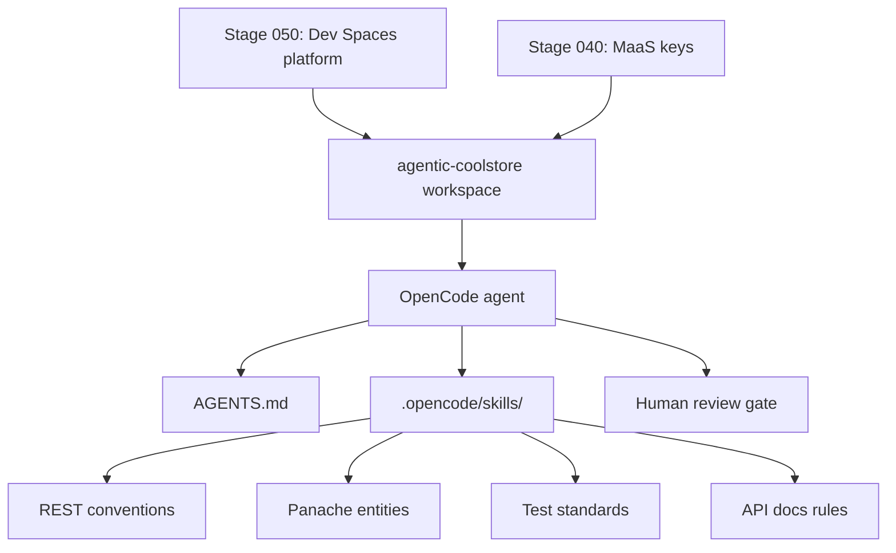

# Stage 060: Agentic Development

> **Status:** deployable. This stage provisions the `agentic-coolstore`
> DevWorkspace: coolstore-inventory-service checked out on the
> `demo/agentic-skills` branch (AGENTS.md + `.opencode/skills` Quarkus
> standards, authored and pushed), with agent-scale resources for OpenCode
> multi-step runs. It consumes the Stage 050 Dev Spaces platform and the
> Stage 040 MaaS keys. Flip the workspace checkout to `main` once the skills
> branch merges.

## Why This Matters

Stage 050 ends with an honest observation: one-shot prompting produces
plausible code that ignores project standards, misses multi-file consistency,
and forgets hidden requirements. Enterprises do not fix that by writing
longer prompts — they fix it by teaching the agent how the team builds
software.

This stage shows that path: OpenCode running in the same governed workspace,
now with `AGENTS.md` (project identity, build and test commands) and a set of
reusable skills that encode how this team builds Quarkus applications —
REST resource conventions, Panache entity patterns, test standards, and
OpenAPI documentation rules. The same task that produced a mediocre one-shot
result in Stage 050 is repeated here with the agent following the skills.

The bigger message for platform teams: internal development guidelines stop
being wiki pages that nobody reads and become living, versioned assets that
agents apply on every change — and that humans improve through review
feedback.

## Architecture



The `agentic-coolstore` DevWorkspace clones the external repository
`adnan-drina/coolstore-inventory-service` on branch `demo/agentic-skills`.
Skills content lives in that external repository and is not verifiable from
this repo — the validate script uses `git ls-remote` to confirm the branch
exists upstream.

## What This Stage Adds

This stage adds skill-guided agentic development to the governed workspace pattern established in Stage 050.

- A dedicated `agentic-coolstore` DevWorkspace with 6Gi memory (vs 4Gi for standard workspaces) for OpenCode multi-step agent runs.
- `AGENTS.md` in the workspace repository: project map, build/test commands, and pointers to reusable skills.
- Reusable Quarkus skills (`.opencode/skills/`): REST endpoint conventions, Panache entity patterns, project test standards, API documentation rules.
- The workspace is `started: false` by default — the developer starts it at runtime when entering the agentic flow.
- A comparison exercise: the Stage 050 one-shot task re-run under skills guidance.
- A skill-improvement exercise: review feedback turned into a skill update.

## What To Notice And Why It Matters

- **Standards become executable.** AGENTS.md and skills files are versioned alongside code. The agent reads them on every task, so internal conventions are applied consistently without longer prompts.
- **Same governance, different workflow.** OpenCode uses the same MaaS keys, token quotas, and model endpoints as Continue in Stage 050. The platform boundary is unchanged.
- **Agent-scale resources.** The workspace allocates 6Gi memory to support OpenCode holding multi-file context during iterative agent runs.
- **Skills are a pull request away from improving.** When review feedback recurs, it becomes a skill update — the guideline is now enforced on every future run.
- **No separate exercise file.** The demo is the README narrative (Demo Script below); the agentic workflow happens live in the workspace terminal.

## How Red Hat And Open Source Make It Work

Red Hat OpenShift Dev Spaces provides the isolated workspace with elevated resources. Red Hat OpenShift AI MaaS provides the governed model endpoint. OpenCode is the terminal-based AI coding agent that reads `AGENTS.md` and skill files to steer its behavior. The DevWorkspace operator manages workspace lifecycle and Git checkout. OpenShift identity, RBAC, and namespace isolation keep the agentic workflow scoped to the developer's context.

## Trust Boundaries

The agent operates within the same trust boundary as Stage 050: prompts to local models stay inside OpenShift, external model prompts are governed by MaaS but processed by the provider. The agent has workspace-scoped filesystem access only — it cannot escalate to cluster resources or other namespaces. Human review gates remain mandatory; the agent produces changes, humans approve them.

## Red Hat Products Used

- **[Red Hat OpenShift Dev Spaces](https://www.redhat.com/en/technologies/cloud-computing/openshift/dev-spaces)** provides the managed workspace with agent-scale resources.
- **[Red Hat OpenShift AI](https://www.redhat.com/en/technologies/cloud-computing/openshift/openshift-ai)** provides governed model endpoints through MaaS.
- **[Red Hat OpenShift](https://www.redhat.com/en/technologies/cloud-computing/openshift)** provides identity, namespace isolation, and runtime controls.

## Open Source Projects To Know

- [OpenCode](https://opencode.ai/) is the terminal-based AI coding agent that reads AGENTS.md and skill files.
- [Eclipse Che](https://www.eclipse.org/che/) is the upstream cloud development environment behind Dev Spaces.
- [DevWorkspace Operator](https://github.com/devfile/devworkspace-operator) provides Kubernetes-native workspace orchestration and Git checkout.

## Deploy And Validate

```bash
./stages/060-ai-agentic-development/deploy.sh
./stages/060-ai-agentic-development/validate.sh
```

Manifests: [`gitops/stages/060-ai-agentic-development/base/`](../../gitops/stages/060-ai-agentic-development/base/)

The validate script checks that the `demo/agentic-skills` branch exists upstream via `git ls-remote`. Note: the manifest sets `revision: demo/agentic-skills` (the full branch name including the path separator).

## References

| Resource | Link |
|----------|------|
| OpenCode documentation | https://opencode.ai/ |
| AGENTS.md convention | https://opencode.ai/docs/agents |
| Red Hat OpenShift Dev Spaces documentation | https://docs.redhat.com/en/documentation/red_hat_openshift_dev_spaces/ |
| MaaS code assistant quickstart | https://docs.redhat.com/en/learn/ai-quickstarts/rh-maas-code-assistant |
| OpenCode for OpenShift Dev Spaces | https://developers.redhat.com/articles/2026/04/22/opencode-model-neutral-ai-coding-assistant-openshift-dev-spaces |
| coolstore-inventory-service (skills branch) | https://github.com/adnan-drina/coolstore-inventory-service/tree/demo/agentic-skills |

## Demo Script

### Part 1 — The same task, with the team's standards loaded

**Know.** Stage 050 ended with plausible-but-unreviewable code. Enterprises
fix that by encoding standards where agents can execute them: AGENTS.md and
reusable skills in the repository, versioned and reviewed like code.

**Show.**
- Open the `agentic-coolstore` workspace (Dev Spaces). Show the repository's
  `AGENTS.md` and `.opencode/skills/` — four skills that encode how this
  team builds Quarkus services (REST conventions, domain model, test
  standards, docs consistency).
- In the terminal, start OpenCode and give it the same class of task the
  one-shot attempt fumbled in Stage 050 (for example: "add a reservation
  endpoint for inventory items").
- Narrate what is different: the agent consults the skills, follows the
  `/api/` path conventions, writes behavior-named tests with RestAssured,
  and updates the README API table in the same change — because the
  definition of done lives in the skill, not in the prompt.
- **What they should notice:** nobody wrote a long prompt. The standards
  did the steering, and they are a pull request away from improving.

### Part 2 — Fail forward: the gate fails, the agent fixes it under rules

**Know.** The most convincing demo beat is a failure handled well (adapted
from the platform showroom's pipeline-fails moment). Quality gates exist
precisely so AI-generated code cannot skip review discipline.

**Show.**
- Introduce a deliberate smell into the change (a `System.out.println` and
  an empty catch block) or use a prepared branch, and run `./mvnw test` /
  the project's quality checks so a gate fails visibly.
- Hand the failure back to OpenCode. The `project-test-standards` skill
  forbids weakening assertions, and the REST skill mandates proper error
  contracts — so the agent fixes the code, not the test.
- Close the loop: "Review feedback that recurs becomes a skill update —
  the guideline is now enforced on every future run. That is what it means
  for internal standards to be living assets."

## Next Stage

[Stage 070: Autonomous Application Migration](../070-ai-autonomous-migration/README.md)
scales from skill-guided single tasks to a multi-agent migration workflow.
