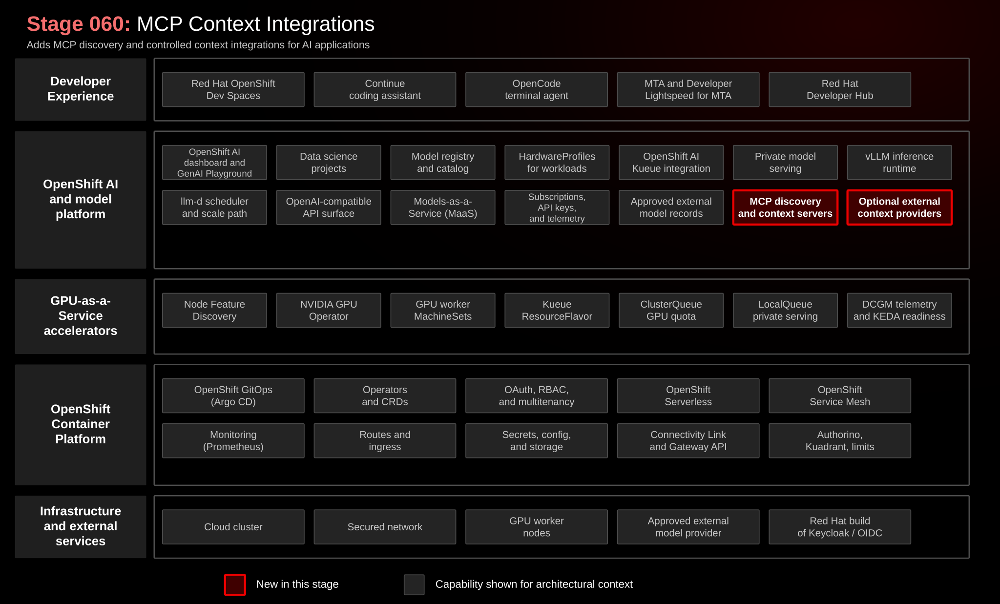

# Stage 060: AI-Assisted Application Modernization

## Why This Matters

Enterprise AI is most useful when it is embedded in real engineering workflows, not isolated chat sessions. Application modernization is a strong example: Java EE and JBoss EAP portfolios need analysis, migration rules, code understanding, remediation suggestions, tests, and human review.

Stage 060 shows how Migration Toolkit for Applications (MTA) and Red Hat Developer Lightspeed for MTA connect static analysis, modernization context, IDE workflow, and governed model access.

## Architecture



## What This Stage Adds

This stage adds an AI-assisted modernization workflow.

- Migration Toolkit for Applications 8.1 with MTA Hub and UI.
- Red Hat Developer Lightspeed for MTA services for AI-assisted remediation suggestions.
- A centrally managed LLM proxy path that sends model requests through MaaS.
- OpenShift OAuth federation through the MTA Keycloak / Red Hat build of Keycloak identity path.
- Red Hat OpenShift Dev Spaces integration through the MTA VS Code extension.

The sample modernization target is [konveyor-ecosystem/coolstore](https://github.com/konveyor-ecosystem/coolstore). Its `main` branch is the legacy Java EE / JBoss-style starting point and its `quarkus` branch is the completed reference target.

## What To Notice And Why It Matters

Stage 060 grounds AI assistance in modernization evidence.

- MTA provides findings from rules, static analysis, and application inventory.
- Developer Lightspeed for MTA uses that context for focused remediation suggestions.
- The LLM proxy centralizes model access so developers do not manage provider credentials in the workspace.
- The primary path sends modernization context through MaaS to a private model on OpenShift.

This matters because enterprise modernization is a risk-managed engineering workflow. Generated remediation remains a proposal until application owners review the diff, tests, and evidence.

## How Red Hat And Open Source Make It Work

Migration Toolkit for Applications provides the modernization platform: analysis engine, inventory, rules, UI, and developer workflow integration. Red Hat Developer Lightspeed for MTA adds AI-assisted code resolution based on MTA findings and is documented as Technology Preview in MTA 8.1.

The MTA `Tackle` custom resource enables the LLM proxy and Solution Server. The `kai-api-keys` Secret holds MaaS-backed OpenAI-compatible credentials. Red Hat build of Keycloak participates in the MTA identity path, and Red Hat OpenShift AI MaaS publishes the private model endpoint used by the assistant workflow.

## Trust Boundaries

Modernization context can include source code, static-analysis findings, dependency information, and remediation suggestions. The private MaaS path keeps this context inside OpenShift. Any approved external model path requires separate data-classification, provider, legal, and application-owner review.

## Red Hat Products Used

- **[Migration Toolkit for Applications](https://developers.redhat.com/products/mta)** provides modernization analysis, inventory, rules, and developer workflow integration.
- **[Red Hat Developer Lightspeed for MTA](https://docs.redhat.com/en/documentation/migration_toolkit_for_applications/8.1/html/configuring_and_using_red_hat_developer_lightspeed_for_mta/)** adds AI-assisted code resolution.
- **[Red Hat OpenShift AI](https://www.redhat.com/en/technologies/cloud-computing/openshift/openshift-ai)** provides the governed MaaS endpoint used by the MTA LLM proxy.
- **[Red Hat OpenShift Dev Spaces](https://www.redhat.com/en/technologies/cloud-computing/openshift/dev-spaces)** hosts the developer workspace and MTA VS Code extension.
- **[Red Hat build of Keycloak](https://access.redhat.com/products/red-hat-build-of-keycloak)** provides the identity layer used by MTA.
- **[Red Hat OpenShift](https://www.redhat.com/en/technologies/cloud-computing/openshift)** provides runtime, identity integration, routes, storage, and operations.

## Open Source Projects To Know

- [Konveyor](https://www.konveyor.io/) is the upstream modernization community behind MTA.
- [Kantra](https://github.com/konveyor/kantra) provides CLI-based application analysis.
- [Kai](https://github.com/konveyor/kai) is the upstream AI-assisted modernization effort.
- [Coolstore](https://github.com/konveyor-ecosystem/coolstore) is the Java EE sample application used in this stage.

## Deploy And Validate

```bash
./stages/060-ai-assisted-application-modernization/deploy.sh
./stages/060-ai-assisted-application-modernization/validate.sh
```

Manifests: [`gitops/stages/060-ai-assisted-application-modernization/base/`](../../gitops/stages/060-ai-assisted-application-modernization/base/)

## References

- [Coolstore sample application](https://github.com/konveyor-ecosystem/coolstore)
- [MTA 8.1 documentation](https://docs.redhat.com/en/documentation/migration_toolkit_for_applications/8.1/)
- [MTA 8.1 installation guide](https://docs.redhat.com/en/documentation/migration_toolkit_for_applications/8.1/html-single/installing_the_migration_toolkit_for_applications/index)
- [Red Hat Developer Lightspeed for MTA 8.1](https://docs.redhat.com/en/documentation/migration_toolkit_for_applications/8.1/html-single/configuring_and_using_red_hat_developer_lightspeed_for_mta/index)
- [MTA VS Code extension 8.1](https://docs.redhat.com/en/documentation/migration_toolkit_for_applications/8.1/html-single/configuring_and_using_the_visual_studio_code_extension_for_mta/index)
- [MaaS code assistant quickstart](https://docs.redhat.com/en/learn/ai-quickstarts/rh-maas-code-assistant)
- [rhpds/mca-devspaces](https://github.com/rhpds/mca-devspaces)

## Next Stage

[Stage 070: Developer Portal and Self-Service](../070-developer-portal-self-service/README.md) turns platform capabilities into a self-service developer portal experience.
