# Stage 060 Coding Exercise — AI-Assisted Development on the Golden Path

## What You'll Do

You will walk the full golden-path loop that enterprise developers follow on
this platform: **discover** a running service in the Developer Hub catalog,
**develop** a new endpoint with a governed AI coding assistant, **generate**
code in one shot, **push** to trigger a CI pipeline, **watch the quality gate
fail** on intentional code smells, **learn** what went wrong by reading the
SonarQube report, **fix** the issues with a stronger model, and **push again**
until the pipeline goes green end-to-end. By the end you will have experienced
governed AI-assisted development — from catalog entry to production-ready
delivery — without a single personal API key or unmanaged plugin.

---

## Step 1 — Sign in to Developer Hub

1. Open the Developer Hub URL (provided by your platform team or the
   `rhdh` Route in the `rhdh` namespace).
2. Click **Sign in** and authenticate as `ai-developer` using OpenShift OIDC.
3. You land on the Home page.

**What you should see:** the RHDH home screen with the catalog search bar and
the global header including the application launcher (nine-dots grid).

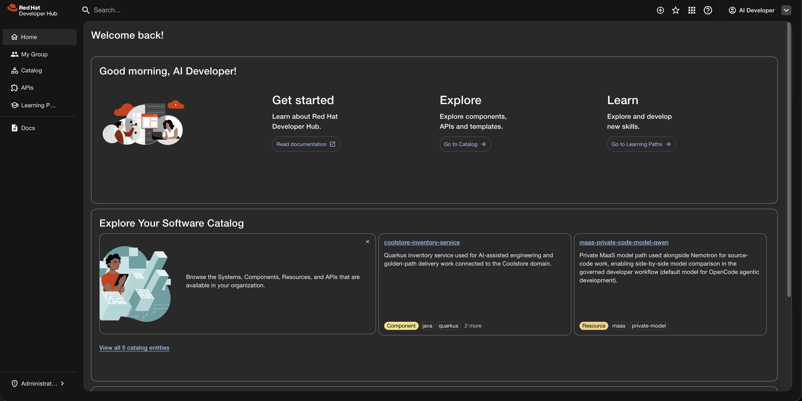

---

## Step 2 — Explore the Coolstore component

1. Navigate to **Catalog** in the sidebar.
2. Click **Coolstore Inventory Service** — this is the only component and the
   single entry point for the developer workflow.
3. On the component Overview page, notice the links: **Source Repo**, **Deployed
   App (dev)**, **Dev Spaces**, and **SonarQube (code quality)**.
4. Click the **Topology** tab — the running service in `coolstore-dev`.
5. Click the **CI** tab — past `app-push` PipelineRun history (all green).
6. Click the **API** tab — `inventory-api` (the REST contract the service
   implements).
7. Open the **Deployed App (dev)** link — the service landing page lists the
   endpoints; click **`GET /api/inventory`** and the service answers with its
   seed inventory data.

This is the brownfield service you will extend. It is already deployed, already
wired to CI, and already has a SonarQube quality baseline. Whatever the AI
writes next lands against a gate that fails on any new issue.

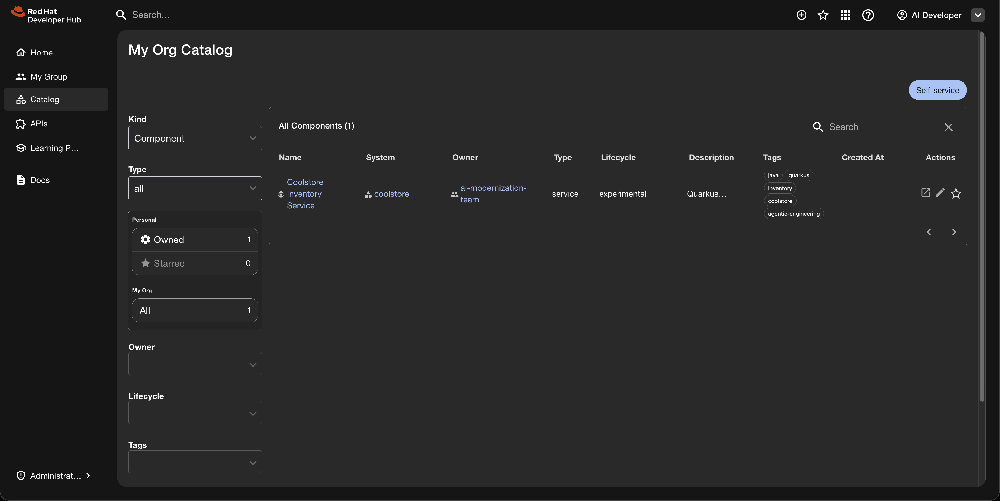

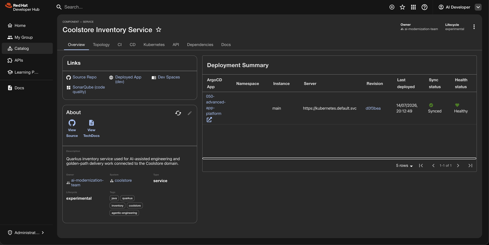

---

## Step 3 — Open the workspace and tour the project

1. On the component page, click the **Dev Spaces** link. This opens the
   `agentic-coolstore` workspace directly — no factory URL needed.
2. The workspace starts. First-start notes:
   - The Kilo Code VSIX (111 MB) downloads from Open VSX. This takes 1–3
     minutes on a fresh workspace; subsequent restarts are instant.
   - VS Code may show a **workspace trust** dialog — accept it.
3. Wait for the IDE to finish loading extensions.

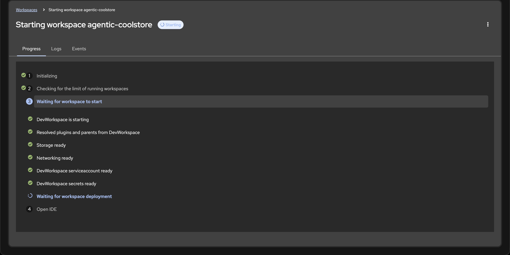

4. While it loads — or once the IDE is up — explore the project structure:
   - `src/main/java/com/redhat/coolstore/inventory/` — the Quarkus
     application code. `InventoryResource` is the existing REST endpoint.
     `InventoryRepository` seeds 3 items across 2 locations, with 1 item
     out-of-stock.
   - `pom.xml` — uses the Red Hat build of Quarkus BOM.
   - `Containerfile` — the container build definition.
   - `devfile.yaml` — defines the Task Runs you will use to build and run
     the application.

**What you should see:** VS Code in the browser with the
`coolstore-inventory-service` project loaded — a standard Quarkus project
structure with seed data ready for extension. The Kilo Code icon appears in
the sidebar.

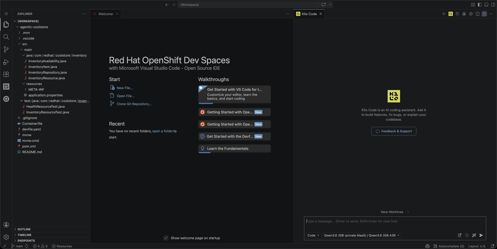

---

## Step 4 — Run Quarkus dev mode

1. Open the Command Palette: `Ctrl+Shift+P` (or `Cmd+Shift+P` on macOS).
2. Type **Tasks: Run Task** → select **devfile** → select **2. Start
   Development mode (Hot reload)**.
3. The terminal opens and Quarkus dev mode starts. Wait for the
   `Listening on: http://0.0.0.0:8080` message.
4. Open the `quarkus-dev` endpoint:
   - A popup may appear offering to open the port — click **Open in New Tab**.
   - Or use the **ENDPOINTS** panel in the bottom bar to find the
     `quarkus-dev` endpoint.
5. The tab that opens shows the **Coolstore Inventory Service** landing page.
   Click **`GET /api/inventory`** to see the seed inventory data. (The Quarkus
   Dev UI at `/q/dev-ui` only accepts localhost connections by design — it is
   not part of this exercise.)

**What you should see:** the landing page listing the service endpoints, and
behind the inventory link a JSON array of inventory records with 3 items.

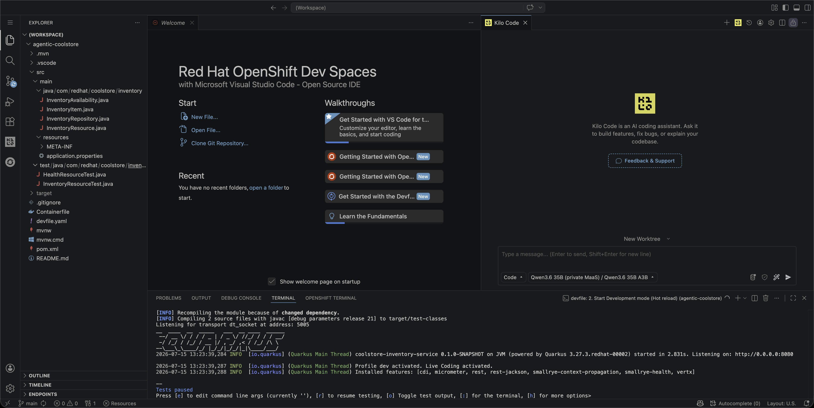

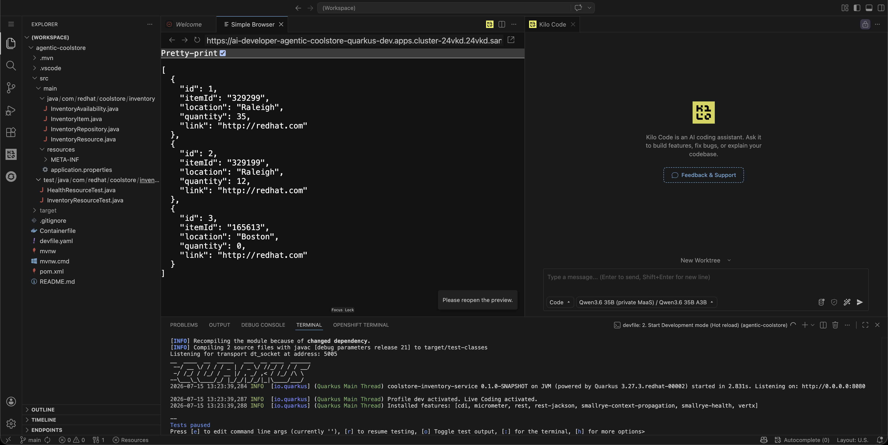

---

## Step 5 — Meet Kilo Code

1. Click the **Kilo Code** icon in the sidebar to open the assistant panel.
2. Notice the model picker at the top. Four governed models are available:

| Model | Context | When to use |
|-------|---------|-------------|
| `qwen3-6-35b-a3b` | 32K | Default — local workhorse with the most reliable tool calling; mind the smaller context on very long sessions |
| `nemotron-3-nano-30b-a3b` | 131K | Local alternative — fast, large context; can drift on multi-step agentic tasks |
| `qwen3-235b` | 16K | External (Red Hat internal) — larger model, shorter context |
| `minimax-m2` | 196K | External (Red Hat internal) — large context for complex fixes; emits visible `<think>` reasoning blocks (normal, not an error) |

3. Configuration comes from `~/.config/kilo/kilo.json` — platform-provisioned,
   no personal API keys. Governance rules live in `~/.config/kilo/AGENTS.md`.
4. Send a first prompt to see the model respond — this is your "hello world";
   ask whatever you like. For example:

```
Explore our project code and report what REST endpoints this service exposes.
```

**What you should see:** the Kilo Code panel with the model picker showing all
four providers, and a streamed answer to your first prompt.


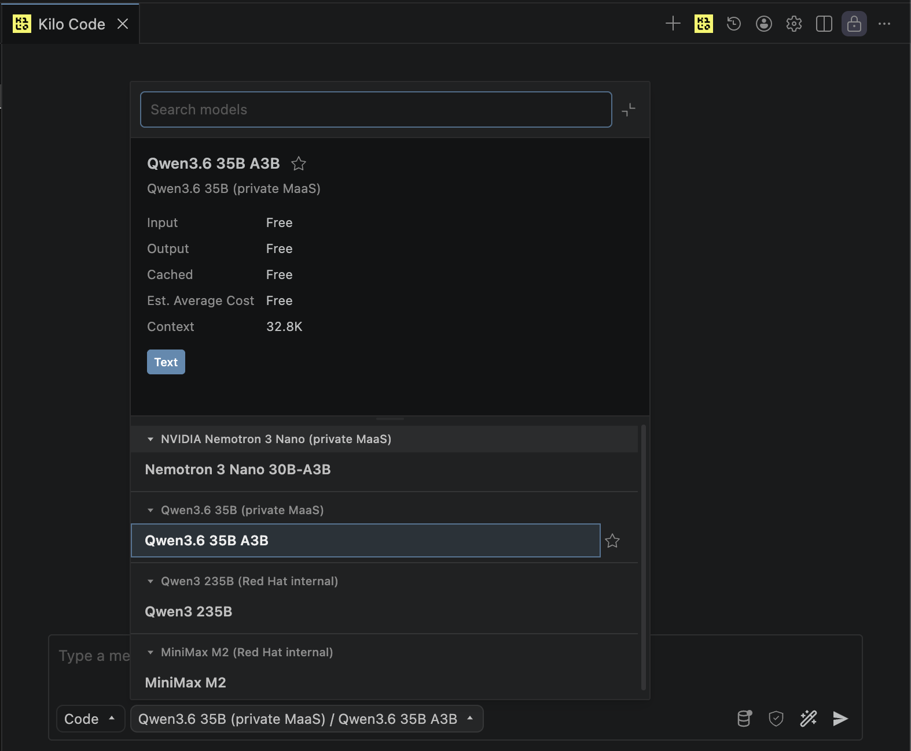

---

## Step 6 — Prompt engineering that pays off

Before generating code, understand the anatomy of a good prompt:

- **Context** — what the model needs to know about the existing code, project,
  and constraints.
- **Task** — the specific outcome you want.
- **Constraints** — what the model must not do (import wrong packages, create
  unnecessary files, use deprecated APIs).
- **Acceptance criteria** — how you will know the output is correct.

### Seven principles that hold across every source

1. **Be specific and explicit** — vague prompts ("fix the code") produce vague
   results; name the function, the bug, and the expected behavior.
2. **Provide structure** — delimiters around data, output format specs, and
   examples constrain the model. In Kilo, context mentions
   (`@/src/main/java/...`) point the model at the right files.
3. **Assign roles / personas** — shaping identity shapes response quality and
   tone.
4. **Break complex tasks into steps** — chain-of-thought, decomposition, or
   multi-stage chaining; think-then-do (analyze → plan → execute → review).
5. **Use few-shot examples** when consistency matters more than brevity —
   2–5 input/output demonstrations beat instructions for structured output.
6. **Iterate and test** — treat prompts as code: refine, version, validate.
   Reject an AI action with an explanation rather than silently redoing it.
7. **Always verify** — the model does not comprehend; you are the editor.
   Review accuracy, especially citations and domain-specific claims.

### Go deeper — four sources worth your time

| Source | What you will find |
|---|---|
| [Kilo Code — Prompt Engineering](https://kilo.ai/docs/customize/prompt-engineering) | Practitioner guide for AI coding assistants: context mentions, task decomposition, think-then-do workflow, custom instructions. |
| [Anthropic — Prompt Engineering Interactive Tutorial](https://github.com/anthropics/prompt-eng-interactive-tutorial) | A 9-chapter hands-on course from basics to advanced: roles, delimiters, chain-of-thought, few-shot, avoiding hallucinations — each chapter with an exercise playground. |
| [Red Hat — Tips for Gen AI LLM Prompt Patterns](https://www.redhat.com/en/blog/tips-for-gen-ai-prompts) | A pattern catalog with when-and-why guidance: Persona, New Information, Refining Questions, Cognitive Verifier, Citation Generator, Few-Shot. |
| [Quarkus LangChain4j — Prompt Engineering Techniques](https://docs.quarkiverse.io/quarkus-langchain4j/dev/guide-prompt-engineering.html) | Java-first technical guide: input delimiters, zero/few-shot, step-back, ReAct, reflection, multi-stage prompting — with code, temperature, and testing advice. |

### Applying it on this platform

The tradeoff between big and small prompts matters:
- A **big one-shot prompt** (like the one you will use) is fast for live demos
  and quick exploration. Downside: it costs more context, can drift, and still
  needs review.
- **Small iterative prompts** give more control but require more turns. Later
  stages (070) move intent into specs and skills for systematic, repeatable
  work.

Durable rules vs. one-shot prompts:
- Durable behavior (file paths, security boundaries, response shape) belongs in
  `~/.config/kilo/AGENTS.md` — it applies to every prompt. Our platform
  provisions these rules for every workspace; this is the same principle as
  "custom instructions", applied with governance.
- Task-specific details (Quarkus coordinates, endpoint shape, acceptance
  criteria) belong in the one-shot prompt.

---

## Step 7 — Generate and verify the stats endpoint

Time to apply Step 6 in practice.

> **Optional — the ✨ Enhance Prompt button.** If your draft is a vague
> one-liner, Enhance Prompt raises its floor by rewriting it with more
> structure before sending. Know its limit: it polishes your stated intent,
> it does not veto it — flawed instructions ("print to the console", "catch
> everything and return an empty map") come back better worded and still
> flawed. On an already-detailed prompt it changes little. You remain the
> editor (principle 7).

### Generate the endpoint

1. Make sure you are in **Act mode** in Kilo Code.
2. Select the **Qwen3.6** model (the default).
3. Paste this prompt into the chat input. Read it first — it is a *realistic
   flawed specification*: the kind a developer writes in a hurry, where some
   requirements are actively bad practice:

```
Create a new REST endpoint /api/inventory/stats in this Quarkus service that returns inventory statistics as JSON: total item count, a count per location, and how many items are in stock vs out of stock. Use the existing InventoryRepository to read the data and inject it directly into a field. Return a Map<String, Object>. Print each request and the computed values to the console so we can follow what is happening, and if anything goes wrong just catch the exception and return an empty map so the endpoint never breaks.
```

   (The same prompt lives in
   [`demo-assets/kilo-code-prompts.md`](demo-assets/kilo-code-prompts.md)
   with presenter notes on what tends to work and what does not.)

4. Kilo Code proposes file changes. **Read the diff carefully** before
   approving — this is the human review gate.
5. Approve the changes.
6. Hot-reload check — in the terminal or browser:
    ```bash
    curl localhost:8080/api/inventory/stats
    ```
7. Look honestly at the generated code. The specification *instructed* three
   code smells, and a good model implements its instructions faithfully:
   - "print to the console" → `System.out.println` instead of a proper logger
   - "catch the exception and return an empty map" → swallowed exceptions
   - "inject it directly into a field" → `@Inject` field injection instead of
     constructor injection

   The model is not the weakest link here — the specification is. Humans
   write vague or wrong requirements every day; this one sets up the
   pipeline failure on purpose. (If your generated code somehow avoided the
   smells, use the pre-prepared version from
   [`demo-assets/InventoryStatsResource-with-smells.java`](demo-assets/InventoryStatsResource-with-smells.java).)

> **If Kilo stalls mid-task** — reasoning trails off with no diff and no
> answer — that is small-model drift on multi-step work, not a platform
> error. Send `continue` or resend the prompt; a drifted turn usually
> recovers on retry. If it keeps happening, switch to a stronger model —
> that tradeoff is exactly what the model picker is for.

**What you should see:** `/api/inventory/stats` returns a JSON object with
`totalItems`, `byLocation`, `inStock`, and `outOfStock` counts.

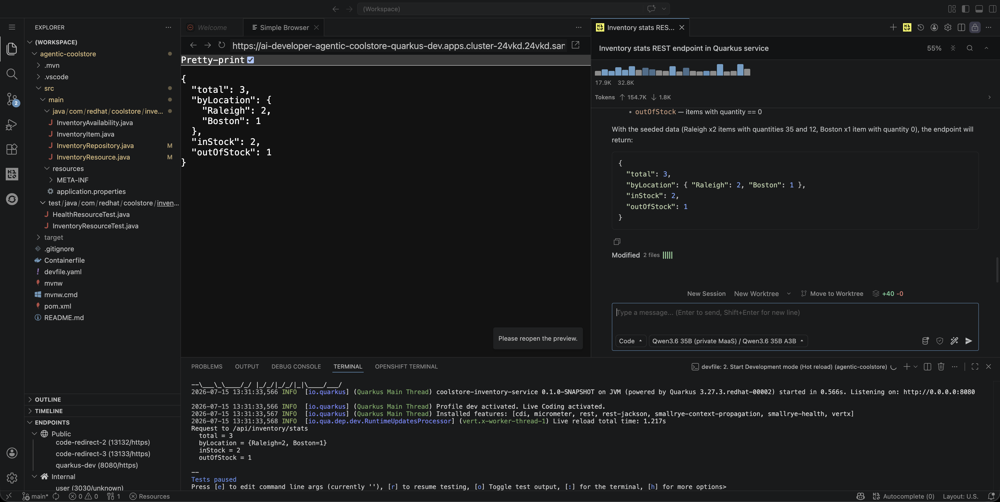

---

## Step 8 — Commit and push

1. Open the **Source Control** view (`Ctrl+Shift+G`).
2. Stage the changed files.
3. Enter the commit message: `Add inventory statistics endpoint`
4. Click **Commit & Push**.

This triggers the delivery chain: the GitHub webhook fires → the platform's
EventListener creates an `app-push` PipelineRun in the `coolstore-dev`
namespace → the pipeline runs clone, build, sonar-scan, build/push image, and
tag-latest.

---

## Step 9 — Watch the pipeline

1. Switch back to Developer Hub.
2. Navigate to the Coolstore Inventory Service component's **CI** tab.
3. A new `app-push` PipelineRun appears. Watch it progress through the steps.
4. **Expect `sonar-scan` to fail.** The quality gate is configured to fail on
   any new issue — by design.

**What you should see:** the pipeline's sonar-scan step turns red.

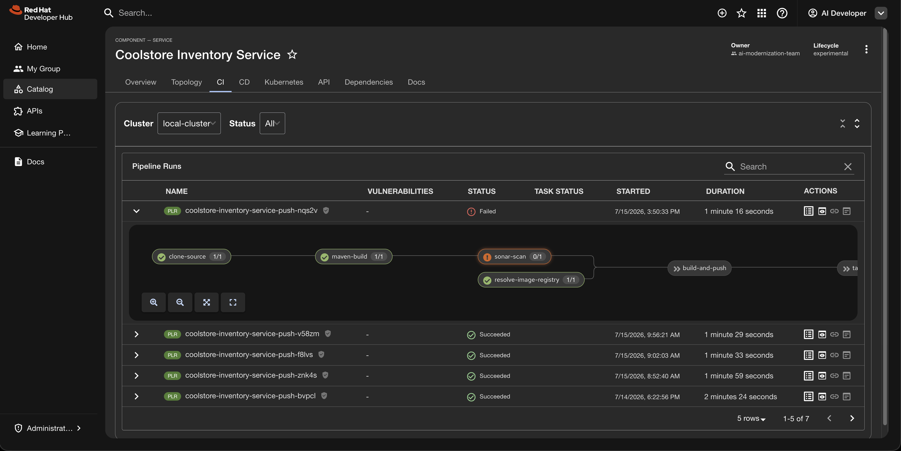

---

## Step 10 — Read the SonarQube report

Open the SonarQube report using either method:

- **Application launcher (nine-dots menu):** click the grid icon in the RHDH
  global header → **Developer Tools** → **SonarQube**.
- **Component link:** on the Coolstore component page, click the **SonarQube
  (code quality)** link.

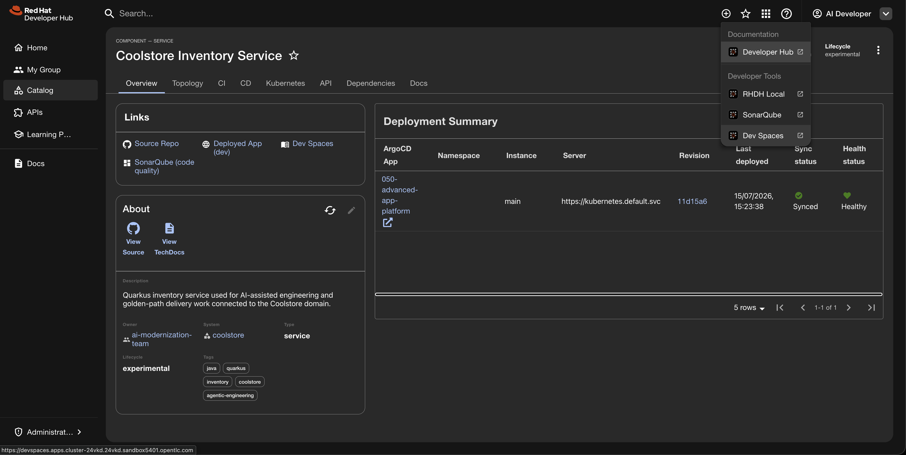

In SonarQube (anonymous browsing is enabled):

1. Open the `coolstore-inventory-service` project.
2. Click **New Code** to see only the issues introduced by your push.
3. Each issue has a production consequence:
   - **`System.out.println`** — unstructured logging that disappears in
     container runtimes; no log levels, no correlation IDs.
   - **Empty catch block** — hidden failures that silently corrupt data or
     leave the service in an undefined state.
   - **Field injection** — untestable wiring; the class cannot be constructed
     outside the CDI container.

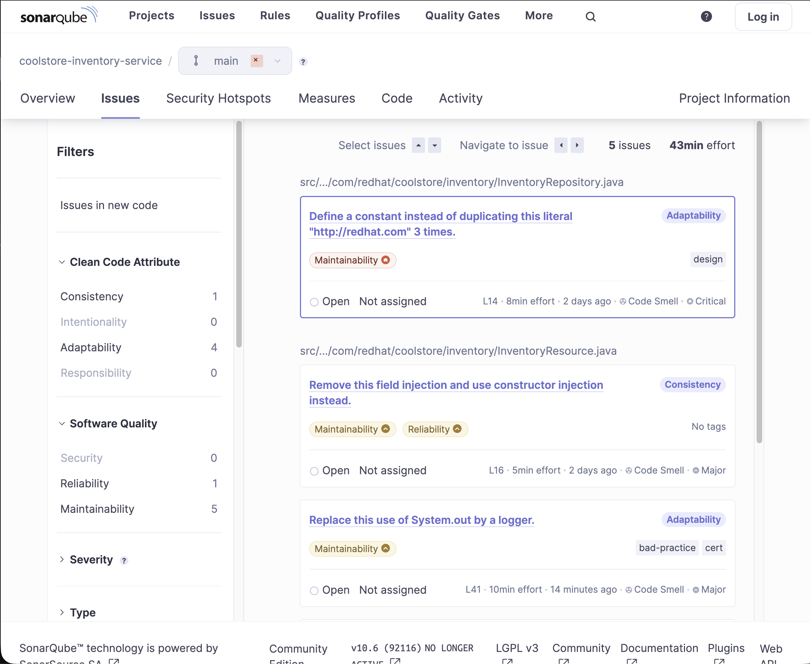

---

## Step 11 — Fix with a stronger model

1. Back in the workspace, open Kilo Code.
2. Switch the model to **minimax-m2** (196K context). Note: this model emits
   visible `<think>` reasoning blocks — this is normal behavior from the
   LiteLLM proxy, not an error.
3. Paste this fix prompt into the chat input:

```
The pipeline's SonarQube gate failed on InventoryStatsResource.java. It
found System.out.println usage, field injection, and an empty catch block.
Fix all three issues following project conventions. Use Logger for output,
constructor injection, and proper error logging in the catch block.
```

   (Also in
   [`demo-assets/kilo-code-prompts.md`](demo-assets/kilo-code-prompts.md)
   with presenter notes.)

4. Review the proposed diff:
   - `System.out.println` → `Logger.info()` (using `org.jboss.logging.Logger`)
   - `@Inject` field injection → constructor injection
   - Empty `catch (Exception e) {}` → `LOG.error("...", e)`
5. Approve the changes.
6. Hot-reload verify:
    ```bash
    curl localhost:8080/api/inventory/stats
    ```
7. Run the tests:
    ```bash
    ./mvnw test
    ```

**What you should see:** tests pass, and the endpoint still returns correct
data.


---

## Step 12 — Push again and go green

1. Stage, commit (`Fix SonarQube code smells`), and push.
2. Switch to the component's **CI** tab in Developer Hub.
3. Watch the new PipelineRun progress. This time the full pipeline completes:
   clone → build → sonar-scan (passes) → build/push → **tag-latest**.
4. The `:latest` tag republish rolls the dev environment — the running
   deployment picks up the new code.
5. Verify on the deployed service: open the component's **Deployed App (dev)**
   link and navigate to `/api/inventory/stats`.

**What you should see:** the CI tab shows all green, and the deployed endpoint
returns the statistics.

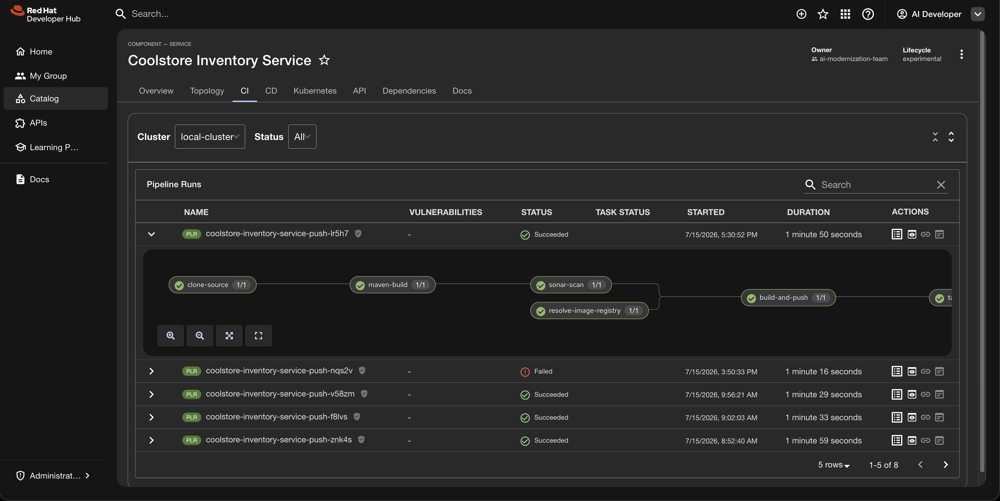

---

## Wrap-up

### What you proved

- **Governed models, no personal keys.** Every prompt went through MaaS with
  platform-issued credentials and token limits.
- **Human review is the gate.** You read every diff before approving — the AI
  proposed, you decided.
- **The pipeline is the safety net.** The quality gate caught what the model
  missed. The fix loop stayed inside the governed workflow.
- **The platform did the wiring.** You never configured a provider, handled an
  API key, or installed a local tool.

### Good Practices

- Keep prompts scoped to a small, reviewable outcome.
- Structure prompts with clear sections, boundaries, and expected output format.
- Put the most important instructions before supporting context.
- Include only task-relevant product facts, file paths, examples, and constraints.
- Put durable constraints in rules, specs, tests, or README text rather than relying on memory.
- Describe what the assistant should do, not only what it must avoid.
- Ask for a plan or gap list before accepting broad edits.
- Validate generated code outside the assistant when shell or cluster evidence is needed.
- Keep model path, task type, files changed, validation result, and rejected suggestions as evidence.
- Keep secrets, private route hostnames, source dumps, tokens, and full environment variables out of prompts and evidence.
- Treat documentation generation as a review workflow: AI can propose, but a human decides what is true.

### Resetting the demo

To reset the `coolstore-inventory-service` repository for the next run, use the
reset script from the demo repo:

```bash
./scripts/reset-coolstore-demo.sh
```

The script rewinds `main` to the `golden` branch baseline via the GitHub API,
recreates the `agentic-coolstore` DevWorkspace, and optionally clears SonarQube
history (`--fresh-sonar`). The force-push fires one expected pipeline run in
`coolstore-dev` that re-validates the chain and re-tags `:latest`. The next
workspace start clones pristine `main`.

Add `--yes` to skip the confirmation prompt. See
`docs/OPERATIONS.md` (Coolstore Demo Reset) for advancing the baseline when
the demo app legitimately evolves.

---

## References

- [Red Hat Developer Hub documentation](https://docs.redhat.com/en/documentation/red_hat_developer_hub/1.10)
- [Red Hat OpenShift Dev Spaces documentation](https://docs.redhat.com/en/documentation/red_hat_openshift_dev_spaces/)
- [MaaS code assistant quickstart](https://docs.redhat.com/en/learn/ai-quickstarts/rh-maas-code-assistant)
- [AI code assistants with Dev Spaces](https://developers.redhat.com/articles/2026/01/28/guide-ai-code-assistants-red-hat-openshift-dev-spaces)
- [Kilo Code](https://kilocode.ai/)
- [Red Hat build of Quarkus — getting started](https://quarkus.io/guides/getting-started)
- [Deploying Quarkus to OpenShift](https://quarkus.io/guides/deploying-to-openshift)
- [SonarQube documentation](https://docs.sonarsource.com/sonarqube/)
- [The uncomfortable truth about vibe coding](https://developers.redhat.com/articles/2026/02/17/uncomfortable-truth-about-vibe-coding)
- [Vibes, specs, skills, and agents: The four pillars of AI coding](https://developers.redhat.com/articles/2026/03/30/vibes-specs-skills-agents-ai-coding)
- [Prompt engineering big vs. small prompts](https://developers.redhat.com/articles/2026/02/23/prompt-engineering-big-vs-small-prompts-ai-agents)
- [Generative AI LLM prompt patterns](https://developers.redhat.com/articles/2024/10/08/ai-llm-prompt-patterns-developers)
