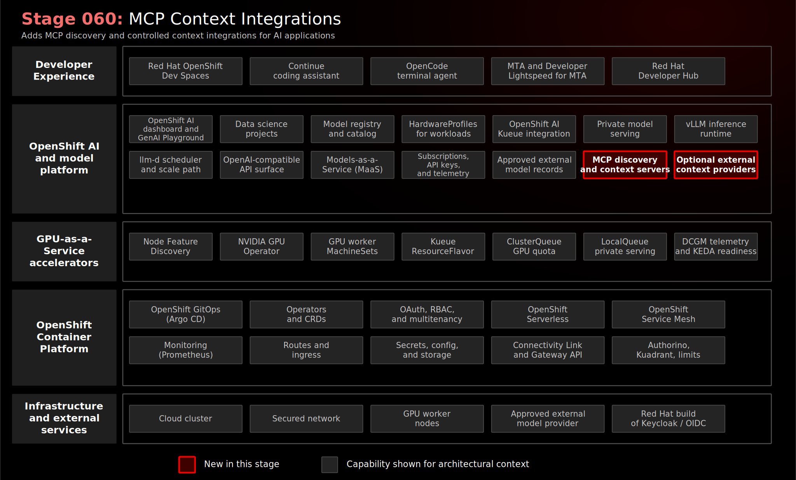

# Stage 060: MCP Context Integrations

## Why This Matters

Stage 050 completed the model access story: private models and approved external models can both be exposed through a governed MaaS path. Stage 060 adds the next layer that AI coding assistants need to become useful in real enterprise workflows: controlled access to context.

Model Context Protocol (MCP) gives AI applications a standardized way to connect to tools, data sources, and services. Without that kind of standard interface, every AI assistant integration can become a custom API project with its own configuration, credential handling, and risk profile. MCP does not replace those underlying APIs. It provides a common protocol above them so an AI application can discover what a server offers and request the right context or tool action through a consistent pattern.

That matters for this demo because governed model access is only half of the enterprise AI problem. A model can generate useful responses only when it has enough task-relevant context. For a developer workflow, that context might be cluster state, logs, documentation, tickets, source code, chat history, or web data. Each source has its own data boundary and approval model.

Stage 060 makes that boundary visible before developer tools consume the integrations. It shows a required, read-only OpenShift MCP server as the platform-native context example, and it includes Slack and BrightData as credential-gated external context examples. The point is not to enable every possible context source. The point is to show that context integrations should be inventoried, scoped, credentialed, and governed with the same care as model providers.

## Architecture



## What This Stage Adds

This stage adds a controlled MCP context layer beside governed model access.

- A required read-only OpenShift MCP server for platform-owned cluster context.
- ServiceAccount and RBAC configuration that scopes how the OpenShift MCP server reads cluster state.
- Red Hat OpenShift AI GenAI Playground discovery configuration for platform-managed MCP servers.
- Optional Slack and BrightData MCP entries that demonstrate credential-gated external context providers.
- Credential provisioning hooks for optional providers without committing real tokens to Git.
- Validation that required platform context is running and optional external context remains gated.

OpenShift MCP is required because it represents platform context owned by the demo. Slack and BrightData are intentionally optional because they introduce external service boundaries and require separate credential approval. Missing optional credentials produce validation warnings, not failures.

## What To Notice And Why It Matters

Stage 060 adds controlled context discovery beside governed model access. The required read-only OpenShift MCP server is deployed as platform-owned context, while Slack and BrightData MCP entries remain credential-gated external integrations.

The essential proof point is that context has its own trust boundary:

- MCP does not replace inference or change where a model runs; model access remains governed by MaaS.
- Red Hat OpenShift AI discovers MCP servers through platform-managed configuration rather than per-user tool settings.
- OpenShift MCP gives assistants a controlled, read-only path to cluster context through ServiceAccount RBAC.
- Optional external MCP providers demonstrate how context sources can be inventoried without becoming active until credentials and approval exist.

This matters because AI assistants become useful when they can reach relevant enterprise context, but every context source expands the data surface. For regulated environments, MCP should be treated as an integration governance pattern: choose trusted servers, scope permissions, manage credentials centrally, and document whether context remains inside the OpenShift boundary or moves to an external service.

## How Red Hat And Open Source Make It Work

Red Hat OpenShift AI provides the GenAI Playground surface where users can try foundation models with configured MCP servers before those patterns move into applications or developer tools. In Red Hat OpenShift AI 3.4, GenAI Playground and MCP server integration are documented as Technology Preview, so this stage presents an early platform direction rather than production guidance. Red Hat OpenShift supplies the hosting and policy substrate: namespaces, ServiceAccounts, RBAC, Secrets, Services, network boundaries, and GitOps reconciliation.

MCP provides the open protocol for connecting AI applications to tools and context. In this stage, MCP servers expose approved capabilities beside the governed inference path from Stage 040. The important distinction is that inference generates tokens, while MCP controls what external context or tools an AI workflow can reach. That separation helps platform teams govern model access and context access as related but different trust boundaries.

## Trust Boundaries

MCP context must be governed separately from model access because tools can expose cluster state, logs, chat data, web data, documents, or actions against other systems. The required OpenShift MCP path is read-only platform context, while Slack and BrightData introduce optional external boundaries; trusted server selection, scoped RBAC, credential control, and periodic review support sovereignty, traceability, and EU AI Act readiness but do not by themselves establish least privilege or legal compliance.

## Red Hat Products Used

- **Red Hat OpenShift AI** provides the GenAI Playground integration point for configured MCP servers.
- **Red Hat OpenShift AI MCP servers** provide the broader Red Hat and partner ecosystem direction for MCP servers built for OpenShift AI use cases.
- **Red Hat OpenShift** provides workload hosting, ServiceAccounts, RBAC, Secrets, Services, namespaces, and cluster policy boundaries.
- **Red Hat OpenShift GitOps** manages the MCP services and discovery configuration.
- **Red Hat OpenShift Dev Spaces** consumes governed model and context capabilities in the next stage.
- **Red Hat Developer Hub** can later document approved context services as discoverable platform capabilities.

## Open Source Projects To Know

- [Model Context Protocol](https://modelcontextprotocol.io/) defines the client/server protocol for connecting AI applications to tools, resources, and external services.
- [Kubernetes MCP server](https://github.com/containers/kubernetes-mcp-server) provides the OpenShift/Kubernetes context server pattern used by this demo container image.
- Slack MCP servers show how team communication platforms can become optional AI context sources when credentials and policy allow.
- BrightData MCP servers show how external web context can be exposed through MCP when an organization explicitly approves that data path.

## Deploy And Validate

Operational commands are kept here for workshop operators.

```bash
./stages/060-mcp-context-integrations/deploy.sh
./stages/060-mcp-context-integrations/validate.sh
```

Manifests: [`gitops/stages/060-mcp-context-integrations/base/`](../../gitops/stages/060-mcp-context-integrations/base/)

## References

- [Red Hat: What is Model Context Protocol (MCP)?](https://www.redhat.com/en/topics/ai/what-is-model-context-protocol-mcp)
- [MCP servers for Red Hat OpenShift AI](https://www.redhat.com/en/products/ai/openshift-ai/mcp-servers)
- [Red Hat OpenShift AI 3.4: Experimenting with models in the GenAI Playground](https://docs.redhat.com/en/documentation/red_hat_openshift_ai_self-managed/3.4/html-single/experimenting_with_models_in_the_gen_ai_playground/index)
- [Model Context Protocol](https://modelcontextprotocol.io/)
- [OpenShift documentation](https://docs.redhat.com/en/documentation/openshift_container_platform/)

## Next Stage

[Stage 070: Controlled Developer Workspaces](../070-controlled-developer-workspaces/README.md) shows developers consuming governed model and context capabilities from Red Hat OpenShift Dev Spaces.
