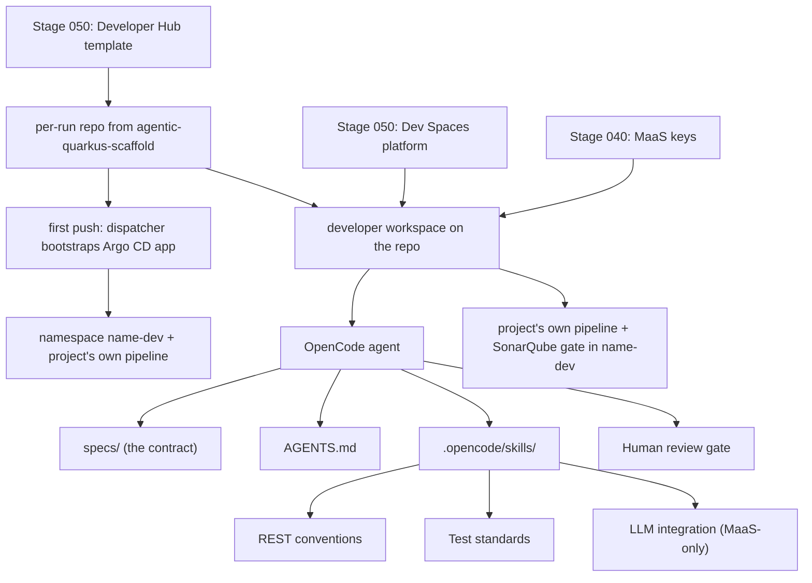

# Stage 070: AI-Agentic Development

> **Status:** workflow-only stage. The primary flow uses the
> `agentic-quarkus-scaffold` golden-path template (Stage 050) to provision a
> brand-new Quarkus application repository carrying corporate standards as
> agent-executable assets, then builds it spec-driven with OpenCode. The
> legacy `agentic-coolstore` DevWorkspace (coolstore-inventory-service,
> `demo/agentic-skills` branch) remains provisioned by Stage 050 as an
> optional comparison workspace until retired. Consumes the Stage 050 Dev
> Spaces platform and Stage 040 MaaS keys. Not yet validated live end to
> end.

## Why This Matters

Stage 060 ends with an honest observation: one-shot prompting produces
plausible code that ignores project standards, misses multi-file consistency,
and forgets hidden requirements. Enterprises do not fix that by writing
longer prompts — they fix it by teaching the agent how the team builds
software.

This stage shows that path, and goes one step further than fixing existing
code: the developer scaffolds a **brand-new Quarkus application** from the
portal. The scaffold contains no application code — it contains the
corporate operating system for building one: `AGENTS.md` (project identity,
workflow, commands), reusable skills (REST conventions, test standards, and
the mandatory MaaS-only LLM integration pattern), and a `specs/` directory
for spec-driven development. OpenCode reads the spec and the skills and
builds the application — including an LLM-powered feature that consumes the
same MaaS gateway that serves the developer's own coding assistant. One
governed access layer for developers' tools *and* their applications.

The bigger message for platform teams: internal development guidelines stop
being wiki pages that nobody reads and become living, versioned assets that
agents apply on every change — and that humans improve through review
feedback.

## Architecture



The golden source is
[`adnan-drina/agentic-quarkus-scaffold`](https://github.com/adnan-drina/agentic-quarkus-scaffold)
(authored in this repository under `golden-repos/` and pushed by
`scripts/bootstrap-golden-repos.sh`). The template copies it into a fresh
per-run repository, so the golden standards are never mutated by a demo.

## What This Stage Adds

This stage adds spec-driven, skill-guided agentic development on the
platform rails established by Stage 050.

- The `agentic-quarkus-scaffold` golden-path template: one field, a
  brand-new repository carrying `AGENTS.md`, `.opencode/skills/`
  (REST conventions, test standards, MaaS-only LLM integration), and
  `specs/` with a template plus a worked example
  (`claims-triage-service.md` — includes an LLM feature through MaaS with a
  deterministic fallback).
- Full project provisioning from the repository's first push: the platform
  dispatcher recognizes the `rhoai3-scaffolded` topic and creates an Argo CD
  Application that instantiates the `<name>-dev` namespace (carrying the
  `pipeline-project` provisioning label) and the project's own delivery
  pipeline from the shared `project-pipeline` base; the project-provisioner
  CronJob distributes build credentials within two minutes. No catalog entry
  exists before the run — the scaffolded repo registers itself.
- Spec-driven workflow: the spec is the contract; skills are the standards;
  the agent does the work; `mvn test` and the pipeline gate are the proof.
- A skill-improvement exercise: review feedback turned into a skill update.
- Optional comparison workspace: the legacy `agentic-coolstore`
  DevWorkspace (6Gi, `started: false`) re-runs the Stage 060 one-shot task
  under skills guidance.

## What To Notice And Why It Matters

- **Standards become executable.** AGENTS.md and skills files are versioned alongside code. The agent reads them on every task, so internal conventions are applied consistently without longer prompts.
- **Same governance, different workflow.** OpenCode uses the same MaaS keys, token quotas, and model endpoints as Kilo Code in Stage 060. The platform boundary is unchanged.
- **Agent-scale resources.** The workspace allocates 6Gi memory to support OpenCode holding multi-file context during iterative agent runs.
- **Skills are a pull request away from improving.** When review feedback recurs, it becomes a skill update — the guideline is now enforced on every future run.
- **No separate exercise file.** The demo is the README narrative (Demo Script below); the agentic workflow happens live in the workspace terminal.

## How Red Hat And Open Source Make It Work

Red Hat OpenShift Dev Spaces provides the isolated workspace with elevated resources. Red Hat OpenShift AI MaaS provides the governed model endpoint. OpenCode is the terminal-based AI coding agent that reads `AGENTS.md` and skill files to steer its behavior. The DevWorkspace operator manages workspace lifecycle and Git checkout. OpenShift identity, RBAC, and namespace isolation keep the agentic workflow scoped to the developer's context.

## Trust Boundaries

The agent operates within the same trust boundary as Stage 060: prompts to local models stay inside OpenShift, external model prompts are governed by MaaS but processed by the provider. The agent has workspace-scoped filesystem access only — it cannot escalate to cluster resources or other namespaces. Human review gates remain mandatory; the agent produces changes, humans approve them.

## Red Hat Products Used

- **[Red Hat OpenShift Dev Spaces](https://www.redhat.com/en/technologies/cloud-computing/openshift/dev-spaces)** provides the managed workspace with agent-scale resources.
- **[Red Hat OpenShift AI](https://www.redhat.com/en/technologies/cloud-computing/openshift/openshift-ai)** provides governed model endpoints through MaaS.
- **[Red Hat OpenShift](https://www.redhat.com/en/technologies/cloud-computing/openshift)** provides identity, namespace isolation, and runtime controls.

## Open Source Projects To Know

- [OpenCode](https://opencode.ai/) is the terminal-based AI coding agent that reads AGENTS.md and skill files.
- [Eclipse Che](https://www.eclipse.org/che/) is the upstream cloud development environment behind Dev Spaces.
- [DevWorkspace Operator](https://github.com/devfile/devworkspace-operator) provides Kubernetes-native workspace orchestration and Git checkout.

## Deploy And Validate

This is a workflow-only stage: it deploys no cluster resources of its own.
The template, dispatcher, and Dev Spaces platform are owned by
[Stage 050: Advanced Application Platform](../050-advanced-app-platform/README.md);
per-run project stacks are created on demand by the scaffolded-project
bootstrap trigger. Deploy stage 050 first, then validate this stage's
prerequisites read-only:

```bash
./stages/070-ai-agentic-development/validate.sh
```

Manifests: [`gitops/stages/050-advanced-app-platform/base/devspaces/`](../../gitops/stages/050-advanced-app-platform/base/devspaces/)

The validate script checks the legacy comparison workspace's
`demo/agentic-skills` branch upstream via `git ls-remote`; the primary flow's
golden repo is `adnan-drina/agentic-quarkus-scaffold`.

## References

| Resource | Link |
|----------|------|
| OpenCode documentation | https://opencode.ai/ |
| AGENTS.md convention | https://opencode.ai/docs/agents |
| Red Hat OpenShift Dev Spaces documentation | https://docs.redhat.com/en/documentation/red_hat_openshift_dev_spaces/ |
| MaaS code assistant quickstart | https://docs.redhat.com/en/learn/ai-quickstarts/rh-maas-code-assistant |
| OpenCode for OpenShift Dev Spaces | https://developers.redhat.com/articles/2026/04/22/opencode-model-neutral-ai-coding-assistant-openshift-dev-spaces |
| agentic-quarkus-scaffold golden repo | https://github.com/adnan-drina/agentic-quarkus-scaffold |
| coolstore-inventory-service (legacy skills branch) | https://github.com/adnan-drina/coolstore-inventory-service/tree/demo/agentic-skills |

## Demo Script

### Part 1 — Self-service in: a repo with standards but no code

**Know.** Stage 060 ended with plausible code the *human* had to catch.
Enterprises fix that by encoding standards where agents execute them:
AGENTS.md and reusable skills, versioned and reviewed like code. Here the
developer starts a brand-new application — and the standards exist in the
repository before the first line of code does.

**Show.**
- Developer Hub → Create → **AI-Agentic Development: new Quarkus
  application**. One field (e.g. `claims-triage-alice`), run, open the new
  repository.
- Walk the tree: no application code. Instead `AGENTS.md` (identity,
  workflow, commands), `.opencode/skills/` (REST conventions, test
  standards, MaaS-only LLM integration), `specs/TEMPLATE.md`, and the
  worked example spec `specs/claims-triage-service.md`.
- Say: "In Stage 060 the standards lived in the reviewer's head. Here they
  are files the agent is required to read."

### Part 2 — Spec-driven: the agent builds the application

**Know.** The spec is the contract, the skills are the standards, the agent
does the work, and the tests plus the pipeline gate are the proof. Nobody
writes a long prompt.

**Show.**
- Open the repo in Dev Spaces; open the example spec: behavior statements,
  API table, acceptance criteria — including an LLM-powered triage feature
  that must go through the MaaS gateway with a deterministic fallback.
- Start OpenCode in the terminal: "Implement specs/claims-triage-service.md."
- Narrate while it works: it consults the skills, uses `/api/` paths and
  constructor injection, writes behavior-named RestAssured tests including
  the fallback path (no live LLM needed in tests), wires LangChain4j to
  `${MAAS_API_BASE_URL}` because the llm-integration skill forbids anything
  else, and updates the README API table — the definition of done lives in
  the skills, not the prompt.
- Run `mvn -q test`; call the triage endpoint in dev mode.
- **What they should notice:** the same MaaS gateway that serves the
  developer's coding assistant now serves the application's AI feature —
  one governed access layer for both. And in the MaaS telemetry, the agent
  and the app show up as consumers under governance.

### Part 3 — Trusted delivery out: green on the first push

**Know.** Stage 060's push failed the gate and a human prompted the fix.
The maturity jump is measurable: skill-guided code exits clean.

**Show.**
- Push to `main` → the project's own pipeline runs in `<name>-dev` →
  SonarQube gate **passes on the first attempt**. Contrast explicitly with
  Stage 060's red run.
- Fail-forward option: introduce a deliberate smell, push, watch the gate
  fail, and hand the failure back to OpenCode — the `project-test-standards`
  skill forbids weakening assertions, so the agent fixes the code, not the
  test.
- Close the loop: "Review feedback that recurs becomes a skill update — the
  guideline is enforced on every future run. Internal standards stopped
  being wiki pages; they are living assets now."

## Next Stage

[Stage 080: Autonomous Application Migration](../080-ai-autonomous-migration/README.md)
scales from skill-guided single tasks to a multi-agent migration workflow.
