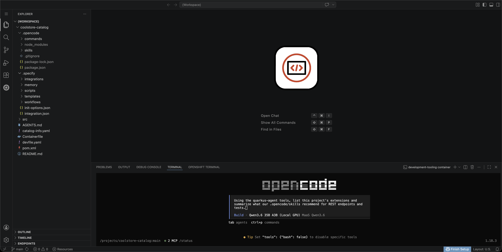
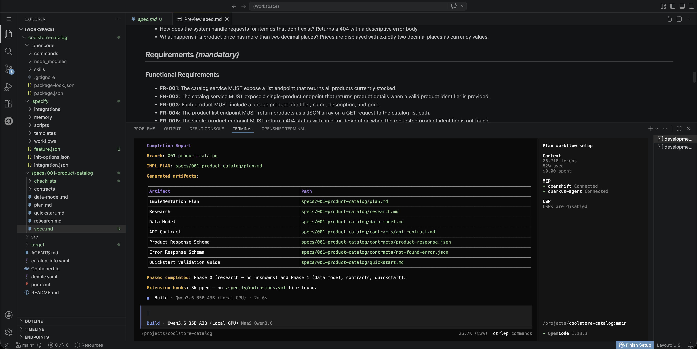

# Stage 070 Coding Exercise — Spec-Driven Agentic Development on the Golden Path

## What You'll Do

In stage 060 you drove an AI assistant by hand: you wrote the prompt, the
model wrote flawed code, and the pipeline's quality gate caught it. This
exercise inverts that story. You will **provision** a brand-new Quarkus
service through a golden-path template (repository, namespace, pipeline,
catalog entry — all self-service), **meet** an agentic assistant whose
corporate standards live in the project itself (constitution, AGENTS.md,
skills), **turn a requirements brief into executable artifacts** with
spec-kit (specify → plan → tasks), **let the agent implement** the service
with its tests, and **push straight to green** — the gate confirms quality
instead of catching its absence. The service you build is itself
AI-enhanced: it classifies insurance claims through the same governed MaaS
gateway that serves your coding assistant.

---

## Step 1 — Sign in to Developer Hub

1. Open the Developer Hub URL and sign in as `ai-developer` (OpenShift OIDC).

**What you should see:** the RHDH home screen with the catalog search bar.

---

## Step 2 — Create your project from the golden-path template

1. Click **Create** in the sidebar (or **Self-service** on the home page).
2. Choose the **New Quarkus app** template.
3. Application name: `claims-triage` (lowercase, hyphens; this becomes the
   repository, namespace, and workspace name).
4. Click **Review**, then **Create**, and watch the five steps run: fetch
   the golden scaffold → read platform link endpoints → add catalog
   metadata → publish to GitHub → register in the catalog.
5. Read the **Next steps** panel — the publish already bootstrapped your
   project stack.

**What you should see:** all five steps green in a few seconds, with
**Source repository** and **Open in catalog** links at the bottom.

> **Why this matters:** without self-service, this is a week of tickets —
> a repo request, a namespace request, CI onboarding, registry access,
> catalog registration. The template did all of it in under ten seconds,
> every piece pre-approved by the platform team. Developers provision, the
> platform governs — nobody waits.


---

## Step 3 — Explore your newborn component

1. Click **Open in catalog**.
2. On the Overview page, notice:
   - **Links**: Source Repo, Dev Spaces, SonarQube (code quality) — real
     URLs for this project, derived at scaffold time.
   - **Deployment Summary**: the `project-claims-triage` Argo CD app,
     Synced — your namespace and pipeline are being managed by GitOps.
3. Open the **CI** tab. Within ~3 minutes of scaffolding, a
   `claims-triage-seed-*` PipelineRun appears and goes green: clone →
   build → SonarQube gate → image build/push.

**What you should see:** a green first PipelineRun for a project you have
written zero lines of code for.

> **The birth certificate:** the platform seeds one pipeline run for every
> scaffolded project. Before you touch the code, the entire delivery chain
> — source access, build, quality gate, registry push — has proven itself.
> If anything in the platform is broken, you find out now, not mid-feature.


---

## Step 4 — Open the workspace and tour the project

1. Click the **Dev Spaces** link on the component page and let the
   workspace start (first start pulls the tooling image and installs the
   latest OpenCode CLI — 1–2 minutes).
2. Tour the project — note what is and is not here:
   - `AGENTS.md` — the project's standing rules for any AI agent.
   - `.opencode/skills/` — corporate standards as executable assets:
     REST conventions, LLM integration, test standards.
   - `.opencode/commands/` — the spec-kit commands (`/speckit.*`).
   - `.specify/` — spec-kit's machinery: templates, scripts, and
     `memory/constitution.md` (the project's governing principles).
   - `pom.xml` — Red Hat Quarkus BOM, test deps, JaCoCo wired for the
     coverage gate.
   - **No `src/` directory.** The scaffold ships standards and structure,
     not code. The agent writes the code; there is no `specs/` yet either —
     spec-kit creates it when you write your first spec.

**What you should see:** a standards-rich, code-empty project. Everything
that steers the agent is versioned in the repository.


---

## Step 5 — Meet OpenCode

1. Open a terminal and run:

```
opencode
```

2. Check the governed setup:
   - `/models` lists exactly four models — the platform's private MaaS
     models (Qwen3.6 default, Nemotron, qwen3-235b, minimax-m2). No
     public catalog, no personal keys.
   - The config came from the platform at workspace start
     (`~/.config/opencode/opencode.json`) — providers, keys, and two MCP
     servers: `openshift` (cluster context) and `quarkus-agent` (the
     official Quarkus MCP: project lifecycle, extension-aware skills,
     doc search).
3. Send a first probe that exercises the Quarkus MCP:

```
Using the quarkus-agent tools, list this project's extensions and summarize what our .opencode/skills recommend for REST endpoints and tests.
```

**What you should see:** the agent calls the MCP tools, reads the skills,
and answers with the project's actual conventions — proof that the
standards are discoverable, not tribal.

> Note: `minimax-m2` emits visible `<think>` blocks through the external
> provider — normal behavior, not an error. The local models render their
> reasoning as collapsible blocks because the platform runs proper
> reasoning parsers for them.



---

## Step 6 — Standards as executable assets

One minute of theory before the build. In stage 060, quality lived in two
places: your prompt (which was flawed) and the pipeline gate (which caught
it). Here, quality is layered *into the project*:

| Layer | File | Scope |
|-------|------|-------|
| Constitution | `.specify/memory/constitution.md` | Project principles every spec-kit command consults |
| Standing rules | `AGENTS.md` | How any agent behaves in this repo |
| Skills | `.opencode/skills/*.md` | Domain conventions: REST shapes, LLM integration, test standards |
| Spec | `specs/<n>-<feature>/spec.md` | What to build — requirements, API, acceptance |

The spec-kit workflow turns a requirements brief into implementation
through reviewable artifacts:

```
/speckit.specify  →  spec.md      (what and why)
/speckit.plan     →  plan.md      (how — stack, structure)
/speckit.tasks    →  tasks.md     (ordered, checkable work items)
/speckit.implement →  code + tests (steered by all the layers above)
```

You review each artifact before the next step — the same human-review
discipline as 060, moved earlier where it is cheap. As the Quarkus team
puts it: treat agents as skilled junior developers — give them structure,
review their work.

---

## Step 7 — Specify: turn the brief into a spec

1. Open the requirements brief the exercise provides:
   [`demo-assets/claims-triage-service.md`](demo-assets/claims-triage-service.md)
   (in the platform repository, stage 070). Skim it: an insurance claims
   triage service — LLM-first classification through the MaaS gateway with
   a deterministic keyword fallback, priorities, stats, error handling,
   acceptance criteria.
2. In OpenCode, run `/speckit.specify` and paste the brief's content as
   the description.
3. spec-kit creates `specs/001-claims-triage/spec.md` (the `specs/`
   directory appears now — created by the tool, owned by the workflow).
4. **Review the spec.** Check the API table, the fallback rules, and the
   acceptance criteria survived translation. Edit if anything drifted —
   this document steers everything downstream.

**What you should see:** a structured spec in spec-kit's format, faithful
to the brief.


---

## Step 8 — Plan and tasks

1. Run `/speckit.plan`. Review `plan.md`: expect Quarkus REST with
   Jackson, the LLM call through the MaaS endpoint per the
   `llm-integration` skill, constructor injection and proper logging per
   the REST conventions skill.
2. Run `/speckit.tasks`. Review `tasks.md`: ordered, individually
   verifiable work items, tests included — the test standards skill makes
   the agent plan tests as first-class tasks, not an afterthought.

**What you should see:** a plan that reads like your team's conventions,
because it is steered by them.

> Model tip: the default Qwen3.6 handles this well. For a heavier planning
> pass on a larger spec, switch to `minimax-m2` (196K context) — the model
> picker is a governed menu, not a credential decision.



---

## Step 9 — Implement and verify locally

1. Run `/speckit.implement`. The agent works through the tasks: source,
   configuration, and tests. Review and approve the diffs as they come —
   you are the senior on this pair.
2. When it finishes, start dev mode (**Tasks: Run Task → devfile →
   2. Start Development mode**) and exercise the service:

```
curl -s -X POST localhost:8080/api/claims/triage -H "Content-Type: application/json" -d '{"id":"C-1001","summary":"Kitchen fire, tenant reports smoke injury"}'
```

```
curl -s localhost:8080/api/claims/triage/stats
```

3. Run the tests:

```
mvn -q test
```

**What you should see:** the triage endpoint answering with a priority and
a `source` (`llm` when the MaaS call classified, `fallback` when the
keyword path did), stats counting, and tests green — including fallback
tests that pass without a live LLM.

> **The double governance beat:** the application you just built calls the
> same MaaS gateway, with the same key discipline and token metering, as
> the assistant that built it. Developer AI and application AI ride one
> governed platform — one credential model, one usage dashboard, one gate.


---

## Step 10 — Push straight to green

1. Commit and push from the Source Control view (message:
   `Implement claims triage per spec 001`).
2. Watch the **CI** tab: your project's own `app-push` pipeline runs
   clone → build → **sonar-scan** → image build/push.
3. Open the **SonarQube (code quality)** link: quality gate **Passed** —
   new code with coverage from the agent-written tests, no new issues.

**What you should see:** a green run on the first real push.

> **The 060 contrast, completed:** same gate, same rules — different
> outcome. In 060 the flawed spec shipped smells and the gate went red; the
> fix cost a round trip. Here the standards were in the project before the
> first line was written — constitution, rules, skills, spec — and the
> agent internalized them. The gate did not catch anything, because there
> was nothing to catch. That is the maturity step: from *inspection* to
> *construction* quality.


---

## Wrap-up

### What you proved

- **Self-service provisioning**: repo, namespace, pipeline, registry, and
  catalog entry in seconds — pre-approved, not improvised.
- **The platform proves itself first**: the seed run validated the entire
  delivery chain before you wrote any code.
- **Standards steer construction**: constitution + AGENTS.md + skills +
  spec made quality an input, not a hoped-for output.
- **Spec-driven beats prompt-driven for real work**: every artifact was
  reviewable before the next step amplified it.
- **One governed AI platform**: the assistant that wrote the app and the
  app itself share the same gateway, keys, limits, and telemetry.

### Resetting the demo

Teardown is an operator action from the platform repository:

```
./scripts/delete-scaffolded-project.sh claims-triage --yes
```

It removes the workspace, catalog entries, Argo app and namespace,
SonarQube history, and the GitHub and Quay repositories (see the script
header for credential requirements). Scaffold again anytime — the template
recreates everything in seconds.

### References

- [spec-kit — Spec-Driven Development toolkit](https://github.com/github/spec-kit)
- [Quarkus Insights #249 — Coding Agents](https://quarkus.io/blog/quarkus-insights-249-coding-agents/)
- [Quarkus Agent MCP](https://github.com/quarkusio/quarkus-agent-mcp)
- [OpenCode documentation](https://opencode.ai/docs/)
- [Red Hat Developer Hub — Golden Path templates](https://developers.redhat.com/rhdh)
