# Stage 070 Coding Exercise — Spec-Driven Agentic Development on the Golden Path

## What You'll Do

In stage 060 you drove an AI assistant by hand: you wrote the prompt, the
model wrote flawed code, and the pipeline's quality gate caught it. This
exercise inverts that story. You will **provision** a brand-new Quarkus
service through a golden-path template (repository, namespace, pipeline,
catalog entry — all self-service), **meet** an agentic assistant whose
corporate standards live in the project itself (constitution, AGENTS.md,
skills), **turn a requirements brief into executable artifacts** with
spec-kit (specify → plan → tasks), **let the agent implement** the service
with its tests, and **push straight to green** — the gate confirms quality
instead of catching its absence. Then you **evolve the service with a
second spec** — integrating it with the stage 060 inventory service — the
way real systems grow. The service is `coolstore-catalog`: the product
catalog sibling of the inventory service you extended in stage 060,
rebuilt fresh in Quarkus from the behavior of the original coolstore
Spring Boot implementation.

---

## Step 1 — Sign in to Developer Hub

1. Open the Developer Hub URL and sign in as `ai-developer` (OpenShift OIDC).

**What you should see:** the RHDH home screen with the catalog search bar.


---

## Step 2 — Create your project from the golden-path template

1. Click **+** icon in the header (or scrol down to **Explore Templates** section on the home page).

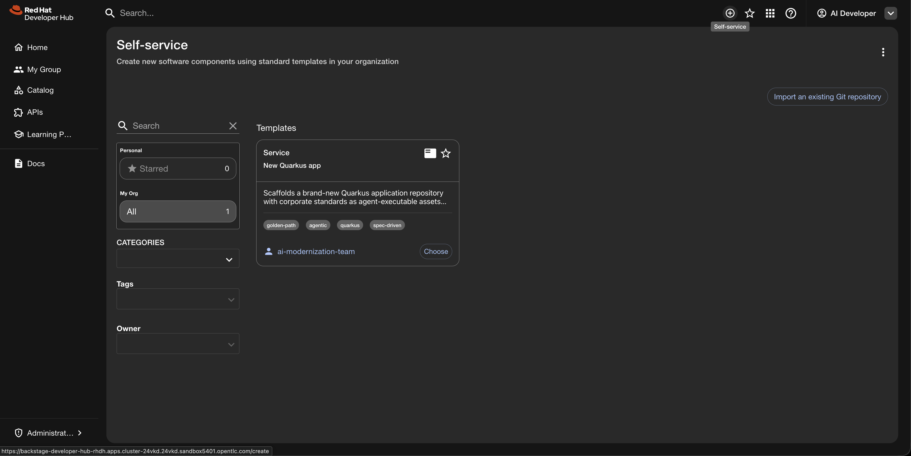

2. Choose the **New Quarkus app** template.
3. Application name: `coolstore-catalog` (lowercase, hyphens; this becomes
   the repository, namespace, and workspace name).

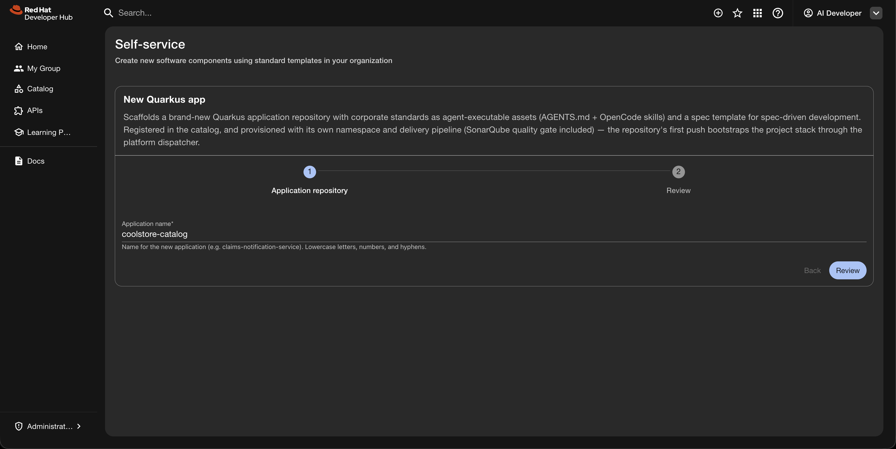

4. Click **Review**, then **Create**, and watch the five steps run: fetch
   the golden scaffold → read platform link endpoints → add catalog
   metadata → publish to GitHub → register in the catalog.
5. Read the **Next steps** panel — the publish already bootstrapped your
   project stack.

**What you should see:** all five steps green in a few seconds, with
**Source repository** and **Open in catalog** links at the bottom.

> **Why this matters:** without self-service, this is a week of tickets —
> a repo request, a namespace request, CI onboarding, registry access,
> catalog registration. The template did all of it in under ten seconds,
> every piece pre-approved by the platform team. Developers provision, the
> platform governs — nobody waits.

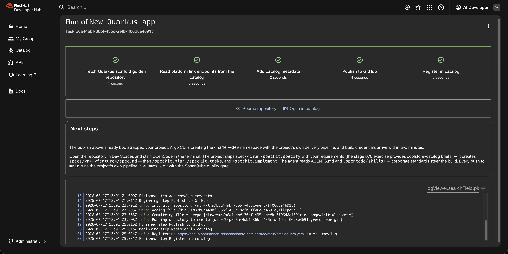

---

## Step 3 — Explore your newborn component

1. Click **Open in catalog**.

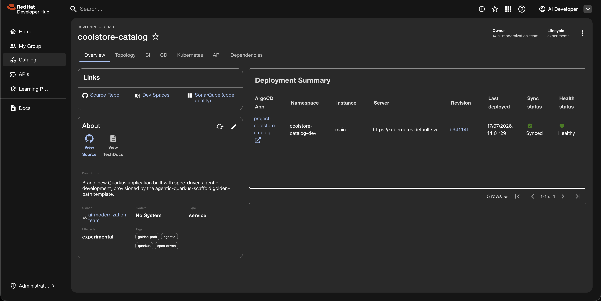

2. On the Overview page, notice:
   - **Links**: Source Repo, Dev Spaces, SonarQube (code quality) — real
     URLs for this project, derived at scaffold time.
   - **Deployment Summary**: the `project-coolstore-catalog` Argo CD app,
     Synced — your namespace and pipeline are being managed by GitOps.
3. Open the **CI** tab. Within ~3 minutes of scaffolding, a
   `coolstore-catalog-seed-*` PipelineRun appears and goes green: clone →
   build → SonarQube gate → image build/push.

**What you should see:** a green first PipelineRun for a project you have
written zero lines of code for.

> **The birth certificate:** the platform seeds one pipeline run for every
> scaffolded project. Before you touch the code, the entire delivery chain
> — source access, build, quality gate, registry push — has proven itself.
> If anything in the platform is broken, you find out now, not mid-feature.

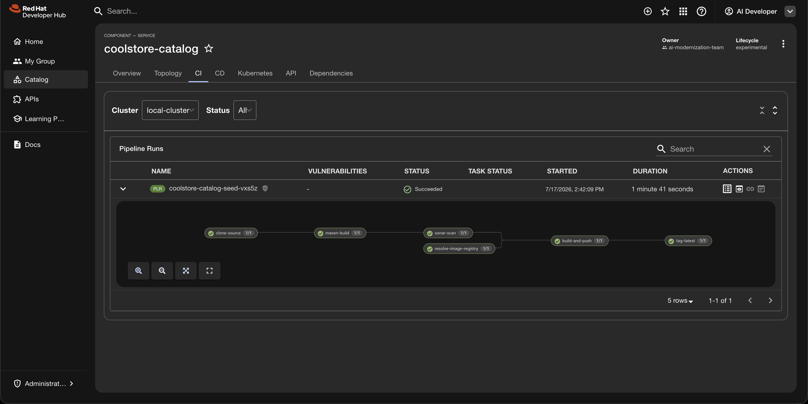

---

## Step 4 — Two ideas that make agentic development work

In stage 060, the quality gate caught what a flawed prompt produced. The
gate stays — every push still exits through it. What changes in this
stage is the *input*: instead of hand-written one-shot prompts, the
agent works from structured, reviewable context — specs and skills —
so what reaches the gate is right the first time. The mental model for
that context comes from Martin Fowler's team: an agent consumes two
distinct kinds of it.

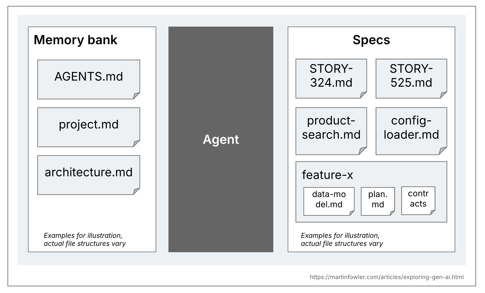
*(Source: [martinfowler.com — Exploring Gen AI: SDD tools](https://martinfowler.com/articles/exploring-gen-ai/sdd-3-tools.html))*

- The **memory bank** is durable, cross-session knowledge — "relevant
  across all AI coding sessions in the codebase": standing rules,
  architecture, conventions.
- **Specs** are per-feature intent — "only relevant to the tasks that
  actually create or change that particular functionality."

Everything this project ships maps onto that picture:

| Context kind | Layer | File | Scope |
|--------------|-------|------|-------|
| Memory bank | Constitution | `.specify/memory/constitution.md` | Project principles every spec-kit command consults |
| Memory bank | Standing rules | `AGENTS.md` | How any agent behaves in this repo, always |
| Memory bank | Skills | `.opencode/skills/*.md` | On-demand know-how: REST shapes, LLM integration, test standards |
| Specs | Feature spec | `specs/<n>-<feature>/spec.md` | What to build — requirements, API, acceptance |

### Concept 1 — The memory bank: AGENTS.md and skills

**AGENTS.md** is an open standard — "a README for agents" — stewarded
under the Linux Foundation and used by 60,000+ projects across every
major agent (Copilot, Cursor, OpenCode, Claude, and more). Where
README.md serves humans, AGENTS.md carries the extra context agents
need: setup and test commands, code style, security boundaries, commit
conventions. Agents read the *closest* AGENTS.md in the tree, so
standards can be scoped per subproject.

**Skills** are the modular complement: reusable procedures an agent
*discovers and loads on demand* rather than carrying always. Each is a
`SKILL.md` with a name and description in frontmatter; OpenCode lists
them via its native skill tool and pulls the full content only when the
task calls for it. The distinction matters: AGENTS.md is always-on
behavior, skills are just-in-time expertise — the same way a team has
both working agreements and runbooks.

This project carries three skills (REST conventions, LLM integration,
test standards) — and the **Quarkus Agent MCP** adds a dynamic layer:
its `quarkus_skills` tool derives extension-specific guidance from what
is actually in your pom, straight from the Quarkus team.

### Concept 2 — Spec-Driven Development

Prompt-by-prompt "vibe coding" is, in Red Hat's phrase, "speedy but not
always sturdy" — flexible for prototypes, brittle under real-world
pressure. SDD's answer is a power inversion: **the spec becomes the
primary artifact, and code becomes its expression**. For that to work,
specs must be precise, complete, and unambiguous enough to generate
working systems — which is exactly what the spec-kit workflow
manufactures, step by reviewable step:

```
/speckit.specify   →  spec.md      (what and why)
/speckit.plan      →  plan.md      (how — stack, structure)
/speckit.tasks     →  tasks.md     (ordered, checkable work items)
/speckit.implement →  code + tests (steered by every layer above)
```

Fowler's team describes three maturity levels — spec-first (specs
precede code, then fade), spec-anchored (specs persist and evolve with
the feature), and spec-as-source (humans edit only specs). This
exercise practices **spec-anchored**: your artifacts live in the repo
and evolve with the service.

Two honest counterweights, so this stays engineering and not ideology:
Fowler's team cautions that SDD workflows can feel disproportionate to
small problems and that agents sometimes ignore or over-interpret specs
— which is why every step below has you **review the artifact before
the next step amplifies it**. And as the Quarkus team puts it: treat
agents as skilled junior developers — give them structure, review their
work.

### Go deeper — the sources behind this step

| Source | What you will find |
|---|---|
| [Fowler — Exploring Gen AI: SDD tools](https://martinfowler.com/articles/exploring-gen-ai/sdd-3-tools.html) | The memory-bank/specs frame, three SDD maturity levels, and honest critique |
| [agents.md](https://agents.md/) | The AGENTS.md open standard: format, adoption, nested scoping |
| [agentskills.io](https://agentskills.io/home) | The agent skills specification |
| [OpenCode — Skills](https://opencode.ai/docs/skills/) | SKILL.md format, discovery paths, the on-demand skill tool |
| [Red Hat — How SDD improves AI coding quality](https://developers.redhat.com/articles/2025/10/22/how-spec-driven-development-improves-ai-coding-quality) | The case for specs over vibes, and five get-started steps |
| [spec-kit — spec-driven.md](https://github.com/github/spec-kit/blob/main/spec-driven.md) | The philosophy: power inversion, executable specs, the constitution |
| [spec-kit repository](https://github.com/github/spec-kit) | The toolkit you are about to use |

---

## Step 5 — Open the workspace and tour the project

1. Click the **Dev Spaces** link on the component page and let the
   workspace start (first start pulls the tooling image and installs the
   latest OpenCode CLI — 1–2 minutes).
2. Tour the project — the two context kinds from Step 4, now as real
   files:
   - `AGENTS.md` — the project's standing rules for any AI agent.
   - `.opencode/skills/` — corporate standards as executable assets:
     REST conventions, LLM integration, test standards.
   - `.opencode/commands/` — the spec-kit commands (`/speckit.*`).
   - `.specify/` — spec-kit's machinery: templates, scripts, and
     `memory/constitution.md` (the project's governing principles).
   - `pom.xml` — Red Hat Quarkus BOM, test deps, JaCoCo wired for the
     coverage gate.
   - **No `src/` directory.** The scaffold ships standards and structure,
     not code. The agent writes the code; there is no `specs/` yet either —
     spec-kit creates it when you write your first spec.

**What you should see:** a standards-rich, code-empty project. Everything
that steers the agent is versioned in the repository.

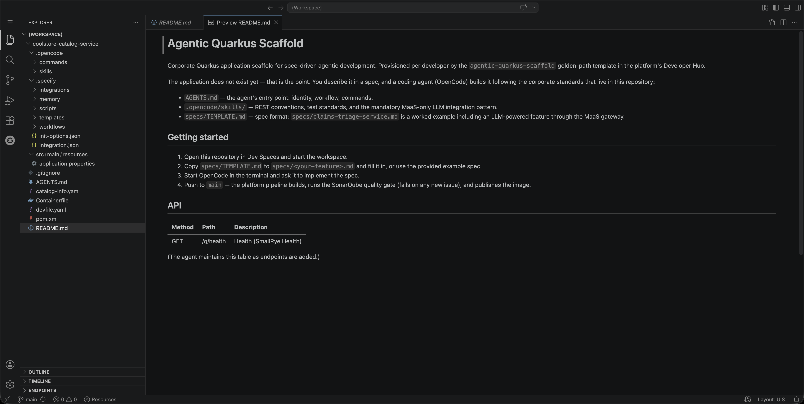

---

## Step 6 — Meet OpenCode

1. Open a terminal and run:

```
opencode
```

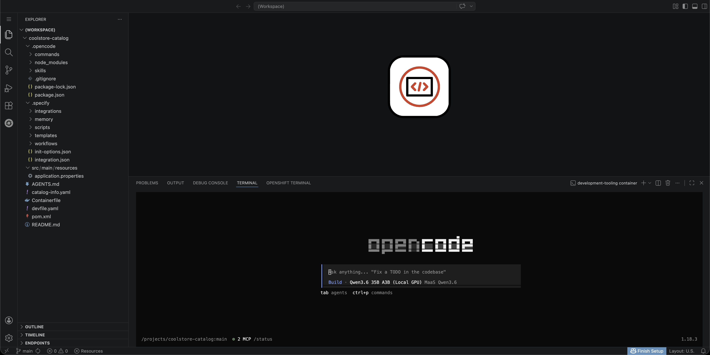

2. Check the governed setup:
   - `/models` lists exactly two models — the platform's private MaaS
     models (Qwen3.6 default, Nemotron), both served on cluster GPUs. No
     public catalog, no personal keys.
   - The config came from the platform at workspace start
     (`~/.config/opencode/opencode.json`) — providers, keys, and two MCP
     servers: `openshift` (cluster context) and `quarkus-agent` (the
     official Quarkus MCP: project lifecycle, extension-aware skills,
     doc search).
3. Send a first probe that exercises the Quarkus MCP:

```
Using the quarkus-agent tools, list this project's extensions and summarize what our .opencode/skills recommend for REST endpoints and tests.
```

**What you should see:** the agent calls the MCP tools, reads the skills,
and answers with the project's actual conventions — proof that the
standards are discoverable, not tribal.

> Note: both models render their reasoning as collapsible blocks because
> the platform runs proper reasoning parsers for them.

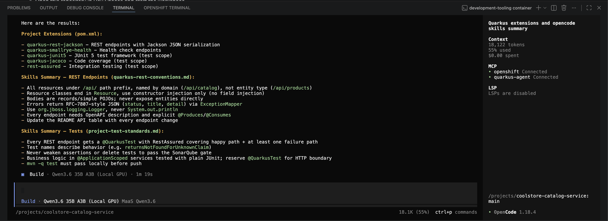

---

## Step 7 — Specify: turn the brief into a spec

1. Open the first requirements brief the exercise provides:
   [`demo-assets/001-catalog-products.md`](demo-assets/001-catalog-products.md)
   (in the platform repository, stage 070). Skim it: the product-listing
   core of the coolstore catalog, captured as intent rather
   than code. Note the seed itemIds: three of them deliberately match
   the inventory service's data — that pays off in step 11.
2. In OpenCode, run `/speckit.specify` and paste the brief's content as
   the description.
3. spec-kit creates `specs/001-.../spec.md` (the `specs/` directory
   appears now — created by the tool, owned by the workflow).
4. **Review the spec.** Check the API, the seed data, and the acceptance
   criteria survived translation. Edit if anything drifted — this
   document steers everything downstream.

**What you should see:** a structured spec in spec-kit's format, faithful
to the brief.

> **Spec from behavior, not from code:** the brief was written against
> the original Spring Boot implementation's observed behavior. The agent
> never sees the Spring code — it builds Quarkus-native from intent.
> That is the difference between spec-driven rebuild (this stage) and
> automated migration (stage 080 does that to real legacy code).

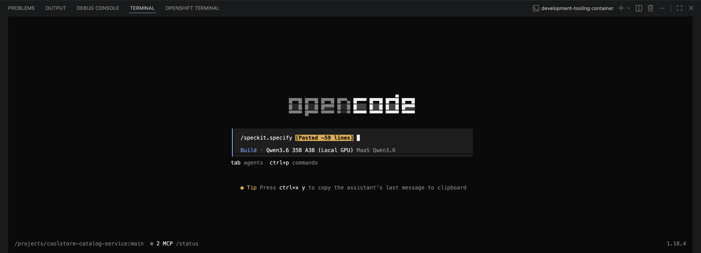

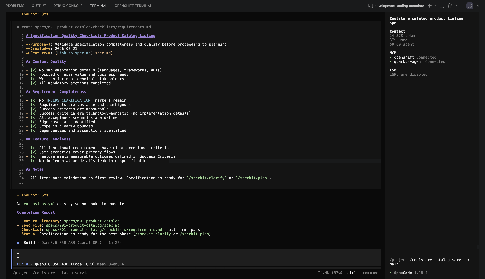

---

## Step 8 — Plan and tasks

1. Run `/speckit.plan`. Review `plan.md`: expect Quarkus REST with
   Jackson, an in-memory repository seeded at startup, constructor
   injection and proper logging per the REST conventions skill.
2. Run `/speckit.tasks`. Review `tasks.md`: ordered, individually
   verifiable work items, tests included — the test standards skill makes
   the agent plan tests as first-class tasks, not an afterthought.

**What you should see:** a plan that reads like your team's conventions,
because it is steered by them.

> Model tip: the default Qwen3.6 handles this well. For a heavier planning
> pass on a larger spec, switch to `nemotron-3-nano-30b-a3b` (131K context)
> — the model picker is a governed menu, not a credential decision.

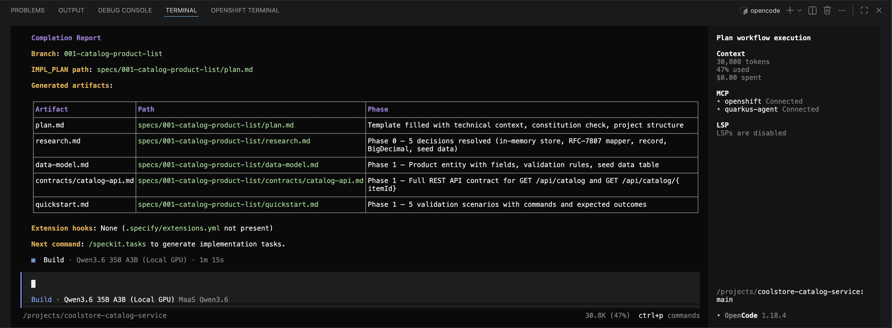

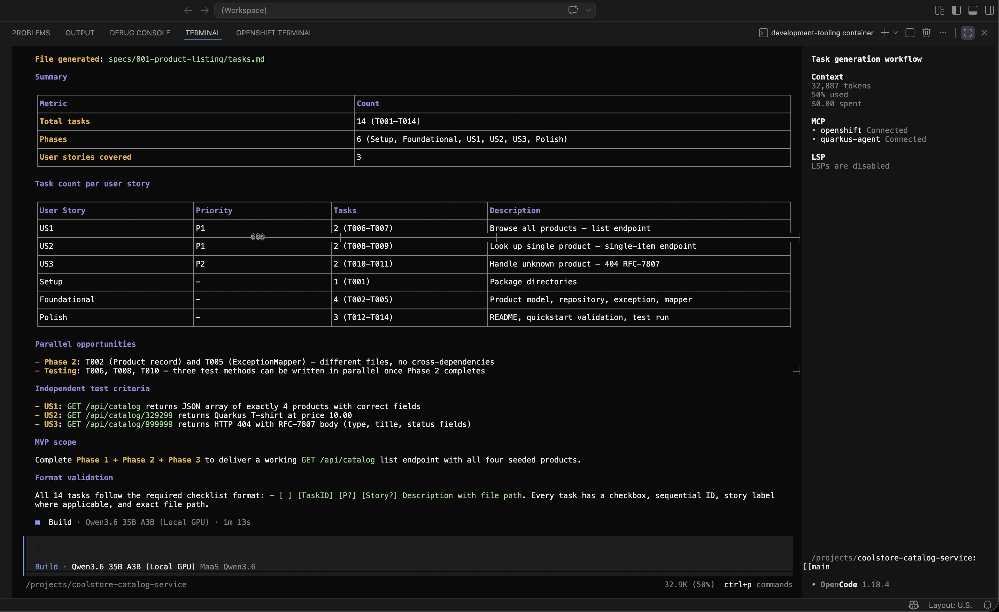

---

## Step 9 — Implement and verify locally

1. Run `/speckit.implement`. The agent works through the tasks: source,
   configuration, and tests. Review and approve the diffs as they come —
   you are the senior on this pair.

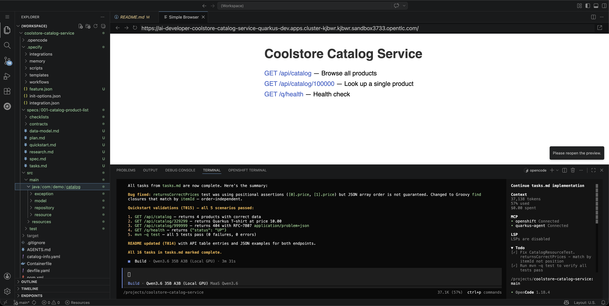

2. When it finishes, start dev mode (**Tasks: Run Task → devfile →
   2. Start Development mode**) and exercise the service:

```
curl -s localhost:8080/api/catalog
```

```
curl -s localhost:8080/api/catalog/329299
```

```
curl -s -i localhost:8080/api/catalog/999999
```

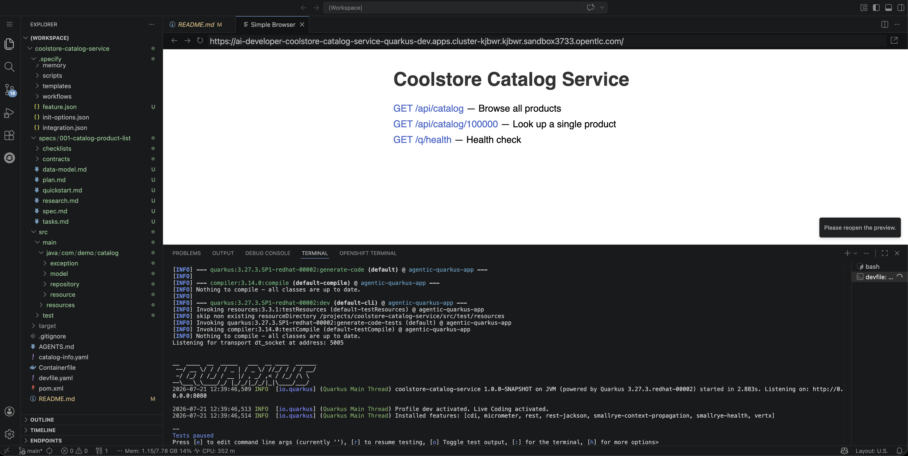

**What you should see:** four seed products on the list endpoint, the
Quarkus T-shirt by id, a proper 404 body for the unknown id, and tests
green.

---

## Step 10 — Push straight to green

1. Commit and push from the Source Control view (message:
   `Implement catalog products per spec 001`).
2. Watch the **CI** tab: your project's own `app-push` pipeline runs
   clone → build → **sonar-scan** → image build/push.
3. Open the **SonarQube (code quality)** link: quality gate **Passed** —
   new code with coverage from the agent-written tests, no new issues.

**What you should see:** a green run on the first real push.

> **The 060 contrast, completed:** same gate, same rules — different
> outcome. In 060 the flawed spec shipped smells and the gate went red; the
> fix cost a round trip. Here the standards were in the project before the
> first line was written — constitution, rules, skills, spec — and the
> agent internalized them. The gate did not catch anything, because there
> was nothing to catch. That is the maturity step: from *inspection* to
> *construction* quality.

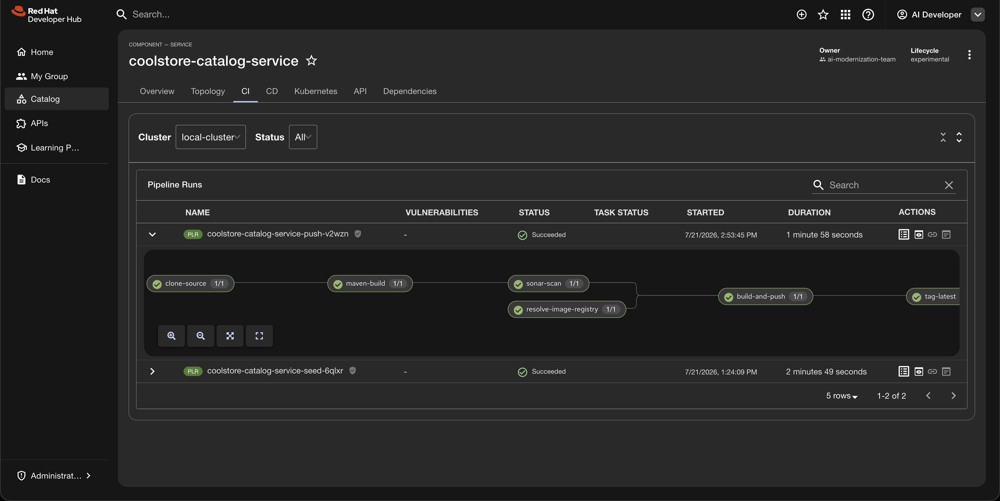

---

## Step 11 — Evolve the service with a second spec

Real services grow spec by spec — this is Fowler's *spec-anchored* level
in practice, on the codebase you just shipped.

1. Open the second brief:
   [`demo-assets/002-catalog-availability.md`](demo-assets/002-catalog-availability.md)
   — the catalog enriches products with live stock data from the
   **stage 060 inventory service** (deployed in `coolstore-dev`), with
   config-driven wiring and graceful degradation.
2. Run the cycle again: `/speckit.specify` (paste brief 002) → review →
   `/speckit.plan` → review → `/speckit.tasks` → `/speckit.implement`.
3. Verify locally — the catalog now decorates products with availability
   (in dev mode the inventory URL points at the cluster service; the
   degradation path answers even when inventory is unreachable):

```
curl -s localhost:8080/api/catalog/329299
```

```
mvn -q test
```

4. Commit (`Add availability from inventory per spec 002`) and push —
   second pipeline run, green again.
5. Back in Developer Hub, look at the two components side by side:
   `coolstore-catalog` consuming what `coolstore-inventory-service`
   provides — two stages of the maturity ladder, one product domain,
   integrated on the platform.

**What you should see:** products carrying `available`/`quantity` from
the live inventory service — itemIds `329299`, `329199`, `165613` show
real stock; `100000` (unknown to inventory) degrades gracefully to
`available: false`.

> **Why the second spec matters more than the first:** any tool can
> one-shot a greenfield service. Evolving a *running* service against a
> *live* dependency — with tests that mock it and configuration that
> targets it — is what daily engineering looks like. The spec captured
> the intent; the artifacts stayed in the repo; the service grew.


### Optional — Spec 003: AI product search through the governed gateway

For presenters with time:
[`demo-assets/003-catalog-ai-search.md`](demo-assets/003-catalog-ai-search.md)
adds natural-language product search via the platform LLM (with a
deterministic fallback). It lands the **double governance beat**: the
application consumes the same MaaS gateway — same keys, token limits,
and usage telemetry — as the coding assistant that built it. Developer
AI and application AI, one governed platform.

---

## Wrap-up

### What you proved

- **Self-service provisioning**: repo, namespace, pipeline, registry, and
  catalog entry in seconds — pre-approved, not improvised.
- **The platform proves itself first**: the seed run validated the entire
  delivery chain before you wrote any code.
- **Standards steer construction**: constitution + AGENTS.md + skills +
  spec made quality an input, not a hoped-for output.
- **Spec-driven beats prompt-driven for real work**: every artifact was
  reviewable before the next step amplified it.
- **Services evolve by spec**: the second cycle grew a running service
  against a live dependency — artifacts in the repo, gate green twice.
- **One governed AI platform** (with the optional spec 003): the
  assistant that writes the app and the app itself share the same
  gateway, keys, limits, and telemetry.

### Resetting the demo

Teardown is an operator action from the platform repository:

```
./scripts/delete-scaffolded-project.sh coolstore-catalog --yes
```

It removes the workspace, catalog entries, Argo app and namespace,
SonarQube history, and the GitHub and Quay repositories (see the script
header for credential requirements). Scaffold again anytime — the template
recreates everything in seconds.

### References

- [spec-kit — Spec-Driven Development toolkit](https://github.com/github/spec-kit)
- [Quarkus Insights #249 — Coding Agents](https://quarkus.io/blog/quarkus-insights-249-coding-agents/)
- [Quarkus Agent MCP](https://github.com/quarkusio/quarkus-agent-mcp)
- [OpenCode documentation](https://opencode.ai/docs/)
- [Red Hat Developer Hub — Golden Path templates](https://developers.redhat.com/rhdh)
