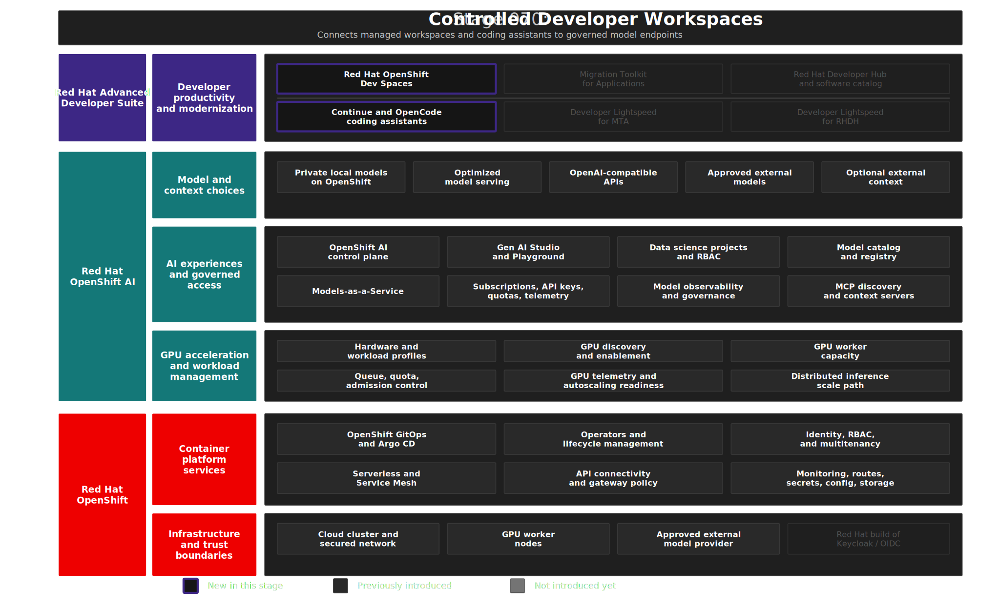

# Stage 070: Controlled Developer Workspaces

## Why This Matters

AI-assisted development is most useful when it appears inside the tools where code is written, tested, and reviewed. The enterprise concern is how to offer that experience without turning every laptop, plugin, and personal API key into a separate policy exception.

This stage moves the coding experience into managed OpenShift workspaces. Developers still use familiar IDE and terminal workflows, while model access flows through the MaaS layer created in Stage 040.

## Architecture



## What This Stage Adds

This stage adds a governed cloud development workspace layer.

- Red Hat OpenShift Dev Spaces deployed through operator-managed OpenShift resources.
- Per-user DevWorkspace definitions for the demo personas, with OpenShift identity and namespace isolation.
- Browser-based VS Code-style environments that can be recreated from Git and workspace definitions.
- Continue and OpenCode tooling configured to consume MaaS-published OpenAI-compatible endpoints.
- Coding exercises, Coolstore source, and the MTA VS Code extension for AI-assisted development and modernization workflows.

The capability added is a governed developer workspace layer. The workspace, source repositories, tools, and model access pattern are all platform-managed instead of being assembled manually on each developer machine.

## What To Notice And Why It Matters

Stage 070 moves AI-assisted development into managed Red Hat OpenShift Dev Spaces workspaces. Developers still use familiar IDE and terminal workflows, but Continue and OpenCode consume MaaS-published OpenAI-compatible endpoints instead of unmanaged local provider keys.

The essential proof point is a governed developer experience:

- Workspaces, source repositories, tools, and model configuration are platform-managed and reproducible.
- AI assistants consume centrally governed model endpoints instead of personal API keys.
- Local models keep prompts and code inside the OpenShift platform boundary.
- External models can use the same workflow only when policy allows provider-side processing.

This matters because regulated enterprises need AI coding assistance that fits existing controls for identity, network access, approved tooling, and data residency. Red Hat OpenShift Dev Spaces gives platform engineers reproducible cloud development environments, while MaaS keeps model access centralized so developer productivity does not depend on unmanaged laptops, plugins, or provider credentials.

## How Red Hat And Open Source Make It Work

Red Hat OpenShift Dev Spaces provides Kubernetes-based cloud development environments on OpenShift, built on Eclipse Che and DevWorkspace. Red Hat OpenShift supplies OAuth, routing, namespace isolation, RBAC, and runtime controls, while MaaS supplies the governed OpenAI-compatible model endpoint and API key pattern.

Continue provides the IDE assistant experience and OpenCode provides the terminal-based agent workflow. Because both tools consume standard OpenAI-compatible endpoints, developers keep familiar workflows while platform teams control workspace configuration, model access, and credential handling centrally.

## Trust Boundaries

Red Hat OpenShift Dev Spaces keeps workspaces, source access, tool configuration, and MaaS credentials under platform control, but the selected model path still defines where prompts and code are processed. Local models keep sensitive work inside OpenShift; external models are centrally governed through MaaS but processed by the provider, so data-residency policy, usage traceability, and human review remain essential for sovereignty and EU AI Act readiness.

## Red Hat Products Used

- **[Red Hat OpenShift Dev Spaces](https://www.redhat.com/en/technologies/cloud-computing/openshift/dev-spaces)** provides the managed cloud development environment.
- **[Red Hat OpenShift AI](https://www.redhat.com/en/technologies/cloud-computing/openshift/openshift-ai)** provides the MaaS model endpoints consumed by the developer tools.
- **[Red Hat OpenShift](https://www.redhat.com/en/technologies/cloud-computing/openshift)** provides identity, routing, namespace isolation, and runtime controls for the workspaces.

## Open Source Projects To Know

- [Eclipse Che](https://www.eclipse.org/che/) is the upstream cloud development environment project behind OpenShift Dev Spaces.
- [DevWorkspace](https://github.com/devfile/devworkspace-operator) provides Kubernetes-native workspace orchestration.
- [Continue](https://www.continue.dev/) is an open source AI code assistant that can use OpenAI-compatible model endpoints.
- [OpenCode](https://opencode.ai/) provides terminal-based AI coding workflows that can consume MaaS endpoints.

## Deploy And Validate

Operational commands are kept here for workshop operators.

```bash
./stages/070-controlled-developer-workspaces/deploy.sh
./stages/070-controlled-developer-workspaces/validate.sh
```

Manifests: [`gitops/stages/070-controlled-developer-workspaces/base/`](../../gitops/stages/070-controlled-developer-workspaces/base/)

## References

- [Red Hat OpenShift Dev Spaces documentation](https://docs.redhat.com/en/documentation/red_hat_openshift_dev_spaces/)
- [MaaS code assistant quickstart](https://docs.redhat.com/en/learn/ai-quickstarts/rh-maas-code-assistant)
- [Continue](https://www.continue.dev/)
- [A guide to AI code assistants with Red Hat OpenShift Dev Spaces](https://developers.redhat.com/articles/2026/01/28/guide-ai-code-assistants-red-hat-openshift-dev-spaces)
- [OpenCode: Model-neutral AI coding assistant for OpenShift Dev Spaces](https://developers.redhat.com/articles/2026/04/22/opencode-model-neutral-ai-coding-assistant-openshift-dev-spaces)

## Next Stage

[Stage 080: AI-Assisted Application Modernization](../080-ai-assisted-application-modernization/README.md) applies the same governed model access pattern to application modernization.
