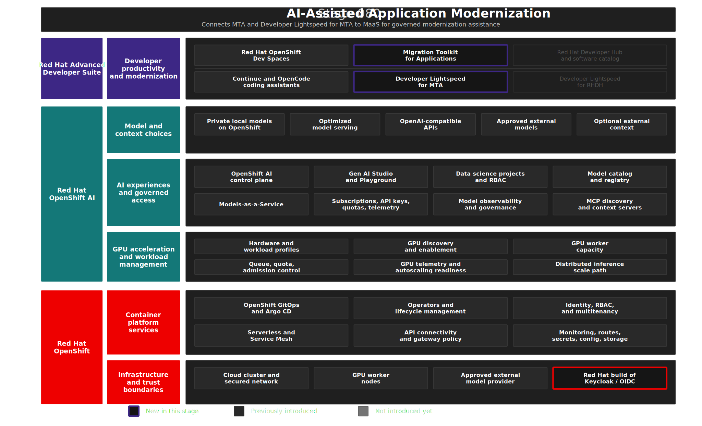

# Stage 080: AI-Assisted Application Modernization

## Why This Matters

Enterprise AI is more useful when it is embedded in real engineering workflows instead of isolated chat sessions. Application modernization is a strong example: many organizations have Java EE and JBoss EAP portfolios that need to move toward modern runtimes such as Quarkus, but the work requires analysis, code understanding, migration rules, and developer review.

Generic prompting is not enough for that kind of work. This stage shows how Migration Toolkit for Applications (MTA) and Red Hat Developer Lightspeed for MTA connect static analysis, migration context, IDE workflow, and governed model access so AI assistance supports a modernization process rather than replacing it.

## Architecture



## What This Stage Adds

This stage adds an AI-assisted application modernization workflow.

- Migration Toolkit for Applications 8.1 with MTA Hub and UI for application inventory, static analysis, and issue discovery.
- Red Hat Developer Lightspeed for MTA services for AI-assisted remediation suggestions grounded in modernization findings.
- A centrally managed LLM proxy path that sends model requests through MaaS instead of workspace-local provider credentials.
- OpenShift OAuth federation through the MTA Keycloak / Red Hat build of Keycloak identity path.
- Red Hat OpenShift Dev Spaces integration through the MTA VS Code extension.

The demo application is [konveyor-ecosystem/coolstore](https://github.com/konveyor-ecosystem/coolstore), a Java EE / JBoss-style sample. The `main` branch is the legacy starting point and the `quarkus` branch is the completed reference target.

## What To Notice And Why It Matters

Stage 080 applies governed model access to application modernization. Migration Toolkit for Applications analyzes the application portfolio target, the MTA VS Code extension brings findings into the developer workflow, and Red Hat Developer Lightspeed for MTA requests targeted assistance through the LLM proxy and MaaS.

The essential proof point is AI assistance grounded in modernization evidence:

- Migration Toolkit for Applications provides findings from rules, static analysis, and application inventory.
- Developer Lightspeed for MTA uses that context to request focused remediation suggestions instead of generic chat output.
- The LLM proxy centralizes model access, so developers do not manage provider credentials in the workspace.
- The primary path sends modernization context through MaaS to a private model on OpenShift, with any external model choice requiring separate trust-boundary review.

This matters because enterprise modernization is a risk-managed engineering workflow, not a generic prompting exercise. Regulated organizations need traceable analysis, controlled model access, and human review before code changes are accepted. Red Hat Developer Lightspeed for MTA makes AI useful inside that workflow while MaaS preserves control over where modernization context is processed.

## How Red Hat And Open Source Make It Work

MTA provides the modernization platform: analysis engine, application inventory, migration rules, UI, and developer workflow integration. Red Hat Developer Lightspeed for MTA adds AI-assisted code resolution based on MTA findings. The LLM proxy centralizes model access for the MTA services instead of placing provider credentials in each workspace.

```text
Developer in Dev Spaces
  -> MTA VS Code extension
  -> MTA Hub
  -> LLM proxy
  -> MaaS Gateway
  -> Private Nemotron model
  -> Suggested migration fix
```

OpenShift provides the runtime, routing, storage, identity integration, and operator lifecycle for MTA. Red Hat build of Keycloak is used in the MTA identity path. Red Hat OpenShift AI MaaS publishes the private Nemotron endpoint that the LLM proxy calls.

The open source foundation includes Konveyor for modernization analysis, Kai for AI-assisted modernization workflows, and the Coolstore sample application. Red Hat integrates those pieces into MTA and connects them to the same OpenShift and OpenShift AI platform controls used in the earlier stages.

Red Hat Developer Lightspeed for MTA is documented as a Technology Preview feature in MTA 8.1. This stage is included because it is central to the demo narrative: modernization context from MTA is routed through a governed model endpoint instead of unmanaged developer credentials.


## Trust Boundaries

Modernization context can include source code, static-analysis findings, dependency information, and remediation suggestions, so the model path must match the data classification. The private MaaS path keeps this context inside OpenShift, while any approved external model path must be explicitly reviewed; centralized LLM proxy credentials, traceable model access, and human review support sovereignty and EU AI Act readiness but do not remove the need for legal, security, and application-owner approval.

## Red Hat Products Used

- **Migration Toolkit for Applications 8.1** provides the modernization analysis, application inventory, migration rules, and developer workflow integration.
- **Red Hat Developer Lightspeed for MTA** adds AI-assisted code resolution to the modernization workflow.
- **Red Hat OpenShift AI MaaS** provides the governed model endpoint used by the MTA LLM proxy.
- **Red Hat OpenShift Dev Spaces** hosts the developer workspace and MTA VS Code extension.
- **Red Hat build of Keycloak** provides the identity layer used by MTA and the federated OpenShift login flow.
- **Red Hat OpenShift** provides the runtime platform, identity integration, routes, storage, and operations foundation.

## Open Source Projects To Know

- [Konveyor](https://www.konveyor.io/) is the upstream community for application modernization capabilities behind MTA.
- [Kantra](https://github.com/konveyor/kantra) provides CLI-based application analysis capabilities in the Konveyor ecosystem.
- [Kai](https://github.com/konveyor/kai) is the upstream AI-assisted modernization effort behind Developer Lightspeed-style workflows.
- [Coolstore](https://github.com/konveyor-ecosystem/coolstore) is the Java EE sample application used to demonstrate the migration path to Quarkus.


## Where This Fits In The Full Platform

| Earlier capability | How MTA uses it |
|--------------------|-----------------|
| Stage 010 platform identity | MTA login is federated through OpenShift OAuth |
| Stage 040 MaaS | Red Hat Developer Lightspeed for MTA calls a governed model endpoint |
| Stage 070 Red Hat OpenShift Dev Spaces | The MTA extension runs in the developer workspace |
| Stage 090 Red Hat Developer Hub | The modernization workflow can become a portal golden path |

## Deploy And Validate

Operational commands are kept here for workshop operators.

```bash
./stages/080-ai-assisted-application-modernization/deploy.sh
./stages/080-ai-assisted-application-modernization/validate.sh
```

Manifests: [`gitops/stages/080-ai-assisted-application-modernization/base/`](../../gitops/stages/080-ai-assisted-application-modernization/base/)

## References

- [Coolstore sample application](https://github.com/konveyor-ecosystem/coolstore)
- [MTA 8.1 documentation](https://docs.redhat.com/en/documentation/migration_toolkit_for_applications/8.1/)
- [MTA 8.1 installation guide](https://docs.redhat.com/en/documentation/migration_toolkit_for_applications/8.1/html-single/installing_the_migration_toolkit_for_applications/index)
- [Red Hat Developer Lightspeed for MTA 8.1](https://docs.redhat.com/en/documentation/migration_toolkit_for_applications/8.1/html-single/configuring_and_using_red_hat_developer_lightspeed_for_mta/index)
- [MTA VS Code extension 8.1](https://docs.redhat.com/en/documentation/migration_toolkit_for_applications/8.1/html-single/configuring_and_using_the_visual_studio_code_extension_for_mta/index)
- [MaaS code assistant quickstart](https://docs.redhat.com/en/learn/ai-quickstarts/rh-maas-code-assistant)

## Next Stage

[Stage 090: Developer Portal and Self-Service](../090-developer-portal-self-service/README.md) turns the platform capabilities into a self-service developer portal experience.
