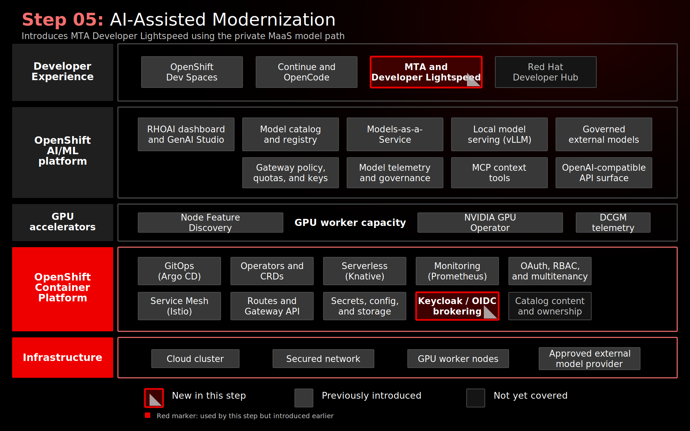

# Stage 080: AI-Assisted Application Modernization

## Why This Matters

Enterprise AI is more useful when it is embedded in real engineering workflows instead of isolated chat sessions. Application modernization is a strong example: many organizations have Java EE and JBoss EAP portfolios that need to move toward modern runtimes such as Quarkus, but the work requires analysis, code understanding, migration rules, and developer review.

Generic prompting is not enough for that kind of work. This stage shows how Migration Toolkit for Applications (MTA) and Red Hat Developer Lightspeed for MTA connect static analysis, migration context, IDE workflow, and governed model access so AI assistance supports a modernization process rather than replacing it.

## Architecture



## What This Stage Adds

- Migration Toolkit for Applications 8.1, deployed from [`gitops/stages/080-ai-assisted-application-modernization/base/`](../../gitops/stages/080-ai-assisted-application-modernization/base/) through the MTA Operator and `Tackle` custom resource.
- MTA Hub and UI for application inventory, static analysis, issue discovery, and modernization workflow context.
- Red Hat Developer Lightspeed for MTA services, including Kai API, Solution Server, database, and LLM proxy components.
- A centrally managed `kai-api-keys` Secret and post-sync MaaS URL patching so the MTA LLM proxy calls the MaaS-published `nemotron-3-nano-30b-a3b` model.
- OpenShift OAuth federation through the MTA Keycloak / Red Hat build of Keycloak identity path, plus an OpenShift ConsoleLink for demo access.
- Integration with the Dev Spaces workspace from Stage 070 through the MTA VS Code extension.

The demo application is [konveyor-ecosystem/coolstore](https://github.com/konveyor-ecosystem/coolstore), a Java EE / JBoss-style sample. The `main` branch is the legacy starting point and the `quarkus` branch is the completed reference target.

## What To Notice In The Demo

Show the workflow, not only the suggested code change.

1. MTA analyzes Coolstore and identifies migration issues.
2. The developer opens the same application in Dev Spaces.
3. The MTA VS Code extension brings migration issues into the IDE.
4. Red Hat Developer Lightspeed for MTA requests an AI-assisted fix.
5. The LLM request flows through the MTA LLM proxy to MaaS.
6. The developer reviews and applies a targeted change.
7. Analysis is run again to show progress.

The important message is context. MTA gives the model migration findings from rules and static analysis. Red Hat Developer Lightspeed for MTA uses that context to request a targeted suggestion through the LLM proxy. The developer still reviews and applies the change.

The trust boundary is also visible. In the primary demo path, modernization context goes through MaaS to the private Nemotron model on OpenShift. If another MaaS model is selected later, that model path must be evaluated separately, especially for external providers.

## How Red Hat And Open Source Make It Work

MTA provides the modernization platform: analysis engine, application inventory, migration rules, UI, and developer workflow integration. Red Hat Developer Lightspeed for MTA adds AI-assisted code resolution based on MTA findings. The LLM proxy centralizes model access for the MTA services instead of placing provider credentials in each workspace.

```text
Developer in Dev Spaces
  -> MTA VS Code extension
  -> MTA Hub
  -> LLM proxy
  -> MaaS Gateway
  -> Private Nemotron model
  -> Suggested migration fix
```

OpenShift provides the runtime, routing, storage, identity integration, and operator lifecycle for MTA. Red Hat build of Keycloak is used in the MTA identity path. Red Hat OpenShift AI MaaS publishes the private Nemotron endpoint that the LLM proxy calls.

The open source foundation includes Konveyor for modernization analysis, Kai for AI-assisted modernization workflows, and the Coolstore sample application. Red Hat integrates those pieces into MTA and connects them to the same OpenShift and OpenShift AI platform controls used in the earlier stages.

## Red Hat Products Used

- **Migration Toolkit for Applications 8.1** provides the modernization analysis, application inventory, migration rules, and developer workflow integration.
- **Red Hat Developer Lightspeed for MTA** adds AI-assisted code resolution to the modernization workflow.
- **Red Hat OpenShift AI MaaS** provides the governed model endpoint used by the MTA LLM proxy.
- **Red Hat OpenShift Dev Spaces** hosts the developer workspace and MTA VS Code extension.
- **Red Hat build of Keycloak** provides the identity layer used by MTA and the federated OpenShift login flow.
- **Red Hat OpenShift** provides the runtime platform, identity integration, routes, storage, and operations foundation.

## Open Source Projects To Know

- [Konveyor](https://www.konveyor.io/) is the upstream community for application modernization capabilities behind MTA.
- [Kantra](https://github.com/konveyor/kantra) provides CLI-based application analysis capabilities in the Konveyor ecosystem.
- [Kai](https://github.com/konveyor/kai) is the upstream AI-assisted modernization effort behind Developer Lightspeed-style workflows.
- [Coolstore](https://github.com/konveyor-ecosystem/coolstore) is the Java EE sample application used to demonstrate the migration path to Quarkus.

## Trust Boundaries

- For sensitive code, use the private MaaS model path so prompts and source context remain on the OpenShift platform.
- If an organization approves external models for selected modernization tasks, MaaS can expose those models through the same controlled interface.
- Developers do not manage provider credentials in the primary flow; the LLM proxy uses centrally managed credentials.

## Why This Is Worth Knowing

This stage shows that AI-assisted development is not limited to chat windows and autocomplete. With the right platform pattern, AI can support strategic engineering work such as application modernization.

The reusable lesson is:

- Static analysis provides trusted context.
- The model access layer provides governance.
- The developer extension provides workflow integration.
- Human review remains part of the process.

That combination is much more credible for enterprise modernization than unmanaged AI prompting.

## Where This Fits In The Full Platform

| Earlier capability | How MTA uses it |
|--------------------|-----------------|
| Stage 010 platform identity | MTA login is federated through OpenShift OAuth |
| Stage 040 MaaS | Red Hat Developer Lightspeed for MTA calls a governed model endpoint |
| Stage 070 Red Hat OpenShift Dev Spaces | The MTA extension runs in the developer workspace |
| Stage 090 Red Hat Developer Hub | The modernization workflow can become a portal golden path |

## Deploy And Validate

Operational commands are kept here for workshop operators.

```bash
./stages/080-ai-assisted-application-modernization/deploy.sh
./stages/080-ai-assisted-application-modernization/validate.sh
```

Manifests: [`gitops/stages/080-ai-assisted-application-modernization/base/`](../../gitops/stages/080-ai-assisted-application-modernization/base/)

## References

- [Coolstore sample application](https://github.com/konveyor-ecosystem/coolstore)
- [MTA 8.1 documentation](https://docs.redhat.com/en/documentation/migration_toolkit_for_applications/8.1/)
- [MTA 8.1 installation guide](https://docs.redhat.com/en/documentation/migration_toolkit_for_applications/8.1/html-single/installing_the_migration_toolkit_for_applications/index)
- [Red Hat Developer Lightspeed for MTA 8.1](https://docs.redhat.com/en/documentation/migration_toolkit_for_applications/8.1/html-single/configuring_and_using_red_hat_developer_lightspeed_for_mta/index)
- [MTA VS Code extension 8.1](https://docs.redhat.com/en/documentation/migration_toolkit_for_applications/8.1/html-single/configuring_and_using_the_visual_studio_code_extension_for_mta/index)
- [MaaS code assistant quickstart](https://docs.redhat.com/en/learn/ai-quickstarts/rh-maas-code-assistant)

## Next Stage

[Stage 090: Developer Portal and Self-Service](../090-developer-portal-self-service/README.md) turns the platform capabilities into a self-service developer portal experience.
