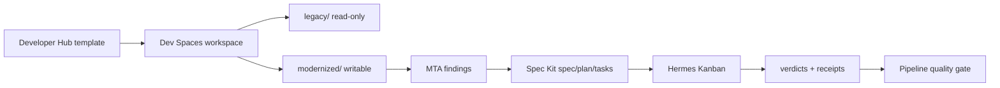
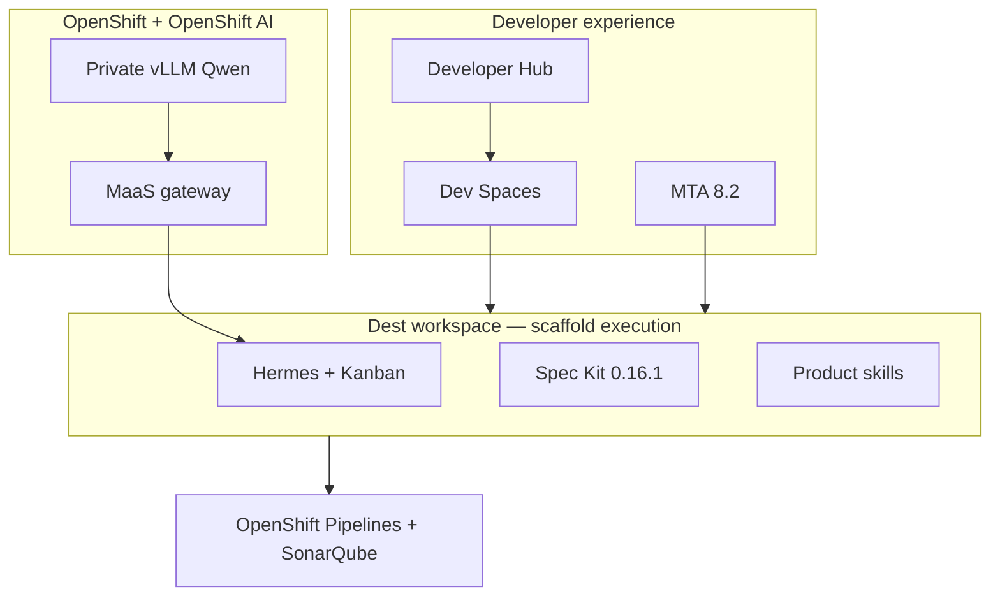
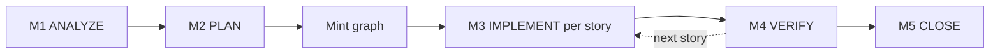
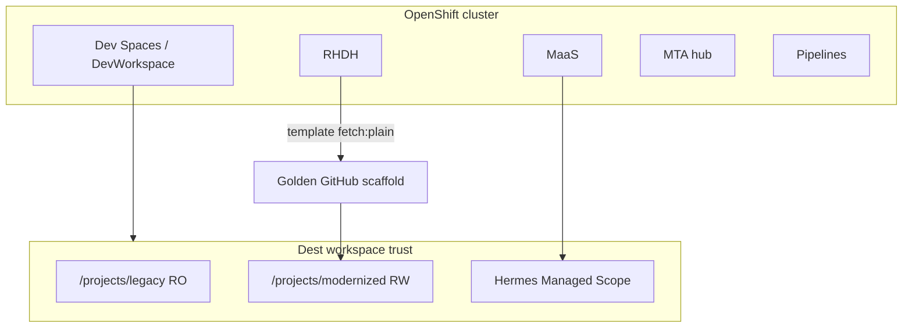

# Stage 080 — Solution Architecture

**This is the solution architecture of Stage 080**, not of the `rhoai3-coding-demo` workshop. Workshop architecture stays in the [root README](../../README.md) and this stage's [README.md](README.md). Keep this file — and any later engineering companions — inside `stages/080-ai-autonomous-migration/`. Do not lift it into `docs/`, repo root, or `scaffold-repo/`.

**Audience:** platform engineers and implementing agents building the Stage 080 migration factory.  
**Not dest execution.** The golden scaffold (`scaffold-repo/quarkus-migration-scaffold/`, published as `quarkus-migration-scaffold` today and `-v2` on branch `harness-v2`) is what runs inside the OpenShift Dev Spaces workspace. This file does not belong in that tree.

| Document | Job |
|---|---|
| [README.md](README.md) | Demo walkthrough. What the room shows. |
| **This file** | Implementation architecture. Design decisions, product split, flow, governance, status. |
| `scaffold-repo/` | Dest execution only: identity, pins, skills, native Hermes config, slim kernel when it lands. |

Same-PR rule: if implementation changes, update this file and the README architecture delta / maturity line together.

**Agents:** consume and contribute using [§10](#10-how-agents-consume-and-contribute). Do not treat the README wrap-up as a factory ship. Do not copy this file into `scaffold-repo/` or dest.

**Pins (live seat):** Hermes **v0.20.4** (`v2026.8.18`), Spec Kit **0.16.1**, Red Hat Quarkus BOM **3.27.3.SP1-redhat-00002**. Pin moves only on Operator GO. Official product behavior is captured under `.agents/skills/` (`hermes-*`, `mta-*`, `rhdh-*`, `ocp-devspaces-*`).

---

## 1. Purpose and outcomes

**Problem.** Legacy Spring Boot services are an expanding attack surface and a compliance deadline (EU Cyber Resilience Act). Manual migration does not scale. Unharnessed agents invent facts, write outside the destination, and claim done without MTA or runtime proof.

**Target outcome.** A governed **migration factory**: self-service onboard from Developer Hub, MTA as ground truth, Spec Kit for plan (never `/speckit.implement`), Hermes Kanban for work that must survive restarts, product skills for Spring→Quarkus, pipeline as merge authority.

**Scope.** Stage 080 implementation on this workshop: GitOps template, Dev Spaces workspace, dest golden, M1–M5 process, MaaS-pinned models, CI quality gate.

**Non-goals.** A Kubernetes Hermes operator (OpenShift is not an official Hermes install surface). Silent model failover (`fallback_providers`). Copying this document into the dest golden. Closing Gate P-kernel on the profiles GO.

---

## 2. Demo user journey

The click-by-click script is the [README](README.md). One-page journey:

1. **Onboard** — Developer Hub **Application migration** template. Destination repo + namespace + pipeline. Workspace clones `/projects/legacy` (read-only) beside `/projects/modernized` (writable dest).
2. **Analyze** — MTA (in-workspace panel and/or harness `mta-cli` / kantra). Findings are the checklist. The agent does not define done.
3. **Plan** — Spec Kit specify → plan → tasks. Stop. Create Kanban cards. Never `/speckit.implement`.
4. **Watch** — `hermes kanban watch` before dispatch. Audit with `list` / `show` / `runs` and verdict JSON.
5. **Close** — Honest exit today is M4 provisional evidence, not a claimed M5 factory ship.

---

## 3. Solution at a glance

The factory **consumes** stages 010–070. It does not re-own GPU, MaaS, or RHDH.

**Factory boundary.** Everything the agent may write is the isolated destination clone. Legacy is read-only. Models are reached only through MaaS. Merge is the pipeline, not a person and not the agent.

**External dependencies.** Git hosting for dest publish, MaaS subscription keys, optional MiniMax exception (typed escalation, never default, never silent fallback).

Interactive diagram: [images/architecture-e2e-stack.html](images/architecture-e2e-stack.html).

---

## 4. Products and responsibilities

| Product | Responsibility in this stage |
|---|---|
| Developer Hub | Self-service **Application migration** template; catalog component for the **destination** only |
| Dev Spaces | Per-run workspace; Managed Scope Hermes pin; MTA extension pack |
| MTA 8.2 / kantra | Ground-truth analysis. Human panel and harness M1 share rulesets from `migration.yaml` |
| Spec Kit | `spec.md` → `plan.md` → `tasks.md`. Advisory analyze. Not the Kanban converter |
| Hermes Agent | Orchestrator workers, Kanban lifecycle, one terminator per card |
| OpenShift AI / MaaS | Identity, API keys, quotas, telemetry for every model call |
| OpenShift Pipelines + SonarQube | Merge authority after push |
| Keycloak (platform SSO) | Attributed identity across RHDH, MTA, cluster |
| OpenRewrite | Deterministic transforms where a recipe exists — product skill, not a second orchestrator |

---

## 5. How the migration factory works

Live glossary: **M1 ANALYZE → M2 PLAN → M3 IMPLEMENT → M4 VERIFY → M5 CLOSE**. Older SEQUENCE / SPECIFY / EVALUATE labels are retired.

| Phase | Enabling surface | Artifacts | Live dest vs target |
|---|---|---|---|
| M1 | Hermes card + MTA skill + inventory | Findings, inventory, type graph. `generated` is **derived at read time from path**, not a trusted stored flag | Implemented on dest |
| M2 | Hermes planner + Spec Kit | `spec.md` / `plan.md` / `tasks.md`. Overlay does not dest-rewrite `tasks.md` after mint | Live dest **blocked** on 1:N split vs 1:1 coverage (PetClinic v42). Target: typed partition + sanctioned supersede map |
| Mint | Wave-holder + verifier card | One K1 body per story; `kanban_create` + **inline** body; exact `created_cards` on complete | Authoring tree on `harness-v2` `a39b7d2d` deleted `dispatch-phase` / `handover-mint.py`. Overlay dest leftover still has v1 until HV-1+wipe. **Target:** K4 converter after Gate P-kernel copies the **typed partition** into `files_writable`. OBJECT scraping paths from `tasks.md` prose |
| M3 | One card per story | Writes only `files_writable`. One Kanban terminator | Live dest. Target write fence is one shell `pre_tool_call` (`fail_closed`), not a claimed OS boundary until adversarial tests |
| M4 | Gate cards | Runtime product oracles (startup, parity, persistence). Compile and MTA rescan **support**, they do not replace | Owner/Pet **PROVISIONAL_ACCEPT** demonstrated historically; full slice M4 on current v42 **not** claimed |
| M5 | Factory / ACCEPT | Pipeline green. Waiver cannot author ACCEPT | **Not demonstrated** for Owner/Pet ship |

**Inner loop:** gates → fix → re-dispatch within retries. **Parents** sequence stories. **Steering loop:** humans improve skills in versioned PRs; agents do not silently rewrite `.hermes/skills/**` mid-run.

**Grounding.** Every hand-off must be derived from the previous artifact, not recalled. Live dest still runs G1–G9-style checks; `NOT-LANDED` must stay visible. Target authoring: refusals name the **remedy** (including the wrong reading); oracles report the **full gap set**, not the first failure; coverage is **1:N with a named supersede set** (a whole-domain `ClinicService` splits into per-aggregate classes; the old `dest_file` is not kept as a dummy). HTTP shapes stay 1:1 (`endpoints_multi` is a routing conflict).

---

## 6. Agent automation and governance

**Agent = Model + Harness** ([Harness Engineering for Coding Agents](https://martinfowler.com/articles/harness-engineering.html)). Guides steer before action; sensors catch after. Computational sensors (build, tests, MTA) run early; inferential sensors guard expensive exits. A red sensor must **teach** ([Maintainability sensors](https://martinfowler.com/articles/sensors-for-coding-agents.html)).

Red Hat's [open blueprint for cloud-native AI agents](https://developers.redhat.com/articles/2026/07/20/architect-open-blueprint-cloud-native-ai-agents) maps here as Agent-as-a-Workload: the loop runs in Dev Spaces, models only through MaaS, tools through governed endpoints.

| Role | Authority | Must not |
|---|---|---|
| M1 analyzer | Read legacy, emit inventory/findings | Write dest application sources |
| M2 planner | Spec Kit artifacts + typed partition | Implement; dest-rewrite `tasks.md` after mint |
| Mint writer | Create the graph, complete with exact `created_cards` | Import `create_task`; mix CLI + tool + internal API |
| Mint verifier | Check the whole graph, then complete **or** sticky `kanban_block` | Human `ack_gate`; `kanban_request_review` as the refuse path (a reviewer complete would release M3) |
| M3 implementer | Write `files_writable` only | Complete without a terminator; invent identity/scope |
| M4 verifier | Runtime oracles | Treat compile-only as ACCEPT |

**Isolation.** Writable dest clone only. Legacy is read-only. Secrets stay in managed `.env`, never under `HERMES_HOME` in git.

**Refusal and escalation.** There is no native `refused` status. The legal non-complete terminator is sticky `kanban_block`. Clean exit while `running` is `protocol_violation`. `kanban daemon --force` is not a recovery design.

**Rollback.** Dest git + pipeline. Do not dest-complete Operator ack gates. Harvest a live dest before any wipe.

**Named profiles.** Operator GO `231808Z` lifts R-V14.10 HOLD for **two dest worker profiles** (`orchestrator`, `implementer`). R-V14.10 stays as a rule id — do not delete it. Create with `hermes profile create --no-alias` (no `--clone`; EX-4). M2 / mint-verifier assign `orchestrator`; M3 assign `implementer`. Dest-armed (a) is unmeasured until Review verifies seated dest schemas. OBJECT EX-4 `analyzer`/`planner`/`validator` names, overlay v1 profiles, and copying this file into the golden.

---

## 7. Deployment overview

**Trust boundaries.** Prompts and dest source for the primary model stay on-cluster (private Qwen). MiniMax is an explicit exception: prompts leave the cluster; never silent failover. MTA Developer Lightspeed stays off; the dest harness is the remediation engine.

**Model pin (invariants).** Main = `qwen27b` / `qwen3-6-27b`. No `fallback_providers`. Auxiliary compression `auto`. Recipe, YAML, and “add a model later” live in [docs/OPERATIONS.md](../../docs/OPERATIONS.md) (Model selection record). Writer: `gitops/stages/050-advanced-app-platform/base/devspaces/maas-api-key-provisioning.yaml` (`ensure_hermes`).

**Workspace kind.** Live dest uses `dir:/projects/modernized`. Native `scratch` / `dir:` / `worktree:` is a measured choice, not v1 law. Do not freeze serial-via-parents until dest PVC / worktree is measured.

---

## 8. Implementation status and known gaps

| Item | Status |
|---|---|
| Platform 010–070 consumed by 080 | Implemented |
| RHDH Application migration template + dest publish | Implemented (live Argo still overlay / v1 golden) |
| M1 MTA + inventory on dest | Implemented on prior dest cuts; v42 campaign **abandoned** (not wiped) |
| Kanban watch / list / show / runs | Demonstrated on earlier dest cuts |
| M4 full runtime ACCEPT / M5 factory ship | Planned / **not demonstrated** for Owner/Pet ship |
| v1 dest harness (`dispatch-phase`, `handover-mint.py`, human `ack_gate`, `.hermes/home/scripts/`) | Overlay dest leftover until HV-1+wipe GO. **Deleted, not ported**, on `harness-v2` `a39b7d2d` |
| v2 native tree (Phase N) | **Landed** `harness-v2` `a39b7d2d`: product skills + config template; no mint / `home/scripts` / `ack_gate`. Golden `-v2` **not published**. Dest provision **HOLD** |
| Slim kernel K1–K4 | **HOLD**. Gate P-pack CLOSED; Gate P-kernel OPEN (K2 adversarial write-escape and dest-armed role (a) still `[U]`; scratch container (a) is not dest role (a)) |
| Dest named profiles (`orchestrator` / `implementer`) | **DEFINED** (Operator GO `231808Z`). GitOps creates both without `--clone`. Dest-armed (a) **unmeasured**. OBJECT EX-4 four-seat names / overlay v1 |
| K2 write fence as a claimed control | Unproven until adversarial suite + tool subtraction or container backend |
| K3 live PID reclaim / gateway tick | Unproven (`recompute_ready` stands in; no `kanban daemon --force`) |
| 1:N supersede coverage | **Landed** in KEEP `check-partition-coverage` on `a39b7d2d`. Not dest-measured |
| Hermes dashboard / `web_dist` | Never a demo surface (v37–v42 `state=failed`). Later GO |

**Principal risks.** Mixing this SAD into the dest golden. Harvesting v1 mint prose into v2. Treating README wrap-up slogans as DEMONSTRATED. Dest-applying `harness-v2` onto a v1 dest. Calling this file an overlay remnant (it belongs in this stage folder).

**v2 git isolation.** Same `scaffold-repo/` path as v1. Isolation is a **new GitHub golden** (`quarkus-migration-scaffold-v2`), not a sibling tree and not a rename of v1. Live Argo stays overlay until GitOps GO. OBJECT: `bootstrap-scaffold-repos.sh` from `harness-v2` (force-pushes v1); dest-apply onto v42; dest-complete Operator ack gates; `kanban daemon --force`; wipe v42 before HV-1 harvest; provision leftover `greeting-v2`; resume aborted `scaffold-repo-v2/`. Publish only with `scripts/bootstrap-migration-scaffold-v2.sh` on Operator GO. Ops table: [docs/OPERATIONS.md](../../docs/OPERATIONS.md) (branch isolation).

---

## 9. Detailed documentation map

| Home | Content |
|---|---|
| [README.md](README.md) | Demo walkthrough |
| This file | Implementation architecture |
| [docs/OPERATIONS.md](../../docs/OPERATIONS.md) | Deploy order, Hermes model recipe, GitOps |
| [docs/TROUBLESHOOTING.md](../../docs/TROUBLESHOOTING.md) | Dest/workspace failure recovery |
| [BACKLOG.md](../../BACKLOG.md) | Deferred work |
| `.agents/skills/hermes-*`, `mta-*`, `rhdh-*`, `ocp-devspaces-*` | Official captures (product, version, URL, date, support status) |
| `gitops/stages/050-advanced-app-platform/` | Template, Dev Spaces init, MTA, RHDH |
| `stages/080-ai-autonomous-migration/validate.sh` | Stage readiness |
| `scripts/bootstrap-migration-scaffold-v2.sh` | v2 golden publish only. Never `bootstrap-scaffold-repos.sh` from `harness-v2` |

Engineering companions (workflow, orchestration, contracts, acceptance) are **not opened in this change**. Do not invent empty stubs. When they land, they stay in this stage directory and **point at** scaffold paths; they are not dest execution and they are not workshop architecture.

### Glossary

| Term | Meaning |
|---|---|
| Dest | Per-run destination repository and Dev Spaces workspace |
| Golden | GitHub scaffold the template fetches |
| Sticky block | `kanban_block` event that holds children until complete, not until unblock |
| Typed partition | Structured per-story `files_writable` + optional supersede set. Write-set authority |
| PROVISIONAL_ACCEPT | M4 evidence with `ship=false` |

### Official references

| Product | Docs |
|---|---|
| MTA 8.2 | https://docs.redhat.com/en/documentation/migration_toolkit_for_applications/8.2/ |
| Hermes Agent | https://hermes-agent.nousresearch.com/docs |
| Hermes models | https://hermes-agent.nousresearch.com/docs/user-guide/configuring-models |
| Spec Kit | https://github.com/github/spec-kit/blob/main/spec-driven.md |
| Developer Hub | https://developers.redhat.com/rhdh |
| OpenShift AI | https://docs.redhat.com/en/documentation/red_hat_openshift_ai_self-managed/ |
| MaaS coding quickstart | https://docs.redhat.com/en/learn/ai-quickstarts/rh-maas-code-assistant |

---

## 10. How agents consume and contribute

This section is the contract for every implementing agent (platform repo, nested campaign, and dest workers). This file is **Stage 080** solution architecture, contained in this directory. Workshop architecture is the root README. Campaign-local GO/HOLD still lives in nested AD-019; dest execution still lives in `scaffold-repo/`.

### Consume

Read the document that owns the question. Do not flatten them.

| Question | Read this | Do not |
|---|---|---|
| What does the room show / click? | [README.md](README.md) | Treat wrap-up as M5 `DEMONSTRATED` |
| How do we build the factory? Design, products, M1–M5, governance, status | **This file** | Invent a second SAD in dest or `docs/architecture/` stubs |
| What runs inside the workspace? | `scaffold-repo/` (golden `-v2` on branch `harness-v2`) | Put this SAD on the dest PVC |
| v2 campaign GO / HOLD / isolation / Gate P | Nested `architecture/SOLUTION-ARCHITECTURE-v2.md` (AD-019) | Treat this Stage 080 SAD as dest-provision GO or as the workshop SAD |
| Live v1 dest / overlay / v42 | Nested `architecture/SOLUTION-ARCHITECTURE.md` | Apply `harness-v2` onto v42 |
| Official product behavior | `.agents/skills/` (`hermes-*`, `mta-*`, `rhdh-*`, `ocp-devspaces-*`) | Blog-only claims |
| Hermes model YAML / add a model | `docs/OPERATIONS.md` | Paste YAML back into the README |

**Conflict rule.** If README walkthrough and this file disagree: **this file wins for design**; **README wins for what you click**. File a same-PR fix; do not paper over it in dest.

**Cite before you change.** A factory change that cannot name a section here (or an Architect BIND updating it) is presumed a patch and held.

### Contribute

Architect owns this file. Lead lands code. Review and Research produce evidence, not silent edits.

| Role | Contribute by | Do not |
|---|---|---|
| **Architect** | BIND design here. File a nested V2 hop when campaign-relevant, then land the SAD in platform git. | Dest-implement. Open ten companion stubs. LLM-rewrite the nested v1 spine in place of this file. |
| **Lead** | Implement against the cited section. Draft SAD/README diffs in the **same PR** as the behavior. Wait for Architect CONCUR on design edits. | Land SAD-only drive-bys. Copy this file into the golden. Dest-apply `harness-v2`. Inflate §8 status without a measurement. |
| **Review** | Always-read this file when checking factory, maturity, or dest-vs-target claims. Dest-cite vs §8. OBJECT copy-into-golden and wrap-up-as-ship. | Dest-complete Operator ack gates. Treat sqlite `done` as validation. |
| **Research** | Ground proposed SAD amendments in official skills / primary docs. File a source-analysis pack, then Architect BIND. | Silent SAD edits. Treat a blog as pin law. |
| **Operator / Deputy** | GO on pin moves, dest provision, companion files, merging `harness-v2` into overlay. | — |
| **Dest workers** | Execute skills in the golden. | Edit this file. Fetch it into `/projects/modernized`. |

**Same-PR rule (repeat).** Behavior change → update this file **and** the README architecture delta / maturity line together. Nested AD-019 stays campaign law; do not duplicate GO/HOLD tables here.

**Edit procedure.**

1. Read this file, the README architecture delta, and (for v2 campaign work) AD-019.
2. Name the section you are changing. If the architecture is silent, ask Architect — do not improvise a script.
3. For campaign seats: file `REFACTORING_V2.md` (`git show HEAD:` + `hash-object` / `update-index`). Do not dest-complete, dest-wipe, or `kanban daemon --force` as documentation work.
4. Land in platform git on the branch that owns the change. Stage 080 SAD lives on **`harness-v2`** in this stage folder (Architect `085800Z` / `092500Z`). Overlay still owns live Argo until a recut GO. `scaffold-repo/` is dest execution; do not copy this SAD there.
5. Do not commit secrets. Do not add `Signed-off-by` for a human.

**Forbidden in this file.** Runbooks (those go to `docs/OPERATIONS.md`). Dest scripts. Empty companions outside this stage directory. v1 mint prose (`dispatch-phase`, `handover-mint.py`, `ack_gate`, `PATH_TOKEN` over `tasks.md`). Claiming M5 / factory ship. 1:1 dest_file KEEP without a sanctioned supersede map. Treating this file as the workshop's solution architecture.
