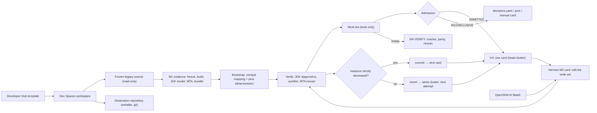

# Stage 080 — Solution Architecture (v3: fix-until-green)

**Architecture status:** accepted design; implemented and locally fixture-tested (2026-09-09 review round applied: transactional acceptance, measurement contract, native continuation, conservative bootstrap); real toolchain execution, autonomous migration, and runtime parity are unproven. Supersedes v2 (capability planner) on 2026-09-08.

This is the solution architecture for Stage 080, not for the whole workshop and not an execution file for a destination workspace. The [stage README](README.md) owns the demo journey. This document owns the migration design, authority boundaries, invariants, and proof gates. Runtime procedures remain in [operations](../../docs/OPERATIONS.md); destination code and skills remain in `scaffold-repo/`.

| Evidence label | Meaning |
|---|---|
| **Implemented** | Present in the repository, executable, with a selftest that includes the negative case |
| **Demonstrated** | Exercised in a retained live run |
| **Accepted design** | Architecture decision to implement; not runtime proof |
| **Unknown** | Not established; must not be inferred |

Same-PR rule: a change to Stage 080 behavior must update this document and the README maturity projection together.

---

## 1. Executive decision

Migration is **one mechanical loop**. There is no planner in the sense of an ownership map, a capability graph, or a step table authored by anyone:

> **Frozen evidence → deterministic bootstrap → work list computed by tools → fail-closed admission → one Hermes card per step → tools accept or revert → repeat until the list is empty → runtime parity**

The governing decisions:

1. **The work list is the plan.** MTA mandatory incidents, JDK compiler diagnostics, failing tests, and runtime-parity mismatches, each with a file locus, clustered by file, in a fixed order. It is recomputed by tools after every change and never written by a model or a human.
2. **A strict progress measure decides.** The tuple *(mandatory incidents, observed compile errors, failing tests)* must strictly decrease lexicographically with no new mandatory incident, **or** a typed gate/coverage outcome must retain the candidate unaccepted. The compile slot is an observed diagnostic count: javac reports one error at a time, so `[0,1,0]` cannot establish that only one defect remains. An issued compile diagnostic that disappears while the count stays the same is `VERIFICATION_PENDING` (`unproven-repair`), not ACCEPTED and not a spent attempt. Disappearance, a changed diagnostic id, or a moved line never earns ACCEPTED. A true count drop still accepts. Strict decrease plus the typed pending outcome is the termination argument.
3. **AI proposes; tools decide.** A worker edits only the head cluster's write set. It never authors the list, the measure, the acceptance, or a decision. A cluster that fails the attempt threshold becomes a human's card and the loop stops until the human clears it (pilot rule: a deferral is never routed around).
4. **Product tooling only, permissively licensed.** MTA CLI 8.2 (analysis), the pinned toolchain JDK's compiler API (structure and diagnostics), Maven and surefire (build and tests), Hermes v0.20.5 (cards), git (state). No third-party analysis library, no source-available recipe bundle, no regex extraction.
5. **The Spring-compatibility path first.** The deterministic bootstrap targets the Quarkus Spring compatibility extensions; the native path is the same loop with a second mapping catalog and one more work-list source (`org.springframework` imports), applied class by class as the Quarkus guidance recommends.
6. **Specimen independence is required from the outset.** PetClinic is the current proving application. Every harness component must express a reusable capability or consume an evidence-bound application contract; a PetClinic repair must satisfy this boundary before it ships. Successful PetClinic migration is followed by validation on a new application, not by a deferred generalization rewrite. See §2.1.

Spec Kit, the typed partition, the ownership map, the capability DAG, the context probe, and bytecode reconciliation are removed. None of them has a compatibility path.

---

## 2. Scope and product pins

| Component | Stage responsibility | Pin or posture |
|---|---|---|
| Red Hat Developer Hub | Self-service migration project creation | Platform-managed |
| Red Hat OpenShift Dev Spaces | Per-run workspace with legacy read-only and destination writable | Platform-managed |
| MTA CLI | Mandatory incidents on the frozen source and on the destination after every step; the canary rule proves the effective ruleset | `pins.mta_cli` **8.2** product line; measured binary version and sha256 recorded in every receipt; an Operator freezes `artifact_sha256` from a measured receipt; kantra is provisional and non-admissible |
| JDK compiler API (`javax.lang.model`, `com.sun.source`, `javax.tools`) | Structural inventory of the frozen source (`JdkModelExtract.java`) and compiler diagnostics of the destination (`JdkDiagnostics.java`) | `pins.structure_extractor` **jdk-21** = the toolchain JDK; the launcher refuses on a feature-release mismatch; no third-party library, no separate license |
| Maven + surefire | Offline build and tests of the destination | Compiler and surefire plugin pins; offline (`-o`) after the warm-up |
| Hermes Agent Kanban | One card per loop step; native dispatch and review | **v0.20.5**, build **2026.8.19** |
| Red Hat build of Quarkus | Destination platform, compat path first | BOM **3.27.3.SP1-redhat-00002** (`pins.quarkus_platform`) |
| git | Loop state: every accepted step is a commit; every rejected step is a revert | Workspace repository |

Non-goals: a Kubernetes Hermes operator, LLM-generated task decomposition, silent model failover, automatic architecture decisions, OpenRewrite as a planning authority, and claiming filesystem containment from Hermes profiles or hooks alone.

### 2.1 Specimen independence (required architecture, 2026-09-14)

This requirement applies to the whole harness: onboarding, extraction, bootstrap, planning, worker guidance, source execution, scenario derivation, qualification, parity, and release gates. Removing application names from code is insufficient when the remaining algorithms assume one application's file layout, reset behavior, routes, or error representation. Reusability does not promise support for every Spring feature; each supported capability needs a declared applicability check and evidence of its implementation.

| Boundary | Responsibility | Application dependence permitted |
|---|---|---|
| Kernel | Evidence binding, obligation identity, scope, budgets, state transitions, acceptance and audit | Read sealed facts and verdicts; never branch on a repository URL, application name, package, business type, endpoint literal, or run id to choose migration behavior or relax acceptance |
| Capability adapters and catalogs | Build/start/reset, framework mappings, schema and fixture discovery, request derivation and behavioral assertions | Versioned rules selected by measured technology and structure, with explicit prerequisites and typed unsupported outcomes; no adapter that exists only to recognize one application's identity |
| Application contract and evidence | Source/runtime identity, layouts, profiles, integrations, schema/seed ownership, routes, payloads and preserved behavior | Concrete values derived from frozen inputs or declared migration decisions; every consumer verifies their provenance and referenced bytes |
| Examples and regression fixtures | Reproduce failures and teach supported patterns | Named applications and concrete values are allowed as test data; they cannot supply fallback facts to a live run |

Demo presets may populate contract data at the authoring boundary. They must use the same schema and evidence checks as any other input; recognition of a repository URL is neither proof of a capability nor acceptance authority. Ordinary derivation and qualification remain autonomous and require no human signature.

Build tool, module and artifact selection, source startup, database reset, seed discovery, request examples, collection identity, and error representation must be discovered or declared explicitly. A restart is a reset only when the selected storage lifecycle establishes that claim. A source that returns field errors in a body must not inherit an `errors`-header obligation from PetClinic. Missing OpenAPI examples, unavailable reset mechanisms, and unsupported protocols remain typed gaps at the owning phase; they never supply invented requests, empty coverage, or destination repair cards for a source prerequisite failure.

**Acceptance criteria for harness changes:**

1. State the capability and its prerequisites, identify which facts come from the application, and bind those facts plus referenced files to receipts. Unknown and ambiguous inputs must have a tested, non-passing outcome.
2. Pair each application-discovered defect with a test on structurally different data. Rename packages, types, members and routes consistently and require the same decisions after normalizing evidence identities; hashes and concrete requests must change with their inputs. Merely replacing the word PetClinic is not a portability test.
3. Test the relevant variation: alternate fixture locations, an external database whose state survives restart, body-based validation errors, or absent schema examples. Select a supported adapter or report the unsupported capability; never reuse the first application's assumptions.
4. Keep evidence usability, scenario intent, observed parity and required coverage distinct. Missing or unusable evidence cannot become coverage through an application-specific exception. Kernel and capability tests run during PetClinic development, before the next application's live campaign.

**Proof sequence:** complete PetClinic through packaging, startup, qualified parity and release evidence, recording any assistance. Then freeze the harness manifest and run a new application under the same rules. Application contracts may differ. Any harness change needed by the second application is a portability finding with a regression test and a new recorded version; report the original and repaired runs separately. Success on PetClinic alone establishes no cross-application claim.

**Current status:** accepted requirement; full conformance is not established. The source runner's root Maven/JAR and restart assumptions, `db/<engine>/populateDB.sql` discovery, and validation-error-header derivation remain concrete generalization work. The open implementation and executable-check exits are tracked in [BACKLOG.md](../../BACKLOG.md#stage-080-autonomous-migration). A documentation change does not close them.

---

## 3. System context and trust boundaries

Trust boundaries:

- The legacy tree is immutable evidence. Agents read it but never repair it in place.
- Destination writes are limited to the head cluster's write set. Tests are never writable. The K2 hook is an accident guardrail, not an OS security boundary.
- Models receive work only through governed Hermes profiles and MaaS. External-provider use is explicit and never a silent fallback.
- `evidence/planning/` and `verification/` are tool outputs. The only human-authored planning input is `decisions.yaml`, and every entry cites an ADR.
- Merge authority remains the software supply-chain pipeline; neither a worker nor a human comment creates `ACCEPT`.

---

## 4. Authority model

| Decision or action | Deterministic tool | AI-assisted, mechanically checked | Human ADR required |
|---|:---:|:---:|:---:|
| Freeze source, classify files, record tool receipts | ✓ | | |
| Inventory types, entry points, dependency order | ✓ | | Catalog changes only |
| Bootstrap the destination (pom, properties, main class) | ✓ | | Mapping-catalog changes only |
| Compute the work list, cluster, order, measure | ✓ | | Never |
| Admit the next step | ✓ | | Never |
| Mint the next Hermes card | ✓ | | Never |
| Edit code inside the head cluster's write set | | ✓ | |
| Accept or revert a step | ✓ | AI may explain a rejection | Never |
| Retire a work-list item as not applicable | | | ✓ (`decisions.not_applicable`, one item, one ADR) |
| Retire a source file (e.g. a Spring AOP aspect Quarkus cannot host) | bootstrap deletes exactly the listed paths | | ✓ (`decisions.retired_sources`, one file, one ADR, one reason) |
| Own a cluster after the attempt threshold | | | ✓ (manual card; the run cannot close while it is open) |
| Define the runtime oracles and accepted business behavior | ✓ (source-recorded) | | Oracle definition |

An ADR may retire an item or choose the platform and the threshold. It may not waive a compile error, a failing test, or a parity mismatch.

---

## 5. The work list

`evidence/planning/worklist.json` (`planner.worklist`, schema `worklist.schema.json`).

| Source | Items | Kind |
|---|---|---|
| MTA rescan of the destination (`verification/mta-rescan/findings.json`); before the first rescan, the frozen-source obligations from the evidence bundle | one item per mandatory incident, content-addressed over rule, locus, variables and message; nothing dropped, `GLOBAL` locus kept | `build` / `config` / `incident` by path |
| JDK compiler diagnostics (`JdkDiagnostics.java` over the destination with the offline classpath) | every `ERROR`; an unresolvable build is one `pom.xml` item | `compile` (or `build`) |
| surefire reports (ElementTree) | every failing test | `test` |
| parity verdicts (`verification/parity/*.json`) | every `FAIL` | `parity` |

Items cluster by file. Order key: kind rank (build → config → compile → incident → test → parity), then dependency depth for compile clusters (leaf types first, from the JDK model's type references), then path. The head cluster is the next card. A cluster's write set is its file (plus `pom.xml` for build items).

The measure is `(mandatory_incidents, compile_errors, failing_tests)`; parity is reported beside it and judged by M4. The compile slot counts *observed* diagnostics from this verification's collector; a new collector requires remeasuring both the accepted baseline and the candidate before comparing. Every component is known only when its tool ran in this verification and produced a report (`verification/build/run.json`): tests that did not run, an empty surefire directory, a `mvn test` failure with no recorded failing test, or a skipped rescan make the measure unknown and the loop does not advance. A step is accepted iff the tuple strictly decreases lexicographically **and** no mandatory obligation appears that was absent before, **or** a typed package/boot passing / compile-coverage pending outcome applies. Compile RETAIN: the issued `err:` diagnostic is gone, the observed count did not drop, the candidate is kept unaccepted and the attempt is not spent; bounded continuation is the same card plus the sealed family write set (or restore-pending). Obligation identity is line-free (rule, file, variables, message): moving code is not a new obligation. Removing a Spring annotation may add compile errors while removing an incident: that is progress.

An unhandled checked exception is a compiler-derived obligation. javac reports one such site per compilation, so the measure cannot see how many a transformation introduced: acceptance models the last accepted commit and the candidate with the JDK compiler API under the same configuration (`planner/dest_model.checked_exception_delta`), and a proven newly introduced site — or a checked exception added to a member's `throws` — **vetoes** acceptance even when the tuple falls; a site the baseline already had is exposed, not introduced; incomplete baseline coverage the parse tree cannot settle is INCONCLUSIVE. The compile card that follows is a **repair-family** (`checked-exception-family/v1`): the sites of one signature that ONE accepted step introduced, sealed with that step's commit, one retry budget. Whether its issued failure is still reported is asked of a line-free identity (file, member, call site, exception); when the compiler moves to another member of the family the card CONTINUEs in place (bounded), and anything outside the family is a typed diagnosis. Each member is assessed from the compiled tree: the checked callee gone, no exception caught or declared in its place, the consuming operation (`setLocation`) kept. For a Location the rule is source-compatible construction: a request-aware URI builder (`@Context UriInfo`, `getBaseUriBuilder().path(<source template>).build(id)`) — `URI.create` of a relative path is not the source's form. The value itself is parity's: captures record the first response without following redirects, the comparator maps only the declared source and destination origins in `Location` (path, escaping, query and fragment untouched), a required header map that is missing is INCONCLUSIVE, and each CORS policy needs an actual cross-origin exchange and an OPTIONS preflight in the corpus.

Tests are never in a write set. A failing test scopes its production twin; when no twin can be derived the cluster is a typed blocker (`SCOPE_UNDERIVED`) for a human or ADR.

The bundle is environment-independent (machine paths are stripped from receipts), so two workspaces that froze the same source seal the same bundle.

---

## 6. Bootstrap (step 0)

`bootstrap-destination` (stdlib only: ElementTree, line-based properties) produces the deterministic baseline from `.hermes/planning/catalogs/compat-mapping.json` and `pins.json`:

1. import `pom.xml` and `src/` from the frozen analysis copy (packages kept);
2. pom: drop `spring-boot-starter-parent`, import the pinned `quarkus-bom`, map every listed starter and JDBC driver to its Quarkus Spring-compatibility or runtime extension, drop the Spring Boot plugin, add the pinned Quarkus plugin, pin compiler and surefire; an unmapped `org.springframework.boot` dependency is removed and surfaces again as a compiler or rescan item, never guessed;
3. configuration: rename mapped property keys and documented values; drop keys the catalog marks as having no Quarkus equivalent (recorded);
4. delete the `@SpringBootApplication` class only when it is a trivial launcher (no fields, no other annotation, no method but `main`); a launcher that declares beans or configuration is kept and recorded as `MAIN_CLASS_NOT_TRIVIAL`.

A Spring Boot dependency with no catalog row stays in the pom and is recorded as `UNMAPPED_DEPENDENCY`; a block exits 1 and keeps admission `INCONCLUSIVE` (`BOOTSTRAP_BLOCKED`) until a catalog row or an ADR resolves it. Nothing is removed on a block. The import never overwrites a file the destination already has, so a repeated bootstrap changes nothing after the baseline. Every mapping row is a documented Quarkus guide mapping; versions come only from pins. The receipt is sealed by admission and bound to the bundle digest. After the bootstrap the compiler produces the real plan.

---

## 7. Admission

`evidence/planning/admission-receipt.json` v2 seals the bundle, the work list, the bootstrap receipt, `decisions.yaml`, every contract file, and the tool pins, and records `activation`, `measure`, `head`, `loop_complete`.

Fail-closed boundaries, each with a permanent negative test:

| Block | Meaning |
|---|---|
| `TOOL_UNPINNED` / `TOOL_PIN_MISMATCH` | a mandatory producer (JDK model, MTA CLI) is not pinned, or its receipt disagrees with the pin on status, version, or digest |
| `MTA_MISSING` / `MTA_PROVENANCE` / `CANARY_MISSING` / `INCIDENTS_NOT_CONSERVED` | analysis absent, not the pinned 8.2 artifact, canary silent, or an incident lost between the tool and the list |
| `STRUCTURE_MISSING` / `ZERO_ENTRY_POINTS` | no admitted structural evidence, or nothing to verify parity against |
| `PLANNER_NOT_ACTIVATED` / `PLANNER_PILOT_SEAL` | the activation gate (§9) |
| `MISSING_DECISION` / `ADR_NOT_ACCEPTED` / `PLATFORM_UNKNOWN` | `decisions.yaml` incomplete or citing an unaccepted ADR |
| `BOOTSTRAP_MISSING` / `BOOTSTRAP_STALE` | no deterministic baseline, or one bound to another bundle |
| `MEASURE_UNKNOWN` / `WORKLIST_STALE` | a tool did not run in this verification, or the list belongs to another bundle |
| `BOOTSTRAP_BLOCKED` | the bootstrap recorded a non-trivial launcher or an unmapped dependency |
| `MANUAL_CLUSTER` / `SCOPE_UNDERIVED` | a deferred (human-owned) cluster, or a cluster with no derivable production scope; the loop stops |

`ADMITTED` means "the loop may run its next step from this exact state". `COMPAT_FAIL` means the bundle or the work list fails its schema: a planner defect. The receipt digest binds every idempotency key and every K1 body.

---

## 8. Hermes execution model (K1–K4)

- **K4** converts the sealed work list into **exactly one** `kanban_create` payload per step: `M3 c:<cluster>` for the head cluster, or `M4 VERIFY` when the list is empty and nothing is deferred. Key `k4:<cluster>:<attempt>:<receipt16>`; parent = the previous accepted step's card plus the M2 card. K4 re-derives the activation verdict and the tool pins from `pins.json` itself; a receipt text never overrides them. Zero commands unless ADMITTED. `k4_mint.py` appends the captured task id to `evidence/receipts/k4/mints.json`.
- **K1** bodies carry `receipt_sha256`, `worklist_sha256`, cluster id/kind/attempt, the write set, the item ids, and the artifact digests. No graph, no MTA prose, no acceptance text.
- **K3** proves the live board equals the loop's expected cards: every accepted step's card and the one open card, matched only by native idempotency key or by K4's mint receipts (never title or body), chained by parent. Only registered control cards (`verification/loop/cards.json`: the M2 card, registered once from its own environment, and its M1 ancestor) are exempt; an execution card is never exempt, so the previous accepted card stays in the expected set. Continuation is proven through `advance.py` → `k4_mint.py --exec` against a file-backed fake board; not yet on the pinned Hermes.
- **K2** vetoes worker graph mutation (`kanban_create`, `kanban_link`, swarm, decompose, direct `hermes kanban create|link`, `daemon --force`) and product writes outside the sandbox. Guardrail, not containment.
- **The card procedure** (`fix-until-green`): `brief.py` (this card's issued cluster: `--cluster` or `issued.json` when `$HERMES_KANBAN_TASK` matches — never the work-list head after a bounce) → edit the write set → `run-verify.sh` (acceptance: JDK diagnostics, fresh surefire reports with the `mvn test` exit status, destination MTA rescan on this candidate — the first measure slot is measured every time or declared unknown — then packaging/startup when green; diagnostic: classpath + compiler only, never rescans, and cannot feed advance) → `advance.py`, the acceptance transaction. It promotes only when the card is the issued one (`verification/loop/issued.json`, written by K4 and bound to the minted `t_*`), the product tree is exactly the tree verify.py measured (`candidate_sha256`), every changed path is inside the write set, and the measure strictly decreased with no new obligation **or** a typed gate/coverage outcome retained the candidate; then on ACCEPTED it commits exactly those paths, snapshots the reports, rebuilds the list, re-admits, and mints the next card with this card as parent. An unknown measure, or compile coverage that only moved the reported locus, records `VERIFICATION_PENDING` (candidate retained, attempt not counted, K4 does not mint). After reject or pending, work list **and** `verification/loop/state.json` are rebuilt from the accepted tree so Operator-facing state cannot keep describing a discarded candidate. Otherwise it discards the candidate in index and working tree, restores the accepted reports, counts the attempt against the cluster's `retry_key` (a URI Location family shares one budget across the inventoried controllers), and re-issues the cluster; at `decisions.thresholds.max_attempts` it defers and the loop **stops** (pilot rule). `verification/loop/` is the protected journal; the sealed list is rebuilt, never edited. Retry briefs carry previous diagnostic loci, rejection reasons, patch summary, write set, and legal next action. `result_len: 0` on a completion event is not proof of an empty handoff when the summary is nonempty.
- **M4 VERIFY** runs the source-recorded oracles (`capture-source-oracles`), runtime parity for every entry point, the pre-verdict runner, and the MTA rescan assertion, and composes the verdict from measured exits.

dest-init mints M1 ANALYZE always and M2 PLAN (child of M1) only under an activated or pilot-sealed planner. Never M3 or M4 from dest-init.

---

## 9. Activation gate and pilot seal

`pins.planner.activation ∈ {not-activated, pilot, activated}`, read independently by `assert-planner-activated.py` (first M2 step), admission, and K4.

- `not-activated` (golden): dest-init mints M1 only; admission never ADMITS; K4 emits nothing; M3 and M4 do not exist.
- `pilot`: `pins.planner.pilot = {run_id, authorized_by, evidence_bundle_sha256}` admits exactly one bundle. A different bundle, a missing `authorized_by`, or a re-freeze is refused. A pilot never flips to `activated`.
- `activated`: named Operator GO after one live campaign demonstrates all of the following (fixture-green evidence does not count):

1. Repeated M1 on the same frozen source yields byte-identical bundle, work list and receipt.
2. Every MTA mandatory incident, every compiler error, and every failing test is a work-list item; none is lost between the tool and the list.
3. A step that introduces a mandatory incident is reverted; a step that does not decrease the measure is reverted, unless a typed compile-coverage or gate-unproven outcome retains it unaccepted.
4. K4 emits zero commands for a non-ADMITTED receipt and for a forged one.
5. The bootstrap on PetClinic REST compiles far enough to produce a real, non-empty work list.
6. A real board equals the expected cards after every mint; the foreign-card audit is clean.
7. One cluster completes accept → next card; one is reverted; one is deferred and cleared by a human.
8. The list reaches empty and M4 records runtime parity, not merely compile and rescan.
9. Every retired item cites a `decisions.yaml` entry and ADR; no planning artifact was hand-edited.

---

## 10. Current implementation impact

| Asset | Disposition |
|---|---|
| Freeze, build receipt, JDK-model inventory, MTA 8.2 receipts, evidence bundle | **Kept**; bundle trimmed to source, structure, entry points, obligations, receipts |
| Ownership map, four partition policies, capability DAG, transformation projection, resolution ledger | **Deleted** (`planner.ownership`, `planner.dag`, `planner.ledger`) |
| Context probe, jQAssistant reconciliation | **Deleted** (`probe-spring-bindings`, `enrich-legacy-bytecode`) |
| Platform API index | **Deleted** (no symbol projection on the compat path) |
| `execute-admitted-increment`, `plan-migration-increments`, `verify-live-kanban-dag` | **Replaced** by `fix-until-green`, `build-worklist`, `verify-live-kanban-loop` |
| K1 / K4 / K3 | **Adapted** to the work list (one card per step, attempt in the key, mint receipts as provenance) |
| K2, pins, activation and pilot seal, MTA provenance and canary, source oracles, M4 gates | **Kept** |
| Spec Kit | **Removed**; no compatibility path (residue scan in `validate.sh`) |

New: `planner.worklist`, `planner.cards`, `bootstrap-destination`, `compat-mapping.json`, `JdkDiagnostics.java`, the loop scripts, admission v2.

---

### 10.1 Outcome board (new runs, disabled by default)

The approved native outcome-board design is implemented behind a protocol
selection that no existing run makes (`OUTCOME-BOARD-CONTRACT.md`). After M2
the board shows the known outcomes, their prerequisites and their acceptance.
A repair attempt stays within the outcome that owns it. Continuations run on
the dispatcher's own tick. Execution is disabled until a protected writer
principal exists (architect F1). The current workspace has none.

## 11. Maturity

| Area | Maturity |
|---|---|
| Specimen independence across all harness components (§2.1) | REQUIRED DESIGN; application-assumption removal and capability/invariance checks remain open. PetClinic completion followed by a new application is the live proof sequence; cross-application completion is not demonstrated by this requirement |
| Freeze, build receipt, evidence bundle (environment-independent) | IMPLEMENTED; freeze run locally on a Spring fixture |
| JDK-model extractor | IMPLEMENTED on the JDK compiler API; run inside the selftest on a Spring fixture without a classpath (annotation values from the syntax tree) |
| MTA CLI 8.2 provenance, canary, incident conservation | IMPLEMENTED with negatives; `mta_cli` pinned to the 8.2 line, digest to be frozen from a measured receipt; not executed live |
| Deterministic bootstrap (compat mapping) | IMPLEMENTED with an idempotence test on a fake legacy pom; not run on PetClinic |
| Work list, order, measure, progress rule | IMPLEMENTED with unit and end-to-end tests; the compile slot is observed coverage, so an introduced unhandled checked exception vetoes acceptance from the compiler model, "still reported" is a line-free identity, and a checked-exception repair family (bound to the step that introduced it) continues in place; demonstrated on v8's own commits |
| JDK diagnostics tool | IMPLEMENTED; run locally on the Spring fixture (18 errors, no classpath); `-Xmaxerrs 10000` does not complete coverage across sibling checked-exception sites |
| Loop (verify, accept, revert, defer, human clear, M4 on empty) | IMPLEMENTED end to end on the http specimen with simulated tool outputs and a real git repository; the 2026-09-09 review counterexamples (invented cluster, post-verification edit, out-of-scope test edit, staged revert, rejected reports, unrun/failed tools, line movement, unresolved test scope, stop on deferral, second-card continuation) and the 2026-09-11 v8 counterexamples (six-file URI mask, compile RETAIN, reject still-reported, rollback state rebuild) are permanent tests |
| Admission v2 with every boundary | IMPLEMENTED with per-boundary negatives, forged-receipt and pilot-seal counterexamples |
| K1 / K4 / K3 (one card per step, provenance-only matching) | IMPLEMENTED against a fake board |
| K2 graph-mutation veto | IMPLEMENTED for the documented tool names; the real v0.20.5 worker tool surface is not captured |
| M4 source oracles and parity receipt | IMPLEMENTED with a local HTTP stub; scenario comparator asserts `Location` / `Access-Control-*` when the capture recorded `headers`; legacy captures without that map skip header compare |
| Native lifecycle on the pinned Hermes (accept, reject, review, deferral) | NOT DEMONSTRATED; continuation proven only against a file-backed fake board |
| The producer → bootstrap → verify chain on real code (spring-petclinic-rest, local JDK 21 + Maven, Red Hat GA repository) | DEMONSTRATED 2026-09-09 by `build-worklist/scripts/rehearse-legacy.sh`: bootstrap `ok` (BOM probe, legacy-version carry-over, ADR-003 retirement), 675 compiler errors in 81 files → 62 clusters, head `model/BaseEntity.java`; incidents UNKNOWN (no MTA CLI on that host) |
| Anything on a live workspace, board, or the MTA CLI | NOT DEMONSTRATED |

Principal risks: the compat mapping's coverage on a real starter set (unmapped dependencies become loop work, which is correct but may be long); local minima where a step reduces the measure without being semantically right (tests and parity are in the measure, and tests are never writable); sequential-only execution; the surefire runner on a partially migrated tree.

Decisions still required: the MTA CLI 8.2 binary in the overlay with its checksum frozen before admission; the pilot seal (bound to source, baseline, receipt, board and expiry) after the acceptance and continuation defects are proven on the pinned Hermes; capture of the worker tool names and schemas per profile for K2. `decisions.yaml` (platform ADR-001, attempt threshold ADR-002 = 3) is in place.

---

## 12. Documentation and contribution boundaries

| Question | Authoritative home |
|---|---|
| What does a participant click and observe? | [Stage README](README.md) |
| What is the target design and what is proven? | This document |
| What runs in the destination workspace? | `scaffold-repo/quarkus-migration-scaffold/` |
| How is the stage deployed and operated? | [Operations](../../docs/OPERATIONS.md) |
| How are failures diagnosed and recovered? | [Troubleshooting](../../docs/TROUBLESHOOTING.md) |
| What is deferred? | [Backlog](../../BACKLOG.md) |

Architects bind design here. Implementers change the kernel and skills against a cited section. Reviewers provide evidence and challenge maturity labels. Destination workers never edit this file or any sealed planning artifact.

### Primary references

- [MTA 8.2 CLI documentation](https://docs.redhat.com/en/documentation/migration_toolkit_for_applications/8.2/html-single/using_the_migration_toolkit_for_applications_command-line_interface/index)
- [Hermes Kanban documentation](https://hermes-agent.nousresearch.com/docs/user-guide/features/kanban)
- [Hermes Kanban worker lanes](https://hermes-agent.nousresearch.com/docs/user-guide/features/kanban-worker-lanes)
- [JDK compiler API (`jdk.compiler` module)](https://docs.oracle.com/en/java/javase/21/docs/api/jdk.compiler/module-summary.html)
- [Quarkus: migrating from Spring](https://quarkus.io/spring/migrate/), [Spring DI](https://quarkus.io/guides/spring-di), [Spring Web](https://quarkus.io/guides/spring-web), [Spring Data JPA](https://quarkus.io/guides/spring-data-jpa), [Spring Boot properties](https://quarkus.io/guides/spring-boot-properties)
- [Migrating Code At Scale With LLMs At Google (FSE 2025)](https://arxiv.org/abs/2504.09691) — the change-location + LLM + verification loop this design follows

### Per-run resource lifecycle qualification (2026-09-22)

The platform serializes each run's provision/retire operations with an atomic,
non-expiring lock and writes retirement intent before deleting generated
resources. A dead holder needs proven termination before recovery, not elapsed
time alone. A missing assignment never grants a fresh run legacy access.
Receipts bind the full endpoint, actual workspace and scaffolding ancestor;
the original resource declaration must still agree. This is consistency checking
at harness entry points, not an OS or tenant security boundary. The platform
images and the live two-workspace qualification are pinned before v10 starts.
See V10-PLAN.md and ISOLATION-DEMO.md for the measured release conditions.
