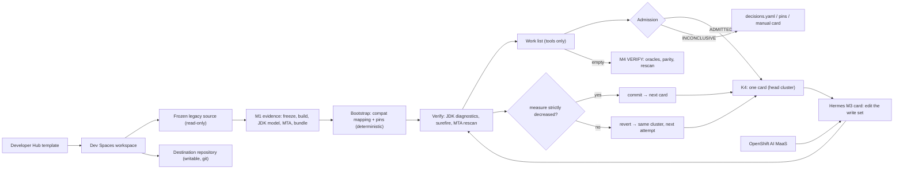

# Stage 080 — Solution Architecture (v3: fix-until-green)

**Architecture status (2026-09-23):** accepted design; implemented and locally fixture-tested. Assisted v10 demonstrated toolchain execution, M2, runtime parity through M4 `PROVISIONAL_ACCEPT`, and CI/CD/live Route deployment on a dest overlay beyond published golden `61ac38db` ([BACKLOG v10 readiness](../../BACKLOG.md)). Full release qualification remains open. Clean repeatability is still to demonstrate with v11. Autonomous migration is not claimed. Golden `pins.planner.activation` remains `not-activated`. Supersedes v2 (capability planner) on 2026-09-08.

This is the solution architecture for Stage 080, not for the whole workshop and not an execution file for a destination workspace. The [stage README](README.md) owns the demo journey. This document owns the migration design, authority boundaries, invariants, and proof gates. Runtime procedures remain in [operations](../../docs/OPERATIONS.md); destination code and skills remain in `scaffold-repo/`.

ADR-024 (2026-09-22, assisted v10 continuation) amends ADR-018's symbol bound
only for the complete, model-derived repository-fragment set: 16 sealed
member rows, versus eight for other units. The first real package failure
owes 16 methods across seven parents; the old fixture represented seven
single-method parents. Every method remains inventoried; 20-file/160-site
bounds, scope seals, retry budgets and package/startup/parity gates remain.
Excess still produces `UNIT_OVERSIZE`; no specimen-name branch is introduced.

| Evidence label | Meaning |
|---|---|
| **Implemented** | Present in the repository, executable, with a selftest that includes the negative case |
| **Demonstrated** | Exercised in a retained live run |
| **Accepted design** | Architecture decision to implement; not runtime proof |
| **Unknown** | Not established; must not be inferred |

Same-PR rule: a change to Stage 080 behavior must update this document and the README maturity projection together.

---

## 1. Executive decision

Migration is **one mechanical loop**. There is no planner in the sense of an ownership map, a capability graph, or a step table authored by anyone:

> **Frozen evidence → deterministic bootstrap → work list computed by tools → fail-closed admission → one Hermes card per step → tools accept or revert → repeat until the list is empty → runtime parity**

*Current native path (2026-09-28).* "One card per step" is the serial-loop/v1 reading and stays true for runs created with it. A run on `outcome-board/v2` (§10.1, the default for new runs) publishes one native task per planned outcome after M2. With `loop.compatibility_objectives: v1` (§7.2), an outcome is a bounded **compatibility objective**: one or more work-list units that share one concrete repair, issued whole and judged per constituent. The tools still accept or revert every candidate; Hermes still owns the lifecycle; execution stays serial.

The governing decisions:

1. **The work list is the plan.** MTA mandatory incidents, JDK compiler diagnostics, failing tests, and runtime-parity mismatches, each with a file locus, clustered by file, in a fixed order. It is recomputed by tools after every change and never written by a model or a human.
2. **A strict progress measure decides.** The tuple *(mandatory incidents, observed compile errors, failing tests)* must strictly decrease lexicographically with no new mandatory incident, **or** a typed gate/coverage outcome must retain the candidate unaccepted. The compile slot is an observed diagnostic count: javac reports one error at a time, so `[0,1,0]` cannot establish that only one defect remains. An issued compile diagnostic that disappears while the count stays the same is `VERIFICATION_PENDING` (`unproven-repair`), not ACCEPTED and not a spent attempt. Disappearance, a changed diagnostic id, or a moved line never earns ACCEPTED. A true count drop still accepts. Strict decrease plus the typed pending outcome is the termination argument.
3. **AI proposes; tools decide.** A worker edits only the head cluster's write set. It never authors the list, the measure, the acceptance, or a decision. A cluster that fails the attempt threshold becomes a human's card and the loop stops until the human clears it (pilot rule: a deferral is never routed around).
4. **Product tooling only, permissively licensed.** MTA CLI 8.2 (analysis), the pinned toolchain JDK's compiler API (structure and diagnostics), Maven and surefire (build and tests), Hermes v0.20.5 (cards), git (state), and one pinned execution component: OpenRewrite 8.89.0 (`rewrite-core`, `rewrite-java`, `rewrite-java-21`; Apache-2.0) inside the harness's typed repair executor, which applies this project's own two recipes to an issued unit (§7.3). It never produces M1/M2 evidence and never plans. No third-party analysis library, no recipe bundle (`rewrite-spring`, `rewrite-quarkus`, `rewrite-migrate-java`), no source-available or proprietary component, no regex extraction.
5. **The Spring-compatibility path first.** The deterministic bootstrap targets the Quarkus Spring compatibility extensions; the native path is the same loop with a second mapping catalog and one more work-list source (`org.springframework` imports), applied class by class as the Quarkus guidance recommends.
6. **Specimen independence is required from the outset.** PetClinic is the current proving application. Every harness component must express a reusable capability or consume an evidence-bound application contract; a PetClinic repair must satisfy this boundary before it ships. Successful PetClinic migration is followed by validation on a new application, not by a deferred generalization rewrite. See §2.1.

Spec Kit, the typed partition, the ownership map, the capability DAG, the context probe, and bytecode reconciliation are removed. None of them has a compatibility path.

---

## 2. Scope and product pins

| Component | Stage responsibility | Pin or posture |
|---|---|---|
| Red Hat Developer Hub | Self-service migration project creation | Platform-managed |
| Red Hat OpenShift Dev Spaces | Per-run workspace with legacy read-only and destination writable | Platform-managed |
| MTA CLI | Mandatory incidents on the frozen source and on the destination after every step; the canary rule proves the effective ruleset | `pins.mta_cli` **8.2** product line; measured binary version and sha256 recorded in every receipt; an Operator freezes `artifact_sha256` from a measured receipt; kantra is provisional and non-admissible |
| JDK compiler API (`javax.lang.model`, `com.sun.source`, `javax.tools`) | Structural inventory of the frozen source (`JdkModelExtract.java`) and compiler diagnostics of the destination (`JdkDiagnostics.java`) | `pins.structure_extractor` **jdk-21** = the toolchain JDK; the launcher refuses on a feature-release mismatch; no third-party library, no separate license |
| OpenRewrite (typed repair executor, harness only) | Apply the two qualified typed repairs (§7.3) inside an issued write grant; never a dependency of the migrated application | `pins.typed_repair`: executor jar sha256 and build, rewrite 8.89.0 (Apache-2.0) and every shipped artifact with its POM license; baked at `/opt/rhoai3/typed-repair/typed-repair.jar` in ws-080 |
| Maven + surefire | Offline build and tests of the destination | Compiler and surefire plugin pins; offline (`-o`) after the warm-up |
| Hermes Agent Kanban | One card per loop step; native dispatch and review | **v0.20.5**, build **2026.8.19** |
| Red Hat build of Quarkus | Destination platform, compat path first | BOM **3.27.3.SP1-redhat-00002** (`pins.quarkus_platform`) |
| git | Loop state: every accepted step is a commit; every rejected step is a revert | Workspace repository |

Non-goals: a Kubernetes Hermes operator, LLM-generated task decomposition, silent model failover, automatic architecture decisions, OpenRewrite as a planning authority, and claiming filesystem containment from Hermes profiles or hooks alone.

### 2.1 Specimen independence (required architecture, 2026-09-14)

This requirement applies to the whole harness: onboarding, extraction, bootstrap, planning, worker guidance, source execution, scenario derivation, qualification, parity, and release gates. Removing application names from code is insufficient when the remaining algorithms assume one application's file layout, reset behavior, routes, or error representation. Reusability does not promise support for every Spring feature; each supported capability needs a declared applicability check and evidence of its implementation.

| Boundary | Responsibility | Application dependence permitted |
|---|---|---|
| Kernel | Evidence binding, obligation identity, scope, budgets, state transitions, acceptance and audit | Read sealed facts and verdicts; never branch on a repository URL, application name, package, business type, endpoint literal, or run id to choose migration behavior or relax acceptance |
| Capability adapters and catalogs | Build/start/reset, framework mappings, schema and fixture discovery, request derivation and behavioral assertions | Versioned rules selected by measured technology and structure, with explicit prerequisites and typed unsupported outcomes; no adapter that exists only to recognize one application's identity |
| Application contract and evidence | Source/runtime identity, layouts, profiles, integrations, schema/seed ownership, routes, payloads and preserved behavior | Concrete values derived from frozen inputs or declared migration decisions; every consumer verifies their provenance and referenced bytes |
| Examples and regression fixtures | Reproduce failures and teach supported patterns | Named applications and concrete values are allowed as test data; they cannot supply fallback facts to a live run |

Demo presets may populate contract data at the authoring boundary. They must use the same schema and evidence checks as any other input; recognition of a repository URL is neither proof of a capability nor acceptance authority. Ordinary derivation and qualification remain autonomous and require no human signature.

Build tool, module and artifact selection, source startup, database reset, seed discovery, request examples, collection identity, and error representation must be discovered or declared explicitly. A restart is a reset only when the selected storage lifecycle establishes that claim. A source that returns field errors in a body must not inherit an `errors`-header obligation from PetClinic. Missing OpenAPI examples, unavailable reset mechanisms, and unsupported protocols remain typed gaps at the owning phase; they never supply invented requests, empty coverage, or destination repair cards for a source prerequisite failure.

**Acceptance criteria for harness changes:**

1. State the capability and its prerequisites, identify which facts come from the application, and bind those facts plus referenced files to receipts. Unknown and ambiguous inputs must have a tested, non-passing outcome.
2. Pair each application-discovered defect with a test on structurally different data. Rename packages, types, members and routes consistently and require the same decisions after normalizing evidence identities; hashes and concrete requests must change with their inputs. Merely replacing the word PetClinic is not a portability test.
3. Test the relevant variation: alternate fixture locations, an external database whose state survives restart, body-based validation errors, or absent schema examples. Select a supported adapter or report the unsupported capability; never reuse the first application's assumptions.
4. Keep evidence usability, scenario intent, observed parity and required coverage distinct. Missing or unusable evidence cannot become coverage through an application-specific exception. Kernel and capability tests run during PetClinic development, before the next application's live campaign.

**Proof sequence:** complete PetClinic through packaging, startup, qualified parity and release evidence, recording any assistance. Then freeze the harness manifest and run a new application under the same rules. Application contracts may differ. Any harness change needed by the second application is a portability finding with a regression test and a new recorded version; report the original and repaired runs separately. Success on PetClinic alone establishes no cross-application claim.

**Current status:** accepted requirement; full conformance is not established. The source runner's root Maven/JAR and restart assumptions, `db/<engine>/populateDB.sql` discovery, and validation-error-header derivation remain concrete generalization work. The open implementation and executable-check exits are tracked in [BACKLOG.md](../../BACKLOG.md#stage-080-autonomous-migration). A documentation change does not close them.

---

## 3. System context and trust boundaries

```mermaid
flowchart LR
  RHDH["Developer Hub template"] --> WS["Dev Spaces workspace"]
  WS --> LEG["Frozen legacy source (read-only)"]
  WS --> DST["Destination repository (writable, git)"]
  LEG --> M1["M1 evidence: freeze, build, JDK model, MTA, bundle"]
  M1 --> BOOT["Bootstrap: compat mapping + pins (deterministic)"]
  BOOT --> VERIFY["Verify: JDK diagnostics, surefire, MTA rescan"]
  VERIFY --> WL["Work list (tools only)"]
  WL --> SEAL{"Admission"}
  SEAL -->|ADMITTED| K4["K4: one card (head cluster)"]
  SEAL -->|INCONCLUSIVE| HUMAN["decisions.yaml / pins / manual card"]
  K4 --> CARD["Hermes M3 card: edit the write set"]
  CARD --> VERIFY
  VERIFY --> ADV{"measure strictly decreased?"}
  ADV -->|yes| COMMIT["commit → next card"] --> K4
  ADV -->|no| REVERT["revert → same cluster, next attempt"] --> K4
  WL -->|empty| M4["M4 VERIFY: oracles, parity, rescan"]
  MAAS["OpenShift AI MaaS"] --> CARD
```

Trust boundaries:

- The legacy tree is immutable evidence. Agents read it but never repair it in place.
- Destination writes are limited to the head cluster's write set. Tests are never writable. The K2 hook is an accident guardrail, not an OS security boundary.
- Models receive work only through governed Hermes profiles and MaaS. External-provider use is explicit and never a silent fallback.
- `evidence/planning/` and `verification/` are tool outputs. The only human-authored planning input is `decisions.yaml`, and every entry cites an ADR.
- Merge authority remains the software supply-chain pipeline; neither a worker nor a human comment creates `ACCEPT`.

---

## 4. Authority model

| Decision or action | Deterministic tool | AI-assisted, mechanically checked | Human ADR required |
|---|:---:|:---:|:---:|
| Freeze source, classify files, record tool receipts | ✓ | | |
| Inventory types, entry points, dependency order | ✓ | | Catalog changes only |
| Bootstrap the destination (pom, properties, main class) | ✓ | | Mapping-catalog changes only |
| Compute the work list, cluster, order, measure | ✓ | | Never |
| Admit the next step | ✓ | | Never |
| Mint the next Hermes card | ✓ | | Never |
| Edit code inside the head cluster's write set | | ✓ | |
| Accept or revert a step | ✓ | AI may explain a rejection | Never |
| Retire a work-list item as not applicable | | | ✓ (`decisions.not_applicable`, one item, one ADR) |
| Retire a source file (e.g. a Spring AOP aspect Quarkus cannot host) | bootstrap deletes exactly the listed paths | | ✓ (`decisions.retired_sources`, one file, one ADR, one reason) |
| Own a cluster after the attempt threshold | | | ✓ (manual card; the run cannot close while it is open) |
| Define the runtime oracles and accepted business behavior | ✓ (source-recorded) | | Oracle definition |

An ADR may retire an item or choose the platform and the threshold. It may not waive a compile error, a failing test, or a parity mismatch.

---

## 5. The work list

`evidence/planning/worklist.json` (`planner.worklist`, schema `worklist.schema.json`).

| Source | Items | Kind |
|---|---|---|
| MTA rescan of the destination (`verification/mta-rescan/findings.json`); before the first rescan, the frozen-source obligations from the evidence bundle | one item per mandatory incident, content-addressed over rule, locus, variables and message; nothing dropped, `GLOBAL` locus kept | `build` / `config` / `incident` by path |
| JDK compiler diagnostics (`JdkDiagnostics.java` over the destination with the offline classpath) | every `ERROR`; an unresolvable build is one `pom.xml` item | `compile` (or `build`) |
| surefire reports (ElementTree) | every failing test | `test` |
| parity verdicts (`verification/parity/*.json`) | every `FAIL` | `parity` |

Items cluster by file. Order key: kind rank (build → config → compile → incident → test → parity), then dependency depth for compile clusters (leaf types first, from the JDK model's type references), then path. The head cluster is the next card. A cluster's write set is its file (plus `pom.xml` for build items).

The measure is `(mandatory_incidents, compile_errors, failing_tests)`; parity is reported beside it and judged by M4. The compile slot counts *observed* diagnostics from this verification's collector; a new collector requires remeasuring both the accepted baseline and the candidate before comparing. Every component is known only when its tool ran in this verification and produced a report (`verification/build/run.json`): tests that did not run, an empty surefire directory, a `mvn test` failure with no recorded failing test, or a skipped rescan make the measure unknown and the loop does not advance. A step is accepted iff the tuple strictly decreases lexicographically **and** no mandatory obligation appears that was absent before, **or** a typed package/boot passing / compile-coverage pending outcome applies. Compile RETAIN: the issued `err:` diagnostic is gone, the observed count did not drop, the candidate is kept unaccepted and the attempt is not spent; bounded continuation is the same card plus the sealed family write set (or restore-pending). Obligation identity is line-free (rule, file, variables, message): moving code is not a new obligation. Removing a Spring annotation may add compile errors while removing an incident: that is progress.

Diagnostic-family checkpoints may prove retirement of a type or annotation from
javac's complete parsed identifier inventory, even when unrelated attribution
errors leave the file partially resolved. This proves only that the retired name
is absent; sealed declarations must survive and all other acceptance checks still
apply. Parse errors, absent inventory and remaining names stay inconclusive.
For a package, the complete qualified-name inventory must exclude that exact
namespace and its children, including imports and inline references. This
fallback resolves inherited member-type namespaces separately from unrelated
field/annotation errors: every ancestor must resolve, and none of those names
may belong to the retired package. Unknown ancestry, anonymous/local types,
static imports and the implicitly imported `java.lang` package still refuse.
A matching suffix in another namespace is not a reference to the retired package.
The narrow proof does not mark the file or its general inheritance/calls resolved.
Declaration/inheritance/caller closures still require resolved evidence. Pending
receipts retain the complete scope assessment for diagnosis.

An unhandled checked exception is a compiler-derived obligation. javac reports one such site per compilation, so the measure cannot see how many a transformation introduced: acceptance models the last accepted commit and the candidate with the JDK compiler API under the same configuration (`planner/dest_model.checked_exception_delta`), and a proven newly introduced site — or a checked exception added to a member's `throws` — **vetoes** acceptance even when the tuple falls; a site the baseline already had is exposed, not introduced; incomplete baseline coverage the parse tree cannot settle is INCONCLUSIVE. The compile card that follows is a **repair-family** (`checked-exception-family/v1`): the sites of one signature that ONE accepted step introduced, sealed with that step's commit, one retry budget. Whether its issued failure is still reported is asked of a line-free identity (file, member, call site, exception); when the compiler moves to another member of the family the card CONTINUEs in place (bounded), and anything outside the family is a typed diagnosis. Each member is assessed from the compiled tree: the checked callee gone, no exception caught or declared in its place, the consuming operation (`setLocation`) kept. For a Location the rule is source-compatible construction: a request-aware URI builder (`@Context UriInfo`, `getBaseUriBuilder().path(<source template>).build(id)`) — `URI.create` of a relative path is not the source's form. The value itself is parity's: captures record the first response without following redirects, the comparator maps only the declared source and destination origins in `Location` (path, escaping, query and fragment untouched), a required header map that is missing is INCONCLUSIVE, and each CORS policy needs an actual cross-origin exchange and an OPTIONS preflight in the corpus.

Tests are never in a write set. A failing test scopes its production twin; when no twin can be derived the cluster is a typed blocker (`SCOPE_UNDERIVED`) for a human or ADR.

The bundle is environment-independent (machine paths are stripped from receipts), so two workspaces that froze the same source seal the same bundle.

---

## 6. Bootstrap (step 0)

`bootstrap-destination` (stdlib only: ElementTree, line-based properties) produces the deterministic baseline from `.hermes/planning/catalogs/compat-mapping.json` and `pins.json`:

1. import `pom.xml` and `src/` from the frozen analysis copy (packages kept);
2. pom: drop `spring-boot-starter-parent`, import the pinned `quarkus-bom`, map every listed starter and JDBC driver to its Quarkus Spring-compatibility or runtime extension, drop the Spring Boot plugin, add the pinned Quarkus plugin, pin compiler and surefire; an unmapped `org.springframework.boot` dependency is removed and surfaces again as a compiler or rescan item, never guessed;
3. configuration: rename mapped property keys and documented values; drop keys the catalog marks as having no Quarkus equivalent (recorded);
4. delete the `@SpringBootApplication` class only when it is a trivial launcher (no fields, no other annotation, no method but `main`); a launcher that declares beans or configuration is kept and recorded as `MAIN_CLASS_NOT_TRIVIAL`.

A Spring Boot dependency with no catalog row stays in the pom and is recorded as `UNMAPPED_DEPENDENCY`; a block exits 1 and keeps admission `INCONCLUSIVE` (`BOOTSTRAP_BLOCKED`) until a catalog row or an ADR resolves it. Nothing is removed on a block. The import never overwrites a file the destination already has, so a repeated bootstrap changes nothing after the baseline. Every mapping row is a documented Quarkus guide mapping; versions come only from pins. The receipt is sealed by admission and bound to the bundle digest. After the bootstrap the compiler produces the real plan.

---

## 7. Admission

`evidence/planning/admission-receipt.json` v2 seals the bundle, the work list, the bootstrap receipt, `decisions.yaml`, every contract file, and the tool pins, and records `activation`, `measure`, `head`, `loop_complete`.

Fail-closed boundaries, each with a permanent negative test:

| Block | Meaning |
|---|---|
| `TOOL_UNPINNED` / `TOOL_PIN_MISMATCH` | a mandatory producer (JDK model, MTA CLI) is not pinned, or its receipt disagrees with the pin on status, version, or digest |
| `MTA_MISSING` / `MTA_PROVENANCE` / `CANARY_MISSING` / `INCIDENTS_NOT_CONSERVED` | analysis absent, not the pinned 8.2 artifact, canary silent, or an incident lost between the tool and the list |
| `STRUCTURE_MISSING` / `ZERO_ENTRY_POINTS` | no admitted structural evidence, or nothing to verify parity against |
| `PLANNER_NOT_ACTIVATED` / `PLANNER_PILOT_SEAL` | the activation gate (§9) |
| `MISSING_DECISION` / `ADR_NOT_ACCEPTED` / `PLATFORM_UNKNOWN` | `decisions.yaml` incomplete or citing an unaccepted ADR |
| `PLAN_SEMANTICS_REPINNED` | `decisions.yaml` `loop.plan_semantics` differs from the value the destination's initial commit carried (§7.1): a run keeps the plan semantics it was created with |
| `OBJECTIVES_REPINNED` / `OBJECTIVES_WITHOUT_PLAN_SEMANTICS` | `loop.compatibility_objectives` differs from the run's initial commit, or is selected without `plan_semantics: v1` (§7.2) |
| `BOOTSTRAP_MISSING` / `BOOTSTRAP_STALE` | no deterministic baseline, or one bound to another bundle |
| `MEASURE_UNKNOWN` / `WORKLIST_STALE` | a tool did not run in this verification, or the list belongs to another bundle |
| `BOOTSTRAP_BLOCKED` | the bootstrap recorded a non-trivial launcher or an unmapped dependency |
| `MANUAL_CLUSTER` / `SCOPE_UNDERIVED` | a deferred (human-owned) cluster, or a cluster with no derivable production scope; the loop stops |

`ADMITTED` means "the loop may run its next step from this exact state". `COMPAT_FAIL` means the bundle or the work list fails its schema: a planner defect. The receipt digest binds every idempotency key and every K1 body.

### 7.1 Repeatable initial plan (plan semantics v1, run-pinned)

`decisions.yaml` `loop.plan_semantics: v1` makes the same frozen
application, decisions and pinned toolchain produce the same initial logical
M3 plan. The golden `decisions.yaml` selects it, so every NEW run's
destination is created with it; a run keeps the value its destination's
initial (scaffolding) commit carried -- every earlier run was created without
the key and stays off -- and admission refuses a later edit that flips it
(`PLAN_SEMANTICS_REPINNED`, `decisions.plan_semantics_pin_gap`), so the
selection is immutable per run and never an environment fallback.
`run-preflight.sh` requires it for a new run. `PLAN_RECIPE_MISSING` applies
to repair requirements only (`source_requirements.RECIPE_RULES`); behaviour
verification and decided configuration are judged by their checks.

- **Stable producer identity.** `JdkDiagnostics` renders in the ROOT locale
  (the JVM-locale text is kept as `message_jvm_locale`), emits the column and
  the compiler's structured arguments, and records generated-root and
  output-class provenance. A v1 compile obligation id is derived from code,
  site and arguments; an identical key repeated at one site gets its own
  occurrence, so two diagnostics stay two obligations.
- **Controlled initial analysis.** `build-worklist` runs `run-verify.sh
  --initial`: `prepare-initial-analysis.py` removes `target/` before the first
  baseline only (never after a baseline or an issued card), the warm-up
  regenerates every generated root, the analysis never reads `target/classes`,
  and a stale generated root refuses (`VERIFY_INITIAL_STALE_OUTPUT`). The
  initial analysis NEVER reuses a warm-up: the warm-up stamp's key does not
  cover the resolved dependency graph, so `--initial` discards the stamp and
  rebuilds (`run.json` `warmup.cache: not-reused-initial-analysis`); routine
  verification keeps its reuse.
- **Application paths.** `source_requirements.application_paths` owes every
  path the FROZEN source configures (compat-mapping `application_paths`:
  `server.servlet.context-path` -> `quarkus.http.root-path`,
  `spring.mvc.servlet.path` -> `quarkus.rest.path`,
  `management.endpoints.web.base-path` ->
  `quarkus.http.non-application-root-path`), at its effective value under the
  profiles the source itself activates, or at the value decisions.yaml
  `application_paths` records under an accepted ADR; measured as
  `config:application-path` (the destination's effective value under the
  decided build profiles). No configured path is not-applicable; YAML
  configuration is unresolved.
- **Source-derived responsibilities.** `planner/source_requirements.py` plans
  the known work from the frozen structural model before any destination
  failure: repository fragment architecture, BindingResult/Errors validation,
  unbound handler parameters, adapter-owned annotation retirement and the
  separate adapter behaviour, generator configuration and its consumers,
  decided configuration, and a verification responsibility per entry point.
  Partial evidence is unresolved, never absent. Each requirement names a
  qualified recipe (`compat-mapping.json` `migration_recipes`) and the
  existing checks that refuse its broken forms.
- **Repository behaviour (V17-3).** A fragment parent the decided build
  profiles serve through Spring Data in the source (no implementation of
  their own) is an OWED `<Parent>Impl` whose every member carries its
  SELECTED source behaviour (`source_requirements.repository_behaviour`,
  catalog `repository_behaviour`): the override fragment's method, the
  repository's `@Query`, the base repository's CRUD semantics or a derived
  query -- never the implementation another profile selects, which is named
  as NOT the behaviour source. A source method whose ordered calls a
  `persistence_behaviour_translations` row matches carries that obligation
  (Hibernate 6 flushes a pending removal before a query or bulk statement:
  port the committed effects, dependents first). Stub bodies (a throw of
  any type, an empty mutator, a placeholder return, a private helper or a
  delegation cycle hiding one) are refused at the checkpoint from the
  compiler model's `body_shape`. Functional completion is separate: every
  member plans a verification row (`repository_verification`: a read, or a
  write proven by a scenario that reads the committed effect back in another
  request; a member no captured scenario reaches stays unresolved). The same
  rows are sealed on the serial loop's fragment unit
  (`worklist.fragment_behaviour_rows`), rendered by the brief, and recorded
  on acceptance as `acceptance: structural`, `functional: owed`
  (`verification/loop/owner-debts.json`, observational). Who caused a
  runtime failure a later card meets is a CLASSIFICATION, not a location
  (`planner/runtime_cause.py`, pure over its inputs): pre-existing-owner-defect
  only when the baseline tree's own bound measurement failed the same scenario
  identically in another cluster's accepted file; candidate-regression when
  the baseline passed or failed differently; ambiguous otherwise. The serial
  loop only shows the class (the rejection and its attempt stand); an
  authority may act on it only with inputs it measured itself.
- **Statically decided repairs (V17-4, V17-5).** The generated-body
  obligation (V16-8) no longer waits for a create scenario to fail: the
  destination and source generators are qualified as a pair
  (`worklist.generator_qualification`: generator, library and plugin
  version on both sides, the source read from the frozen legacy pom), and a
  required property an accepted source capture omits plans the pom card at
  gate `plan` before the first loop step. Each required property's
  omitted/null/empty/invalid cases are bound to the captures that send them;
  a case none sends is unresolved. A handler that built its Location with
  `buildAndExpand` carries a null-argument check (`DestModel`
  `uri_expansions`, `worklist._location_verdict`) and its create entry
  point a Location verification responsibility, unresolved without a
  capture.
- **Runtime proof of the V17 repairs (local, offline, pinned platform).**
  Three packaged-jar tests under `fix-until-green/scripts` boot Quarkus and
  speak HTTP: `repository-effects-runtime.test.py` (PostgreSQL 16 in podman;
  `@Typed` fragment delegates behind the generated repositories; create,
  update, delete and related-record effects each read back by an
  independent request after its transaction; a "reads pass, writes do
  nothing" delegate fails every write check; a remove-first delete fails on
  Hibernate 6's flush while the dependents-first port passes),
  `request-body-runtime.test.py` (openapi-generator 7.25.0 jaxrs-spec:
  omitted/null/empty/invalid per required collection and scalar under
  `generateJsonCreator` false and true; only the captured and recipe-stated
  cells are asserted) and `location-null-runtime.test.py` (a bare
  `build(dto.id)` answers 500 after the row committed; the null-tolerant
  build answers 201 with the empty segment Spring's `buildAndExpand(null)`,
  measured offline, produces). They prove the repair shapes on fixtures, not
  on the migrated application.
- **One graph builder.** `outcome_graph.derive_initial_graph(requirements=…)`
  gives every requirement exactly one account: joined to the finding outcome
  that already owns the same file, a bounded requirement outcome (planned
  units, no grant; `UNIT_OVERSIZE` otherwise), a satisfied disposition with its
  receipt, or an explicit unresolved responsibility. The owner's
  `requirement_checks` are not met by an empty work list: the outcome
  board's acceptance recomputes them on the committed tree
  (`planner/requirement_checks.py`) and records the passing ones; a check
  with no producer yet stays unknown, so its owner cannot be accepted
  (OUTCOME-BOARD-CONTRACT §5.1 lists which are measured).
- **Admission.** The receipt seals `seals.plan_semantics` (input and plan
  fingerprints) beside the exact digests and adds `PLAN_CONTRACT`,
  `PLAN_ACCEPTANCE_MISSING` and `PLAN_RECIPE_MISSING`. The first ADMITTED
  receipt freezes `evidence/planning/plan-semantics.json`; re-seals never
  rewrite it. `plan-view.json` is the derived human view of the FROZEN
  initial plan (`scope: frozen-initial-plan`; it carries no additions or
  progress it cannot know; given the store's recorded revisions,
  `plan_view(..., revisions=)` reports the real additions with their
  revision and lineage); on a serial-loop run
  it is observational.
- **Comparison.** `planner/plan_semantics.py` compares two documents by class
  (input-version, input, evidence-quality, outcome/obligation/requirement
  added or removed, membership, scope, recipe, dependencies, acceptance,
  budget; audit-only never makes plans unequal) and names the first divergent
  producer.

Proof levels actually run are recorded by
`skills/planning/build-worklist/scripts/qualify-repeatability.py`:
recorded-evidence replay on SYNTHETIC specimens (every WP8 matrix row,
including source/profile/generator deltas, dependency cycles, ambiguous
shared ownership and mixed protocol state); with `--specimen` the same
consumers on PRESERVED PetClinic M1 evidence (two reordered copies: identical
requirements and logical graph, distinct run bindings); with `--source` the
pinned M1 BUILD producer (capture-build-evidence.sh) and STRUCTURE producer
(run-jdk-model-extract.sh) re-executed on two clean copies of the frozen
PetClinic source -- identical build facts, identical structure (100 types, 0
partial), and source-derived requirements identical to those derived from the
preserved run's recorded evidence (2026-09-26, round 3). Producer replay also
covers the JDK diagnostics, the initial-analysis boundary (which never reuses
a warm-up), decided-repairs, declared-reference, V17-3/4/5 checkpoint and
brief cases.

**The claim is narrower than "same inputs, same plan" end to end.** NOT RUN:
the pinned MTA CLI 8.2 (the host's mta-cli is 7.3.0, not admissible; the
pinned 8.2.1 exists locally only as linux/amd64 inside the ws-080 image, and
under emulation on the arm64 workstation its Java provider did not start the
analysis within 21 minutes -- the native run takes about a minute), so MTA
findings are recorded evidence. Equal plans from recorded evidence are not
equal results from a fresh M1 analysis. Planning equality does not authorize
execution or establish behavioural PASS.

*Fresh M1 → M2 (2026-09-28, local).* With the M1 classpath correction (the
warm-up now runs the same `dependency:build-classpath` goal the offline
extraction runs, so an empty cache no longer yields a partial model), two
fresh derivations of the frozen PetClinic source re-ran build evidence,
structure, the evidence bundle, both scenario corpora, their captures and
qualification, bootstrap and the destination compile; MTA findings stayed the
recorded M1 output. Both derivations produced identical requirements and the
identical logical plan (`qualify-repeatability.py --fresh A B`); bootstrap
and the destination compile matched the preserved v21 baseline. A corpus
or capture bound to another evidence bundle, or naming an entry point the
bundle does not hold, is refused (`outcome_checks.corpus_binding_gaps`,
`qualify-source-captures.py`): the fix changed 14 entry-point identities, and
a stale binding would have reported covered entry points as having no oracle.

### 7.2 Compatibility objectives (v1, run-pinned)

`decisions.yaml` `loop.compatibility_objectives: v1` (pinned like plan
semantics; needs it) changes how M2 groups the known work, not what is known.
`planner/compatibility_objectives.py` composes the work list's sealed units
into objectives using the versioned `objective_families` of
`compat-mapping.json`:

- **Membership by shared concrete repair.** Units join an objective when a
  family names their resolved symbols or MTA rule and they share a file (or,
  for a rule family, the rule). Membership never depends on type or file
  names; symbols are qualified through the frozen model. A unit no family
  names stays a singleton with its baseline id.
- **Requirements by semantic subject.** A requirement attaches to the
  objective that owns its subject, never to the first unit that shares a
  path. Each selected repository contract is its own objective (seven on
  PetClinic); Profile and DAO translation remain separate objectives.
- **Checks planned at M2.** Each (requirement, check) pair is `immediate` or
  `later` (runtime checks at M4 `deferred_requirement_checks`). An immediate
  check's prerequisites are the owners of compile obligations in the files it
  reads, so a task is not issued before the work it depends on. The outcome
  board measures each requirement's checks separately; one passing
  requirement never stands for another's unknown.
- **Bounds and conservation.** One validator (`compatibility_objectives.
  scope_bounds`) judges an objective's FINAL envelope. That is every path it
  may write: unit write sets, sealed writable paths and the paths its
  requirements attach. It counts in the unit former's own units: files, sealed
  member sites, and distinct source symbols, never transformation names. The
  limits are 20 files, 160 sites and 8 symbols; 16 symbols applies only when
  every constituent's seal qualified as a fragment set. An oversized connected
  component is a typed `COMPOSITION_OVERSIZE` planning refusal (admission
  `PLAN_CONTRACT`) naming what it accounts for; it is never split into halves
  whose independence nobody proved, and never enlarged or truncated.
  `worklist.build_objective_scope` recomputes the same bound at issuance and
  projection, so a stored `within` is never trusted and a misreported
  descriptor refuses `ISSUE_OBJECTIVE_SCOPE` before any path is granted.
  Every original obligation and requirement is owned, satisfied or explicitly
  unresolved, and budgets join by lineage: one family key whose limit is the
  sum of its original accounts (measured next run 96 = 96).
- **Execution.** `native_control.issue` issues an open objective whole
  (`objective:<id>`, its union write set). `worklist.build_objective_scope`
  binds each constituent's sealed inventory into one envelope, and
  `advance.py` rebuilds and compares that envelope before judging each
  constituent with its own assessor. A blocked objective parks without
  spending budget, and an independent objective proceeds.

Borrowed from OpenRewrite/Moderne as patterns; no recipe engine composes objectives (the one reused OpenRewrite component is the §7.3 executor, which edits a single issued unit and composes nothing):
declarative, versioned composition metadata; preconditions (applicability)
separated from the transformation; idempotent edits; data-table style
reporting of what each objective covers.

Proof actually run (2026-09-28; retained record
`tmp/v21-run/m3-partition-comparison/CASES-REPORT.md`). The environment was a disposable pod from the
pinned ws-080 image: MTA CLI 8.2.1, JDK 21 and Maven.

- **Measured inventory.** The fresh M1 evidence rebuilt through
  `build-worklist.sh` with the pinned destination rescan gives `[4, 233, 0]`
  and 24 clusters, v21's measured baseline. Two derivations, one run created
  without the policy and one with it, give identical work lists. A plans 32
  repair outcomes and O plans 30, of which 14 are objectives; both have a
  budget of 96.
- **Cases.** Four PetClinic cases ran for A and O through `run-verify.sh
  --mode acceptance` (every verification with the rescan) and `advance.py`.
  Only the board (FakeNative) and the reviewer were simulated.
  - Persistence: A accepted the DAO checkpoint, but its outcome stayed not
    accepted on the attached repository checks, and three cards could not
    finish. O accepted all 11, and every fragment check passed.
  - Sorting and configuration: each is one objective and one verification,
    where A needs more cards.
  - Request boundary: both finished; O needed 2 verifications, A 3.
- **Target runtime.** The golden's package fixtures and a qualification
  fixture ran on the pinned Red Hat build of Quarkus. A duplicate injectable
  refuses at augmentation. A no-op save, an inverted guard, `&&` for `||` and
  a kept `@Valid` are each caught over real HTTP, with writes read back in a
  new transaction.

NOT RUN: a live Hermes board, M4 packaging, startup and parity on the
migrated application (it does not build yet), and the decided PostgreSQL.
Every later check stays due at M4: none was discharged or reclassified.

### 7.3 Typed repair execution (V26-1/V26-2) and known-pattern coverage (M-4)

A `migration_recipes` row whose `implementation.kind` is `typed-repair` names an operation of the harness executor
`.hermes/skills/migration/fix-until-green/typed-repair` (this project's recipes on OpenRewrite's typed LST). The loop
does not change: issued unit → `typed-repair.py` (the brief's FIRST ACTION) → `run-verify.sh` → `advance.py` → native
review. The executor plans only from the issued unit's sealed rows and owned requirements, collects every cross-file
fact before deciding (scan → decide → edit), matches typed references only, stages the complete patch outside the tree,
and the caller applies it only when every changed path is inside the issued write set and the candidate is unchanged,
through a journal (an interrupted apply is rolled back). Outcomes `applied | already-in-required-form | not-applicable |
unresolved | failed` are recorded as `rhoai3.typed-repair-record/v1` under `verification/loop/typed-repair/` (recipe,
executor and classpath identity, candidate before/after, matched symbols, changed files, reasons, elapsed). A record is
never acceptance: the edit is judged by the same checks as an agent's, a no-op establishes nothing, and an unresolved
result returns the unit to its bounded agent procedure with the reason; no attempt is granted.

*Licensing and provenance.* Reused directly: `org.openrewrite:rewrite-core`, `rewrite-java`, `rewrite-java-21` 8.89.0
(Apache-2.0; `rewrite-test` for tests only). Every shipped transitive artifact declares Apache-2.0, MIT, BSD-2/3-Clause or
CC0-1.0 in its POM (`typed-repair/scripts/license-inventory.py --check`; lombok, JNA and jsonrpc are excluded). The jar
carries `META-INF/THIRD-PARTY-NOTICES.txt`, the merged NOTICE and the appended LICENSE texts. Independently implemented:
both recipes, the request/record contract and the grant inspection. Pins, per-artifact sha256 and the reproducible build
are in `pins.json` `typed_repair`; the image recipe builds, license-checks and bakes the jar (hermes-runtime/RELEASE.md).

*Qualification (2026-09-30, local, pinned platform 3.27.3.SP1-redhat-00002).* 32 OpenRewrite `rewrite-test` cases
(before/after, unchanged negatives, second cycle, same-named types, renamed packages, missing types, the v29 routed-back
recursion refused, identical patch on reordered sources, grant refusal); `typed-repair.test.py` 15 (planning inside the
grant, pin refusal, diff inspection, interruption rollback, brief rendering, the real jar end to end);
`typed-repair-package.test.py` 4 runtime cases (CDI packaging and ArC wiring; repository reads and committed writes on
PostgreSQL with a StackOverflowError negative control; Location under `/ledger`; the null Location). On the v28 specimen:
the seven handler sites translate to the loop's own accepted form, the seven fragment implementations are
already-in-required-form, and the v29 delegating shape is unresolved.

*Coverage of the known applicable patterns* (status: **Q** qualified typed recipe, **B** tested bounded procedure with
catalog guidance delivered in the brief, **GAP** needs something this package cannot supply):

| Pattern | Source semantics → action (catalog) | Independent checks | Unsupported / unresolved | Status |
|---|---|---|---|---|
| Repository CDI exposure | Spring Data wires `<Fragment>Impl`; `@ApplicationScoped @Typed(<Fragment>Impl.class)` (`spring-data-fragment-impl`, typed) | `structure:single-injectable-implementation` (fragment-cdi-package), `unit:fragment-implementation`, `gate:package`; FragmentCdiExposureTest, typed-repair-package | absent Impl, another scope or stereotype, unattributed facts | Q |
| Repository delegation, recursion, member behaviour | selected profile's override / `@Query` / CRUD / derived query, ported on `EntityManager`; never through a repository extending the fragment | `unit:fragment-behaviour-bodies`, `worklist.fragment_routed_back`, `behavior:repository-effects` (repository-effects-runtime), executor refusal | inactive-profile source, no captured scenario (open debt) | B |
| Absent single result | Spring Data returns null; `getResultStream().findFirst().orElse(null)` (`repository_behaviour.query_result_semantics`, shown on every read member) | single-result-null-runtime (500 vs 404), M4 parity | more than one row stays an error | B |
| Servlet redirect | `sendRedirect` → 302 + absolute Location from `UriInfo` (`servlet-redirect-response`) | `unit:handler-parameter-sites`, servlet-redirect-package | any other response member (gap `servlet-response-member`) | B |
| URI handling | `UriComponentsBuilder` → `@Context UriInfo`, null-tolerant `build` (`handler-uri-parameter`, typed) | `unit:handler-parameter-sites`, handler-location-package, `unit:location-null-arguments`, location-null-runtime, typed-repair-package | uses outside `path…buildAndExpand…toUri`, Map expansion, unattributed builder | Q |
| Validation semantics | guard kept, `validator.validate` before side effects; objectName = `Introspector.decapitalize(<body short name>)` (`handler-validation-translation`, `validation_helpers`) | `unit:handler-validation-guards`, handler-validation-package, validation-object-name, parity errors header | collection/array body names | B |
| Generated-body binding | `generateJsonCreator=false`; required readOnly keeps `@NotNull` by template override (`generated-body-binding`, `required_read_only`) | `build:clean-generation`, request-body-runtime, generated-required-readonly, parity NULL/OMITTED cases | other generator versions or overridden templates | B |
| Transactions | Spring `@Transactional` → Jakarta at the same element; attribute table (`transaction-annotations`) | transaction-mapping (API completeness), `behavior:repository-effects` | NESTED, isolation, timeout, named manager, private methods; **GAP**: no per-site boundary check (needs a requirement check in the requirement-checks workstream) | B / GAP |
| Collection ordering | `PropertyComparator` → `Comparator…nullsLast…reversed` (`collection-sorting`) | sorting-oracle (Spring's comparator), M4 parity order | nested paths, runtime-toggled definitions | B |
| Root paths | context/servlet paths → `quarkus.http.root-path` / `quarkus.rest.path` (`application_paths`) | `config:application-path`; redirect and Location fixtures under non-root paths | undecided paths | B |
| Security/CORS ordering (both modes) | `source-cors-response-adapter/v1` above the platform CORS filter (ADR-019) | runtime-check.sh (24 cases, both modes, below-filter control), CORS parity scenarios | wildcard inference, comparator changes | B |
| Content-Type parameter | `source-media-type-parameter-adapter/v1` removes the decided parameter | runtime-check.sh, PARITY_CONTENT_TYPE parity | more than one differing parameter | B |
| Deserialization-failure body | source advice renders Spring's exception class and message (`HttpMessageNotReadableException`, Jackson text) | M4 parity | **GAP**: reproducing Spring's class name and reader-specific message is a contract decision (ADR: normalize or adapt) | GAP |
| Duplicate `WWW-Authenticate` | Spring Security 5.6 adds the Basic challenge twice; RFC 7235 treats them as one | M4 parity (enabled mode) | **GAP**: emit a duplicate or compare the challenge set: a comparator/ADR decision | GAP |
| Request outside the root path | the servlet container's HTML 404, not the application | M4 parity | **GAP**: outside the application contract; scope decision (status-only or excluded) | GAP |

M-3 (2026-09-30) found the v28 candidate missing the adapters (CORS, Content-Type), the absent-result, objectName and
required-readOnly translations; the last three are now catalog guidance with checks, the adapters were already qualified.

---

## 8. Hermes execution model (K1–K4)

- **K4** (serial-loop/v1 runs; outcome-board/v2 publishes the whole plan once, §10.1) converts the sealed work list into **exactly one** `kanban_create` payload per step: the head cluster (kind unchanged; display title `M3 <ACTION> — <subject> (...)` from `card_title`) or `M4 VERIFY` when the list is empty and nothing is deferred. Key `k4:<cluster>:<attempt>:<receipt16>`; parent = the previous accepted step's card plus the M2 card. K4 re-derives the activation verdict and the tool pins from `pins.json` itself; a receipt text never overrides them. Zero commands unless ADMITTED. `k4_mint.py` appends the captured task id to `evidence/receipts/k4/mints.json`.
- **K1** bodies carry `receipt_sha256`, `worklist_sha256`, cluster id/kind/attempt, the write set, the item ids, and the artifact digests. No graph, no MTA prose, no acceptance text.
- **K3** proves the live board equals the loop's expected cards: every accepted step's card and the one open card, matched only by native idempotency key or by K4's mint receipts (never title or body), chained by parent. Only registered control cards (`verification/loop/cards.json`: the M2 card, registered once from its own environment, and its M1 ancestor) are exempt; an execution card is never exempt, so the previous accepted card stays in the expected set. Continuation is proven through `advance.py` → `k4_mint.py --exec` against a file-backed fake board; not yet on the pinned Hermes.
- **K2** vetoes worker graph mutation (`kanban_create`, `kanban_link`, swarm, decompose, direct `hermes kanban create|link`, `daemon --force`) and product writes outside the sandbox. Guardrail, not containment.
- **The card procedure** (`fix-until-green`): `brief.py` (this card's issued cluster: `--cluster` or `issued.json` when `$HERMES_KANBAN_TASK` matches — never the work-list head after a bounce) → edit the write set → `run-verify.sh` (acceptance: JDK diagnostics, fresh surefire reports with the `mvn test` exit status, destination MTA rescan on this candidate — the first measure slot is measured every time or declared unknown — then packaging/startup when green; diagnostic: classpath + compiler only, never rescans, and cannot feed advance) → `advance.py`, the acceptance transaction. It promotes only when the card is the issued one (`verification/loop/issued.json`, written by K4 and bound to the minted `t_*`), the product tree is exactly the tree verify.py measured (`candidate_sha256`), every changed path is inside the write set, and the measure strictly decreased with no new obligation **or** a typed gate/coverage outcome retained the candidate; then on ACCEPTED it commits exactly those paths, snapshots the reports, rebuilds the list, re-admits, and mints the next card with this card as parent. An unknown measure, or compile coverage that only moved the reported locus, records `VERIFICATION_PENDING` (candidate retained, attempt not counted, K4 does not mint). After reject or pending, work list **and** `verification/loop/state.json` are rebuilt from the accepted tree so Operator-facing state cannot keep describing a discarded candidate. Otherwise it discards the candidate in index and working tree, restores the accepted reports, counts the attempt against the cluster's `retry_key` (a URI Location family shares one budget across the inventoried controllers), and re-issues the cluster; at `decisions.thresholds.max_attempts` it defers and the loop **stops** (pilot rule). `verification/loop/` is the protected journal; the sealed list is rebuilt, never edited. Retry briefs carry previous diagnostic loci, rejection reasons, patch summary, write set, and legal next action. `result_len: 0` on a completion event is not proof of an empty handoff when the summary is nonempty.
- **M4 VERIFY** runs the source-recorded oracles (`capture-source-oracles`), runtime parity for every entry point, the pre-verdict runner, and the MTA rescan assertion, and composes the verdict from measured exits. Close (`resume-after-m4.py`) records M5 eligibility and does **not** dest-dispatch M5; the M4 terminator remains “Never dest-dispatch M5.”
- **M5 delivery** is a separate assisted continuation: `start-m5-delivery.py` mints M5 PREFLIGHT, M5 DEPLOY, and M5 VALIDATE together (`m5:<stage>:<close_card>:<candidate16>`), native review/dispatch, finite runtime/retry. It publishes through the existing `app-push` Pipeline (no parallel deploy path). Proof is candidate → PipelineRun → TaskRun `IMAGE_DIGEST` → ready app (Deployment, or pod view when that GET is fenced) → HTTPS Route (`spec.host` or `status.ingress[].host`) → live checks. Deployment status is reported separately from release `ACCEPT`. M4 `ship: false` and M4 verdict prose are historical context, not M5 gates. Full `ACCEPT` is the existing release contract plus a pinned G-1 kill-ratio PASS read from evidence (never hardcoded, never invented). Duplicate coverage-account rows collapse; `not-shipped` / `verdict-reason` are not re-opened. Application values live in `delivery.yaml`. Hermes 0.20.5 mint omits `--initial-status todo`.

dest-init mints M1 ANALYZE always and M2 PLAN (child of M1) only under an activated or pilot-sealed planner. Never M3, M4, or M5 from dest-init.

---

## 9. Activation gate and pilot seal

`pins.planner.activation ∈ {not-activated, pilot, activated}`, read independently by `assert-planner-activated.py` (first M2 step), admission, and K4.

- `not-activated` (golden): dest-init mints M1 only; admission never ADMITS; K4 emits nothing; M3 and M4 do not exist.
- `pilot`: `pins.planner.pilot = {run_id, authorized_by, evidence_bundle_sha256}` admits exactly one bundle. A different bundle, a missing `authorized_by`, or a re-freeze is refused. A pilot never flips to `activated`.
- `activated`: named Operator GO after one live campaign demonstrates all of the following (fixture-green evidence does not count):

1. Repeated M1 on the same frozen source yields byte-identical bundle, work list and receipt.
2. Every MTA mandatory incident, every compiler error, and every failing test is a work-list item; none is lost between the tool and the list.
3. A step that introduces a mandatory incident is reverted; a step that does not decrease the measure is reverted, unless a typed compile-coverage or gate-unproven outcome retains it unaccepted.
4. K4 emits zero commands for a non-ADMITTED receipt and for a forged one.
5. The bootstrap on PetClinic REST compiles far enough to produce a real, non-empty work list.
6. A real board equals the expected cards after every mint; the foreign-card audit is clean.
7. One cluster completes accept → next card; one is reverted; one is deferred and cleared by a human.
8. The list reaches empty and M4 records runtime parity, not merely compile and rescan.
9. Every retired item cites a `decisions.yaml` entry and ADR; no planning artifact was hand-edited.

---

## 10. Current implementation impact

| Asset | Disposition |
|---|---|
| Freeze, build receipt, JDK-model inventory, MTA 8.2 receipts, evidence bundle | **Kept**; bundle trimmed to source, structure, entry points, obligations, receipts |
| Ownership map, four partition policies, capability DAG, transformation projection, resolution ledger | **Deleted** (`planner.ownership`, `planner.dag`, `planner.ledger`) |
| Context probe, jQAssistant reconciliation | **Deleted** (`probe-spring-bindings`, `enrich-legacy-bytecode`) |
| Platform API index | **Deleted** (no symbol projection on the compat path) |
| `execute-admitted-increment`, `plan-migration-increments`, `verify-live-kanban-dag` | **Replaced** by `fix-until-green`, `build-worklist`, `verify-live-kanban-loop` |
| K1 / K4 / K3 | **Adapted** to the work list (serial-loop/v1: one card per step, attempt in the key, mint receipts as provenance; outcome-board/v2 publishes one native task per outcome or compatibility objective, §10.1) |
| K2, pins, activation and pilot seal, MTA provenance and canary, source oracles, M4 gates | **Kept** |
| Spec Kit | **Removed**; no compatibility path (residue scan in `validate.sh`) |

New: `planner.worklist`, `planner.cards`, `bootstrap-destination`, `compat-mapping.json`, `JdkDiagnostics.java`, the loop scripts, admission v2.

---

### 10.1 Outcome board (new runs)

After M2 the board shows the known outcomes, their prerequisites and their
acceptance, and a repair attempt stays within the outcome that owns it
(`OUTCOME-BOARD-CONTRACT.md`).

A run requests the protocol once, at creation (the app-migration template's
`boardProtocol`, default `outcome-board/v2`, stamped into the initial commit's
`run-budget.json`); the platform's provisioner selects it in the read-only run
control together with the execution state it owns (default `enabled`
under `cooperative-receipts` since 2026-09-27). Every
reader applies one rule (`outcome_protocol.select_protocol`): request and
selection agree, or the run refuses at launch and never falls back to the
serial loop. Runs created before the request existed stay serial.

**Native cooperative control (`outcome-board/v2`, contract Part A).** Hermes
Kanban is the one lifecycle authority: one native task per outcome with its
attached contract; rejected attempts and reviewer change requests are runs of
the same task; the reviewer completes an accepted outcome; a proven owner
defect becomes a native prerequisite of the dependent, which resumes by
native promotion. M4 means verification ACCEPTED: a REFUSE keeps the same M4
task open and makes its repairs prerequisites, and M5's three stages depend
on the accepted M4. A small adapter (`planner/native_control.py`,
`kernel/native_gate.py`) publishes the plan deterministically, validates each
native action through the fail-closed K2 hook, and records domain verdicts as
comments and attachments on the board. There is no second store, service,
scheduler or reconciler. The control boundary is cooperative: worker code can
alter the board and its records, and no tamper resistance is claimed (the
earlier protected-writer requirement F1 is amended for v2). Measurement trust
is `cooperative-receipts`: worker-produced build/test/parity evidence remains
trusted subject to binding and consistency checks; this does NOT establish
independently verified results or protection against fabricated evidence.

A runtime failure proven on the accepted baseline and attributed to an
accepted outcome (`planner.runtime_cause`) is not charged to the outcome that
met it: its candidate is held, one repair of the owner becomes its
prerequisite, and it is re-verified afterwards. Requirement-only outcomes are
issued their planned unit (contract §5.1).

The protected-authority variant (`outcome-board/v1`, a sidecar service in a
second principal) is retired for new runs; its contract is Part B.

## 11. Maturity

| Area | Maturity |
|---|---|
| Specimen independence across all harness components (§2.1) | REQUIRED DESIGN; application-assumption removal and capability/invariance checks remain open. PetClinic completion followed by a new application is the live proof sequence; cross-application completion is not demonstrated by this requirement |
| Freeze, build receipt, evidence bundle (environment-independent) | IMPLEMENTED; freeze run locally on a Spring fixture |
| JDK-model extractor | IMPLEMENTED on the JDK compiler API; run inside the selftest on a Spring fixture without a classpath (annotation values from the syntax tree) |
| MTA CLI 8.2 provenance, canary, incident conservation | IMPLEMENTED with negatives; `mta_cli` pinned to the 8.2 line, digest to be frozen from a measured receipt; not executed live |
| Deterministic bootstrap (compat mapping) | IMPLEMENTED with an idempotence test on a fake legacy pom; not run on PetClinic |
| Work list, order, measure, progress rule | IMPLEMENTED with unit and end-to-end tests; the compile slot is observed coverage, so an introduced unhandled checked exception vetoes acceptance from the compiler model, "still reported" is a line-free identity, and a checked-exception repair family (bound to the step that introduced it) continues in place; demonstrated on v8's own commits |
| JDK diagnostics tool | IMPLEMENTED; run locally on the Spring fixture (18 errors, no classpath); `-Xmaxerrs 10000` does not complete coverage across sibling checked-exception sites |
| Loop (verify, accept, revert, defer, human clear, M4 on empty) | IMPLEMENTED end to end on the http specimen with simulated tool outputs and a real git repository; the 2026-09-09 review counterexamples (invented cluster, post-verification edit, out-of-scope test edit, staged revert, rejected reports, unrun/failed tools, line movement, unresolved test scope, stop on deferral, second-card continuation) and the 2026-09-11 v8 counterexamples (six-file URI mask, compile RETAIN, reject still-reported, rollback state rebuild) are permanent tests |
| Admission v2 with every boundary | IMPLEMENTED with per-boundary negatives, forged-receipt and pilot-seal counterexamples |
| K1 / K4 / K3 (one card per step, provenance-only matching) | IMPLEMENTED against a fake board (serial-loop/v1) |
| Compatibility objectives (§7.2) | IMPLEMENTED and selected in the golden for NEW runs; four PetClinic cases run locally through the real issuance and acceptance functions on a FakeNative board, repository and request behaviour probed outside Quarkus; not run on a live board or with the pinned MTA rescan |
| K2 graph-mutation veto | IMPLEMENTED for the documented tool names; the real v0.20.5 worker tool surface is not captured |
| M4 source oracles and parity receipt | IMPLEMENTED with a local HTTP stub; scenario comparator asserts `Location` / `Access-Control-*` when the capture recorded `headers`; legacy captures without that map skip header compare |
| M5 bounded delivery (prepare → app-push observe → deployed Route live checks) | IMPLEMENTED with fixture tests for duplicate-start, failed M4 prerequisite, wrong-revision PipelineRun, pipeline success without Deployment, image mismatch, failed live acceptance, M5 `ACCEPT` from closed M4 `ship: false` plus required release evidence (passes `check-verdict-routing.py`), and retained v10 qualifications → `INCONCLUSIVE`. Live Route demonstration is a separate dest execution, not implied by the fixtures. Full M5 `ACCEPT` still requires the existing release contract including a pinned kill-ratio PASS read from evidence; M4 `ship: false` is not a gate. A reachable app with outstanding qualifications is `INCONCLUSIVE` / not shipped |
| Native lifecycle on the pinned Hermes (accept, reject, review, deferral) | NOT DEMONSTRATED; continuation proven only against a file-backed fake board |
| The producer → bootstrap → verify chain on real code (spring-petclinic-rest, local JDK 21 + Maven, Red Hat GA repository) | DEMONSTRATED 2026-09-09 by `build-worklist/scripts/rehearse-legacy.sh` (local rehearsal). Assisted v10 later demonstrated the live producer → loop → M4 chain on dest; that overlay is not this local rehearsal and is not autonomous proof |
| Anything on a live workspace, board, or the MTA CLI | Assisted v10 DEMONSTRATED M1–M4 and live Route delivery on an overlay dest ([BACKLOG v10 readiness](../../BACKLOG.md)). Golden workshop path remains `not-activated` (M1 only). Autonomous proof, full M5 `ACCEPT`, and clean v11 repeatability are not claimed |

Principal risks: the compat mapping's coverage on a real starter set (unmapped dependencies become loop work, which is correct but may be long); local minima where a step reduces the measure without being semantically right (tests and parity are in the measure, and tests are never writable); sequential-only execution; the surefire runner on a partially migrated tree; a composed objective is a larger single candidate than a per-unit card (bounded by the planned-unit grant); work no objective family names still reaches M4 only as parity (2026-09-28: the source's own override fragments use column names in JPQL, which Hibernate 7 rejects).

Decisions still required: the MTA CLI 8.2 binary in the overlay with its checksum frozen before admission; the pilot seal (bound to source, baseline, receipt, board and expiry) after the acceptance and continuation defects are proven on the pinned Hermes; capture of the worker tool names and schemas per profile for K2. `decisions.yaml` (platform ADR-001, attempt threshold ADR-002 = 3) is in place.

---

## 12. Documentation and contribution boundaries

| Question | Authoritative home |
|---|---|
| What does a participant click and observe? | [Stage README](README.md) |
| What is the target design and what is proven? | This document |
| What runs in the destination workspace? | `scaffold-repo/quarkus-migration-scaffold/` |
| How is the stage deployed and operated? | [Operations](../../docs/OPERATIONS.md) |
| How are failures diagnosed and recovered? | [Troubleshooting](../../docs/TROUBLESHOOTING.md) |
| What is deferred? | [Backlog](../../BACKLOG.md) |

Architects bind design here. Implementers change the kernel and skills against a cited section. Reviewers provide evidence and challenge maturity labels. Destination workers never edit this file or any sealed planning artifact.

### Primary references

- [MTA 8.2 CLI documentation](https://docs.redhat.com/en/documentation/migration_toolkit_for_applications/8.2/html-single/using_the_migration_toolkit_for_applications_command-line_interface/index)
- [Hermes Kanban documentation](https://hermes-agent.nousresearch.com/docs/user-guide/features/kanban)
- [Hermes Kanban worker lanes](https://hermes-agent.nousresearch.com/docs/user-guide/features/kanban-worker-lanes)
- [JDK compiler API (`jdk.compiler` module)](https://docs.oracle.com/en/java/javase/21/docs/api/jdk.compiler/module-summary.html)
- [Quarkus: migrating from Spring](https://quarkus.io/spring/migrate/), [Spring DI](https://quarkus.io/guides/spring-di), [Spring Web](https://quarkus.io/guides/spring-web), [Spring Data JPA](https://quarkus.io/guides/spring-data-jpa), [Spring Boot properties](https://quarkus.io/guides/spring-boot-properties)
- [Migrating Code At Scale With LLMs At Google (FSE 2025)](https://arxiv.org/abs/2504.09691) — the change-location + LLM + verification loop this design follows

### Per-run resource lifecycle qualification (2026-09-22)

The platform serializes each run's provision/retire operations with an atomic,
non-expiring lock and writes retirement intent before deleting generated
resources. A dead holder needs proven termination before recovery, not elapsed
time alone. A missing assignment never grants a fresh run legacy access.
Receipts bind the full endpoint, actual workspace and scaffolding ancestor;
the original resource declaration must still agree. This is consistency checking
at harness entry points, not an OS or tenant security boundary. The platform
images and the live two-workspace qualification are pinned before v10 starts.
The historical `V10-PLAN.md` is available in Git history. Use
[Stage 080 run isolation](../../docs/OPERATIONS.md#stage-080-run-isolation)
for the current qualification requirements.
