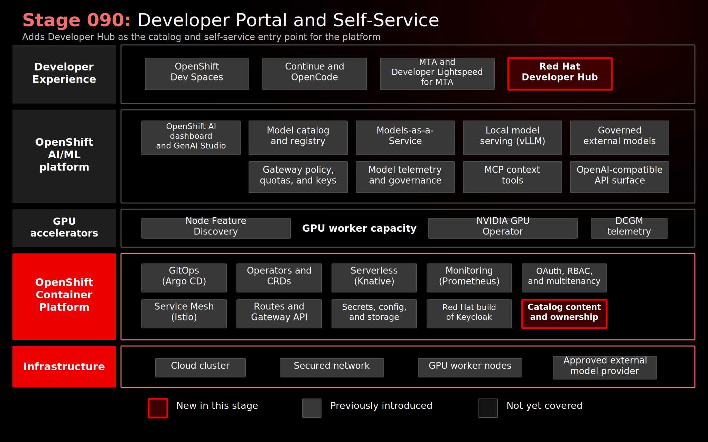

# Stage 090: Developer Portal and Self-Service

## Why This Matters

A platform capability only changes day-to-day engineering behavior when teams can find it, understand ownership, and follow a supported path to consume it. Without a portal, the AI platform remains scattered across dashboards, routes, namespaces, GitOps applications, and README files.

This stage establishes Red Hat Developer Hub as the front door for the demo platform. It starts with application discovery, identity integration, and the Developer Lightspeed for RHDH assistant path, then sets up the place where golden paths, model entities, TechDocs, and modernization workflows can be published.

## Architecture



## What This Stage Adds

This stage adds the developer portal foundation for platform self-service.

- Red Hat Developer Hub 1.9 deployed through operator-managed OpenShift resources.
- Application configuration, runtime secrets, and dynamic plugin configuration managed as platform state.
- OIDC authentication through the MTA Keycloak / Red Hat build of Keycloak realm, brokered back to OpenShift OAuth.
- Developer Lightspeed for RHDH as an AI-assisted portal experience.
- OpenShift launcher integration and initial catalog content for demo users, teams, ownership, lifecycle, and the `coolstore` component.

The capability added is the portal foundation: a catalog-backed place to describe ownership, lifecycle, source links, and the platform relationships around the AI-assisted modernization workflow.

## What To Notice And Why It Matters

Stage 090 makes Red Hat Developer Hub the front door for platform consumption. The implementation provides Red Hat Developer Hub 1.9, OIDC authentication through the MTA Keycloak / Red Hat build of Keycloak realm, Developer Lightspeed for RHDH, an OpenShift ConsoleLink, and catalog content for demo users, teams, and the `coolstore` component.

The essential proof point is discoverability with enterprise access control:

- Developers open Developer Hub from the OpenShift launcher and sign in through the OpenShift-backed identity chain.
- The catalog gives application teams a central place for ownership, lifecycle, tags, and source context.
- Developer Lightspeed for RHDH introduces an AI-assisted portal experience without embedding unmanaged provider credentials.
- Red Hat Developer Hub provides the governed catalog surface where platform services can be documented, discovered, and consumed.

This matters because platform capabilities only change engineering behavior when teams can find them, understand who owns them, and follow approved paths to consume them. For regulated enterprises, the developer portal is also a governance surface: it makes ownership, lifecycle, access control, documentation, and self-service consumption visible across hybrid cloud application teams.

## How Red Hat And Open Source Make It Work

Red Hat Developer Hub provides a developer portal based on the open source Backstage project. Backstage supplies the software catalog model for components, ownership, lifecycle, systems, APIs, resources, and documentation. Red Hat packages that portal for OpenShift with operator-based deployment, supported configuration patterns, and dynamic plugin management.

In this demo, Developer Hub authenticates through OIDC against the MTA Keycloak / Red Hat build of Keycloak realm, which already brokers identity from OpenShift OAuth:

```text
Red Hat Developer Hub
  -> MTA Keycloak / RHBK
  -> OpenShift OAuth
  -> demo HTPasswd users
```

That identity chain reinforces the platform story: OpenShift-backed identity is reused across Red Hat OpenShift AI, Red Hat OpenShift Dev Spaces, MTA, MaaS, and Red Hat Developer Hub. The portal does not replace those systems; it gives teams a single place to discover them, understand ownership, and follow approved paths into the right workflow.

The Red Hat Developer Hub deployment follows the operator-managed Backstage custom resource pattern and uses dynamic plugin configuration through OpenShift resources. The catalog URL is derived at runtime from the Stage 090 Argo CD Application `repoURL` and `targetRevision`, so the portal follows the validated GitOps revision instead of a hard-coded branch.

## Red Hat Products Used

- **Red Hat Developer Hub 1.9** provides the enterprise developer portal and software catalog.
- **Red Hat Advanced Developer Suite** frames Developer Hub, Dev Spaces, MTA, and Developer Lightspeed as a developer productivity layer.
- **Developer Lightspeed for Red Hat Developer Hub** provides the assistant capability in the portal layer.
- **Red Hat OpenShift** provides the runtime platform, route, console launcher integration, and OAuth identity foundation.
- **Red Hat build of Keycloak** is reused as the OIDC identity broker through the MTA realm.
- **Red Hat OpenShift AI**, **Red Hat OpenShift Dev Spaces**, and **MTA** are the platform capabilities that Red Hat Developer Hub is intended to make discoverable.

## Open Source Projects To Know

- [Backstage](https://backstage.io/) is the upstream developer portal framework behind Red Hat Developer Hub.
- The [Backstage Software Catalog](https://backstage.io/docs/features/software-catalog/) provides the model for describing components, ownership, APIs, systems, resources, and documentation.
- [TechDocs](https://backstage.io/docs/features/techdocs/) can turn repository documentation into portal-hosted technical documentation.

## Trust Boundaries

For demo continuity, Red Hat Developer Hub reuses the MTA Keycloak / Red Hat build of Keycloak realm, which brokers authentication back to OpenShift OAuth. A production implementation should use the organization's approved identity provider or a dedicated Red Hat build of Keycloak design rather than depending on the MTA identity path.

The portal is a discovery and self-service surface. It should link to approved platform paths rather than embedding provider secrets, kubeconfigs, or unmanaged service credentials.

## Where This Fits In The Full Platform

| Platform capability | Red Hat Developer Hub role |
|---------------------|--------------------|
| Coolstore modernization | Catalog entry provides ownership, lifecycle, and source context |
| Red Hat OpenShift Dev Spaces | Future catalog link or template can launch the developer workspace |
| MTA | Future catalog link or template can direct users to analysis and remediation workflows |
| MaaS models | Future Resource/API entities can show approved private and external model endpoints |
| GitOps | Future Argo CD plugin integration can show deployment state |

## Next Enhancements

- Add direct Coolstore links for Red Hat OpenShift Dev Spaces, MTA, MaaS, and OpenShift Console.
- Add MaaS `Resource` and `API` catalog entities for private and governed external models.
- Add TechDocs for the Coolstore modernization runbook.
- Add a Software Template for "Modernize Java EE application with MTA."
- Add OpenShift and Argo CD plugins for resource and GitOps visibility.
- Evaluate the OpenShift AI Connector once the base portal story is stable.

## Deploy And Validate

Operational commands are kept here for workshop operators.

```bash
./stages/090-developer-portal-self-service/deploy.sh
./stages/090-developer-portal-self-service/validate.sh
```

Manifests: [`gitops/stages/090-developer-portal-self-service/base/`](../../gitops/stages/090-developer-portal-self-service/base/)

## References

- [Red Hat Developer Hub 1.9 documentation](https://docs.redhat.com/en/documentation/red_hat_developer_hub/1.9)
- [Red Hat Advanced Developer Suite](https://www.redhat.com/en/products/advanced-developer-suite)
- [Developer Lightspeed for Red Hat Developer Hub](https://developers.redhat.com/products/rhdh/developer-lightspeed)
- [Installing RHDH on OpenShift](https://docs.redhat.com/en/documentation/red_hat_developer_hub/1.9/html/installing_red_hat_developer_hub_on_openshift_container_platform/index)
- [Configuring RHDH](https://docs.redhat.com/en/documentation/red_hat_developer_hub/1.9/html-single/configuring_red_hat_developer_hub/index)
- [RHDH authentication](https://docs.redhat.com/en/documentation/red_hat_developer_hub/1.9/html-single/authentication_in_red_hat_developer_hub/authentication_in_red_hat_developer_hub)
- [RHDH dynamic plugins](https://docs.redhat.com/en/documentation/red_hat_developer_hub/1.9/html/installing_and_viewing_plugins_in_red_hat_developer_hub/index)

## Next Stage

This is the final implemented stage. Use [Operations](../../docs/OPERATIONS.md) for day-2 work, or extend Developer Hub with the future catalog, TechDocs, and template items listed above.
