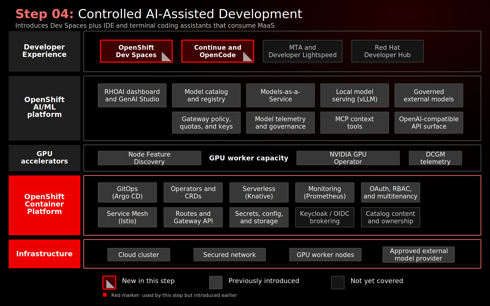

# Step 04: AI-Assisted Development In Controlled Workspaces

## Why This Matters

AI-assisted development is most useful when it appears inside the tools where code is written, tested, and reviewed. The enterprise concern is how to offer that experience without turning every laptop, plugin, and personal API key into a separate policy exception.

This step moves the coding experience into managed OpenShift workspaces. Developers still use familiar IDE and terminal workflows, while model access flows through the MaaS layer created in Step 03.

## Architecture



## What This Step Adds

- Red Hat OpenShift Dev Spaces, deployed through the operator, `CheCluster`, and workspace manifests in [`gitops/step-04-devspaces/base/`](../../gitops/step-04-devspaces/base/).
- Per-user DevWorkspace definitions for the demo personas, with OpenShift identity and namespace-based workspace isolation.
- Browser-based VS Code-style development environments that can be recreated from Git and devfile-style workspace definitions.
- Continue and OpenCode tooling configured to consume MaaS-published OpenAI-compatible endpoints.
- Coding exercises for AI assistant demonstrations and the Coolstore Java EE application used by the MTA modernization workflow in Step 05.
- The MTA VS Code extension in the relevant workspaces so modernization context can move from analysis into the developer IDE.

The capability added is a governed developer workspace layer. The workspace, source repositories, tools, and model access pattern are all platform-managed instead of being assembled manually on each developer machine.

## What To Notice In The Demo

Show the workspace first, then the model configuration. The important point is that the development tool is not tied to a single model provider. Continue and OpenCode can use any MaaS-published model that follows the OpenAI-compatible API pattern.

Then make the trust choice explicit:

- Selecting a local model keeps the request inside the platform.
- Selecting an external model uses the same developer workflow, but the prompt is processed by the external provider and must be allowed by policy.

The platform provides flexibility without hiding the data boundary. The same workflow can support private model use for sensitive code and governed external model use where policy allows, but those paths are not equivalent.

## How Red Hat And Open Source Make It Work

OpenShift Dev Spaces provides Kubernetes-based cloud development environments on OpenShift, built on Eclipse Che and DevWorkspace. OpenShift supplies OAuth, routing, namespace isolation, RBAC, and runtime controls for the workspaces.

Continue provides the IDE assistant experience. OpenCode provides a terminal-based agent workflow. MaaS supplies the model endpoint, API key pattern, and access policy. Because the tools consume OpenAI-compatible endpoints, the model backend can be local vLLM or an approved external provider without changing the developer workflow.

Red Hat’s platform role is the separation of concerns: developers focus on code, platform teams operate workspaces and model access, and governance decisions attach to the model path rather than to unmanaged local tooling.

## Red Hat Products Used

- **Red Hat OpenShift Dev Spaces** provides the managed cloud development environment.
- **Red Hat OpenShift AI** provides the MaaS model endpoints consumed by the developer tools.
- **Red Hat OpenShift** provides the identity, routing, namespace isolation, and runtime platform for the workspaces.

## Open Source Projects To Know

- [Eclipse Che](https://www.eclipse.org/che/) is the upstream cloud development environment project behind OpenShift Dev Spaces.
- [DevWorkspace](https://github.com/devfile/devworkspace-operator) provides Kubernetes-native workspace orchestration.
- [Continue](https://www.continue.dev/) is an open source AI code assistant that can use OpenAI-compatible model endpoints.
- [OpenCode](https://opencode.ai/) provides terminal-based AI coding workflows that can consume MaaS endpoints.

## Trust Boundaries

| Model path | What happens to prompts and code |
|------------|----------------------------------|
| Local models such as Nemotron and gpt-oss | Requests stay within the OpenShift platform boundary. This is the recommended path for sensitive or regulated code. |
| External models such as GPT-4o and GPT-4o-mini | Requests are proxied through MaaS to OpenAI. Access is centrally governed, but prompt content is processed externally and must be allowed by policy. |

This distinction is the core learning point. A governed external model is useful, but it is not private. The platform makes both options visible and controllable.

## Why This Is Worth Knowing

Many organizations start AI coding experiments with individual developer plugins and personal API keys. That approach does not scale well for enterprise governance.

This step shows a better pattern:

- Developer tools remain familiar.
- Workspaces are reproducible and centrally managed.
- Model keys are issued through a platform layer.
- Private and external model options can coexist.
- The same model access pattern can serve IDE assistants, terminal agents, and later MTA modernization.

## Where This Fits In The Full Platform

| Workflow | Dev Spaces role |
|----------|-----------------|
| AI coding assistant | Developers use Continue against MaaS-published models |
| Terminal agent workflow | Developers use OpenCode with the same MaaS model access pattern |
| Java modernization | Developers analyze Coolstore with the MTA extension |
| Governance story | Model access stays centralized even when tools run in developer workspaces |

## Deploy And Validate

Operational commands are kept here for workshop operators.

```bash
./steps/step-04-devspaces/deploy.sh
./steps/step-04-devspaces/validate.sh
```

Manifests: [`gitops/step-04-devspaces/base/`](../../gitops/step-04-devspaces/base/)

## References

- [OpenShift Dev Spaces documentation](https://docs.redhat.com/en/documentation/red_hat_openshift_dev_spaces/)
- [MaaS code assistant quickstart](https://docs.redhat.com/en/learn/ai-quickstarts/rh-maas-code-assistant)
- [Continue](https://www.continue.dev/)
- [A guide to AI code assistants with Red Hat OpenShift Dev Spaces](https://developers.redhat.com/articles/2026/01/28/guide-ai-code-assistants-red-hat-openshift-dev-spaces)
- [OpenCode: Model-neutral AI coding assistant for OpenShift Dev Spaces](https://developers.redhat.com/articles/2026/04/22/opencode-model-neutral-ai-coding-assistant-openshift-dev-spaces)

## Next Step

[Step 05: AI-Assisted EAP/Java EE Modernization to Quarkus](../step-05-mta/README.md) applies the same governed model access pattern to application modernization.
