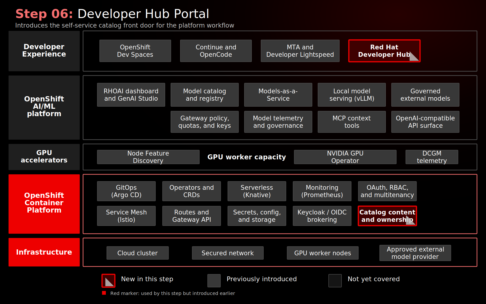

# Step 06: Red Hat Developer Hub As The Self-Service Portal

> Compatibility note: this step path is retained for existing links. New docs and automation should use [Stage 090](../../stages/090-developer-portal-self-service/README.md).

## Why This Matters

A platform capability only changes day-to-day engineering behavior when teams can find it, understand ownership, and follow a supported path to consume it. Without a portal, the AI platform remains scattered across dashboards, routes, namespaces, GitOps applications, and README files.

This step establishes Red Hat Developer Hub as the front door for the demo platform. It starts with application discovery and identity integration, then sets up the place where future golden paths, model entities, TechDocs, and modernization workflows can be published.

## Architecture



## What This Step Adds

- Red Hat Developer Hub 1.9, deployed from [`gitops/step-06-developer-hub/base/`](../../gitops/step-06-developer-hub/base/) through the RHDH Operator and `Backstage` custom resource.
- Application configuration, runtime secrets, and dynamic plugin configuration managed as OpenShift resources.
- OIDC authentication configured through the MTA Keycloak / Red Hat build of Keycloak realm, which brokers back to OpenShift OAuth for the demo users.
- An OpenShift ConsoleLink so the portal is reachable from the same launcher used for the other platform surfaces.
- Initial Backstage catalog content for the demo users, team ownership model, and the `coolstore` component used in the modernization workflow.

The capability added is the portal foundation: a catalog-backed place to describe ownership, lifecycle, source links, and the platform relationships around the AI-assisted modernization workflow.

## What To Notice In The Demo

Show the portal as the place where the story starts to come together:

1. Open Developer Hub from the OpenShift launcher.
2. Sign in through the OIDC flow backed by MTA Keycloak and OpenShift OAuth.
3. Search for `coolstore`.
4. Explain ownership, lifecycle, tags, and source links.
5. Connect the catalog entry back to the previous steps: workspaces, models, MTA analysis, and modernization.

For the current implementation, present Developer Hub as the portal foundation rather than the finished self-service experience. The catalog already establishes ownership and application context. The next increment is to add direct links, model entities, TechDocs, and a software template so the portal becomes the primary handoff point for the full workflow.

## How Red Hat And Open Source Make It Work

Red Hat Developer Hub provides a developer portal based on the open source Backstage project. Backstage supplies the software catalog model for components, ownership, lifecycle, systems, APIs, resources, and documentation. Red Hat packages that portal for OpenShift with operator-based deployment, supported configuration patterns, and dynamic plugin management.

In this demo, Developer Hub authenticates through OIDC against the MTA Keycloak / Red Hat build of Keycloak realm, which already brokers identity from OpenShift OAuth:

```text
Developer Hub
  -> MTA Keycloak / RHBK
  -> OpenShift OAuth
  -> demo HTPasswd users
```

That identity chain reinforces the platform story: OpenShift-backed identity is reused across RHOAI, Dev Spaces, MTA, MaaS, and Developer Hub. The portal does not replace those systems; it gives teams a single place to discover them, understand ownership, and follow approved paths into the right workflow.

## Red Hat Products Used

- **Red Hat Developer Hub 1.9** provides the enterprise developer portal and software catalog.
- **Red Hat OpenShift** provides the runtime platform, route, console launcher integration, and OAuth identity foundation.
- **Red Hat build of Keycloak** is reused as the OIDC identity broker through the MTA realm.
- **Red Hat OpenShift AI**, **Dev Spaces**, and **MTA** are the platform capabilities that Developer Hub is intended to make discoverable.

## Open Source Projects To Know

- [Backstage](https://backstage.io/) is the upstream developer portal framework behind Red Hat Developer Hub.
- The [Backstage Software Catalog](https://backstage.io/docs/features/software-catalog/) provides the model for describing components, ownership, APIs, systems, resources, and documentation.
- [TechDocs](https://backstage.io/docs/features/techdocs/) can turn repository documentation into portal-hosted technical documentation.

## Why This Is Worth Knowing

Developer portals are where platform engineering becomes usable. The previous steps create powerful capabilities, but developers should not need to understand every operator, CRD, route, and secret to start work.

Developer Hub is the natural place to publish:

- Application ownership and lifecycle.
- Approved model endpoints and AI APIs.
- Modernization runbooks.
- Golden paths such as "Modernize Java EE application with MTA."
- Links to Dev Spaces, MTA analysis, GitOps status, and OpenShift resources.

This turns the AI platform from a set of components into a self-service developer experience.

## Where This Fits In The Full Platform

| Platform capability | Developer Hub role |
|---------------------|--------------------|
| Coolstore modernization | Catalog entry provides ownership, lifecycle, and source context |
| Dev Spaces | Future catalog link or template can launch the developer workspace |
| MTA | Future catalog link or template can direct users to analysis and remediation workflows |
| MaaS models | Future Resource/API entities can show approved private and external model endpoints |
| GitOps | Future Argo CD plugin integration can show deployment state |

## Next Enhancements

- Add direct Coolstore links for Dev Spaces, MTA, MaaS, and OpenShift Console.
- Add MaaS `Resource` and `API` catalog entities for private and governed external models.
- Add TechDocs for the Coolstore modernization runbook.
- Add a Software Template for "Modernize Java EE application with MTA."
- Add OpenShift and Argo CD plugins for resource and GitOps visibility.
- Evaluate the OpenShift AI Connector once the base portal story is stable.

## Deploy And Validate

Operational commands are kept here for workshop operators.

```bash
./steps/step-06-developer-hub/deploy.sh
./steps/step-06-developer-hub/validate.sh
```

Manifests: [`gitops/step-06-developer-hub/base/`](../../gitops/step-06-developer-hub/base/)

## References

- [Red Hat Developer Hub 1.9 documentation](https://docs.redhat.com/en/documentation/red_hat_developer_hub/1.9)
- [Installing RHDH on OpenShift](https://docs.redhat.com/en/documentation/red_hat_developer_hub/1.9/html/installing_red_hat_developer_hub_on_openshift_container_platform/index)
- [Configuring RHDH](https://docs.redhat.com/en/documentation/red_hat_developer_hub/1.9/html-single/configuring_red_hat_developer_hub/index)
- [RHDH authentication](https://docs.redhat.com/en/documentation/red_hat_developer_hub/1.9/html-single/authentication_in_red_hat_developer_hub/authentication_in_red_hat_developer_hub)
- [RHDH dynamic plugins](https://docs.redhat.com/en/documentation/red_hat_developer_hub/1.9/html/installing_and_viewing_plugins_in_red_hat_developer_hub/index)

## Next Step

This is the final implemented step. Use [Operations](../../docs/OPERATIONS.md) for day-2 work, or extend Developer Hub with the future catalog, TechDocs, and template items listed above.
